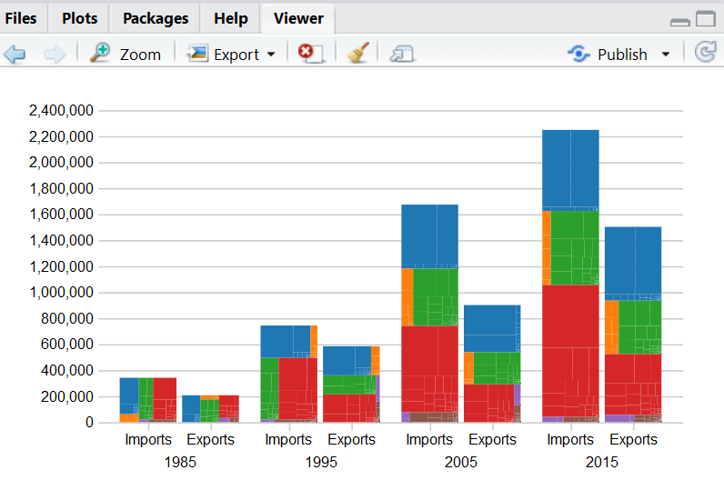

<!-- README.md is generated from README.Rmd. Please edit that file -->
based off of [Chris Given](https://twitter.com/cmgiven) [`d3.js`](http://d3js.org) zoomable interactive [treemap bar](http://bl.ocks.org/cmgiven/4541f6de7b6fbef482aaa43f3a71f8d4)

### basic example

``` r
#devtools::install_github("timelyportfolio/treebar")

library(stringr)
library(treebar)
library(jsonlite)

## make it a more generic hierarchy
##  normally this step is not necessary
json <- str_replace_all(
  readLines(system.file("example/data.json",package="treebar")),
  "(country)|(continent)|(year)|(type)",
  "id"
)
#> Warning in readLines(system.file("example/data.json", package =
#> "treebar")): incomplete final line found on 'C:/Users/KENT/Documents/R/win-
#> library/3.3/treebar/example/data.json'

data <- fromJSON(json, simplifyDataFrame=FALSE)

treebar(data)
```



### explore tiling options

``` r
# also allows different treemap tiling options
library(htmltools)

browsable(
  tagList(
    lapply(
      c("Squarify", "Binary", "SliceDice", "Slice", "Dice"),
      function(tile){
        tags$div(
          style = "float:left; display:inline;",
          tags$h3(tile),
          treebar(
            data,
            tile = tile, 
            height = 250,
            width = 400
          )
        )
      }
    )   
  )
)
```

<!--html_preserve-->
<h3>
Squarify
</h3>

<script type="application/json" data-for="htmlwidget-f7dd22444c7bf27edbce">{"x":{"data":{"children":[{"id":"1995","children":[{"id":"Imports","children":[{"id":"North America","children":[{"id":"Greenland","value":7.6,"adj_value":11.81952},{"id":"Canada","value":144369.9,"adj_value":224524.0685},{"id":"St Pierre and Miquelon","value":3.4,"adj_value":5.28768},{"id":"Mexico","value":62100.4,"adj_value":96578.54208},{"id":"Guatemala","value":1526.8,"adj_value":2374.47936},{"id":"Belize","value":52.1,"adj_value":81.02592},{"id":"El Salvador","value":812.2,"adj_value":1263.13344},{"id":"Honduras","value":1441.2,"adj_value":2241.35424},{"id":"Nicaragua","value":238.8,"adj_value":371.38176},{"id":"Costa Rica","value":1843.2,"adj_value":2866.54464},{"id":"Panama","value":307.1,"adj_value":477.60192},{"id":"Bermuda","value":10.4,"adj_value":16.17408},{"id":"Bahamas","value":156.7,"adj_value":243.69984},{"id":"Cuba","value":0,"adj_value":0},{"id":"Jamaica","value":846.9,"adj_value":1317.09888},{"id":"Turks and Caicos Islands","value":5,"adj_value":7.776},{"id":"Cayman Islands","value":18.2,"adj_value":28.30464},{"id":"Haiti","value":129.9,"adj_value":202.02048},{"id":"Dominican Republic","value":3398.9,"adj_value":5285.96928},{"id":"Anguilla","value":0,"adj_value":0},{"id":"British Virgin Islands","value":11.2,"adj_value":17.41824},{"id":"St Kitts and Nevis","value":22.3,"adj_value":34.68096},{"id":"Antigua and Barbuda","value":2.8,"adj_value":4.35456},{"id":"Montserrat","value":2,"adj_value":3.1104},{"id":"Dominica","value":6.6,"adj_value":10.26432},{"id":"St Lucia","value":35.1,"adj_value":54.58752},{"id":"St Vincent and the Grenadines","value":7.9,"adj_value":12.28608},{"id":"Grenada","value":5.3,"adj_value":8.24256},{"id":"Barbados","value":37.7,"adj_value":58.63104},{"id":"Trinidad and Tobago","value":1089.2,"adj_value":1693.92384},{"id":"Netherlands Antilles","value":289.8,"adj_value":450.69696},{"id":"Aruba","value":420.7,"adj_value":654.27264},{"id":"Guadeloupe","value":1.2,"adj_value":1.86624},{"id":"Martinique","value":1.9,"adj_value":2.95488}]},{"id":"South America","children":[{"id":"Colombia","value":3791,"adj_value":5895.7632},{"id":"Venezuela","value":9764,"adj_value":15184.9728},{"id":"Guyana","value":107.4,"adj_value":167.02848},{"id":"Suriname","value":100,"adj_value":155.52},{"id":"French Guiana","value":5.2,"adj_value":8.08704},{"id":"Ecuador","value":1939.7,"adj_value":3016.62144},{"id":"Peru","value":1034.4,"adj_value":1608.69888},{"id":"Bolivia","value":262.5,"adj_value":408.24},{"id":"Chile","value":1930.8,"adj_value":3002.78016},{"id":"Brazil","value":8832.9,"adj_value":13736.92608},{"id":"Paraguay","value":55,"adj_value":85.536},{"id":"Uruguay","value":167.2,"adj_value":260.02944},{"id":"Argentina","value":1760.8,"adj_value":2738.39616},{"id":"Falkland Islands(Islas Malvin","value":0.5,"adj_value":0.7776}]},{"id":"Europe","children":[{"id":"Iceland","value":232.8,"adj_value":362.05056},{"id":"Sweden","value":6256.4,"adj_value":9729.95328},{"id":"Svalbard, Jan Mayen Island","value":0.2,"adj_value":0.31104},{"id":"Norway","value":3086.7,"adj_value":4800.43584},{"id":"Finland","value":2269.9,"adj_value":3530.14848},{"id":"Faroe Islands","value":8.4,"adj_value":13.06368},{"id":"Denmark","value":1944.9,"adj_value":3024.70848},{"id":"United Kingdom","value":26929.7,"adj_value":41881.06944},{"id":"Ireland","value":4078.7,"adj_value":6343.19424},{"id":"Netherlands","value":6404.9,"adj_value":9960.90048},{"id":"Belgium","value":6053.9,"adj_value":9415.02528},{"id":"Luxembourg","value":233.8,"adj_value":363.60576},{"id":"Andorra","value":0.2,"adj_value":0.31104},{"id":"Monaco","value":12.2,"adj_value":18.97344},{"id":"France","value":17209.4,"adj_value":26764.05888},{"id":"Germany","value":36843.9,"adj_value":57299.63328},{"id":"Austria","value":1963.2,"adj_value":3053.16864},{"id":"Czechoslovakia","value":0,"adj_value":0},{"id":"Czech Republic","value":363.3,"adj_value":565.00416},{"id":"Slovakia","value":129.5,"adj_value":201.3984},{"id":"Hungary","value":547,"adj_value":850.6944},{"id":"Liechtenstein","value":126.2,"adj_value":196.26624},{"id":"Switzerland","value":7593.9,"adj_value":11810.03328},{"id":"Estonia","value":62.1,"adj_value":96.57792},{"id":"Latvia","value":82,"adj_value":127.5264},{"id":"Lithuania","value":26.5,"adj_value":41.2128},{"id":"Poland","value":663.6,"adj_value":1032.03072},{"id":"USSR","value":0,"adj_value":0},{"id":"Russia","value":4030.1,"adj_value":6267.61152},{"id":"Belarus","value":45,"adj_value":69.984},{"id":"Ukraine","value":405.7,"adj_value":630.94464},{"id":"Armenia","value":16.3,"adj_value":25.34976},{"id":"Azerbaijan","value":0.7,"adj_value":1.08864},{"id":"Georgia","value":10.7,"adj_value":16.64064},{"id":"Kazakhstan","value":122.9,"adj_value":191.13408},{"id":"Kyrgyzstan","value":8.4,"adj_value":13.06368},{"id":"Moldova","value":24.8,"adj_value":38.56896},{"id":"Tajikistan","value":40.9,"adj_value":63.60768},{"id":"Turkmenistan","value":1.3,"adj_value":2.02176},{"id":"Uzbekistan","value":18.8,"adj_value":29.23776},{"id":"Spain","value":3879.7,"adj_value":6033.70944},{"id":"Portugal","value":1056.7,"adj_value":1643.37984},{"id":"Gibraltar","value":4.8,"adj_value":7.46496},{"id":"Malta","value":132.5,"adj_value":206.064},{"id":"San Marino","value":1,"adj_value":1.5552},{"id":"Vatican City","value":0.7,"adj_value":1.08864},{"id":"Italy","value":16348.4,"adj_value":25425.03168},{"id":"Yugoslavia (former)","value":0,"adj_value":0},{"id":"Croatia","value":93.8,"adj_value":145.87776},{"id":"Slovenia","value":289.5,"adj_value":450.2304},{"id":"Bosnia and Herzegovina","value":3.5,"adj_value":5.4432},{"id":"Macedonia","value":88.8,"adj_value":138.10176},{"id":"Serbia and Montenegro","value":0,"adj_value":0},{"id":"Albania","value":9.4,"adj_value":14.61888},{"id":"Greece","value":397.1,"adj_value":617.56992},{"id":"Romania","value":222.3,"adj_value":345.72096},{"id":"Bulgaria","value":188.5,"adj_value":293.1552}]},{"id":"Asia","children":[{"id":"Turkey","value":1797.9,"adj_value":2796.09408},{"id":"Cyprus","value":13.1,"adj_value":20.37312},{"id":"Syria","value":61.1,"adj_value":95.02272},{"id":"Lebanon","value":35,"adj_value":54.432},{"id":"Iraq","value":0,"adj_value":0},{"id":"Iran","value":0.2,"adj_value":0.31104},{"id":"Israel","value":0,"adj_value":0},{"id":"Israel","value":5708.7,"adj_value":8878.17024},{"id":"Gaza Strip admin. by Israel","value":0,"adj_value":0},{"id":"West Bank admin. by Israel","value":0,"adj_value":0},{"id":"Jordan","value":28.9,"adj_value":44.94528},{"id":"Kuwait","value":1335.5,"adj_value":2076.9696},{"id":"Iraq-Saudi Arabia Neutral Zone","value":0,"adj_value":0},{"id":"Saudi Arabia","value":8376.6,"adj_value":13027.28832},{"id":"Qatar","value":90.9,"adj_value":141.36768},{"id":"United Arab Emirates","value":459.1,"adj_value":713.99232},{"id":"Republic of Yemen","value":41.5,"adj_value":64.5408},{"id":"Oman","value":294.9,"adj_value":458.62848},{"id":"Bahrain","value":134.3,"adj_value":208.86336},{"id":"Afghanistan","value":5.4,"adj_value":8.39808},{"id":"India","value":5726.3,"adj_value":8905.54176},{"id":"Pakistan","value":1197,"adj_value":1861.5744},{"id":"Nepal","value":96.1,"adj_value":149.45472},{"id":"Bangladesh","value":1257.2,"adj_value":1955.19744},{"id":"Sri Lanka","value":1259.7,"adj_value":1959.08544},{"id":"Burma","value":81,"adj_value":125.9712},{"id":"Thailand","value":11348.1,"adj_value":17648.56512},{"id":"Vietnam","value":199,"adj_value":309.4848},{"id":"Laos","value":10.2,"adj_value":15.86304},{"id":"Cambodia","value":5.1,"adj_value":7.93152},{"id":"Malaysia","value":17454.9,"adj_value":27145.86048},{"id":"Singapore","value":18560.4,"adj_value":28865.13408},{"id":"Indonesia","value":7435.3,"adj_value":11563.37856},{"id":"Brunei","value":38.4,"adj_value":59.71968},{"id":"Philippines","value":7006.5,"adj_value":10896.5088},{"id":"Macau","value":895.3,"adj_value":1392.37056},{"id":"Bhutan","value":0.1,"adj_value":0.15552},{"id":"Maldives","value":12,"adj_value":18.6624},{"id":"China","value":45543.2,"adj_value":70828.78464},{"id":"Mongolia","value":23.2,"adj_value":36.08064},{"id":"Korea, North","value":0,"adj_value":0},{"id":"Korea, South","value":24184,"adj_value":37610.9568},{"id":"Hong Kong","value":10291.3,"adj_value":16005.02976},{"id":"Taiwan","value":28971.9,"adj_value":45057.09888},{"id":"Japan","value":123479.3,"adj_value":192035.0074}]},{"id":"Australia","children":[{"id":"Australia","value":3323,"adj_value":5167.9296},{"id":"Norfolk Island","value":78.6,"adj_value":122.23872},{"id":"Cocos (Keeling) Islands","value":0,"adj_value":0},{"id":"Christmas Island","value":0,"adj_value":0},{"id":"Heard and McDonald Islands","value":0.3,"adj_value":0.46656},{"id":"Papua New Guinea","value":50.2,"adj_value":78.07104},{"id":"New Zealand","value":1451.8,"adj_value":2257.83936},{"id":"Cook Islands","value":0.8,"adj_value":1.24416},{"id":"Tokelau","value":6.1,"adj_value":9.48672},{"id":"Niue","value":0.1,"adj_value":0.15552},{"id":"Samoa","value":0.3,"adj_value":0.46656},{"id":"Solomon Islands","value":4.3,"adj_value":6.68736},{"id":"Vanuatu","value":0,"adj_value":0},{"id":"Pitcairn Islands","value":0,"adj_value":0},{"id":"Kiribati","value":1.4,"adj_value":2.17728},{"id":"Tuvalu","value":0,"adj_value":0},{"id":"New Caledonia","value":40.2,"adj_value":62.51904},{"id":"Wallis and Futuna","value":0,"adj_value":0},{"id":"French Polynesia","value":14.4,"adj_value":22.39488},{"id":"Marshall Islands","value":11.1,"adj_value":17.26272},{"id":"Micronesia","value":13.2,"adj_value":20.52864},{"id":"Palau","value":5.8,"adj_value":9.02016},{"id":"Nauru","value":0,"adj_value":0},{"id":"Fiji","value":78.1,"adj_value":121.46112},{"id":"Tonga","value":6.2,"adj_value":9.64224}]},{"id":"Africa","children":[{"id":"Morocco","value":239.4,"adj_value":372.31488},{"id":"Algeria","value":1749.5,"adj_value":2720.8224},{"id":"Tunisia","value":70.4,"adj_value":109.48608},{"id":"Libya","value":0,"adj_value":0},{"id":"Egypt","value":606.3,"adj_value":942.91776},{"id":"Sudan","value":22.6,"adj_value":35.14752},{"id":"Western Sahara","value":0,"adj_value":0},{"id":"Equatorial Guinea","value":31,"adj_value":48.2112},{"id":"Mauritania","value":5.4,"adj_value":8.39808},{"id":"Cameroon","value":57.3,"adj_value":89.11296},{"id":"Senegal","value":4.9,"adj_value":7.62048},{"id":"Mali","value":3.6,"adj_value":5.59872},{"id":"Guinea","value":98.8,"adj_value":153.65376},{"id":"Sierra Leone","value":28.4,"adj_value":44.16768},{"id":"Cote d'Ivoire","value":214.1,"adj_value":332.96832},{"id":"Ghana","value":196.1,"adj_value":304.97472},{"id":"Gambia","value":2.2,"adj_value":3.42144},{"id":"Niger","value":1.4,"adj_value":2.17728},{"id":"Togo","value":3.3,"adj_value":5.13216},{"id":"Nigeria","value":4930.5,"adj_value":7667.9136},{"id":"Central African Republic","value":0.4,"adj_value":0.62208},{"id":"Gabon","value":1463.9,"adj_value":2276.65728},{"id":"Chad","value":3.3,"adj_value":5.13216},{"id":"St Helena","value":0,"adj_value":0},{"id":"Burkina Faso","value":0.4,"adj_value":0.62208},{"id":"Benin","value":10,"adj_value":15.552},{"id":"Angola","value":2232.3,"adj_value":3471.67296},{"id":"Congo (Brazzaville)","value":206.8,"adj_value":321.61536},{"id":"Guinea-Bissau","value":0,"adj_value":0},{"id":"Cabo Verde","value":0.2,"adj_value":0.31104},{"id":"Sao Tome and Principe","value":0.1,"adj_value":0.15552},{"id":"Liberia","value":9.9,"adj_value":15.39648},{"id":"Congo (Kinshasa)","value":267,"adj_value":415.2384},{"id":"Burundi","value":20.5,"adj_value":31.8816},{"id":"Rwanda","value":1.8,"adj_value":2.79936},{"id":"Somalia","value":0,"adj_value":0},{"id":"Ethiopia","value":0,"adj_value":0},{"id":"Eritrea","value":0.4,"adj_value":0.62208},{"id":"Ethiopia","value":32.9,"adj_value":51.16608},{"id":"Djibouti","value":0,"adj_value":0},{"id":"Uganda","value":13.4,"adj_value":20.83968},{"id":"Kenya","value":101.5,"adj_value":157.8528},{"id":"Seychelles","value":2.5,"adj_value":3.888},{"id":"British Indian Ocean Terr.","value":1.9,"adj_value":2.95488},{"id":"Tanzania","value":22.4,"adj_value":34.83648},{"id":"Mauritius","value":229.5,"adj_value":356.9184},{"id":"Mozambique","value":27.5,"adj_value":42.768},{"id":"Madagascar","value":57.4,"adj_value":89.26848},{"id":"Comoros","value":2.2,"adj_value":3.42144},{"id":"Reunion","value":0.4,"adj_value":0.62208},{"id":"French Southern and Antarctic","value":0.4,"adj_value":0.62208},{"id":"South Africa","value":2208,"adj_value":3433.8816},{"id":"Namibia","value":11.5,"adj_value":17.8848},{"id":"Botswana","value":21.3,"adj_value":33.12576},{"id":"Zambia","value":32.8,"adj_value":51.01056},{"id":"Swaziland","value":32.4,"adj_value":50.38848},{"id":"Zimbabwe","value":97.5,"adj_value":151.632},{"id":"Malawi","value":41.1,"adj_value":63.91872},{"id":"Lesotho","value":62.3,"adj_value":96.88896}]}]},{"id":"Exports","children":[{"id":"North America","children":[{"id":"Greenland","value":2.4,"adj_value":3.73248},{"id":"Canada","value":127226,"adj_value":197861.8752},{"id":"St Pierre and Miquelon","value":0.5,"adj_value":0.7776},{"id":"Mexico","value":46292.1,"adj_value":71993.47392},{"id":"Guatemala","value":1646.6,"adj_value":2560.79232},{"id":"Belize","value":99.7,"adj_value":155.05344},{"id":"El Salvador","value":1110.4,"adj_value":1726.89408},{"id":"Honduras","value":1278.9,"adj_value":1988.94528},{"id":"Nicaragua","value":249.8,"adj_value":388.48896},{"id":"Costa Rica","value":1736.6,"adj_value":2700.76032},{"id":"Panama","value":1389.6,"adj_value":2161.10592},{"id":"Bermuda","value":298.5,"adj_value":464.2272},{"id":"Bahamas","value":661.2,"adj_value":1028.29824},{"id":"Cuba","value":5.4,"adj_value":8.39808},{"id":"Jamaica","value":1420.2,"adj_value":2208.69504},{"id":"Turks and Caicos Islands","value":33.6,"adj_value":52.25472},{"id":"Cayman Islands","value":180.1,"adj_value":280.09152},{"id":"Haiti","value":550.1,"adj_value":855.51552},{"id":"Dominican Republic","value":3014.9,"adj_value":4688.77248},{"id":"Anguilla","value":14.6,"adj_value":22.70592},{"id":"British Virgin Islands","value":49.2,"adj_value":76.51584},{"id":"St Kitts and Nevis","value":43.6,"adj_value":67.80672},{"id":"Antigua and Barbuda","value":97,"adj_value":150.8544},{"id":"Montserrat","value":4.4,"adj_value":6.84288},{"id":"Dominica","value":26.6,"adj_value":41.36832},{"id":"St Lucia","value":80.8,"adj_value":125.66016},{"id":"St Vincent and the Grenadines","value":42.2,"adj_value":65.62944},{"id":"Grenada","value":26.9,"adj_value":41.83488},{"id":"Barbados","value":185.6,"adj_value":288.64512},{"id":"Trinidad and Tobago","value":689.2,"adj_value":1071.84384},{"id":"Netherlands Antilles","value":503.9,"adj_value":783.66528},{"id":"Aruba","value":247.6,"adj_value":385.06752},{"id":"Guadeloupe","value":69.1,"adj_value":107.46432},{"id":"Martinique","value":38.5,"adj_value":59.8752}]},{"id":"South America","children":[{"id":"Colombia","value":4624.4,"adj_value":7191.86688},{"id":"Venezuela","value":4640.4,"adj_value":7216.75008},{"id":"Guyana","value":141.3,"adj_value":219.74976},{"id":"Suriname","value":189.7,"adj_value":295.02144},{"id":"French Guiana","value":441.8,"adj_value":687.08736},{"id":"Ecuador","value":1538.3,"adj_value":2392.36416},{"id":"Peru","value":1775.4,"adj_value":2761.10208},{"id":"Bolivia","value":213.5,"adj_value":332.0352},{"id":"Chile","value":3614.7,"adj_value":5621.58144},{"id":"Brazil","value":11439.4,"adj_value":17790.55488},{"id":"Paraguay","value":992.4,"adj_value":1543.38048},{"id":"Uruguay","value":395.8,"adj_value":615.54816},{"id":"Argentina","value":4189.2,"adj_value":6515.04384},{"id":"Falkland Islands(Islas Malvin","value":0.3,"adj_value":0.46656}]},{"id":"Europe","children":[{"id":"Iceland","value":170.5,"adj_value":265.1616},{"id":"Sweden","value":3079.7,"adj_value":4789.54944},{"id":"Svalbard, Jan Mayen Island","value":1.1,"adj_value":1.71072},{"id":"Norway","value":1292.9,"adj_value":2010.71808},{"id":"Finland","value":1249.7,"adj_value":1943.53344},{"id":"Faroe Islands","value":0.4,"adj_value":0.62208},{"id":"Denmark","value":1517.7,"adj_value":2360.32704},{"id":"United Kingdom","value":28856.5,"adj_value":44877.6288},{"id":"Ireland","value":4108.7,"adj_value":6389.85024},{"id":"Netherlands","value":16557.6,"adj_value":25750.37952},{"id":"Belgium","value":12465.6,"adj_value":19386.50112},{"id":"Luxembourg","value":374.2,"adj_value":581.95584},{"id":"Andorra","value":16.5,"adj_value":25.6608},{"id":"Monaco","value":9.6,"adj_value":14.92992},{"id":"France","value":14245.2,"adj_value":22154.13504},{"id":"Germany","value":22394.3,"adj_value":34827.61536},{"id":"Austria","value":2017,"adj_value":3136.8384},{"id":"Czechoslovakia","value":0,"adj_value":0},{"id":"Czech Republic","value":362.8,"adj_value":564.22656},{"id":"Slovakia","value":61,"adj_value":94.8672},{"id":"Hungary","value":295.2,"adj_value":459.09504},{"id":"Liechtenstein","value":15.1,"adj_value":23.48352},{"id":"Switzerland","value":6227.4,"adj_value":9684.85248},{"id":"Estonia","value":139.1,"adj_value":216.32832},{"id":"Latvia","value":89.5,"adj_value":139.1904},{"id":"Lithuania","value":52.2,"adj_value":81.18144},{"id":"Poland","value":776.1,"adj_value":1206.99072},{"id":"USSR","value":0,"adj_value":0},{"id":"Russia","value":2823.4,"adj_value":4390.95168},{"id":"Belarus","value":47.9,"adj_value":74.49408},{"id":"Ukraine","value":223.4,"adj_value":347.43168},{"id":"Armenia","value":70.3,"adj_value":109.33056},{"id":"Azerbaijan","value":35.6,"adj_value":55.36512},{"id":"Georgia","value":95.2,"adj_value":148.05504},{"id":"Kazakhstan","value":80.9,"adj_value":125.81568},{"id":"Kyrgyzstan","value":24.6,"adj_value":38.25792},{"id":"Moldova","value":10.2,"adj_value":15.86304},{"id":"Tajikistan","value":17.6,"adj_value":27.37152},{"id":"Turkmenistan","value":34.3,"adj_value":53.34336},{"id":"Uzbekistan","value":63.4,"adj_value":98.59968},{"id":"Spain","value":5526,"adj_value":8594.0352},{"id":"Portugal","value":898.1,"adj_value":1396.72512},{"id":"Gibraltar","value":18.4,"adj_value":28.61568},{"id":"Malta","value":106.7,"adj_value":165.93984},{"id":"San Marino","value":5.7,"adj_value":8.86464},{"id":"Vatican City","value":0.3,"adj_value":0.46656},{"id":"Italy","value":8861.6,"adj_value":13781.56032},{"id":"Yugoslavia (former)","value":0,"adj_value":0},{"id":"Croatia","value":140,"adj_value":217.728},{"id":"Slovenia","value":109.6,"adj_value":170.44992},{"id":"Bosnia and Herzegovina","value":28.3,"adj_value":44.01216},{"id":"Macedonia","value":21.2,"adj_value":32.97024},{"id":"Serbia and Montenegro","value":2.1,"adj_value":3.26592},{"id":"Albania","value":13.5,"adj_value":20.9952},{"id":"Greece","value":1518.7,"adj_value":2361.88224},{"id":"Romania","value":253.2,"adj_value":393.77664},{"id":"Bulgaria","value":131.8,"adj_value":204.97536}]},{"id":"Asia","children":[{"id":"Turkey","value":2768,"adj_value":4304.7936},{"id":"Cyprus","value":257.8,"adj_value":400.93056},{"id":"Syria","value":223.4,"adj_value":347.43168},{"id":"Lebanon","value":592.2,"adj_value":920.98944},{"id":"Iraq","value":0.2,"adj_value":0.31104},{"id":"Iran","value":277.4,"adj_value":431.41248},{"id":"Israel","value":0,"adj_value":0},{"id":"Israel","value":5621,"adj_value":8741.7792},{"id":"Gaza Strip admin. by Israel","value":0.1,"adj_value":0.15552},{"id":"West Bank admin. by Israel","value":0.3,"adj_value":0.46656},{"id":"Jordan","value":335.3,"adj_value":521.45856},{"id":"Kuwait","value":1437.4,"adj_value":2235.44448},{"id":"Iraq-Saudi Arabia Neutral Zone","value":0,"adj_value":0},{"id":"Saudi Arabia","value":6155,"adj_value":9572.256},{"id":"Qatar","value":226,"adj_value":351.4752},{"id":"United Arab Emirates","value":2006.3,"adj_value":3120.19776},{"id":"Republic of Yemen","value":185.3,"adj_value":288.17856},{"id":"Oman","value":222,"adj_value":345.2544},{"id":"Bahrain","value":255.1,"adj_value":396.73152},{"id":"Afghanistan","value":4,"adj_value":6.2208},{"id":"India","value":3295.8,"adj_value":5125.62816},{"id":"Pakistan","value":941.3,"adj_value":1463.90976},{"id":"Nepal","value":9.8,"adj_value":15.24096},{"id":"Bangladesh","value":325,"adj_value":505.44},{"id":"Sri Lanka","value":279.1,"adj_value":434.05632},{"id":"Burma","value":16.2,"adj_value":25.19424},{"id":"Thailand","value":6665,"adj_value":10365.408},{"id":"Vietnam","value":252.3,"adj_value":392.37696},{"id":"Laos","value":1.6,"adj_value":2.48832},{"id":"Cambodia","value":26.9,"adj_value":41.83488},{"id":"Malaysia","value":8816.1,"adj_value":13710.79872},{"id":"Singapore","value":15333,"adj_value":23845.8816},{"id":"Indonesia","value":3359.6,"adj_value":5224.84992},{"id":"Brunei","value":190.1,"adj_value":295.64352},{"id":"Philippines","value":5294.8,"adj_value":8234.47296},{"id":"Macau","value":29.9,"adj_value":46.50048},{"id":"Bhutan","value":0.5,"adj_value":0.7776},{"id":"Maldives","value":1.1,"adj_value":1.71072},{"id":"China","value":11753.7,"adj_value":18279.35424},{"id":"Mongolia","value":13.9,"adj_value":21.61728},{"id":"Korea, North","value":11.6,"adj_value":18.04032},{"id":"Korea, South","value":25379.9,"adj_value":39470.82048},{"id":"Hong Kong","value":14231.5,"adj_value":22132.8288},{"id":"Taiwan","value":19289.6,"adj_value":29999.18592},{"id":"Japan","value":64342.7,"adj_value":100065.767}]},{"id":"Australia","children":[{"id":"Australia","value":10789.1,"adj_value":16779.20832},{"id":"Norfolk Island","value":1.2,"adj_value":1.86624},{"id":"Cocos (Keeling) Islands","value":0.5,"adj_value":0.7776},{"id":"Christmas Island","value":4.5,"adj_value":6.9984},{"id":"Heard and McDonald Islands","value":0,"adj_value":0},{"id":"Papua New Guinea","value":50.8,"adj_value":79.00416},{"id":"New Zealand","value":1691.3,"adj_value":2630.30976},{"id":"Cook Islands","value":0.9,"adj_value":1.39968},{"id":"Tokelau","value":0.1,"adj_value":0.15552},{"id":"Niue","value":31.5,"adj_value":48.9888},{"id":"Samoa","value":7.3,"adj_value":11.35296},{"id":"Solomon Islands","value":2.7,"adj_value":4.19904},{"id":"Vanuatu","value":1.1,"adj_value":1.71072},{"id":"Pitcairn Islands","value":2.2,"adj_value":3.42144},{"id":"Kiribati","value":2.3,"adj_value":3.57696},{"id":"Tuvalu","value":0.3,"adj_value":0.46656},{"id":"New Caledonia","value":22.3,"adj_value":34.68096},{"id":"Wallis and Futuna","value":0,"adj_value":0},{"id":"French Polynesia","value":82.3,"adj_value":127.99296},{"id":"Marshall Islands","value":31.8,"adj_value":49.45536},{"id":"Micronesia","value":23.3,"adj_value":36.23616},{"id":"Palau","value":8.3,"adj_value":12.90816},{"id":"Nauru","value":0.5,"adj_value":0.7776},{"id":"Fiji","value":31.8,"adj_value":49.45536},{"id":"Tonga","value":7.5,"adj_value":11.664}]},{"id":"Africa","children":[{"id":"Morocco","value":517.4,"adj_value":804.66048},{"id":"Algeria","value":774.1,"adj_value":1203.88032},{"id":"Tunisia","value":214.9,"adj_value":334.21248},{"id":"Libya","value":0,"adj_value":0},{"id":"Egypt","value":2985.1,"adj_value":4642.42752},{"id":"Sudan","value":43.5,"adj_value":67.6512},{"id":"Western Sahara","value":0,"adj_value":0},{"id":"Equatorial Guinea","value":5.2,"adj_value":8.08704},{"id":"Mauritania","value":43.2,"adj_value":67.18464},{"id":"Cameroon","value":45.6,"adj_value":70.91712},{"id":"Senegal","value":67.9,"adj_value":105.59808},{"id":"Mali","value":23.1,"adj_value":35.92512},{"id":"Guinea","value":66.5,"adj_value":103.4208},{"id":"Sierra Leone","value":18.1,"adj_value":28.14912},{"id":"Cote d'Ivoire","value":173.3,"adj_value":269.51616},{"id":"Ghana","value":167.2,"adj_value":260.02944},{"id":"Gambia","value":6.1,"adj_value":9.48672},{"id":"Niger","value":39.6,"adj_value":61.58592},{"id":"Togo","value":18.5,"adj_value":28.7712},{"id":"Nigeria","value":602.9,"adj_value":937.63008},{"id":"Central African Republic","value":6.3,"adj_value":9.79776},{"id":"Gabon","value":54.5,"adj_value":84.7584},{"id":"Chad","value":10.8,"adj_value":16.79616},{"id":"St Helena","value":0.3,"adj_value":0.46656},{"id":"Burkina Faso","value":14.7,"adj_value":22.86144},{"id":"Benin","value":34,"adj_value":52.8768},{"id":"Angola","value":259.7,"adj_value":403.88544},{"id":"Congo (Brazzaville)","value":54.8,"adj_value":85.22496},{"id":"Guinea-Bissau","value":0.8,"adj_value":1.24416},{"id":"Cabo Verde","value":7.5,"adj_value":11.664},{"id":"Sao Tome and Principe","value":1.8,"adj_value":2.79936},{"id":"Liberia","value":41.7,"adj_value":64.85184},{"id":"Congo (Kinshasa)","value":77.1,"adj_value":119.90592},{"id":"Burundi","value":2.9,"adj_value":4.51008},{"id":"Rwanda","value":38.3,"adj_value":59.56416},{"id":"Somalia","value":8.1,"adj_value":12.59712},{"id":"Ethiopia","value":0,"adj_value":0},{"id":"Eritrea","value":16.5,"adj_value":25.6608},{"id":"Ethiopia","value":147.7,"adj_value":229.70304},{"id":"Djibouti","value":8.5,"adj_value":13.2192},{"id":"Uganda","value":22.1,"adj_value":34.36992},{"id":"Kenya","value":114,"adj_value":177.2928},{"id":"Seychelles","value":7.2,"adj_value":11.19744},{"id":"British Indian Ocean Terr.","value":1.8,"adj_value":2.79936},{"id":"Tanzania","value":66.2,"adj_value":102.95424},{"id":"Mauritius","value":24.6,"adj_value":38.25792},{"id":"Mozambique","value":49.3,"adj_value":76.67136},{"id":"Madagascar","value":9.8,"adj_value":15.24096},{"id":"Comoros","value":0.6,"adj_value":0.93312},{"id":"Reunion","value":3.7,"adj_value":5.75424},{"id":"French Southern and Antarctic","value":0,"adj_value":0},{"id":"South Africa","value":2750.5,"adj_value":4277.5776},{"id":"Namibia","value":26.5,"adj_value":41.2128},{"id":"Botswana","value":35.7,"adj_value":55.52064},{"id":"Zambia","value":48.9,"adj_value":76.04928},{"id":"Swaziland","value":3.2,"adj_value":4.97664},{"id":"Zimbabwe","value":122.1,"adj_value":189.88992},{"id":"Malawi","value":17.8,"adj_value":27.68256},{"id":"Lesotho","value":1.8,"adj_value":2.79936}]}]}]},{"id":"2005","children":[{"id":"Imports","children":[{"id":"North America","children":[{"id":"Greenland","value":17.255599,"adj_value":20.94139495},{"id":"Canada","value":290384.2932,"adj_value":352410.3782},{"id":"St Pierre and Miquelon","value":1.094378,"adj_value":1.328137141},{"id":"Mexico","value":170108.6141,"adj_value":206443.8141},{"id":"Guatemala","value":3137.382263,"adj_value":3807.527114},{"id":"Belize","value":98.265102,"adj_value":119.2545278},{"id":"El Salvador","value":1988.765718,"adj_value":2413.566075},{"id":"Honduras","value":3749.243099,"adj_value":4550.081425},{"id":"Nicaragua","value":1180.787602,"adj_value":1433.003834},{"id":"Costa Rica","value":3415.279262,"adj_value":4144.782912},{"id":"Panama","value":327.060069,"adj_value":396.9200997},{"id":"Bermuda","value":87.276753,"adj_value":105.9190674},{"id":"Bahamas","value":699.936003,"adj_value":849.4423332},{"id":"Cuba","value":0.009079,"adj_value":0.011018274},{"id":"Jamaica","value":375.57236,"adj_value":455.7946161},{"id":"Turks and Caicos Islands","value":9.434412,"adj_value":11.4496024},{"id":"Cayman Islands","value":53.497875,"adj_value":64.9250211},{"id":"Haiti","value":447.217315,"adj_value":542.7429335},{"id":"Dominican Republic","value":4603.684143,"adj_value":5587.031076},{"id":"Anguilla","value":3.754737,"adj_value":4.556748823},{"id":"British Virgin Islands","value":33.579607,"adj_value":40.75221106},{"id":"St Kitts and Nevis","value":49.718541,"adj_value":60.33842136},{"id":"Antigua and Barbuda","value":4.414365,"adj_value":5.357273364},{"id":"Montserrat","value":0.953906,"adj_value":1.157660322},{"id":"Dominica","value":3.344243,"adj_value":4.058573305},{"id":"St Lucia","value":32.396909,"adj_value":39.31688876},{"id":"St Vincent and the Grenadines","value":15.650342,"adj_value":18.99325505},{"id":"Grenada","value":5.852881,"adj_value":7.103056382},{"id":"Barbados","value":31.903789,"adj_value":38.71843833},{"id":"Trinidad and Tobago","value":7890.88378,"adj_value":9576.376555},{"id":"Netherlands Antilles","value":922.413941,"adj_value":1119.441559},{"id":"Aruba","value":2919.735672,"adj_value":3543.391212},{"id":"Guadeloupe","value":2.128806,"adj_value":2.583518962},{"id":"Martinique","value":22.236488,"adj_value":26.98620184}]},{"id":"South America","children":[{"id":"Colombia","value":8849.380048,"adj_value":10739.60763},{"id":"Venezuela","value":33978.13481,"adj_value":41235.8644},{"id":"Guyana","value":119.931261,"adj_value":145.5485783},{"id":"Suriname","value":165.346376,"adj_value":200.6643619},{"id":"French Guiana","value":0.121285,"adj_value":0.147191476},{"id":"Ecuador","value":5758.679346,"adj_value":6988.733254},{"id":"Peru","value":5119.15577,"adj_value":6212.607442},{"id":"Bolivia","value":293.216045,"adj_value":355.8469922},{"id":"Chile","value":6664.333836,"adj_value":8087.835543},{"id":"Brazil","value":24435.51938,"adj_value":29654.94632},{"id":"Paraguay","value":51.645596,"adj_value":62.67709531},{"id":"Uruguay","value":732.311644,"adj_value":888.7334112},{"id":"Argentina","value":4583.613305,"adj_value":5562.673107},{"id":"Falkland Islands(Islas Malvin","value":9.261546,"adj_value":11.23981223}]},{"id":"Europe","children":[{"id":"Iceland","value":268.97508,"adj_value":326.4281571},{"id":"Sweden","value":13820.97724,"adj_value":16773.13798},{"id":"Svalbard, Jan Mayen Island","value":0.039576,"adj_value":0.048029434},{"id":"Norway","value":6776.30892,"adj_value":8223.728505},{"id":"Finland","value":4341.679942,"adj_value":5269.062778},{"id":"Faroe Islands","value":4.276273,"adj_value":5.189684913},{"id":"Denmark","value":5144.20165,"adj_value":6243.003122},{"id":"United Kingdom","value":51032.62111,"adj_value":61933.18897},{"id":"Ireland","value":28733.08026,"adj_value":34870.4662},{"id":"Netherlands","value":14862.04151,"adj_value":18036.57358},{"id":"Belgium","value":13022.90274,"adj_value":15804.59477},{"id":"Luxembourg","value":388.834493,"adj_value":471.8895407},{"id":"Andorra","value":0.673148,"adj_value":0.816932413},{"id":"Monaco","value":37.485881,"adj_value":45.49286518},{"id":"France","value":33842.05751,"adj_value":41070.721},{"id":"Germany","value":84750.87138,"adj_value":102853.6575},{"id":"Austria","value":6102.944725,"adj_value":7406.533718},{"id":"Czech Republic","value":2192.863031,"adj_value":2661.258574},{"id":"Slovakia","value":960.730063,"adj_value":1165.942004},{"id":"Hungary","value":2561.172978,"adj_value":3108.239526},{"id":"Liechtenstein","value":295.705721,"adj_value":358.868463},{"id":"Switzerland","value":12999.88108,"adj_value":15776.65568},{"id":"Estonia","value":511.379949,"adj_value":620.6107061},{"id":"Latvia","value":362.159252,"adj_value":439.5164682},{"id":"Lithuania","value":633.912046,"adj_value":769.315659},{"id":"Poland","value":1948.58625,"adj_value":2364.804273},{"id":"Russia","value":15306.67384,"adj_value":18576.17937},{"id":"Belarus","value":345.161433,"adj_value":418.8879151},{"id":"Ukraine","value":1098.029235,"adj_value":1332.56828},{"id":"Armenia","value":46.191425,"adj_value":56.05791338},{"id":"Azerbaijan","value":45.361225,"adj_value":55.05038266},{"id":"Georgia","value":194.384289,"adj_value":235.9047731},{"id":"Kazakhstan","value":1101.145431,"adj_value":1336.350095},{"id":"Kyrgyzstan","value":4.618689,"adj_value":5.60524097},{"id":"Moldova","value":50.224656,"adj_value":60.95264252},{"id":"Tajikistan","value":241.029155,"adj_value":292.5129825},{"id":"Turkmenistan","value":135.325351,"adj_value":164.230846},{"id":"Uzbekistan","value":95.627811,"adj_value":116.0539114},{"id":"Spain","value":8614.64214,"adj_value":10454.7297},{"id":"Portugal","value":2328.674933,"adj_value":2826.079899},{"id":"Gibraltar","value":4.637081,"adj_value":5.627561502},{"id":"Malta","value":282.653662,"adj_value":343.0284842},{"id":"San Marino","value":1.389972,"adj_value":1.686870019},{"id":"Vatican City","value":0.282286,"adj_value":0.34258229},{"id":"Italy","value":31009.26008,"adj_value":37632.83803},{"id":"Croatia","value":364.277603,"adj_value":442.087299},{"id":"Slovenia","value":413.019469,"adj_value":501.2404276},{"id":"Bosnia and Herzegovina","value":70.462111,"adj_value":85.51281791},{"id":"Macedonia","value":48.149502,"adj_value":58.43423563},{"id":"Serbia and Montenegro","value":54.632827,"adj_value":66.30239885},{"id":"Albania","value":37.18875,"adj_value":45.132267},{"id":"Greece","value":883.73016,"adj_value":1072.494922},{"id":"Romania","value":1207.584718,"adj_value":1465.524814},{"id":"Bulgaria","value":454.262612,"adj_value":551.2931059}]},{"id":"Asia","children":[{"id":"Turkey","value":5182.052179,"adj_value":6288.938524},{"id":"Cyprus","value":30.536194,"adj_value":37.05872504},{"id":"Syria","value":323.599119,"adj_value":392.7198908},{"id":"Lebanon","value":86.370988,"adj_value":104.819831},{"id":"Iraq","value":9053.695686,"adj_value":10987.56508},{"id":"Iran","value":174.457417,"adj_value":211.7215213},{"id":"Israel","value":16830.46608,"adj_value":20425.45364},{"id":"Gaza Strip admin. by Israel","value":1.443661,"adj_value":1.75202699},{"id":"West Bank admin. by Israel","value":1.604198,"adj_value":1.946854693},{"id":"Jordan","value":1266.84986,"adj_value":1537.44899},{"id":"Kuwait","value":4334.781445,"adj_value":5260.690762},{"id":"Saudi Arabia","value":27192.64204,"adj_value":33000.99038},{"id":"Qatar","value":447.861094,"adj_value":543.5242237},{"id":"United Arab Emirates","value":1468.316627,"adj_value":1781.949059},{"id":"Republic of Yemen","value":278.635079,"adj_value":338.1515319},{"id":"Oman","value":555.043525,"adj_value":673.6008219},{"id":"Bahrain","value":431.61192,"adj_value":523.8042261},{"id":"Afghanistan","value":67.310191,"adj_value":81.6876478},{"id":"India","value":18804.16965,"adj_value":22820.74029},{"id":"Pakistan","value":3253.181975,"adj_value":3948.061645},{"id":"Nepal","value":111.212077,"adj_value":134.9669766},{"id":"Bangladesh","value":2693.035035,"adj_value":3268.267318},{"id":"Sri Lanka","value":2082.938898,"adj_value":2527.854647},{"id":"Burma","value":0.0615,"adj_value":0.0746364},{"id":"Thailand","value":19889.75578,"adj_value":24138.20761},{"id":"Vietnam","value":6631.158734,"adj_value":8047.57424},{"id":"Laos","value":4.166156,"adj_value":5.056046922},{"id":"Cambodia","value":1766.956953,"adj_value":2144.378958},{"id":"Malaysia","value":33685.15957,"adj_value":40880.30965},{"id":"Singapore","value":15110.08962,"adj_value":18337.60477},{"id":"Indonesia","value":12014.34419,"adj_value":14580.6081},{"id":"East Timor","value":0.084963,"adj_value":0.103111097},{"id":"Brunei","value":562.742346,"adj_value":682.9441111},{"id":"Philippines","value":9250.433389,"adj_value":11226.32596},{"id":"Macau","value":1249.02212,"adj_value":1515.813245},{"id":"Bhutan","value":0.615516,"adj_value":0.746990218},{"id":"Maldives","value":5.496456,"adj_value":6.670499002},{"id":"China","value":243470.1048,"adj_value":295475.3192},{"id":"Mongolia","value":143.645404,"adj_value":174.3280623},{"id":"Korea, North","value":0.003252,"adj_value":0.003946627},{"id":"Korea, South","value":43781.44106,"adj_value":53133.15687},{"id":"Hong Kong","value":8891.705575,"adj_value":10790.97389},{"id":"Taiwan","value":34825.82882,"adj_value":42264.62586},{"id":"Japan","value":138003.6962,"adj_value":167481.2857}]},{"id":"Australia","children":[{"id":"Australia","value":7342.17895,"adj_value":8910.468374},{"id":"Norfolk Island","value":0.17315,"adj_value":0.21013484},{"id":"Cocos (Keeling) Islands","value":0.484315,"adj_value":0.587764684},{"id":"Christmas Island","value":0.417613,"adj_value":0.506815137},{"id":"Heard and McDonald Islands","value":0.016396,"adj_value":0.019898186},{"id":"Papua New Guinea","value":58.451246,"adj_value":70.93643215},{"id":"New Zealand","value":3155.239797,"adj_value":3829.199018},{"id":"Cook Islands","value":1.744825,"adj_value":2.11751962},{"id":"Tokelau","value":10.800762,"adj_value":13.10780476},{"id":"Niue","value":0.138878,"adj_value":0.168542341},{"id":"Samoa","value":7.937575,"adj_value":9.63304102},{"id":"Solomon Islands","value":1.351564,"adj_value":1.64025807},{"id":"Vanuatu","value":2.489141,"adj_value":3.020821518},{"id":"Pitcairn Islands","value":1.040512,"adj_value":1.262765363},{"id":"Kiribati","value":1.104581,"adj_value":1.340519502},{"id":"Tuvalu","value":0.056868,"adj_value":0.069015005},{"id":"New Caledonia","value":27.174251,"adj_value":32.97867101},{"id":"Wallis and Futuna","value":0.022469,"adj_value":0.027268378},{"id":"French Polynesia","value":60.124235,"adj_value":72.9667716},{"id":"Marshall Islands","value":17.205126,"adj_value":20.88014091},{"id":"Micronesia","value":1.557731,"adj_value":1.890462342},{"id":"Palau","value":0.484544,"adj_value":0.588042598},{"id":"Nauru","value":0.148786,"adj_value":0.18056669},{"id":"Fiji","value":169.460711,"adj_value":205.6575189},{"id":"Tonga","value":5.350431,"adj_value":6.493283062}]},{"id":"Africa","children":[{"id":"Morocco","value":445.793996,"adj_value":541.0155935},{"id":"Algeria","value":10446.43785,"adj_value":12677.79698},{"id":"Tunisia","value":263.768113,"adj_value":320.1089819},{"id":"Libya","value":1590.341099,"adj_value":1930.037958},{"id":"Egypt","value":2091.236887,"adj_value":2537.925086},{"id":"Sudan","value":13.574271,"adj_value":16.47373529},{"id":"Western Sahara","value":0,"adj_value":0},{"id":"Equatorial Guinea","value":1561.137497,"adj_value":1894.596466},{"id":"Mauritania","value":0.825319,"adj_value":1.001607138},{"id":"Cameroon","value":158.161864,"adj_value":191.9452382},{"id":"Senegal","value":3.662962,"adj_value":4.445370683},{"id":"Mali","value":3.649953,"adj_value":4.429582961},{"id":"Guinea","value":74.733573,"adj_value":90.69666419},{"id":"Sierra Leone","value":9.312822,"adj_value":11.30204078},{"id":"Cote d'Ivoire","value":1197.97516,"adj_value":1453.862654},{"id":"Ghana","value":158.409617,"adj_value":192.2459112},{"id":"Gambia","value":0.427153,"adj_value":0.518392881},{"id":"Niger","value":65.51339,"adj_value":79.5070501},{"id":"Togo","value":6.439273,"adj_value":7.814701713},{"id":"Nigeria","value":24239.35673,"adj_value":29416.88333},{"id":"Central African Republic","value":5.696947,"adj_value":6.913814879},{"id":"Gabon","value":2815.602273,"adj_value":3417.014919},{"id":"Chad","value":1498.086294,"adj_value":1818.077526},{"id":"St Helena","value":3.269267,"adj_value":3.967582431},{"id":"Burkina Faso","value":2.084203,"adj_value":2.529388761},{"id":"Benin","value":0.513184,"adj_value":0.622800102},{"id":"Angola","value":8484.361601,"adj_value":10296.62124},{"id":"Congo (Brazzaville)","value":1622.90154,"adj_value":1969.553309},{"id":"Guinea-Bissau","value":0.120677,"adj_value":0.146453607},{"id":"Cabo Verde","value":2.62425,"adj_value":3.1847898},{"id":"Sao Tome and Principe","value":0.216017,"adj_value":0.262158231},{"id":"Liberia","value":90.827263,"adj_value":110.2279664},{"id":"Congo (Kinshasa)","value":263.558216,"adj_value":319.8542509},{"id":"Burundi","value":4.423229,"adj_value":5.368030714},{"id":"Rwanda","value":6.301468,"adj_value":7.647461565},{"id":"Somalia","value":0.307638,"adj_value":0.373349477},{"id":"Eritrea","value":1.269401,"adj_value":1.540545054},{"id":"Ethiopia","value":61.802253,"adj_value":75.00321424},{"id":"Djibouti","value":1.101206,"adj_value":1.336423602},{"id":"Uganda","value":25.769069,"adj_value":31.27334214},{"id":"Kenya","value":348.019269,"adj_value":422.3561849},{"id":"Seychelles","value":5.883749,"adj_value":7.140517786},{"id":"British Indian Ocean Terr.","value":0.432984,"adj_value":0.525469382},{"id":"Tanzania","value":33.695475,"adj_value":40.89282846},{"id":"Mauritius","value":221.85071,"adj_value":269.2380217},{"id":"Mozambique","value":11.905754,"adj_value":14.44882305},{"id":"Madagascar","value":323.631165,"adj_value":392.7587818},{"id":"Comoros","value":1.447044,"adj_value":1.756132598},{"id":"Reunion","value":5.835528,"adj_value":7.081996781},{"id":"French Southern and Antarctic","value":0.05164,"adj_value":0.062670304},{"id":"South Africa","value":5885.639948,"adj_value":7142.812641},{"id":"Namibia","value":129.590672,"adj_value":157.2712395},{"id":"Botswana","value":178.164424,"adj_value":216.220345},{"id":"Zambia","value":31.70289,"adj_value":38.4746273},{"id":"Swaziland","value":198.886296,"adj_value":241.3684088},{"id":"Zimbabwe","value":94.328983,"adj_value":114.4776538},{"id":"Malawi","value":115.50192,"adj_value":140.1731301},{"id":"Lesotho","value":403.608048,"adj_value":489.8187271}]}]},{"id":"Exports","children":[{"id":"North America","children":[{"id":"Greenland","value":5.085009,"adj_value":6.171166922},{"id":"Canada","value":211898.6894,"adj_value":257160.2494},{"id":"St Pierre and Miquelon","value":0.980031,"adj_value":1.189365622},{"id":"Mexico","value":120247.5801,"adj_value":145932.4633},{"id":"Guatemala","value":2835.38039,"adj_value":3441.017641},{"id":"Belize","value":217.562773,"adj_value":264.0341813},{"id":"El Salvador","value":1854.286657,"adj_value":2250.362287},{"id":"Honduras","value":3253.813808,"adj_value":3948.828437},{"id":"Nicaragua","value":625.460463,"adj_value":759.0588179},{"id":"Costa Rica","value":3598.560177,"adj_value":4367.212631},{"id":"Panama","value":2162.020485,"adj_value":2623.828061},{"id":"Bermuda","value":490.497944,"adj_value":595.2683048},{"id":"Bahamas","value":1786.740047,"adj_value":2168.387721},{"id":"Cuba","value":369.034678,"adj_value":447.8604852},{"id":"Jamaica","value":1700.769277,"adj_value":2064.053595},{"id":"Turks and Caicos Islands","value":237.752693,"adj_value":288.5366682},{"id":"Cayman Islands","value":680.670387,"adj_value":826.0615817},{"id":"Haiti","value":709.620597,"adj_value":861.1955565},{"id":"Dominican Republic","value":4718.733392,"adj_value":5726.654845},{"id":"Anguilla","value":32.186758,"adj_value":39.06184951},{"id":"British Virgin Islands","value":124.856685,"adj_value":151.5260729},{"id":"St Kitts and Nevis","value":94.069439,"adj_value":114.1626712},{"id":"Antigua and Barbuda","value":190.447421,"adj_value":231.1269901},{"id":"Montserrat","value":4.848606,"adj_value":5.884268242},{"id":"Dominica","value":61.540001,"adj_value":74.68494521},{"id":"St Lucia","value":135.389135,"adj_value":164.3082542},{"id":"St Vincent and the Grenadines","value":45.411401,"adj_value":55.11127625},{"id":"Grenada","value":82.440305,"adj_value":100.0495541},{"id":"Barbados","value":394.92009,"adj_value":479.2750212},{"id":"Trinidad and Tobago","value":1416.748479,"adj_value":1719.365954},{"id":"Netherlands Antilles","value":1137.633614,"adj_value":1380.632154},{"id":"Aruba","value":558.924451,"adj_value":678.3107137},{"id":"Guadeloupe","value":54.512655,"adj_value":66.15655811},{"id":"Martinique","value":34.95999,"adj_value":42.42744386}]},{"id":"South America","children":[{"id":"Colombia","value":5462.357164,"adj_value":6629.116654},{"id":"Venezuela","value":6420.897723,"adj_value":7792.401477},{"id":"Guyana","value":176.704601,"adj_value":214.4487038},{"id":"Suriname","value":245.701079,"adj_value":298.1828295},{"id":"French Guiana","value":26.993942,"adj_value":32.75984801},{"id":"Ecuador","value":1963.825872,"adj_value":2383.299078},{"id":"Peru","value":2309.446378,"adj_value":2802.744124},{"id":"Bolivia","value":219.479092,"adj_value":266.3598261},{"id":"Chile","value":5133.523351,"adj_value":6230.043939},{"id":"Brazil","value":15371.71785,"adj_value":18655.11678},{"id":"Paraguay","value":895.819607,"adj_value":1087.166675},{"id":"Uruguay","value":356.676188,"adj_value":432.8622218},{"id":"Argentina","value":4121.861182,"adj_value":5002.29073},{"id":"Falkland Islands(Islas Malvin","value":9.049418,"adj_value":10.98237368}]},{"id":"Europe","children":[{"id":"Iceland","value":512.019513,"adj_value":621.386881},{"id":"Sweden","value":3715.36862,"adj_value":4508.971357},{"id":"Svalbard, Jan Mayen Island","value":5.677609,"adj_value":6.890346282},{"id":"Norway","value":1941.882004,"adj_value":2356.668},{"id":"Finland","value":2254.052992,"adj_value":2735.518711},{"id":"Faroe Islands","value":2.528152,"adj_value":3.068165267},{"id":"Denmark","value":1918.423705,"adj_value":2328.199008},{"id":"United Kingdom","value":38568.08305,"adj_value":46806.22558},{"id":"Ireland","value":8446.771993,"adj_value":10251.00249},{"id":"Netherlands","value":26467.74458,"adj_value":32121.25482},{"id":"Belgium","value":18690.60657,"adj_value":22682.92013},{"id":"Luxembourg","value":711.38307,"adj_value":863.3344938},{"id":"Andorra","value":10.549473,"adj_value":12.80284043},{"id":"Monaco","value":16.776668,"adj_value":20.36016428},{"id":"France","value":22258.62805,"adj_value":27013.071},{"id":"Germany","value":34183.65627,"adj_value":41485.28525},{"id":"Austria","value":2544.481273,"adj_value":3087.982473},{"id":"Czech Republic","value":1053.557481,"adj_value":1278.597359},{"id":"Slovakia","value":149.800634,"adj_value":181.7980494},{"id":"Hungary","value":1023.258213,"adj_value":1241.826167},{"id":"Liechtenstein","value":19.7165,"adj_value":23.9279444},{"id":"Switzerland","value":10717.52806,"adj_value":13006.79206},{"id":"Estonia","value":145.425805,"adj_value":176.4887569},{"id":"Latvia","value":177.537085,"adj_value":215.4590064},{"id":"Lithuania","value":390.027824,"adj_value":473.3377672},{"id":"Poland","value":1267.748385,"adj_value":1538.53944},{"id":"Russia","value":3962.270261,"adj_value":4808.611189},{"id":"Belarus","value":34.942759,"adj_value":42.40653232},{"id":"Ukraine","value":532.954308,"adj_value":646.7933482},{"id":"Armenia","value":65.483218,"adj_value":79.47043336},{"id":"Azerbaijan","value":132.462798,"adj_value":160.7568517},{"id":"Georgia","value":213.886826,"adj_value":259.573052},{"id":"Kazakhstan","value":538.286932,"adj_value":653.2650207},{"id":"Kyrgyzstan","value":31.140901,"adj_value":37.79259745},{"id":"Moldova","value":40.069837,"adj_value":48.62875418},{"id":"Tajikistan","value":28.7867,"adj_value":34.93553912},{"id":"Turkmenistan","value":215.170092,"adj_value":261.1304237},{"id":"Uzbekistan","value":73.826609,"adj_value":89.59597268},{"id":"Spain","value":6839.116578,"adj_value":8299.951879},{"id":"Portugal","value":1131.865366,"adj_value":1373.631808},{"id":"Gibraltar","value":163.257568,"adj_value":198.1293845},{"id":"Malta","value":193.709217,"adj_value":235.0855058},{"id":"San Marino","value":4.676009,"adj_value":5.674804522},{"id":"Vatican City","value":24.181227,"adj_value":29.34633709},{"id":"Italy","value":11524.32529,"adj_value":13985.92117},{"id":"Croatia","value":158.621993,"adj_value":192.5036507},{"id":"Slovenia","value":233.830317,"adj_value":283.7764727},{"id":"Bosnia and Herzegovina","value":17.573793,"adj_value":21.32755518},{"id":"Macedonia","value":31.556267,"adj_value":38.29668563},{"id":"Serbia and Montenegro","value":132.49633,"adj_value":160.7975461},{"id":"Albania","value":18.513925,"adj_value":22.46849938},{"id":"Greece","value":1192.248494,"adj_value":1446.912772},{"id":"Romania","value":608.858767,"adj_value":738.9109996},{"id":"Bulgaria","value":267.93442,"adj_value":325.1652121}]},{"id":"Asia","children":[{"id":"Turkey","value":4238.966194,"adj_value":5144.409373},{"id":"Cyprus","value":84.179247,"adj_value":102.1599342},{"id":"Syria","value":155.049379,"adj_value":188.1679264},{"id":"Lebanon","value":465.688546,"adj_value":565.1596194},{"id":"Iraq","value":1373.986265,"adj_value":1667.469731},{"id":"Iran","value":95.773068,"adj_value":116.2301953},{"id":"Israel","value":9737.340849,"adj_value":11817.23685},{"id":"Gaza Strip admin. by Israel","value":0.23112,"adj_value":0.280487232},{"id":"West Bank admin. by Israel","value":3.720993,"adj_value":4.515797105},{"id":"Jordan","value":644.195347,"adj_value":781.7954731},{"id":"Kuwait","value":1974.875551,"adj_value":2396.708969},{"id":"Saudi Arabia","value":6805.402418,"adj_value":8259.036374},{"id":"Qatar","value":986.642413,"adj_value":1197.389232},{"id":"United Arab Emirates","value":8119.527357,"adj_value":9853.8584},{"id":"Republic of Yemen","value":219.04852,"adj_value":265.8372839},{"id":"Oman","value":570.72512,"adj_value":692.6320056},{"id":"Bahrain","value":350.78451,"adj_value":425.7120813},{"id":"Afghanistan","value":262.153213,"adj_value":318.1491393},{"id":"India","value":7918.602428,"adj_value":9610.015907},{"id":"Pakistan","value":1251.63194,"adj_value":1518.980522},{"id":"Nepal","value":24.704668,"adj_value":29.98158508},{"id":"Bangladesh","value":319.769758,"adj_value":388.0725783},{"id":"Sri Lanka","value":197.631294,"adj_value":239.8453384},{"id":"Burma","value":5.464172,"adj_value":6.631319139},{"id":"Thailand","value":7256.616259,"adj_value":8806.629492},{"id":"Vietnam","value":1193.152202,"adj_value":1448.009512},{"id":"Laos","value":9.807849,"adj_value":11.90280555},{"id":"Cambodia","value":69.652929,"adj_value":84.53079463},{"id":"Malaysia","value":10460.83317,"adj_value":12695.26713},{"id":"Singapore","value":20466.07346,"adj_value":24837.62675},{"id":"Indonesia","value":3053.913961,"adj_value":3706.229983},{"id":"East Timor","value":8.685474,"adj_value":10.54069125},{"id":"Brunei","value":49.614155,"adj_value":60.21173851},{"id":"Philippines","value":6895.406023,"adj_value":8368.26475},{"id":"Macau","value":101.575899,"adj_value":123.272511},{"id":"Bhutan","value":3.05218,"adj_value":3.704125648},{"id":"Maldives","value":9.25555,"adj_value":11.23253548},{"id":"China","value":41192.01012,"adj_value":49990.62349},{"id":"Mongolia","value":21.879286,"adj_value":26.55270149},{"id":"Korea, North","value":5.757048,"adj_value":6.986753453},{"id":"Korea, South","value":27571.60598,"adj_value":33460.90101},{"id":"Hong Kong","value":16351.02861,"adj_value":19843.60832},{"id":"Taiwan","value":21614.49693,"adj_value":26231.35347},{"id":"Japan","value":54680.57985,"adj_value":66360.3517}]},{"id":"Australia","children":[{"id":"Australia","value":15588.51968,"adj_value":18918.22748},{"id":"Norfolk Island","value":0.391532,"adj_value":0.475163235},{"id":"Cocos (Keeling) Islands","value":1.048051,"adj_value":1.271914694},{"id":"Christmas Island","value":2.00592,"adj_value":2.434384512},{"id":"Heard and McDonald Islands","value":0.160607,"adj_value":0.194912655},{"id":"Papua New Guinea","value":55.347872,"adj_value":67.17017746},{"id":"New Zealand","value":2592.076963,"adj_value":3145.744602},{"id":"Cook Islands","value":1.372809,"adj_value":1.666041002},{"id":"Tokelau","value":79.822527,"adj_value":96.87261877},{"id":"Niue","value":0.607643,"adj_value":0.737435545},{"id":"Samoa","value":14.538961,"adj_value":17.64448307},{"id":"Solomon Islands","value":2.297431,"adj_value":2.788162262},{"id":"Vanuatu","value":9.138578,"adj_value":11.09057826},{"id":"Pitcairn Islands","value":0.45629,"adj_value":0.553753544},{"id":"Kiribati","value":2.411608,"adj_value":2.926727469},{"id":"Tuvalu","value":0.04246,"adj_value":0.051529456},{"id":"New Caledonia","value":38.403106,"adj_value":46.60600944},{"id":"Wallis and Futuna","value":0.408737,"adj_value":0.496043223},{"id":"French Polynesia","value":111.838384,"adj_value":135.7270628},{"id":"Marshall Islands","value":75.48435,"adj_value":91.60780716},{"id":"Micronesia","value":25.349268,"adj_value":30.76387164},{"id":"Palau","value":12.22524,"adj_value":14.83655126},{"id":"Nauru","value":1.62475,"adj_value":1.9717966},{"id":"Fiji","value":28.177593,"adj_value":34.19632686},{"id":"Tonga","value":9.685131,"adj_value":11.75387498}]},{"id":"Africa","children":[{"id":"Morocco","value":480.792527,"adj_value":583.4898108},{"id":"Algeria","value":1106.190448,"adj_value":1342.472728},{"id":"Tunisia","value":261.16652,"adj_value":316.9516887},{"id":"Libya","value":83.841985,"adj_value":101.750633},{"id":"Egypt","value":3159.259288,"adj_value":3834.077072},{"id":"Sudan","value":108.105454,"adj_value":131.196779},{"id":"Western Sahara","value":0.028656,"adj_value":0.034776922},{"id":"Equatorial Guinea","value":281.472431,"adj_value":341.5949423},{"id":"Mauritania","value":86.135221,"adj_value":104.5337042},{"id":"Cameroon","value":117.313887,"adj_value":142.3721333},{"id":"Senegal","value":141.499953,"adj_value":171.724343},{"id":"Mali","value":32.421928,"adj_value":39.34725182},{"id":"Guinea","value":93.59706,"adj_value":113.589392},{"id":"Sierra Leone","value":37.829353,"adj_value":45.9097028},{"id":"Cote d'Ivoire","value":124.242832,"adj_value":150.7811009},{"id":"Ghana","value":337.389713,"adj_value":409.4561557},{"id":"Gambia","value":30.604418,"adj_value":37.14152168},{"id":"Niger","value":78.511944,"adj_value":95.28209524},{"id":"Togo","value":27.928388,"adj_value":33.89389168},{"id":"Nigeria","value":1619.788459,"adj_value":1965.775274},{"id":"Central African Republic","value":14.781003,"adj_value":17.93822524},{"id":"Gabon","value":99.105857,"adj_value":120.2748681},{"id":"Chad","value":53.752155,"adj_value":65.23361531},{"id":"St Helena","value":2.732629,"adj_value":3.316318554},{"id":"Burkina Faso","value":25.11081,"adj_value":30.47447902},{"id":"Benin","value":72.278749,"adj_value":87.71748979},{"id":"Angola","value":929.046776,"adj_value":1127.491167},{"id":"Congo (Brazzaville)","value":104.056096,"adj_value":126.2824781},{"id":"Guinea-Bissau","value":2.100355,"adj_value":2.548990828},{"id":"Cabo Verde","value":9.871825,"adj_value":11.98044682},{"id":"Sao Tome and Principe","value":10.153283,"adj_value":12.32202425},{"id":"Liberia","value":69.32032,"adj_value":84.12714035},{"id":"Congo (Kinshasa)","value":64.968131,"adj_value":78.84532378},{"id":"Burundi","value":8.121178,"adj_value":9.855861621},{"id":"Rwanda","value":10.534162,"adj_value":12.784259},{"id":"Somalia","value":8.831504,"adj_value":10.71791325},{"id":"Eritrea","value":31.058711,"adj_value":37.69285167},{"id":"Ethiopia","value":455.635812,"adj_value":552.9596214},{"id":"Djibouti","value":47.571125,"adj_value":57.7323173},{"id":"Uganda","value":62.573652,"adj_value":75.93938407},{"id":"Kenya","value":573.365497,"adj_value":695.8363672},{"id":"Seychelles","value":17.912292,"adj_value":21.73835757},{"id":"British Indian Ocean Terr.","value":0.806112,"adj_value":0.978297523},{"id":"Tanzania","value":96.44391,"adj_value":117.0443292},{"id":"Mauritius","value":30.860179,"adj_value":37.45191323},{"id":"Mozambique","value":62.825299,"adj_value":76.24478287},{"id":"Madagascar","value":28.205237,"adj_value":34.22987562},{"id":"Comoros","value":0.295219,"adj_value":0.358277778},{"id":"Reunion","value":3.78591,"adj_value":4.594580376},{"id":"French Southern and Antarctic","value":0.273678,"adj_value":0.332135621},{"id":"South Africa","value":3906.946741,"adj_value":4741.470565},{"id":"Namibia","value":112.249178,"adj_value":136.2256024},{"id":"Botswana","value":67.272144,"adj_value":81.64147396},{"id":"Zambia","value":29.113109,"adj_value":35.33166908},{"id":"Swaziland","value":11.856893,"adj_value":14.38952534},{"id":"Zimbabwe","value":45.540976,"adj_value":55.26852847},{"id":"Malawi","value":28.049237,"adj_value":34.04055402},{"id":"Lesotho","value":4.015033,"adj_value":4.872644049}]}]}]},{"id":"2015","children":[{"id":"Imports","children":[{"id":"North America","children":[{"id":"Greenland","value":3.800273,"adj_value":3.800273},{"id":"Canada","value":296155.599,"adj_value":296155.599},{"id":"St Pierre and Miquelon","value":0.18562,"adj_value":0.18562},{"id":"Mexico","value":296407.9011,"adj_value":296407.9011},{"id":"Guatemala","value":4120.351959,"adj_value":4120.351959},{"id":"Belize","value":75.287339,"adj_value":75.287339},{"id":"El Salvador","value":2531.699424,"adj_value":2531.699424},{"id":"Honduras","value":4755.934545,"adj_value":4755.934545},{"id":"Nicaragua","value":3188.301535,"adj_value":3188.301535},{"id":"Costa Rica","value":4488.341429,"adj_value":4488.341429},{"id":"Panama","value":408.293396,"adj_value":408.293396},{"id":"Bermuda","value":108.704684,"adj_value":108.704684},{"id":"Bahamas","value":452.744256,"adj_value":452.744256},{"id":"Cuba","value":0,"adj_value":0},{"id":"Jamaica","value":305.978402,"adj_value":305.978402},{"id":"Turks and Caicos Islands","value":14.710225,"adj_value":14.710225},{"id":"Cayman Islands","value":97.496341,"adj_value":97.496341},{"id":"Haiti","value":950.091535,"adj_value":950.091535},{"id":"Dominican Republic","value":4665.266745,"adj_value":4665.266745},{"id":"Anguilla","value":5.583883,"adj_value":5.583883},{"id":"British Virgin Islands","value":16.491398,"adj_value":16.491398},{"id":"St Kitts and Nevis","value":56.753359,"adj_value":56.753359},{"id":"Antigua and Barbuda","value":6.856395,"adj_value":6.856395},{"id":"Montserrat","value":2.271534,"adj_value":2.271534},{"id":"Dominica","value":1.683203,"adj_value":1.683203},{"id":"St Lucia","value":29.00446,"adj_value":29.00446},{"id":"St Vincent and the Grenadines","value":1.768076,"adj_value":1.768076},{"id":"Grenada","value":9.215032,"adj_value":9.215032},{"id":"Barbados","value":68.174291,"adj_value":68.174291},{"id":"Trinidad and Tobago","value":4314.344265,"adj_value":4314.344265},{"id":"Sint Maarten","value":51.873445,"adj_value":51.873445},{"id":"Curacao","value":335.229109,"adj_value":335.229109},{"id":"Aruba","value":54.90185,"adj_value":54.90185},{"id":"Guadeloupe","value":4.123528,"adj_value":4.123528},{"id":"Martinique","value":37.46278,"adj_value":37.46278}]},{"id":"South America","children":[{"id":"Colombia","value":14074.81661,"adj_value":14074.81661},{"id":"Venezuela","value":15564.23275,"adj_value":15564.23275},{"id":"Guyana","value":431.099884,"adj_value":431.099884},{"id":"Suriname","value":146.224404,"adj_value":146.224404},{"id":"French Guiana","value":0.042924,"adj_value":0.042924},{"id":"Ecuador","value":7467.258698,"adj_value":7467.258698},{"id":"Peru","value":5053.337195,"adj_value":5053.337195},{"id":"Bolivia","value":1006.481438,"adj_value":1006.481438},{"id":"Chile","value":8772.414027,"adj_value":8772.414027},{"id":"Brazil","value":27468.23032,"adj_value":27468.23032},{"id":"Paraguay","value":162.023098,"adj_value":162.023098},{"id":"Uruguay","value":604.746068,"adj_value":604.746068},{"id":"Argentina","value":3950.849545,"adj_value":3950.849545},{"id":"Falkland Islands(Islas Malvin","value":14.273948,"adj_value":14.273948}]},{"id":"Europe","children":[{"id":"Iceland","value":316.534176,"adj_value":316.534176},{"id":"Sweden","value":9878.966413,"adj_value":9878.966413},{"id":"Svalbard, Jan Mayen Island","value":0.028231,"adj_value":0.028231},{"id":"Norway","value":4760.200206,"adj_value":4760.200206},{"id":"Finland","value":4506.071121,"adj_value":4506.071121},{"id":"Faroe Islands","value":97.897991,"adj_value":97.897991},{"id":"Denmark","value":7760.022813,"adj_value":7760.022813},{"id":"United Kingdom","value":57962.25131,"adj_value":57962.25131},{"id":"Ireland","value":39336.18067,"adj_value":39336.18067},{"id":"Netherlands","value":16835.61486,"adj_value":16835.61486},{"id":"Belgium","value":19482.27263,"adj_value":19482.27263},{"id":"Luxembourg","value":639.038795,"adj_value":639.038795},{"id":"Andorra","value":4.863157,"adj_value":4.863157},{"id":"Monaco","value":58.818337,"adj_value":58.818337},{"id":"France","value":47815.32286,"adj_value":47815.32286},{"id":"Germany","value":124820.4692,"adj_value":124820.4692},{"id":"Austria","value":11311.97506,"adj_value":11311.97506},{"id":"Czech Republic","value":4497.634904,"adj_value":4497.634904},{"id":"Slovakia","value":2299.822999,"adj_value":2299.822999},{"id":"Hungary","value":5721.266311,"adj_value":5721.266311},{"id":"Liechtenstein","value":310.294941,"adj_value":310.294941},{"id":"Switzerland","value":31396.66041,"adj_value":31396.66041},{"id":"Estonia","value":503.50072,"adj_value":503.50072},{"id":"Latvia","value":302.969587,"adj_value":302.969587},{"id":"Lithuania","value":1059.366349,"adj_value":1059.366349},{"id":"Poland","value":5637.927607,"adj_value":5637.927607},{"id":"Russia","value":16366.16158,"adj_value":16366.16158},{"id":"Belarus","value":158.249733,"adj_value":158.249733},{"id":"Ukraine","value":850.788858,"adj_value":850.788858},{"id":"Armenia","value":62.46349,"adj_value":62.46349},{"id":"Azerbaijan","value":507.148173,"adj_value":507.148173},{"id":"Georgia","value":181.150349,"adj_value":181.150349},{"id":"Kazakhstan","value":816.099815,"adj_value":816.099815},{"id":"Kyrgyzstan","value":15.803561,"adj_value":15.803561},{"id":"Moldova","value":43.920552,"adj_value":43.920552},{"id":"Tajikistan","value":31.123801,"adj_value":31.123801},{"id":"Turkmenistan","value":55.976778,"adj_value":55.976778},{"id":"Uzbekistan","value":9.715446,"adj_value":9.715446},{"id":"Spain","value":14129.84151,"adj_value":14129.84151},{"id":"Portugal","value":3271.009123,"adj_value":3271.009123},{"id":"Gibraltar","value":1.82442,"adj_value":1.82442},{"id":"Malta","value":241.219869,"adj_value":241.219869},{"id":"San Marino","value":8.517198,"adj_value":8.517198},{"id":"Vatican City","value":1.218395,"adj_value":1.218395},{"id":"Italy","value":44159.01154,"adj_value":44159.01154},{"id":"Croatia","value":576.891578,"adj_value":576.891578},{"id":"Slovenia","value":678.110689,"adj_value":678.110689},{"id":"Bosnia and Herzegovina","value":78.282267,"adj_value":78.282267},{"id":"Macedonia","value":203.357353,"adj_value":203.357353},{"id":"Serbia","value":272.617662,"adj_value":272.617662},{"id":"Kosovo","value":2.38298,"adj_value":2.38298},{"id":"Montenegro","value":2.108687,"adj_value":2.108687},{"id":"Albania","value":160.081219,"adj_value":160.081219},{"id":"Greece","value":1356.447796,"adj_value":1356.447796},{"id":"Romania","value":2148.841567,"adj_value":2148.841567},{"id":"Bulgaria","value":597.694693,"adj_value":597.694693}]},{"id":"Asia","children":[{"id":"Turkey","value":7880.91386,"adj_value":7880.91386},{"id":"Cyprus","value":31.98822,"adj_value":31.98822},{"id":"Syria","value":6.544106,"adj_value":6.544106},{"id":"Lebanon","value":93.219618,"adj_value":93.219618},{"id":"Iraq","value":4353.472677,"adj_value":4353.472677},{"id":"Iran","value":10.766314,"adj_value":10.766314},{"id":"Israel","value":24477.02161,"adj_value":24477.02161},{"id":"Gaza Strip admin. by Israel","value":0.012534,"adj_value":0.012534},{"id":"West Bank admin. by Israel","value":5.435229,"adj_value":5.435229},{"id":"Jordan","value":1491.618691,"adj_value":1491.618691},{"id":"Kuwait","value":4684.750276,"adj_value":4684.750276},{"id":"Saudi Arabia","value":22080.78482,"adj_value":22080.78482},{"id":"Qatar","value":1354.237789,"adj_value":1354.237789},{"id":"United Arab Emirates","value":2468.033306,"adj_value":2468.033306},{"id":"Republic of Yemen","value":48.270876,"adj_value":48.270876},{"id":"Oman","value":906.993161,"adj_value":906.993161},{"id":"Bahrain","value":902.425581,"adj_value":902.425581},{"id":"Afghanistan","value":23.454045,"adj_value":23.454045},{"id":"India","value":44791.64405,"adj_value":44791.64405},{"id":"Pakistan","value":3701.018609,"adj_value":3701.018609},{"id":"Nepal","value":86.959805,"adj_value":86.959805},{"id":"Bangladesh","value":5991.251839,"adj_value":5991.251839},{"id":"Sri Lanka","value":2889.92219,"adj_value":2889.92219},{"id":"Burma","value":143.796881,"adj_value":143.796881},{"id":"Thailand","value":28631.93281,"adj_value":28631.93281},{"id":"Vietnam","value":38019.69623,"adj_value":38019.69623},{"id":"Laos","value":45.189001,"adj_value":45.189001},{"id":"Cambodia","value":3025.433126,"adj_value":3025.433126},{"id":"Malaysia","value":33970.67872,"adj_value":33970.67872},{"id":"Singapore","value":18267.48494,"adj_value":18267.48494},{"id":"Indonesia","value":19601.54814,"adj_value":19601.54814},{"id":"East Timor","value":3.302038,"adj_value":3.302038},{"id":"Brunei","value":19.402766,"adj_value":19.402766},{"id":"Philippines","value":10233.69067,"adj_value":10233.69067},{"id":"Macau","value":121.919528,"adj_value":121.919528},{"id":"Bhutan","value":3.398158,"adj_value":3.398158},{"id":"Maldives","value":21.737873,"adj_value":21.737873},{"id":"China","value":483244.7019,"adj_value":483244.7019},{"id":"Mongolia","value":17.222375,"adj_value":17.222375},{"id":"Korea, North","value":0,"adj_value":0},{"id":"Korea, South","value":71758.69672,"adj_value":71758.69672},{"id":"Hong Kong","value":6795.630644,"adj_value":6795.630644},{"id":"Taiwan","value":40907.5936,"adj_value":40907.5936},{"id":"Japan","value":131364.1476,"adj_value":131364.1476}]},{"id":"Australia","children":[{"id":"Australia","value":10894.02186,"adj_value":10894.02186},{"id":"Norfolk Island","value":1.217241,"adj_value":1.217241},{"id":"Cocos (Keeling) Islands","value":3.809085,"adj_value":3.809085},{"id":"Christmas Island","value":2.12084,"adj_value":2.12084},{"id":"Heard and McDonald Islands","value":0.006734,"adj_value":0.006734},{"id":"Papua New Guinea","value":90.809528,"adj_value":90.809528},{"id":"New Zealand","value":4292.770709,"adj_value":4292.770709},{"id":"Cook Islands","value":0.84788,"adj_value":0.84788},{"id":"Tokelau","value":1.848379,"adj_value":1.848379},{"id":"Niue","value":0.531806,"adj_value":0.531806},{"id":"Samoa","value":4.220542,"adj_value":4.220542},{"id":"Solomon Islands","value":3.521953,"adj_value":3.521953},{"id":"Vanuatu","value":3.67132,"adj_value":3.67132},{"id":"Pitcairn Islands","value":0.012162,"adj_value":0.012162},{"id":"Kiribati","value":2.728752,"adj_value":2.728752},{"id":"Tuvalu","value":0.228118,"adj_value":0.228118},{"id":"New Caledonia","value":47.038156,"adj_value":47.038156},{"id":"Wallis and Futuna","value":0.093303,"adj_value":0.093303},{"id":"French Polynesia","value":43.030557,"adj_value":43.030557},{"id":"Marshall Islands","value":29.067047,"adj_value":29.067047},{"id":"Micronesia","value":0.717108,"adj_value":0.717108},{"id":"Palau","value":0.544832,"adj_value":0.544832},{"id":"Nauru","value":0.52087,"adj_value":0.52087},{"id":"Fiji","value":202.639037,"adj_value":202.639037},{"id":"Tonga","value":2.442895,"adj_value":2.442895}]},{"id":"Africa","children":[{"id":"Morocco","value":1011.85636,"adj_value":1011.85636},{"id":"Algeria","value":3371.552526,"adj_value":3371.552526},{"id":"Tunisia","value":546.271256,"adj_value":546.271256},{"id":"Libya","value":155.103895,"adj_value":155.103895},{"id":"Egypt","value":1405.853699,"adj_value":1405.853699},{"id":"Sudan","value":8.973253,"adj_value":8.973253},{"id":"South Sudan","value":0.192583,"adj_value":0.192583},{"id":"Western Sahara","value":0.044063,"adj_value":0.044063},{"id":"Equatorial Guinea","value":163.14305,"adj_value":163.14305},{"id":"Mauritania","value":1.173847,"adj_value":1.173847},{"id":"Cameroon","value":132.053379,"adj_value":132.053379},{"id":"Senegal","value":71.965108,"adj_value":71.965108},{"id":"Mali","value":4.504283,"adj_value":4.504283},{"id":"Guinea","value":79.616516,"adj_value":79.616516},{"id":"Sierra Leone","value":39.58921,"adj_value":39.58921},{"id":"Cote d'Ivoire","value":1027.88557,"adj_value":1027.88557},{"id":"Ghana","value":309.36766,"adj_value":309.36766},{"id":"Gambia","value":0.896754,"adj_value":0.896754},{"id":"Niger","value":4.184625,"adj_value":4.184625},{"id":"Togo","value":14.211452,"adj_value":14.211452},{"id":"Nigeria","value":1915.80016,"adj_value":1915.80016},{"id":"Central African Republic","value":3.12467,"adj_value":3.12467},{"id":"Gabon","value":337.024529,"adj_value":337.024529},{"id":"Chad","value":1303.322183,"adj_value":1303.322183},{"id":"St Helena","value":15.340188,"adj_value":15.340188},{"id":"Burkina Faso","value":3.592979,"adj_value":3.592979},{"id":"Benin","value":4.94488,"adj_value":4.94488},{"id":"Angola","value":2806.494883,"adj_value":2806.494883},{"id":"Congo (Brazzaville)","value":304.303884,"adj_value":304.303884},{"id":"Guinea-Bissau","value":0.05184,"adj_value":0.05184},{"id":"Cabo Verde","value":2.21905,"adj_value":2.21905},{"id":"Sao Tome and Principe","value":0.773369,"adj_value":0.773369},{"id":"Liberia","value":44.940717,"adj_value":44.940717},{"id":"Congo (Kinshasa)","value":153.738045,"adj_value":153.738045},{"id":"Burundi","value":8.427001,"adj_value":8.427001},{"id":"Rwanda","value":45.643909,"adj_value":45.643909},{"id":"Somalia","value":0.896112,"adj_value":0.896112},{"id":"Eritrea","value":0.106871,"adj_value":0.106871},{"id":"Ethiopia","value":310.269077,"adj_value":310.269077},{"id":"Djibouti","value":35.463684,"adj_value":35.463684},{"id":"Uganda","value":64.123855,"adj_value":64.123855},{"id":"Kenya","value":573.095415,"adj_value":573.095415},{"id":"Seychelles","value":5.83899,"adj_value":5.83899},{"id":"British Indian Ocean Terr.","value":15.818366,"adj_value":15.818366},{"id":"Tanzania","value":104.93518,"adj_value":104.93518},{"id":"Mauritius","value":395.664813,"adj_value":395.664813},{"id":"Mozambique","value":96.026702,"adj_value":96.026702},{"id":"Madagascar","value":319.783011,"adj_value":319.783011},{"id":"Mayotte","value":0.095927,"adj_value":0.095927},{"id":"Comoros","value":1.211821,"adj_value":1.211821},{"id":"Reunion","value":16.967288,"adj_value":16.967288},{"id":"French Southern and Antarctic","value":0.013953,"adj_value":0.013953},{"id":"South Africa","value":7314.612701,"adj_value":7314.612701},{"id":"Namibia","value":85.353831,"adj_value":85.353831},{"id":"Botswana","value":211.913954,"adj_value":211.913954},{"id":"Zambia","value":47.114386,"adj_value":47.114386},{"id":"Swaziland","value":21.49843,"adj_value":21.49843},{"id":"Zimbabwe","value":67.166669,"adj_value":67.166669},{"id":"Malawi","value":61.395881,"adj_value":61.395881},{"id":"Lesotho","value":331.955607,"adj_value":331.955607}]}]},{"id":"Exports","children":[{"id":"North America","children":[{"id":"Greenland","value":8.076839,"adj_value":8.076839},{"id":"Canada","value":280609.0056,"adj_value":280609.0056},{"id":"St Pierre and Miquelon","value":0.227459,"adj_value":0.227459},{"id":"Mexico","value":235745.1375,"adj_value":235745.1375},{"id":"Guatemala","value":5806.713895,"adj_value":5806.713895},{"id":"Belize","value":285.240264,"adj_value":285.240264},{"id":"El Salvador","value":3240.284878,"adj_value":3240.284878},{"id":"Honduras","value":5214.668234,"adj_value":5214.668234},{"id":"Nicaragua","value":1267.532561,"adj_value":1267.532561},{"id":"Costa Rica","value":6079.415736,"adj_value":6079.415736},{"id":"Panama","value":7663.548283,"adj_value":7663.548283},{"id":"Bermuda","value":600.945255,"adj_value":600.945255},{"id":"Bahamas","value":2386.461864,"adj_value":2386.461864},{"id":"Cuba","value":180.215206,"adj_value":180.215206},{"id":"Jamaica","value":1716.030814,"adj_value":1716.030814},{"id":"Turks and Caicos Islands","value":279.728597,"adj_value":279.728597},{"id":"Cayman Islands","value":684.947958,"adj_value":684.947958},{"id":"Haiti","value":1140.574185,"adj_value":1140.574185},{"id":"Dominican Republic","value":7113.829302,"adj_value":7113.829302},{"id":"Anguilla","value":47.602633,"adj_value":47.602633},{"id":"British Virgin Islands","value":259.758571,"adj_value":259.758571},{"id":"St Kitts and Nevis","value":149.707108,"adj_value":149.707108},{"id":"Antigua and Barbuda","value":677.657633,"adj_value":677.657633},{"id":"Montserrat","value":6.640011,"adj_value":6.640011},{"id":"Dominica","value":67.312046,"adj_value":67.312046},{"id":"St Lucia","value":510.811024,"adj_value":510.811024},{"id":"St Vincent and the Grenadines","value":84.722498,"adj_value":84.722498},{"id":"Grenada","value":90.420149,"adj_value":90.420149},{"id":"Barbados","value":595.966307,"adj_value":595.966307},{"id":"Trinidad and Tobago","value":2511.195111,"adj_value":2511.195111},{"id":"Sint Maarten","value":741.201231,"adj_value":741.201231},{"id":"Curacao","value":522.079698,"adj_value":522.079698},{"id":"Aruba","value":1167.632524,"adj_value":1167.632524},{"id":"Guadeloupe","value":100.959536,"adj_value":100.959536},{"id":"Martinique","value":119.577165,"adj_value":119.577165}]},{"id":"South America","children":[{"id":"Colombia","value":16286.7799,"adj_value":16286.7799},{"id":"Venezuela","value":8345.880233,"adj_value":8345.880233},{"id":"Guyana","value":368.129666,"adj_value":368.129666},{"id":"Suriname","value":443.643313,"adj_value":443.643313},{"id":"French Guiana","value":1073.642767,"adj_value":1073.642767},{"id":"Ecuador","value":5794.812688,"adj_value":5794.812688},{"id":"Peru","value":8725.607473,"adj_value":8725.607473},{"id":"Bolivia","value":931.431709,"adj_value":931.431709},{"id":"Chile","value":15445.13797,"adj_value":15445.13797},{"id":"Brazil","value":31650.62387,"adj_value":31650.62387},{"id":"Paraguay","value":1514.300292,"adj_value":1514.300292},{"id":"Uruguay","value":1295.148749,"adj_value":1295.148749},{"id":"Argentina","value":9341.210651,"adj_value":9341.210651},{"id":"Falkland Islands(Islas Malvin","value":2.917708,"adj_value":2.917708}]},{"id":"Europe","children":[{"id":"Iceland","value":415.45785,"adj_value":415.45785},{"id":"Sweden","value":3940.8105,"adj_value":3940.8105},{"id":"Svalbard, Jan Mayen Island","value":0.380164,"adj_value":0.380164},{"id":"Norway","value":3570.63315,"adj_value":3570.63315},{"id":"Finland","value":1558.146898,"adj_value":1558.146898},{"id":"Faroe Islands","value":2.336863,"adj_value":2.336863},{"id":"Denmark","value":2202.093582,"adj_value":2202.093582},{"id":"United Kingdom","value":56114.61886,"adj_value":56114.61886},{"id":"Ireland","value":8930.773509,"adj_value":8930.773509},{"id":"Netherlands","value":40196.15629,"adj_value":40196.15629},{"id":"Belgium","value":34159.97966,"adj_value":34159.97966},{"id":"Luxembourg","value":1394.17473,"adj_value":1394.17473},{"id":"Andorra","value":3.336817,"adj_value":3.336817},{"id":"Monaco","value":71.128048,"adj_value":71.128048},{"id":"France","value":30103.5212,"adj_value":30103.5212},{"id":"Germany","value":49970.80411,"adj_value":49970.80411},{"id":"Austria","value":4024.435888,"adj_value":4024.435888},{"id":"Czech Republic","value":1976.037865,"adj_value":1976.037865},{"id":"Slovakia","value":379.469169,"adj_value":379.469169},{"id":"Hungary","value":1715.278037,"adj_value":1715.278037},{"id":"Liechtenstein","value":35.930552,"adj_value":35.930552},{"id":"Switzerland","value":22185.27991,"adj_value":22185.27991},{"id":"Estonia","value":288.143789,"adj_value":288.143789},{"id":"Latvia","value":294.787977,"adj_value":294.787977},{"id":"Lithuania","value":527.67763,"adj_value":527.67763},{"id":"Poland","value":3715.441301,"adj_value":3715.441301},{"id":"Russia","value":7087.111574,"adj_value":7087.111574},{"id":"Belarus","value":59.235752,"adj_value":59.235752},{"id":"Ukraine","value":862.088348,"adj_value":862.088348},{"id":"Armenia","value":50.24617,"adj_value":50.24617},{"id":"Azerbaijan","value":477.316108,"adj_value":477.316108},{"id":"Georgia","value":340.502111,"adj_value":340.502111},{"id":"Kazakhstan","value":510.479071,"adj_value":510.479071},{"id":"Kyrgyzstan","value":32.003481,"adj_value":32.003481},{"id":"Moldova","value":16.163682,"adj_value":16.163682},{"id":"Tajikistan","value":18.985373,"adj_value":18.985373},{"id":"Turkmenistan","value":80.839805,"adj_value":80.839805},{"id":"Uzbekistan","value":137.962928,"adj_value":137.962928},{"id":"Spain","value":10310.27052,"adj_value":10310.27052},{"id":"Portugal","value":942.466275,"adj_value":942.466275},{"id":"Gibraltar","value":1972.99261,"adj_value":1972.99261},{"id":"Malta","value":490.660579,"adj_value":490.660579},{"id":"San Marino","value":5.011879,"adj_value":5.011879},{"id":"Vatican City","value":2.226547,"adj_value":2.226547},{"id":"Italy","value":16204.22609,"adj_value":16204.22609},{"id":"Croatia","value":331.976272,"adj_value":331.976272},{"id":"Slovenia","value":346.040192,"adj_value":346.040192},{"id":"Bosnia and Herzegovina","value":27.586061,"adj_value":27.586061},{"id":"Macedonia","value":30.678977,"adj_value":30.678977},{"id":"Serbia","value":126.25142,"adj_value":126.25142},{"id":"Kosovo","value":19.743318,"adj_value":19.743318},{"id":"Montenegro","value":11.133957,"adj_value":11.133957},{"id":"Albania","value":30.952665,"adj_value":30.952665},{"id":"Greece","value":725.699147,"adj_value":725.699147},{"id":"Romania","value":753.718827,"adj_value":753.718827},{"id":"Bulgaria","value":289.09201,"adj_value":289.09201}]},{"id":"Asia","children":[{"id":"Turkey","value":9502.498123,"adj_value":9502.498123},{"id":"Cyprus","value":101.831614,"adj_value":101.831614},{"id":"Syria","value":3.072304,"adj_value":3.072304},{"id":"Lebanon","value":1272.487166,"adj_value":1272.487166},{"id":"Iraq","value":1971.478767,"adj_value":1971.478767},{"id":"Iran","value":281.512074,"adj_value":281.512074},{"id":"Israel","value":13538.69482,"adj_value":13538.69482},{"id":"Gaza Strip admin. by Israel","value":0.183934,"adj_value":0.183934},{"id":"West Bank admin. by Israel","value":0.903282,"adj_value":0.903282},{"id":"Jordan","value":1358.977191,"adj_value":1358.977191},{"id":"Kuwait","value":2739.289578,"adj_value":2739.289578},{"id":"Saudi Arabia","value":19738.98459,"adj_value":19738.98459},{"id":"Qatar","value":4222.426394,"adj_value":4222.426394},{"id":"United Arab Emirates","value":23003.59562,"adj_value":23003.59562},{"id":"Republic of Yemen","value":158.039977,"adj_value":158.039977},{"id":"Oman","value":2355.271013,"adj_value":2355.271013},{"id":"Bahrain","value":1270.662445,"adj_value":1270.662445},{"id":"Afghanistan","value":478.851271,"adj_value":478.851271},{"id":"India","value":21451.87992,"adj_value":21451.87992},{"id":"Pakistan","value":1837.506933,"adj_value":1837.506933},{"id":"Nepal","value":36.405446,"adj_value":36.405446},{"id":"Bangladesh","value":942.540067,"adj_value":942.540067},{"id":"Sri Lanka","value":361.920786,"adj_value":361.920786},{"id":"Burma","value":227.140755,"adj_value":227.140755},{"id":"Thailand","value":11230.56974,"adj_value":11230.56974},{"id":"Vietnam","value":7087.524038,"adj_value":7087.524038},{"id":"Laos","value":24.584007,"adj_value":24.584007},{"id":"Cambodia","value":391.045876,"adj_value":391.045876},{"id":"Malaysia","value":12277.22614,"adj_value":12277.22614},{"id":"Singapore","value":28472.07098,"adj_value":28472.07098},{"id":"Indonesia","value":7120.940688,"adj_value":7120.940688},{"id":"East Timor","value":2.690584,"adj_value":2.690584},{"id":"Brunei","value":133.449998,"adj_value":133.449998},{"id":"Philippines","value":7907.893167,"adj_value":7907.893167},{"id":"Macau","value":542.354584,"adj_value":542.354584},{"id":"Bhutan","value":2.64104,"adj_value":2.64104},{"id":"Maldives","value":35.143208,"adj_value":35.143208},{"id":"China","value":116071.7696,"adj_value":116071.7696},{"id":"Mongolia","value":69.161103,"adj_value":69.161103},{"id":"Korea, North","value":4.751721,"adj_value":4.751721},{"id":"Korea, South","value":43445.54748,"adj_value":43445.54748},{"id":"Hong Kong","value":37167.02295,"adj_value":37167.02295},{"id":"Taiwan","value":25860.08634,"adj_value":25860.08634},{"id":"Japan","value":62442.64646,"adj_value":62442.64646}]},{"id":"Australia","children":[{"id":"Australia","value":25035.79015,"adj_value":25035.79015},{"id":"Norfolk Island","value":0.350312,"adj_value":0.350312},{"id":"Cocos (Keeling) Islands","value":0.55762,"adj_value":0.55762},{"id":"Christmas Island","value":1.551179,"adj_value":1.551179},{"id":"Heard and McDonald Islands","value":0.913419,"adj_value":0.913419},{"id":"Papua New Guinea","value":207.793894,"adj_value":207.793894},{"id":"New Zealand","value":3631.061903,"adj_value":3631.061903},{"id":"Cook Islands","value":4.249826,"adj_value":4.249826},{"id":"Tokelau","value":0.341222,"adj_value":0.341222},{"id":"Niue","value":0.071371,"adj_value":0.071371},{"id":"Samoa","value":22.71966,"adj_value":22.71966},{"id":"Solomon Islands","value":5.861309,"adj_value":5.861309},{"id":"Vanuatu","value":5.867876,"adj_value":5.867876},{"id":"Pitcairn Islands","value":0.017405,"adj_value":0.017405},{"id":"Kiribati","value":7.320835,"adj_value":7.320835},{"id":"Tuvalu","value":0.625636,"adj_value":0.625636},{"id":"New Caledonia","value":88.651277,"adj_value":88.651277},{"id":"Wallis and Futuna","value":0.376841,"adj_value":0.376841},{"id":"French Polynesia","value":120.047865,"adj_value":120.047865},{"id":"Marshall Islands","value":53.912135,"adj_value":53.912135},{"id":"Micronesia","value":40.032614,"adj_value":40.032614},{"id":"Palau","value":25.693198,"adj_value":25.693198},{"id":"Nauru","value":1.73365,"adj_value":1.73365},{"id":"Fiji","value":56.904585,"adj_value":56.904585},{"id":"Tonga","value":13.817538,"adj_value":13.817538}]},{"id":"Africa","children":[{"id":"Morocco","value":1625.204959,"adj_value":1625.204959},{"id":"Algeria","value":1875.734479,"adj_value":1875.734479},{"id":"Tunisia","value":602.412017,"adj_value":602.412017},{"id":"Libya","value":242.951645,"adj_value":242.951645},{"id":"Egypt","value":4752.983685,"adj_value":4752.983685},{"id":"Sudan","value":59.514997,"adj_value":59.514997},{"id":"South Sudan","value":19.613532,"adj_value":19.613532},{"id":"Western Sahara","value":0.032113,"adj_value":0.032113},{"id":"Equatorial Guinea","value":161.964373,"adj_value":161.964373},{"id":"Mauritania","value":126.280667,"adj_value":126.280667},{"id":"Cameroon","value":224.961698,"adj_value":224.961698},{"id":"Senegal","value":196.428411,"adj_value":196.428411},{"id":"Mali","value":72.426079,"adj_value":72.426079},{"id":"Guinea","value":135.350114,"adj_value":135.350114},{"id":"Sierra Leone","value":77.325724,"adj_value":77.325724},{"id":"Cote d'Ivoire","value":266.335569,"adj_value":266.335569},{"id":"Ghana","value":949.913963,"adj_value":949.913963},{"id":"Gambia","value":37.899622,"adj_value":37.899622},{"id":"Niger","value":71.493157,"adj_value":71.493157},{"id":"Togo","value":311.819809,"adj_value":311.819809},{"id":"Nigeria","value":3437.952784,"adj_value":3437.952784},{"id":"Central African Republic","value":34.309874,"adj_value":34.309874},{"id":"Gabon","value":203.872443,"adj_value":203.872443},{"id":"Chad","value":56.591528,"adj_value":56.591528},{"id":"St Helena","value":3.720487,"adj_value":3.720487},{"id":"Burkina Faso","value":53.875343,"adj_value":53.875343},{"id":"Benin","value":631.462518,"adj_value":631.462518},{"id":"Angola","value":1166.161667,"adj_value":1166.161667},{"id":"Congo (Brazzaville)","value":249.220232,"adj_value":249.220232},{"id":"Guinea-Bissau","value":2.13532,"adj_value":2.13532},{"id":"Cabo Verde","value":7.32166,"adj_value":7.32166},{"id":"Sao Tome and Principe","value":0.853963,"adj_value":0.853963},{"id":"Liberia","value":135.807551,"adj_value":135.807551},{"id":"Congo (Kinshasa)","value":136.189374,"adj_value":136.189374},{"id":"Burundi","value":5.650192,"adj_value":5.650192},{"id":"Rwanda","value":14.28771,"adj_value":14.28771},{"id":"Somalia","value":45.026584,"adj_value":45.026584},{"id":"Eritrea","value":3.497538,"adj_value":3.497538},{"id":"Ethiopia","value":1555.249376,"adj_value":1555.249376},{"id":"Djibouti","value":144.711021,"adj_value":144.711021},{"id":"Uganda","value":88.315069,"adj_value":88.315069},{"id":"Kenya","value":943.436657,"adj_value":943.436657},{"id":"Seychelles","value":18.542809,"adj_value":18.542809},{"id":"British Indian Ocean Terr.","value":0.581016,"adj_value":0.581016},{"id":"Tanzania","value":172.803054,"adj_value":172.803054},{"id":"Mauritius","value":58.435311,"adj_value":58.435311},{"id":"Mozambique","value":264.203995,"adj_value":264.203995},{"id":"Madagascar","value":54.553731,"adj_value":54.553731},{"id":"Mayotte","value":5.697333,"adj_value":5.697333},{"id":"Comoros","value":1.507078,"adj_value":1.507078},{"id":"Reunion","value":6.905271,"adj_value":6.905271},{"id":"French Southern and Antarctic","value":8.026602,"adj_value":8.026602},{"id":"South Africa","value":5458.29362,"adj_value":5458.29362},{"id":"Namibia","value":127.603603,"adj_value":127.603603},{"id":"Botswana","value":39.04197,"adj_value":39.04197},{"id":"Zambia","value":84.170835,"adj_value":84.170835},{"id":"Swaziland","value":28.521751,"adj_value":28.521751},{"id":"Zimbabwe","value":37.834783,"adj_value":37.834783},{"id":"Malawi","value":37.201602,"adj_value":37.201602},{"id":"Lesotho","value":0.881897,"adj_value":0.881897}]}]}]},{"id":"1985","children":[{"id":"Imports","children":[{"id":"North America","children":[{"id":"Canada","value":69006.4,"adj_value":152007.2979},{"id":"Mexico","value":19131.7,"adj_value":42143.30876},{"id":"Guatemala","value":409,"adj_value":900.9452},{"id":"El Salvador","value":395.6,"adj_value":871.42768},{"id":"Honduras","value":375.4,"adj_value":826.93112},{"id":"Costa Rica","value":501.3,"adj_value":1104.26364},{"id":"Panama","value":410.6,"adj_value":904.46968},{"id":"Bahamas","value":626.3,"adj_value":1379.61364},{"id":"Jamaica","value":272.7,"adj_value":600.70356},{"id":"Haiti","value":389.6,"adj_value":858.21088},{"id":"Dominican Republic","value":982.3,"adj_value":2163.81044},{"id":"Trinidad and Tobago","value":1258.4,"adj_value":2772.00352},{"id":"Netherlands Antilles","value":808,"adj_value":1779.8624}]},{"id":"South America","children":[{"id":"Colombia","value":1330.7,"adj_value":2931.26596},{"id":"Venezuela","value":6537.1,"adj_value":14399.92388},{"id":"Ecuador","value":1836.5,"adj_value":4045.4422},{"id":"Peru","value":1086.6,"adj_value":2393.56248},{"id":"Chile","value":745.2,"adj_value":1641.52656},{"id":"Brazil","value":7526.2,"adj_value":16578.71336},{"id":"Paraguay","value":23.6,"adj_value":51.98608},{"id":"Uruguay","value":556.6,"adj_value":1226.07848},{"id":"Argentina","value":1069.3,"adj_value":2355.45404}]},{"id":"Europe","children":[{"id":"Iceland","value":247.8,"adj_value":545.85384},{"id":"Sweden","value":4123.7,"adj_value":9083.68636},{"id":"Norway","value":1164.3,"adj_value":2564.72004},{"id":"Finland","value":895.2,"adj_value":1971.94656},{"id":"Denmark","value":1664.4,"adj_value":3666.34032},{"id":"United Kingdom","value":14937.2,"adj_value":32903.66416},{"id":"Ireland","value":901.1,"adj_value":1984.94308},{"id":"Netherlands","value":4081.3,"adj_value":8990.28764},{"id":"Belgium","value":3355.2,"adj_value":7390.83456},{"id":"France","value":9482,"adj_value":20886.9496},{"id":"Germany","value":20239.2,"adj_value":44582.90976},{"id":"Austria","value":833.7,"adj_value":1836.47436},{"id":"Hungary","value":218.3,"adj_value":480.87124},{"id":"Switzerland","value":3476.1,"adj_value":7657.15308},{"id":"Poland","value":220.2,"adj_value":485.05656},{"id":"USSR","value":408.5,"adj_value":899.8438},{"id":"Spain","value":2515.2,"adj_value":5540.48256},{"id":"Portugal","value":546,"adj_value":1202.7288},{"id":"Italy","value":9673.8,"adj_value":21309.44664},{"id":"Yugoslavia (former)","value":542.2,"adj_value":1194.35816},{"id":"Greece","value":394.7,"adj_value":869.44516}]},{"id":"Asia","children":[{"id":"Turkey","value":601.9,"adj_value":1325.86532},{"id":"Iran","value":725.1,"adj_value":1597.25028},{"id":"Israel","value":2122.5,"adj_value":4675.443},{"id":"Kuwait","value":184,"adj_value":405.3152},{"id":"Saudi Arabia","value":1907.1,"adj_value":4200.95988},{"id":"United Arab Emirates","value":671,"adj_value":1478.0788},{"id":"Bahrain","value":83.3,"adj_value":183.49324},{"id":"India","value":2294.7,"adj_value":5054.76516},{"id":"Pakistan","value":273.9,"adj_value":603.34692},{"id":"Bangladesh","value":196,"adj_value":431.7488},{"id":"Sri Lanka","value":281.9,"adj_value":620.96932},{"id":"Thailand","value":1428.3,"adj_value":3146.25924},{"id":"Malaysia","value":2299.9,"adj_value":5066.21972},{"id":"Singapore","value":4259.9,"adj_value":9383.70772},{"id":"Indonesia","value":4568.9,"adj_value":10064.37292},{"id":"Philippines","value":2145,"adj_value":4725.006},{"id":"Macau","value":341.9,"adj_value":753.13732},{"id":"China","value":3861.7,"adj_value":8506.55276},{"id":"Korea, South","value":10013.3,"adj_value":22057.29724},{"id":"Hong Kong","value":8396.4,"adj_value":18495.58992},{"id":"Taiwan","value":16396.3,"adj_value":36117.76964},{"id":"Japan","value":68782.9,"adj_value":151514.9721}]},{"id":"Australia","children":[{"id":"Australia","value":2836.3,"adj_value":6247.80164},{"id":"New Zealand","value":857,"adj_value":1887.7996}]},{"id":"Africa","children":[{"id":"Algeria","value":2333,"adj_value":5139.1324},{"id":"Egypt","value":79.1,"adj_value":174.24148},{"id":"Cote d'Ivoire","value":524.8,"adj_value":1156.02944},{"id":"Nigeria","value":3001.9,"adj_value":6612.58532},{"id":"Gabon","value":501.9,"adj_value":1105.58532},{"id":"Angola","value":1053.6,"adj_value":2320.87008},{"id":"Congo (Brazzaville)","value":609.3,"adj_value":1342.16604},{"id":"Congo (Kinshasa)","value":400.7,"adj_value":882.66196},{"id":"South Africa","value":2070.9,"adj_value":4561.77852}]}]},{"id":"Exports","children":[{"id":"North America","children":[{"id":"Canada","value":47251,"adj_value":104084.5028},{"id":"Mexico","value":13634.7,"adj_value":30034.51716},{"id":"Guatemala","value":404.6,"adj_value":891.25288},{"id":"El Salvador","value":445.5,"adj_value":981.3474},{"id":"Honduras","value":307.9,"adj_value":678.24212},{"id":"Costa Rica","value":421.7,"adj_value":928.92076},{"id":"Panama","value":674.8,"adj_value":1486.44944},{"id":"Bahamas","value":786.3,"adj_value":1732.06164},{"id":"Jamaica","value":404.3,"adj_value":890.59204},{"id":"Haiti","value":395.9,"adj_value":872.08852},{"id":"Dominican Republic","value":742,"adj_value":1634.4776},{"id":"Trinidad and Tobago","value":503.7,"adj_value":1109.55036},{"id":"Netherlands Antilles","value":427.5,"adj_value":941.697}]},{"id":"South America","children":[{"id":"Colombia","value":1467.7,"adj_value":3233.04956},{"id":"Venezuela","value":3399.4,"adj_value":7488.19832},{"id":"Ecuador","value":591.1,"adj_value":1302.07508},{"id":"Peru","value":495.9,"adj_value":1092.36852},{"id":"Chile","value":682.2,"adj_value":1502.75016},{"id":"Brazil","value":3139.6,"adj_value":6915.91088},{"id":"Paraguay","value":98.9,"adj_value":217.85692},{"id":"Uruguay","value":64.3,"adj_value":141.64004},{"id":"Argentina","value":721.3,"adj_value":1588.87964}]},{"id":"Europe","children":[{"id":"Iceland","value":38,"adj_value":83.7064},{"id":"Sweden","value":1924.9,"adj_value":4240.16972},{"id":"Norway","value":665.9,"adj_value":1466.84452},{"id":"Finland","value":437.7,"adj_value":964.16556},{"id":"Denmark","value":705.7,"adj_value":1554.51596},{"id":"United Kingdom","value":11272.8,"adj_value":24831.72384},{"id":"Ireland","value":1341.8,"adj_value":2955.71704},{"id":"Netherlands","value":7269,"adj_value":16012.1532},{"id":"Belgium","value":4917.7,"adj_value":10832.70956},{"id":"France","value":6095.6,"adj_value":13427.38768},{"id":"Germany","value":9050.2,"adj_value":19935.78056},{"id":"Austria","value":441.2,"adj_value":971.87536},{"id":"Hungary","value":94.5,"adj_value":208.1646},{"id":"Switzerland","value":2287.7,"adj_value":5039.34556},{"id":"Poland","value":237.9,"adj_value":524.04612},{"id":"USSR","value":2422.8,"adj_value":5336.94384},{"id":"Spain","value":2524.1,"adj_value":5560.08748},{"id":"Portugal","value":694.5,"adj_value":1529.8446},{"id":"Italy","value":4625.2,"adj_value":10188.39056},{"id":"Yugoslavia (former)","value":594.7,"adj_value":1310.00516},{"id":"Greece","value":497.8,"adj_value":1096.55384}]},{"id":"Asia","children":[{"id":"Turkey","value":1294.6,"adj_value":2851.74488},{"id":"Iran","value":73.9,"adj_value":162.78692},{"id":"Israel","value":2579.6,"adj_value":5682.34288},{"id":"Kuwait","value":550.6,"adj_value":1212.86168},{"id":"Saudi Arabia","value":4474.3,"adj_value":9855.98804},{"id":"United Arab Emirates","value":596.5,"adj_value":1313.9702},{"id":"Bahrain","value":107,"adj_value":235.6996},{"id":"India","value":1641.9,"adj_value":3616.77732},{"id":"Pakistan","value":1041.7,"adj_value":2294.65676},{"id":"Bangladesh","value":218.9,"adj_value":482.19292},{"id":"Sri Lanka","value":72.8,"adj_value":160.36384},{"id":"Thailand","value":849.1,"adj_value":1870.39748},{"id":"Malaysia","value":1539.2,"adj_value":3390.54976},{"id":"Singapore","value":3475.6,"adj_value":7656.05168},{"id":"Indonesia","value":795,"adj_value":1751.226},{"id":"Philippines","value":1379.3,"adj_value":3038.32204},{"id":"Macau","value":1.1,"adj_value":2.42308},{"id":"China","value":3855.7,"adj_value":8493.33596},{"id":"Korea, South","value":5956.3,"adj_value":13120.53764},{"id":"Hong Kong","value":2785.9,"adj_value":6136.78052},{"id":"Taiwan","value":4700,"adj_value":10353.16},{"id":"Japan","value":22630.9,"adj_value":49851.34652}]},{"id":"Australia","children":[{"id":"Australia","value":5440.4,"adj_value":11984.11312},{"id":"New Zealand","value":727.5,"adj_value":1602.537}]},{"id":"Africa","children":[{"id":"Algeria","value":430.1,"adj_value":947.42428},{"id":"Egypt","value":2322.6,"adj_value":5116.22328},{"id":"Cote d'Ivoire","value":69.7,"adj_value":153.53516},{"id":"Nigeria","value":675.7,"adj_value":1488.43196},{"id":"Gabon","value":91.2,"adj_value":200.89536},{"id":"Angola","value":136.9,"adj_value":301.56332},{"id":"Congo (Brazzaville)","value":19.4,"adj_value":42.73432},{"id":"Congo (Kinshasa)","value":101.5,"adj_value":223.5842},{"id":"South Africa","value":1205,"adj_value":2654.374}]}]}]}]},"options":{"tile":"Squarify"}},"evals":[],"jsHooks":[]}</script>

<h3>
Binary
</h3>

<script type="application/json" data-for="htmlwidget-65d9657537debe14bac0">{"x":{"data":{"children":[{"id":"1995","children":[{"id":"Imports","children":[{"id":"North America","children":[{"id":"Greenland","value":7.6,"adj_value":11.81952},{"id":"Canada","value":144369.9,"adj_value":224524.0685},{"id":"St Pierre and Miquelon","value":3.4,"adj_value":5.28768},{"id":"Mexico","value":62100.4,"adj_value":96578.54208},{"id":"Guatemala","value":1526.8,"adj_value":2374.47936},{"id":"Belize","value":52.1,"adj_value":81.02592},{"id":"El Salvador","value":812.2,"adj_value":1263.13344},{"id":"Honduras","value":1441.2,"adj_value":2241.35424},{"id":"Nicaragua","value":238.8,"adj_value":371.38176},{"id":"Costa Rica","value":1843.2,"adj_value":2866.54464},{"id":"Panama","value":307.1,"adj_value":477.60192},{"id":"Bermuda","value":10.4,"adj_value":16.17408},{"id":"Bahamas","value":156.7,"adj_value":243.69984},{"id":"Cuba","value":0,"adj_value":0},{"id":"Jamaica","value":846.9,"adj_value":1317.09888},{"id":"Turks and Caicos Islands","value":5,"adj_value":7.776},{"id":"Cayman Islands","value":18.2,"adj_value":28.30464},{"id":"Haiti","value":129.9,"adj_value":202.02048},{"id":"Dominican Republic","value":3398.9,"adj_value":5285.96928},{"id":"Anguilla","value":0,"adj_value":0},{"id":"British Virgin Islands","value":11.2,"adj_value":17.41824},{"id":"St Kitts and Nevis","value":22.3,"adj_value":34.68096},{"id":"Antigua and Barbuda","value":2.8,"adj_value":4.35456},{"id":"Montserrat","value":2,"adj_value":3.1104},{"id":"Dominica","value":6.6,"adj_value":10.26432},{"id":"St Lucia","value":35.1,"adj_value":54.58752},{"id":"St Vincent and the Grenadines","value":7.9,"adj_value":12.28608},{"id":"Grenada","value":5.3,"adj_value":8.24256},{"id":"Barbados","value":37.7,"adj_value":58.63104},{"id":"Trinidad and Tobago","value":1089.2,"adj_value":1693.92384},{"id":"Netherlands Antilles","value":289.8,"adj_value":450.69696},{"id":"Aruba","value":420.7,"adj_value":654.27264},{"id":"Guadeloupe","value":1.2,"adj_value":1.86624},{"id":"Martinique","value":1.9,"adj_value":2.95488}]},{"id":"South America","children":[{"id":"Colombia","value":3791,"adj_value":5895.7632},{"id":"Venezuela","value":9764,"adj_value":15184.9728},{"id":"Guyana","value":107.4,"adj_value":167.02848},{"id":"Suriname","value":100,"adj_value":155.52},{"id":"French Guiana","value":5.2,"adj_value":8.08704},{"id":"Ecuador","value":1939.7,"adj_value":3016.62144},{"id":"Peru","value":1034.4,"adj_value":1608.69888},{"id":"Bolivia","value":262.5,"adj_value":408.24},{"id":"Chile","value":1930.8,"adj_value":3002.78016},{"id":"Brazil","value":8832.9,"adj_value":13736.92608},{"id":"Paraguay","value":55,"adj_value":85.536},{"id":"Uruguay","value":167.2,"adj_value":260.02944},{"id":"Argentina","value":1760.8,"adj_value":2738.39616},{"id":"Falkland Islands(Islas Malvin","value":0.5,"adj_value":0.7776}]},{"id":"Europe","children":[{"id":"Iceland","value":232.8,"adj_value":362.05056},{"id":"Sweden","value":6256.4,"adj_value":9729.95328},{"id":"Svalbard, Jan Mayen Island","value":0.2,"adj_value":0.31104},{"id":"Norway","value":3086.7,"adj_value":4800.43584},{"id":"Finland","value":2269.9,"adj_value":3530.14848},{"id":"Faroe Islands","value":8.4,"adj_value":13.06368},{"id":"Denmark","value":1944.9,"adj_value":3024.70848},{"id":"United Kingdom","value":26929.7,"adj_value":41881.06944},{"id":"Ireland","value":4078.7,"adj_value":6343.19424},{"id":"Netherlands","value":6404.9,"adj_value":9960.90048},{"id":"Belgium","value":6053.9,"adj_value":9415.02528},{"id":"Luxembourg","value":233.8,"adj_value":363.60576},{"id":"Andorra","value":0.2,"adj_value":0.31104},{"id":"Monaco","value":12.2,"adj_value":18.97344},{"id":"France","value":17209.4,"adj_value":26764.05888},{"id":"Germany","value":36843.9,"adj_value":57299.63328},{"id":"Austria","value":1963.2,"adj_value":3053.16864},{"id":"Czechoslovakia","value":0,"adj_value":0},{"id":"Czech Republic","value":363.3,"adj_value":565.00416},{"id":"Slovakia","value":129.5,"adj_value":201.3984},{"id":"Hungary","value":547,"adj_value":850.6944},{"id":"Liechtenstein","value":126.2,"adj_value":196.26624},{"id":"Switzerland","value":7593.9,"adj_value":11810.03328},{"id":"Estonia","value":62.1,"adj_value":96.57792},{"id":"Latvia","value":82,"adj_value":127.5264},{"id":"Lithuania","value":26.5,"adj_value":41.2128},{"id":"Poland","value":663.6,"adj_value":1032.03072},{"id":"USSR","value":0,"adj_value":0},{"id":"Russia","value":4030.1,"adj_value":6267.61152},{"id":"Belarus","value":45,"adj_value":69.984},{"id":"Ukraine","value":405.7,"adj_value":630.94464},{"id":"Armenia","value":16.3,"adj_value":25.34976},{"id":"Azerbaijan","value":0.7,"adj_value":1.08864},{"id":"Georgia","value":10.7,"adj_value":16.64064},{"id":"Kazakhstan","value":122.9,"adj_value":191.13408},{"id":"Kyrgyzstan","value":8.4,"adj_value":13.06368},{"id":"Moldova","value":24.8,"adj_value":38.56896},{"id":"Tajikistan","value":40.9,"adj_value":63.60768},{"id":"Turkmenistan","value":1.3,"adj_value":2.02176},{"id":"Uzbekistan","value":18.8,"adj_value":29.23776},{"id":"Spain","value":3879.7,"adj_value":6033.70944},{"id":"Portugal","value":1056.7,"adj_value":1643.37984},{"id":"Gibraltar","value":4.8,"adj_value":7.46496},{"id":"Malta","value":132.5,"adj_value":206.064},{"id":"San Marino","value":1,"adj_value":1.5552},{"id":"Vatican City","value":0.7,"adj_value":1.08864},{"id":"Italy","value":16348.4,"adj_value":25425.03168},{"id":"Yugoslavia (former)","value":0,"adj_value":0},{"id":"Croatia","value":93.8,"adj_value":145.87776},{"id":"Slovenia","value":289.5,"adj_value":450.2304},{"id":"Bosnia and Herzegovina","value":3.5,"adj_value":5.4432},{"id":"Macedonia","value":88.8,"adj_value":138.10176},{"id":"Serbia and Montenegro","value":0,"adj_value":0},{"id":"Albania","value":9.4,"adj_value":14.61888},{"id":"Greece","value":397.1,"adj_value":617.56992},{"id":"Romania","value":222.3,"adj_value":345.72096},{"id":"Bulgaria","value":188.5,"adj_value":293.1552}]},{"id":"Asia","children":[{"id":"Turkey","value":1797.9,"adj_value":2796.09408},{"id":"Cyprus","value":13.1,"adj_value":20.37312},{"id":"Syria","value":61.1,"adj_value":95.02272},{"id":"Lebanon","value":35,"adj_value":54.432},{"id":"Iraq","value":0,"adj_value":0},{"id":"Iran","value":0.2,"adj_value":0.31104},{"id":"Israel","value":0,"adj_value":0},{"id":"Israel","value":5708.7,"adj_value":8878.17024},{"id":"Gaza Strip admin. by Israel","value":0,"adj_value":0},{"id":"West Bank admin. by Israel","value":0,"adj_value":0},{"id":"Jordan","value":28.9,"adj_value":44.94528},{"id":"Kuwait","value":1335.5,"adj_value":2076.9696},{"id":"Iraq-Saudi Arabia Neutral Zone","value":0,"adj_value":0},{"id":"Saudi Arabia","value":8376.6,"adj_value":13027.28832},{"id":"Qatar","value":90.9,"adj_value":141.36768},{"id":"United Arab Emirates","value":459.1,"adj_value":713.99232},{"id":"Republic of Yemen","value":41.5,"adj_value":64.5408},{"id":"Oman","value":294.9,"adj_value":458.62848},{"id":"Bahrain","value":134.3,"adj_value":208.86336},{"id":"Afghanistan","value":5.4,"adj_value":8.39808},{"id":"India","value":5726.3,"adj_value":8905.54176},{"id":"Pakistan","value":1197,"adj_value":1861.5744},{"id":"Nepal","value":96.1,"adj_value":149.45472},{"id":"Bangladesh","value":1257.2,"adj_value":1955.19744},{"id":"Sri Lanka","value":1259.7,"adj_value":1959.08544},{"id":"Burma","value":81,"adj_value":125.9712},{"id":"Thailand","value":11348.1,"adj_value":17648.56512},{"id":"Vietnam","value":199,"adj_value":309.4848},{"id":"Laos","value":10.2,"adj_value":15.86304},{"id":"Cambodia","value":5.1,"adj_value":7.93152},{"id":"Malaysia","value":17454.9,"adj_value":27145.86048},{"id":"Singapore","value":18560.4,"adj_value":28865.13408},{"id":"Indonesia","value":7435.3,"adj_value":11563.37856},{"id":"Brunei","value":38.4,"adj_value":59.71968},{"id":"Philippines","value":7006.5,"adj_value":10896.5088},{"id":"Macau","value":895.3,"adj_value":1392.37056},{"id":"Bhutan","value":0.1,"adj_value":0.15552},{"id":"Maldives","value":12,"adj_value":18.6624},{"id":"China","value":45543.2,"adj_value":70828.78464},{"id":"Mongolia","value":23.2,"adj_value":36.08064},{"id":"Korea, North","value":0,"adj_value":0},{"id":"Korea, South","value":24184,"adj_value":37610.9568},{"id":"Hong Kong","value":10291.3,"adj_value":16005.02976},{"id":"Taiwan","value":28971.9,"adj_value":45057.09888},{"id":"Japan","value":123479.3,"adj_value":192035.0074}]},{"id":"Australia","children":[{"id":"Australia","value":3323,"adj_value":5167.9296},{"id":"Norfolk Island","value":78.6,"adj_value":122.23872},{"id":"Cocos (Keeling) Islands","value":0,"adj_value":0},{"id":"Christmas Island","value":0,"adj_value":0},{"id":"Heard and McDonald Islands","value":0.3,"adj_value":0.46656},{"id":"Papua New Guinea","value":50.2,"adj_value":78.07104},{"id":"New Zealand","value":1451.8,"adj_value":2257.83936},{"id":"Cook Islands","value":0.8,"adj_value":1.24416},{"id":"Tokelau","value":6.1,"adj_value":9.48672},{"id":"Niue","value":0.1,"adj_value":0.15552},{"id":"Samoa","value":0.3,"adj_value":0.46656},{"id":"Solomon Islands","value":4.3,"adj_value":6.68736},{"id":"Vanuatu","value":0,"adj_value":0},{"id":"Pitcairn Islands","value":0,"adj_value":0},{"id":"Kiribati","value":1.4,"adj_value":2.17728},{"id":"Tuvalu","value":0,"adj_value":0},{"id":"New Caledonia","value":40.2,"adj_value":62.51904},{"id":"Wallis and Futuna","value":0,"adj_value":0},{"id":"French Polynesia","value":14.4,"adj_value":22.39488},{"id":"Marshall Islands","value":11.1,"adj_value":17.26272},{"id":"Micronesia","value":13.2,"adj_value":20.52864},{"id":"Palau","value":5.8,"adj_value":9.02016},{"id":"Nauru","value":0,"adj_value":0},{"id":"Fiji","value":78.1,"adj_value":121.46112},{"id":"Tonga","value":6.2,"adj_value":9.64224}]},{"id":"Africa","children":[{"id":"Morocco","value":239.4,"adj_value":372.31488},{"id":"Algeria","value":1749.5,"adj_value":2720.8224},{"id":"Tunisia","value":70.4,"adj_value":109.48608},{"id":"Libya","value":0,"adj_value":0},{"id":"Egypt","value":606.3,"adj_value":942.91776},{"id":"Sudan","value":22.6,"adj_value":35.14752},{"id":"Western Sahara","value":0,"adj_value":0},{"id":"Equatorial Guinea","value":31,"adj_value":48.2112},{"id":"Mauritania","value":5.4,"adj_value":8.39808},{"id":"Cameroon","value":57.3,"adj_value":89.11296},{"id":"Senegal","value":4.9,"adj_value":7.62048},{"id":"Mali","value":3.6,"adj_value":5.59872},{"id":"Guinea","value":98.8,"adj_value":153.65376},{"id":"Sierra Leone","value":28.4,"adj_value":44.16768},{"id":"Cote d'Ivoire","value":214.1,"adj_value":332.96832},{"id":"Ghana","value":196.1,"adj_value":304.97472},{"id":"Gambia","value":2.2,"adj_value":3.42144},{"id":"Niger","value":1.4,"adj_value":2.17728},{"id":"Togo","value":3.3,"adj_value":5.13216},{"id":"Nigeria","value":4930.5,"adj_value":7667.9136},{"id":"Central African Republic","value":0.4,"adj_value":0.62208},{"id":"Gabon","value":1463.9,"adj_value":2276.65728},{"id":"Chad","value":3.3,"adj_value":5.13216},{"id":"St Helena","value":0,"adj_value":0},{"id":"Burkina Faso","value":0.4,"adj_value":0.62208},{"id":"Benin","value":10,"adj_value":15.552},{"id":"Angola","value":2232.3,"adj_value":3471.67296},{"id":"Congo (Brazzaville)","value":206.8,"adj_value":321.61536},{"id":"Guinea-Bissau","value":0,"adj_value":0},{"id":"Cabo Verde","value":0.2,"adj_value":0.31104},{"id":"Sao Tome and Principe","value":0.1,"adj_value":0.15552},{"id":"Liberia","value":9.9,"adj_value":15.39648},{"id":"Congo (Kinshasa)","value":267,"adj_value":415.2384},{"id":"Burundi","value":20.5,"adj_value":31.8816},{"id":"Rwanda","value":1.8,"adj_value":2.79936},{"id":"Somalia","value":0,"adj_value":0},{"id":"Ethiopia","value":0,"adj_value":0},{"id":"Eritrea","value":0.4,"adj_value":0.62208},{"id":"Ethiopia","value":32.9,"adj_value":51.16608},{"id":"Djibouti","value":0,"adj_value":0},{"id":"Uganda","value":13.4,"adj_value":20.83968},{"id":"Kenya","value":101.5,"adj_value":157.8528},{"id":"Seychelles","value":2.5,"adj_value":3.888},{"id":"British Indian Ocean Terr.","value":1.9,"adj_value":2.95488},{"id":"Tanzania","value":22.4,"adj_value":34.83648},{"id":"Mauritius","value":229.5,"adj_value":356.9184},{"id":"Mozambique","value":27.5,"adj_value":42.768},{"id":"Madagascar","value":57.4,"adj_value":89.26848},{"id":"Comoros","value":2.2,"adj_value":3.42144},{"id":"Reunion","value":0.4,"adj_value":0.62208},{"id":"French Southern and Antarctic","value":0.4,"adj_value":0.62208},{"id":"South Africa","value":2208,"adj_value":3433.8816},{"id":"Namibia","value":11.5,"adj_value":17.8848},{"id":"Botswana","value":21.3,"adj_value":33.12576},{"id":"Zambia","value":32.8,"adj_value":51.01056},{"id":"Swaziland","value":32.4,"adj_value":50.38848},{"id":"Zimbabwe","value":97.5,"adj_value":151.632},{"id":"Malawi","value":41.1,"adj_value":63.91872},{"id":"Lesotho","value":62.3,"adj_value":96.88896}]}]},{"id":"Exports","children":[{"id":"North America","children":[{"id":"Greenland","value":2.4,"adj_value":3.73248},{"id":"Canada","value":127226,"adj_value":197861.8752},{"id":"St Pierre and Miquelon","value":0.5,"adj_value":0.7776},{"id":"Mexico","value":46292.1,"adj_value":71993.47392},{"id":"Guatemala","value":1646.6,"adj_value":2560.79232},{"id":"Belize","value":99.7,"adj_value":155.05344},{"id":"El Salvador","value":1110.4,"adj_value":1726.89408},{"id":"Honduras","value":1278.9,"adj_value":1988.94528},{"id":"Nicaragua","value":249.8,"adj_value":388.48896},{"id":"Costa Rica","value":1736.6,"adj_value":2700.76032},{"id":"Panama","value":1389.6,"adj_value":2161.10592},{"id":"Bermuda","value":298.5,"adj_value":464.2272},{"id":"Bahamas","value":661.2,"adj_value":1028.29824},{"id":"Cuba","value":5.4,"adj_value":8.39808},{"id":"Jamaica","value":1420.2,"adj_value":2208.69504},{"id":"Turks and Caicos Islands","value":33.6,"adj_value":52.25472},{"id":"Cayman Islands","value":180.1,"adj_value":280.09152},{"id":"Haiti","value":550.1,"adj_value":855.51552},{"id":"Dominican Republic","value":3014.9,"adj_value":4688.77248},{"id":"Anguilla","value":14.6,"adj_value":22.70592},{"id":"British Virgin Islands","value":49.2,"adj_value":76.51584},{"id":"St Kitts and Nevis","value":43.6,"adj_value":67.80672},{"id":"Antigua and Barbuda","value":97,"adj_value":150.8544},{"id":"Montserrat","value":4.4,"adj_value":6.84288},{"id":"Dominica","value":26.6,"adj_value":41.36832},{"id":"St Lucia","value":80.8,"adj_value":125.66016},{"id":"St Vincent and the Grenadines","value":42.2,"adj_value":65.62944},{"id":"Grenada","value":26.9,"adj_value":41.83488},{"id":"Barbados","value":185.6,"adj_value":288.64512},{"id":"Trinidad and Tobago","value":689.2,"adj_value":1071.84384},{"id":"Netherlands Antilles","value":503.9,"adj_value":783.66528},{"id":"Aruba","value":247.6,"adj_value":385.06752},{"id":"Guadeloupe","value":69.1,"adj_value":107.46432},{"id":"Martinique","value":38.5,"adj_value":59.8752}]},{"id":"South America","children":[{"id":"Colombia","value":4624.4,"adj_value":7191.86688},{"id":"Venezuela","value":4640.4,"adj_value":7216.75008},{"id":"Guyana","value":141.3,"adj_value":219.74976},{"id":"Suriname","value":189.7,"adj_value":295.02144},{"id":"French Guiana","value":441.8,"adj_value":687.08736},{"id":"Ecuador","value":1538.3,"adj_value":2392.36416},{"id":"Peru","value":1775.4,"adj_value":2761.10208},{"id":"Bolivia","value":213.5,"adj_value":332.0352},{"id":"Chile","value":3614.7,"adj_value":5621.58144},{"id":"Brazil","value":11439.4,"adj_value":17790.55488},{"id":"Paraguay","value":992.4,"adj_value":1543.38048},{"id":"Uruguay","value":395.8,"adj_value":615.54816},{"id":"Argentina","value":4189.2,"adj_value":6515.04384},{"id":"Falkland Islands(Islas Malvin","value":0.3,"adj_value":0.46656}]},{"id":"Europe","children":[{"id":"Iceland","value":170.5,"adj_value":265.1616},{"id":"Sweden","value":3079.7,"adj_value":4789.54944},{"id":"Svalbard, Jan Mayen Island","value":1.1,"adj_value":1.71072},{"id":"Norway","value":1292.9,"adj_value":2010.71808},{"id":"Finland","value":1249.7,"adj_value":1943.53344},{"id":"Faroe Islands","value":0.4,"adj_value":0.62208},{"id":"Denmark","value":1517.7,"adj_value":2360.32704},{"id":"United Kingdom","value":28856.5,"adj_value":44877.6288},{"id":"Ireland","value":4108.7,"adj_value":6389.85024},{"id":"Netherlands","value":16557.6,"adj_value":25750.37952},{"id":"Belgium","value":12465.6,"adj_value":19386.50112},{"id":"Luxembourg","value":374.2,"adj_value":581.95584},{"id":"Andorra","value":16.5,"adj_value":25.6608},{"id":"Monaco","value":9.6,"adj_value":14.92992},{"id":"France","value":14245.2,"adj_value":22154.13504},{"id":"Germany","value":22394.3,"adj_value":34827.61536},{"id":"Austria","value":2017,"adj_value":3136.8384},{"id":"Czechoslovakia","value":0,"adj_value":0},{"id":"Czech Republic","value":362.8,"adj_value":564.22656},{"id":"Slovakia","value":61,"adj_value":94.8672},{"id":"Hungary","value":295.2,"adj_value":459.09504},{"id":"Liechtenstein","value":15.1,"adj_value":23.48352},{"id":"Switzerland","value":6227.4,"adj_value":9684.85248},{"id":"Estonia","value":139.1,"adj_value":216.32832},{"id":"Latvia","value":89.5,"adj_value":139.1904},{"id":"Lithuania","value":52.2,"adj_value":81.18144},{"id":"Poland","value":776.1,"adj_value":1206.99072},{"id":"USSR","value":0,"adj_value":0},{"id":"Russia","value":2823.4,"adj_value":4390.95168},{"id":"Belarus","value":47.9,"adj_value":74.49408},{"id":"Ukraine","value":223.4,"adj_value":347.43168},{"id":"Armenia","value":70.3,"adj_value":109.33056},{"id":"Azerbaijan","value":35.6,"adj_value":55.36512},{"id":"Georgia","value":95.2,"adj_value":148.05504},{"id":"Kazakhstan","value":80.9,"adj_value":125.81568},{"id":"Kyrgyzstan","value":24.6,"adj_value":38.25792},{"id":"Moldova","value":10.2,"adj_value":15.86304},{"id":"Tajikistan","value":17.6,"adj_value":27.37152},{"id":"Turkmenistan","value":34.3,"adj_value":53.34336},{"id":"Uzbekistan","value":63.4,"adj_value":98.59968},{"id":"Spain","value":5526,"adj_value":8594.0352},{"id":"Portugal","value":898.1,"adj_value":1396.72512},{"id":"Gibraltar","value":18.4,"adj_value":28.61568},{"id":"Malta","value":106.7,"adj_value":165.93984},{"id":"San Marino","value":5.7,"adj_value":8.86464},{"id":"Vatican City","value":0.3,"adj_value":0.46656},{"id":"Italy","value":8861.6,"adj_value":13781.56032},{"id":"Yugoslavia (former)","value":0,"adj_value":0},{"id":"Croatia","value":140,"adj_value":217.728},{"id":"Slovenia","value":109.6,"adj_value":170.44992},{"id":"Bosnia and Herzegovina","value":28.3,"adj_value":44.01216},{"id":"Macedonia","value":21.2,"adj_value":32.97024},{"id":"Serbia and Montenegro","value":2.1,"adj_value":3.26592},{"id":"Albania","value":13.5,"adj_value":20.9952},{"id":"Greece","value":1518.7,"adj_value":2361.88224},{"id":"Romania","value":253.2,"adj_value":393.77664},{"id":"Bulgaria","value":131.8,"adj_value":204.97536}]},{"id":"Asia","children":[{"id":"Turkey","value":2768,"adj_value":4304.7936},{"id":"Cyprus","value":257.8,"adj_value":400.93056},{"id":"Syria","value":223.4,"adj_value":347.43168},{"id":"Lebanon","value":592.2,"adj_value":920.98944},{"id":"Iraq","value":0.2,"adj_value":0.31104},{"id":"Iran","value":277.4,"adj_value":431.41248},{"id":"Israel","value":0,"adj_value":0},{"id":"Israel","value":5621,"adj_value":8741.7792},{"id":"Gaza Strip admin. by Israel","value":0.1,"adj_value":0.15552},{"id":"West Bank admin. by Israel","value":0.3,"adj_value":0.46656},{"id":"Jordan","value":335.3,"adj_value":521.45856},{"id":"Kuwait","value":1437.4,"adj_value":2235.44448},{"id":"Iraq-Saudi Arabia Neutral Zone","value":0,"adj_value":0},{"id":"Saudi Arabia","value":6155,"adj_value":9572.256},{"id":"Qatar","value":226,"adj_value":351.4752},{"id":"United Arab Emirates","value":2006.3,"adj_value":3120.19776},{"id":"Republic of Yemen","value":185.3,"adj_value":288.17856},{"id":"Oman","value":222,"adj_value":345.2544},{"id":"Bahrain","value":255.1,"adj_value":396.73152},{"id":"Afghanistan","value":4,"adj_value":6.2208},{"id":"India","value":3295.8,"adj_value":5125.62816},{"id":"Pakistan","value":941.3,"adj_value":1463.90976},{"id":"Nepal","value":9.8,"adj_value":15.24096},{"id":"Bangladesh","value":325,"adj_value":505.44},{"id":"Sri Lanka","value":279.1,"adj_value":434.05632},{"id":"Burma","value":16.2,"adj_value":25.19424},{"id":"Thailand","value":6665,"adj_value":10365.408},{"id":"Vietnam","value":252.3,"adj_value":392.37696},{"id":"Laos","value":1.6,"adj_value":2.48832},{"id":"Cambodia","value":26.9,"adj_value":41.83488},{"id":"Malaysia","value":8816.1,"adj_value":13710.79872},{"id":"Singapore","value":15333,"adj_value":23845.8816},{"id":"Indonesia","value":3359.6,"adj_value":5224.84992},{"id":"Brunei","value":190.1,"adj_value":295.64352},{"id":"Philippines","value":5294.8,"adj_value":8234.47296},{"id":"Macau","value":29.9,"adj_value":46.50048},{"id":"Bhutan","value":0.5,"adj_value":0.7776},{"id":"Maldives","value":1.1,"adj_value":1.71072},{"id":"China","value":11753.7,"adj_value":18279.35424},{"id":"Mongolia","value":13.9,"adj_value":21.61728},{"id":"Korea, North","value":11.6,"adj_value":18.04032},{"id":"Korea, South","value":25379.9,"adj_value":39470.82048},{"id":"Hong Kong","value":14231.5,"adj_value":22132.8288},{"id":"Taiwan","value":19289.6,"adj_value":29999.18592},{"id":"Japan","value":64342.7,"adj_value":100065.767}]},{"id":"Australia","children":[{"id":"Australia","value":10789.1,"adj_value":16779.20832},{"id":"Norfolk Island","value":1.2,"adj_value":1.86624},{"id":"Cocos (Keeling) Islands","value":0.5,"adj_value":0.7776},{"id":"Christmas Island","value":4.5,"adj_value":6.9984},{"id":"Heard and McDonald Islands","value":0,"adj_value":0},{"id":"Papua New Guinea","value":50.8,"adj_value":79.00416},{"id":"New Zealand","value":1691.3,"adj_value":2630.30976},{"id":"Cook Islands","value":0.9,"adj_value":1.39968},{"id":"Tokelau","value":0.1,"adj_value":0.15552},{"id":"Niue","value":31.5,"adj_value":48.9888},{"id":"Samoa","value":7.3,"adj_value":11.35296},{"id":"Solomon Islands","value":2.7,"adj_value":4.19904},{"id":"Vanuatu","value":1.1,"adj_value":1.71072},{"id":"Pitcairn Islands","value":2.2,"adj_value":3.42144},{"id":"Kiribati","value":2.3,"adj_value":3.57696},{"id":"Tuvalu","value":0.3,"adj_value":0.46656},{"id":"New Caledonia","value":22.3,"adj_value":34.68096},{"id":"Wallis and Futuna","value":0,"adj_value":0},{"id":"French Polynesia","value":82.3,"adj_value":127.99296},{"id":"Marshall Islands","value":31.8,"adj_value":49.45536},{"id":"Micronesia","value":23.3,"adj_value":36.23616},{"id":"Palau","value":8.3,"adj_value":12.90816},{"id":"Nauru","value":0.5,"adj_value":0.7776},{"id":"Fiji","value":31.8,"adj_value":49.45536},{"id":"Tonga","value":7.5,"adj_value":11.664}]},{"id":"Africa","children":[{"id":"Morocco","value":517.4,"adj_value":804.66048},{"id":"Algeria","value":774.1,"adj_value":1203.88032},{"id":"Tunisia","value":214.9,"adj_value":334.21248},{"id":"Libya","value":0,"adj_value":0},{"id":"Egypt","value":2985.1,"adj_value":4642.42752},{"id":"Sudan","value":43.5,"adj_value":67.6512},{"id":"Western Sahara","value":0,"adj_value":0},{"id":"Equatorial Guinea","value":5.2,"adj_value":8.08704},{"id":"Mauritania","value":43.2,"adj_value":67.18464},{"id":"Cameroon","value":45.6,"adj_value":70.91712},{"id":"Senegal","value":67.9,"adj_value":105.59808},{"id":"Mali","value":23.1,"adj_value":35.92512},{"id":"Guinea","value":66.5,"adj_value":103.4208},{"id":"Sierra Leone","value":18.1,"adj_value":28.14912},{"id":"Cote d'Ivoire","value":173.3,"adj_value":269.51616},{"id":"Ghana","value":167.2,"adj_value":260.02944},{"id":"Gambia","value":6.1,"adj_value":9.48672},{"id":"Niger","value":39.6,"adj_value":61.58592},{"id":"Togo","value":18.5,"adj_value":28.7712},{"id":"Nigeria","value":602.9,"adj_value":937.63008},{"id":"Central African Republic","value":6.3,"adj_value":9.79776},{"id":"Gabon","value":54.5,"adj_value":84.7584},{"id":"Chad","value":10.8,"adj_value":16.79616},{"id":"St Helena","value":0.3,"adj_value":0.46656},{"id":"Burkina Faso","value":14.7,"adj_value":22.86144},{"id":"Benin","value":34,"adj_value":52.8768},{"id":"Angola","value":259.7,"adj_value":403.88544},{"id":"Congo (Brazzaville)","value":54.8,"adj_value":85.22496},{"id":"Guinea-Bissau","value":0.8,"adj_value":1.24416},{"id":"Cabo Verde","value":7.5,"adj_value":11.664},{"id":"Sao Tome and Principe","value":1.8,"adj_value":2.79936},{"id":"Liberia","value":41.7,"adj_value":64.85184},{"id":"Congo (Kinshasa)","value":77.1,"adj_value":119.90592},{"id":"Burundi","value":2.9,"adj_value":4.51008},{"id":"Rwanda","value":38.3,"adj_value":59.56416},{"id":"Somalia","value":8.1,"adj_value":12.59712},{"id":"Ethiopia","value":0,"adj_value":0},{"id":"Eritrea","value":16.5,"adj_value":25.6608},{"id":"Ethiopia","value":147.7,"adj_value":229.70304},{"id":"Djibouti","value":8.5,"adj_value":13.2192},{"id":"Uganda","value":22.1,"adj_value":34.36992},{"id":"Kenya","value":114,"adj_value":177.2928},{"id":"Seychelles","value":7.2,"adj_value":11.19744},{"id":"British Indian Ocean Terr.","value":1.8,"adj_value":2.79936},{"id":"Tanzania","value":66.2,"adj_value":102.95424},{"id":"Mauritius","value":24.6,"adj_value":38.25792},{"id":"Mozambique","value":49.3,"adj_value":76.67136},{"id":"Madagascar","value":9.8,"adj_value":15.24096},{"id":"Comoros","value":0.6,"adj_value":0.93312},{"id":"Reunion","value":3.7,"adj_value":5.75424},{"id":"French Southern and Antarctic","value":0,"adj_value":0},{"id":"South Africa","value":2750.5,"adj_value":4277.5776},{"id":"Namibia","value":26.5,"adj_value":41.2128},{"id":"Botswana","value":35.7,"adj_value":55.52064},{"id":"Zambia","value":48.9,"adj_value":76.04928},{"id":"Swaziland","value":3.2,"adj_value":4.97664},{"id":"Zimbabwe","value":122.1,"adj_value":189.88992},{"id":"Malawi","value":17.8,"adj_value":27.68256},{"id":"Lesotho","value":1.8,"adj_value":2.79936}]}]}]},{"id":"2005","children":[{"id":"Imports","children":[{"id":"North America","children":[{"id":"Greenland","value":17.255599,"adj_value":20.94139495},{"id":"Canada","value":290384.2932,"adj_value":352410.3782},{"id":"St Pierre and Miquelon","value":1.094378,"adj_value":1.328137141},{"id":"Mexico","value":170108.6141,"adj_value":206443.8141},{"id":"Guatemala","value":3137.382263,"adj_value":3807.527114},{"id":"Belize","value":98.265102,"adj_value":119.2545278},{"id":"El Salvador","value":1988.765718,"adj_value":2413.566075},{"id":"Honduras","value":3749.243099,"adj_value":4550.081425},{"id":"Nicaragua","value":1180.787602,"adj_value":1433.003834},{"id":"Costa Rica","value":3415.279262,"adj_value":4144.782912},{"id":"Panama","value":327.060069,"adj_value":396.9200997},{"id":"Bermuda","value":87.276753,"adj_value":105.9190674},{"id":"Bahamas","value":699.936003,"adj_value":849.4423332},{"id":"Cuba","value":0.009079,"adj_value":0.011018274},{"id":"Jamaica","value":375.57236,"adj_value":455.7946161},{"id":"Turks and Caicos Islands","value":9.434412,"adj_value":11.4496024},{"id":"Cayman Islands","value":53.497875,"adj_value":64.9250211},{"id":"Haiti","value":447.217315,"adj_value":542.7429335},{"id":"Dominican Republic","value":4603.684143,"adj_value":5587.031076},{"id":"Anguilla","value":3.754737,"adj_value":4.556748823},{"id":"British Virgin Islands","value":33.579607,"adj_value":40.75221106},{"id":"St Kitts and Nevis","value":49.718541,"adj_value":60.33842136},{"id":"Antigua and Barbuda","value":4.414365,"adj_value":5.357273364},{"id":"Montserrat","value":0.953906,"adj_value":1.157660322},{"id":"Dominica","value":3.344243,"adj_value":4.058573305},{"id":"St Lucia","value":32.396909,"adj_value":39.31688876},{"id":"St Vincent and the Grenadines","value":15.650342,"adj_value":18.99325505},{"id":"Grenada","value":5.852881,"adj_value":7.103056382},{"id":"Barbados","value":31.903789,"adj_value":38.71843833},{"id":"Trinidad and Tobago","value":7890.88378,"adj_value":9576.376555},{"id":"Netherlands Antilles","value":922.413941,"adj_value":1119.441559},{"id":"Aruba","value":2919.735672,"adj_value":3543.391212},{"id":"Guadeloupe","value":2.128806,"adj_value":2.583518962},{"id":"Martinique","value":22.236488,"adj_value":26.98620184}]},{"id":"South America","children":[{"id":"Colombia","value":8849.380048,"adj_value":10739.60763},{"id":"Venezuela","value":33978.13481,"adj_value":41235.8644},{"id":"Guyana","value":119.931261,"adj_value":145.5485783},{"id":"Suriname","value":165.346376,"adj_value":200.6643619},{"id":"French Guiana","value":0.121285,"adj_value":0.147191476},{"id":"Ecuador","value":5758.679346,"adj_value":6988.733254},{"id":"Peru","value":5119.15577,"adj_value":6212.607442},{"id":"Bolivia","value":293.216045,"adj_value":355.8469922},{"id":"Chile","value":6664.333836,"adj_value":8087.835543},{"id":"Brazil","value":24435.51938,"adj_value":29654.94632},{"id":"Paraguay","value":51.645596,"adj_value":62.67709531},{"id":"Uruguay","value":732.311644,"adj_value":888.7334112},{"id":"Argentina","value":4583.613305,"adj_value":5562.673107},{"id":"Falkland Islands(Islas Malvin","value":9.261546,"adj_value":11.23981223}]},{"id":"Europe","children":[{"id":"Iceland","value":268.97508,"adj_value":326.4281571},{"id":"Sweden","value":13820.97724,"adj_value":16773.13798},{"id":"Svalbard, Jan Mayen Island","value":0.039576,"adj_value":0.048029434},{"id":"Norway","value":6776.30892,"adj_value":8223.728505},{"id":"Finland","value":4341.679942,"adj_value":5269.062778},{"id":"Faroe Islands","value":4.276273,"adj_value":5.189684913},{"id":"Denmark","value":5144.20165,"adj_value":6243.003122},{"id":"United Kingdom","value":51032.62111,"adj_value":61933.18897},{"id":"Ireland","value":28733.08026,"adj_value":34870.4662},{"id":"Netherlands","value":14862.04151,"adj_value":18036.57358},{"id":"Belgium","value":13022.90274,"adj_value":15804.59477},{"id":"Luxembourg","value":388.834493,"adj_value":471.8895407},{"id":"Andorra","value":0.673148,"adj_value":0.816932413},{"id":"Monaco","value":37.485881,"adj_value":45.49286518},{"id":"France","value":33842.05751,"adj_value":41070.721},{"id":"Germany","value":84750.87138,"adj_value":102853.6575},{"id":"Austria","value":6102.944725,"adj_value":7406.533718},{"id":"Czech Republic","value":2192.863031,"adj_value":2661.258574},{"id":"Slovakia","value":960.730063,"adj_value":1165.942004},{"id":"Hungary","value":2561.172978,"adj_value":3108.239526},{"id":"Liechtenstein","value":295.705721,"adj_value":358.868463},{"id":"Switzerland","value":12999.88108,"adj_value":15776.65568},{"id":"Estonia","value":511.379949,"adj_value":620.6107061},{"id":"Latvia","value":362.159252,"adj_value":439.5164682},{"id":"Lithuania","value":633.912046,"adj_value":769.315659},{"id":"Poland","value":1948.58625,"adj_value":2364.804273},{"id":"Russia","value":15306.67384,"adj_value":18576.17937},{"id":"Belarus","value":345.161433,"adj_value":418.8879151},{"id":"Ukraine","value":1098.029235,"adj_value":1332.56828},{"id":"Armenia","value":46.191425,"adj_value":56.05791338},{"id":"Azerbaijan","value":45.361225,"adj_value":55.05038266},{"id":"Georgia","value":194.384289,"adj_value":235.9047731},{"id":"Kazakhstan","value":1101.145431,"adj_value":1336.350095},{"id":"Kyrgyzstan","value":4.618689,"adj_value":5.60524097},{"id":"Moldova","value":50.224656,"adj_value":60.95264252},{"id":"Tajikistan","value":241.029155,"adj_value":292.5129825},{"id":"Turkmenistan","value":135.325351,"adj_value":164.230846},{"id":"Uzbekistan","value":95.627811,"adj_value":116.0539114},{"id":"Spain","value":8614.64214,"adj_value":10454.7297},{"id":"Portugal","value":2328.674933,"adj_value":2826.079899},{"id":"Gibraltar","value":4.637081,"adj_value":5.627561502},{"id":"Malta","value":282.653662,"adj_value":343.0284842},{"id":"San Marino","value":1.389972,"adj_value":1.686870019},{"id":"Vatican City","value":0.282286,"adj_value":0.34258229},{"id":"Italy","value":31009.26008,"adj_value":37632.83803},{"id":"Croatia","value":364.277603,"adj_value":442.087299},{"id":"Slovenia","value":413.019469,"adj_value":501.2404276},{"id":"Bosnia and Herzegovina","value":70.462111,"adj_value":85.51281791},{"id":"Macedonia","value":48.149502,"adj_value":58.43423563},{"id":"Serbia and Montenegro","value":54.632827,"adj_value":66.30239885},{"id":"Albania","value":37.18875,"adj_value":45.132267},{"id":"Greece","value":883.73016,"adj_value":1072.494922},{"id":"Romania","value":1207.584718,"adj_value":1465.524814},{"id":"Bulgaria","value":454.262612,"adj_value":551.2931059}]},{"id":"Asia","children":[{"id":"Turkey","value":5182.052179,"adj_value":6288.938524},{"id":"Cyprus","value":30.536194,"adj_value":37.05872504},{"id":"Syria","value":323.599119,"adj_value":392.7198908},{"id":"Lebanon","value":86.370988,"adj_value":104.819831},{"id":"Iraq","value":9053.695686,"adj_value":10987.56508},{"id":"Iran","value":174.457417,"adj_value":211.7215213},{"id":"Israel","value":16830.46608,"adj_value":20425.45364},{"id":"Gaza Strip admin. by Israel","value":1.443661,"adj_value":1.75202699},{"id":"West Bank admin. by Israel","value":1.604198,"adj_value":1.946854693},{"id":"Jordan","value":1266.84986,"adj_value":1537.44899},{"id":"Kuwait","value":4334.781445,"adj_value":5260.690762},{"id":"Saudi Arabia","value":27192.64204,"adj_value":33000.99038},{"id":"Qatar","value":447.861094,"adj_value":543.5242237},{"id":"United Arab Emirates","value":1468.316627,"adj_value":1781.949059},{"id":"Republic of Yemen","value":278.635079,"adj_value":338.1515319},{"id":"Oman","value":555.043525,"adj_value":673.6008219},{"id":"Bahrain","value":431.61192,"adj_value":523.8042261},{"id":"Afghanistan","value":67.310191,"adj_value":81.6876478},{"id":"India","value":18804.16965,"adj_value":22820.74029},{"id":"Pakistan","value":3253.181975,"adj_value":3948.061645},{"id":"Nepal","value":111.212077,"adj_value":134.9669766},{"id":"Bangladesh","value":2693.035035,"adj_value":3268.267318},{"id":"Sri Lanka","value":2082.938898,"adj_value":2527.854647},{"id":"Burma","value":0.0615,"adj_value":0.0746364},{"id":"Thailand","value":19889.75578,"adj_value":24138.20761},{"id":"Vietnam","value":6631.158734,"adj_value":8047.57424},{"id":"Laos","value":4.166156,"adj_value":5.056046922},{"id":"Cambodia","value":1766.956953,"adj_value":2144.378958},{"id":"Malaysia","value":33685.15957,"adj_value":40880.30965},{"id":"Singapore","value":15110.08962,"adj_value":18337.60477},{"id":"Indonesia","value":12014.34419,"adj_value":14580.6081},{"id":"East Timor","value":0.084963,"adj_value":0.103111097},{"id":"Brunei","value":562.742346,"adj_value":682.9441111},{"id":"Philippines","value":9250.433389,"adj_value":11226.32596},{"id":"Macau","value":1249.02212,"adj_value":1515.813245},{"id":"Bhutan","value":0.615516,"adj_value":0.746990218},{"id":"Maldives","value":5.496456,"adj_value":6.670499002},{"id":"China","value":243470.1048,"adj_value":295475.3192},{"id":"Mongolia","value":143.645404,"adj_value":174.3280623},{"id":"Korea, North","value":0.003252,"adj_value":0.003946627},{"id":"Korea, South","value":43781.44106,"adj_value":53133.15687},{"id":"Hong Kong","value":8891.705575,"adj_value":10790.97389},{"id":"Taiwan","value":34825.82882,"adj_value":42264.62586},{"id":"Japan","value":138003.6962,"adj_value":167481.2857}]},{"id":"Australia","children":[{"id":"Australia","value":7342.17895,"adj_value":8910.468374},{"id":"Norfolk Island","value":0.17315,"adj_value":0.21013484},{"id":"Cocos (Keeling) Islands","value":0.484315,"adj_value":0.587764684},{"id":"Christmas Island","value":0.417613,"adj_value":0.506815137},{"id":"Heard and McDonald Islands","value":0.016396,"adj_value":0.019898186},{"id":"Papua New Guinea","value":58.451246,"adj_value":70.93643215},{"id":"New Zealand","value":3155.239797,"adj_value":3829.199018},{"id":"Cook Islands","value":1.744825,"adj_value":2.11751962},{"id":"Tokelau","value":10.800762,"adj_value":13.10780476},{"id":"Niue","value":0.138878,"adj_value":0.168542341},{"id":"Samoa","value":7.937575,"adj_value":9.63304102},{"id":"Solomon Islands","value":1.351564,"adj_value":1.64025807},{"id":"Vanuatu","value":2.489141,"adj_value":3.020821518},{"id":"Pitcairn Islands","value":1.040512,"adj_value":1.262765363},{"id":"Kiribati","value":1.104581,"adj_value":1.340519502},{"id":"Tuvalu","value":0.056868,"adj_value":0.069015005},{"id":"New Caledonia","value":27.174251,"adj_value":32.97867101},{"id":"Wallis and Futuna","value":0.022469,"adj_value":0.027268378},{"id":"French Polynesia","value":60.124235,"adj_value":72.9667716},{"id":"Marshall Islands","value":17.205126,"adj_value":20.88014091},{"id":"Micronesia","value":1.557731,"adj_value":1.890462342},{"id":"Palau","value":0.484544,"adj_value":0.588042598},{"id":"Nauru","value":0.148786,"adj_value":0.18056669},{"id":"Fiji","value":169.460711,"adj_value":205.6575189},{"id":"Tonga","value":5.350431,"adj_value":6.493283062}]},{"id":"Africa","children":[{"id":"Morocco","value":445.793996,"adj_value":541.0155935},{"id":"Algeria","value":10446.43785,"adj_value":12677.79698},{"id":"Tunisia","value":263.768113,"adj_value":320.1089819},{"id":"Libya","value":1590.341099,"adj_value":1930.037958},{"id":"Egypt","value":2091.236887,"adj_value":2537.925086},{"id":"Sudan","value":13.574271,"adj_value":16.47373529},{"id":"Western Sahara","value":0,"adj_value":0},{"id":"Equatorial Guinea","value":1561.137497,"adj_value":1894.596466},{"id":"Mauritania","value":0.825319,"adj_value":1.001607138},{"id":"Cameroon","value":158.161864,"adj_value":191.9452382},{"id":"Senegal","value":3.662962,"adj_value":4.445370683},{"id":"Mali","value":3.649953,"adj_value":4.429582961},{"id":"Guinea","value":74.733573,"adj_value":90.69666419},{"id":"Sierra Leone","value":9.312822,"adj_value":11.30204078},{"id":"Cote d'Ivoire","value":1197.97516,"adj_value":1453.862654},{"id":"Ghana","value":158.409617,"adj_value":192.2459112},{"id":"Gambia","value":0.427153,"adj_value":0.518392881},{"id":"Niger","value":65.51339,"adj_value":79.5070501},{"id":"Togo","value":6.439273,"adj_value":7.814701713},{"id":"Nigeria","value":24239.35673,"adj_value":29416.88333},{"id":"Central African Republic","value":5.696947,"adj_value":6.913814879},{"id":"Gabon","value":2815.602273,"adj_value":3417.014919},{"id":"Chad","value":1498.086294,"adj_value":1818.077526},{"id":"St Helena","value":3.269267,"adj_value":3.967582431},{"id":"Burkina Faso","value":2.084203,"adj_value":2.529388761},{"id":"Benin","value":0.513184,"adj_value":0.622800102},{"id":"Angola","value":8484.361601,"adj_value":10296.62124},{"id":"Congo (Brazzaville)","value":1622.90154,"adj_value":1969.553309},{"id":"Guinea-Bissau","value":0.120677,"adj_value":0.146453607},{"id":"Cabo Verde","value":2.62425,"adj_value":3.1847898},{"id":"Sao Tome and Principe","value":0.216017,"adj_value":0.262158231},{"id":"Liberia","value":90.827263,"adj_value":110.2279664},{"id":"Congo (Kinshasa)","value":263.558216,"adj_value":319.8542509},{"id":"Burundi","value":4.423229,"adj_value":5.368030714},{"id":"Rwanda","value":6.301468,"adj_value":7.647461565},{"id":"Somalia","value":0.307638,"adj_value":0.373349477},{"id":"Eritrea","value":1.269401,"adj_value":1.540545054},{"id":"Ethiopia","value":61.802253,"adj_value":75.00321424},{"id":"Djibouti","value":1.101206,"adj_value":1.336423602},{"id":"Uganda","value":25.769069,"adj_value":31.27334214},{"id":"Kenya","value":348.019269,"adj_value":422.3561849},{"id":"Seychelles","value":5.883749,"adj_value":7.140517786},{"id":"British Indian Ocean Terr.","value":0.432984,"adj_value":0.525469382},{"id":"Tanzania","value":33.695475,"adj_value":40.89282846},{"id":"Mauritius","value":221.85071,"adj_value":269.2380217},{"id":"Mozambique","value":11.905754,"adj_value":14.44882305},{"id":"Madagascar","value":323.631165,"adj_value":392.7587818},{"id":"Comoros","value":1.447044,"adj_value":1.756132598},{"id":"Reunion","value":5.835528,"adj_value":7.081996781},{"id":"French Southern and Antarctic","value":0.05164,"adj_value":0.062670304},{"id":"South Africa","value":5885.639948,"adj_value":7142.812641},{"id":"Namibia","value":129.590672,"adj_value":157.2712395},{"id":"Botswana","value":178.164424,"adj_value":216.220345},{"id":"Zambia","value":31.70289,"adj_value":38.4746273},{"id":"Swaziland","value":198.886296,"adj_value":241.3684088},{"id":"Zimbabwe","value":94.328983,"adj_value":114.4776538},{"id":"Malawi","value":115.50192,"adj_value":140.1731301},{"id":"Lesotho","value":403.608048,"adj_value":489.8187271}]}]},{"id":"Exports","children":[{"id":"North America","children":[{"id":"Greenland","value":5.085009,"adj_value":6.171166922},{"id":"Canada","value":211898.6894,"adj_value":257160.2494},{"id":"St Pierre and Miquelon","value":0.980031,"adj_value":1.189365622},{"id":"Mexico","value":120247.5801,"adj_value":145932.4633},{"id":"Guatemala","value":2835.38039,"adj_value":3441.017641},{"id":"Belize","value":217.562773,"adj_value":264.0341813},{"id":"El Salvador","value":1854.286657,"adj_value":2250.362287},{"id":"Honduras","value":3253.813808,"adj_value":3948.828437},{"id":"Nicaragua","value":625.460463,"adj_value":759.0588179},{"id":"Costa Rica","value":3598.560177,"adj_value":4367.212631},{"id":"Panama","value":2162.020485,"adj_value":2623.828061},{"id":"Bermuda","value":490.497944,"adj_value":595.2683048},{"id":"Bahamas","value":1786.740047,"adj_value":2168.387721},{"id":"Cuba","value":369.034678,"adj_value":447.8604852},{"id":"Jamaica","value":1700.769277,"adj_value":2064.053595},{"id":"Turks and Caicos Islands","value":237.752693,"adj_value":288.5366682},{"id":"Cayman Islands","value":680.670387,"adj_value":826.0615817},{"id":"Haiti","value":709.620597,"adj_value":861.1955565},{"id":"Dominican Republic","value":4718.733392,"adj_value":5726.654845},{"id":"Anguilla","value":32.186758,"adj_value":39.06184951},{"id":"British Virgin Islands","value":124.856685,"adj_value":151.5260729},{"id":"St Kitts and Nevis","value":94.069439,"adj_value":114.1626712},{"id":"Antigua and Barbuda","value":190.447421,"adj_value":231.1269901},{"id":"Montserrat","value":4.848606,"adj_value":5.884268242},{"id":"Dominica","value":61.540001,"adj_value":74.68494521},{"id":"St Lucia","value":135.389135,"adj_value":164.3082542},{"id":"St Vincent and the Grenadines","value":45.411401,"adj_value":55.11127625},{"id":"Grenada","value":82.440305,"adj_value":100.0495541},{"id":"Barbados","value":394.92009,"adj_value":479.2750212},{"id":"Trinidad and Tobago","value":1416.748479,"adj_value":1719.365954},{"id":"Netherlands Antilles","value":1137.633614,"adj_value":1380.632154},{"id":"Aruba","value":558.924451,"adj_value":678.3107137},{"id":"Guadeloupe","value":54.512655,"adj_value":66.15655811},{"id":"Martinique","value":34.95999,"adj_value":42.42744386}]},{"id":"South America","children":[{"id":"Colombia","value":5462.357164,"adj_value":6629.116654},{"id":"Venezuela","value":6420.897723,"adj_value":7792.401477},{"id":"Guyana","value":176.704601,"adj_value":214.4487038},{"id":"Suriname","value":245.701079,"adj_value":298.1828295},{"id":"French Guiana","value":26.993942,"adj_value":32.75984801},{"id":"Ecuador","value":1963.825872,"adj_value":2383.299078},{"id":"Peru","value":2309.446378,"adj_value":2802.744124},{"id":"Bolivia","value":219.479092,"adj_value":266.3598261},{"id":"Chile","value":5133.523351,"adj_value":6230.043939},{"id":"Brazil","value":15371.71785,"adj_value":18655.11678},{"id":"Paraguay","value":895.819607,"adj_value":1087.166675},{"id":"Uruguay","value":356.676188,"adj_value":432.8622218},{"id":"Argentina","value":4121.861182,"adj_value":5002.29073},{"id":"Falkland Islands(Islas Malvin","value":9.049418,"adj_value":10.98237368}]},{"id":"Europe","children":[{"id":"Iceland","value":512.019513,"adj_value":621.386881},{"id":"Sweden","value":3715.36862,"adj_value":4508.971357},{"id":"Svalbard, Jan Mayen Island","value":5.677609,"adj_value":6.890346282},{"id":"Norway","value":1941.882004,"adj_value":2356.668},{"id":"Finland","value":2254.052992,"adj_value":2735.518711},{"id":"Faroe Islands","value":2.528152,"adj_value":3.068165267},{"id":"Denmark","value":1918.423705,"adj_value":2328.199008},{"id":"United Kingdom","value":38568.08305,"adj_value":46806.22558},{"id":"Ireland","value":8446.771993,"adj_value":10251.00249},{"id":"Netherlands","value":26467.74458,"adj_value":32121.25482},{"id":"Belgium","value":18690.60657,"adj_value":22682.92013},{"id":"Luxembourg","value":711.38307,"adj_value":863.3344938},{"id":"Andorra","value":10.549473,"adj_value":12.80284043},{"id":"Monaco","value":16.776668,"adj_value":20.36016428},{"id":"France","value":22258.62805,"adj_value":27013.071},{"id":"Germany","value":34183.65627,"adj_value":41485.28525},{"id":"Austria","value":2544.481273,"adj_value":3087.982473},{"id":"Czech Republic","value":1053.557481,"adj_value":1278.597359},{"id":"Slovakia","value":149.800634,"adj_value":181.7980494},{"id":"Hungary","value":1023.258213,"adj_value":1241.826167},{"id":"Liechtenstein","value":19.7165,"adj_value":23.9279444},{"id":"Switzerland","value":10717.52806,"adj_value":13006.79206},{"id":"Estonia","value":145.425805,"adj_value":176.4887569},{"id":"Latvia","value":177.537085,"adj_value":215.4590064},{"id":"Lithuania","value":390.027824,"adj_value":473.3377672},{"id":"Poland","value":1267.748385,"adj_value":1538.53944},{"id":"Russia","value":3962.270261,"adj_value":4808.611189},{"id":"Belarus","value":34.942759,"adj_value":42.40653232},{"id":"Ukraine","value":532.954308,"adj_value":646.7933482},{"id":"Armenia","value":65.483218,"adj_value":79.47043336},{"id":"Azerbaijan","value":132.462798,"adj_value":160.7568517},{"id":"Georgia","value":213.886826,"adj_value":259.573052},{"id":"Kazakhstan","value":538.286932,"adj_value":653.2650207},{"id":"Kyrgyzstan","value":31.140901,"adj_value":37.79259745},{"id":"Moldova","value":40.069837,"adj_value":48.62875418},{"id":"Tajikistan","value":28.7867,"adj_value":34.93553912},{"id":"Turkmenistan","value":215.170092,"adj_value":261.1304237},{"id":"Uzbekistan","value":73.826609,"adj_value":89.59597268},{"id":"Spain","value":6839.116578,"adj_value":8299.951879},{"id":"Portugal","value":1131.865366,"adj_value":1373.631808},{"id":"Gibraltar","value":163.257568,"adj_value":198.1293845},{"id":"Malta","value":193.709217,"adj_value":235.0855058},{"id":"San Marino","value":4.676009,"adj_value":5.674804522},{"id":"Vatican City","value":24.181227,"adj_value":29.34633709},{"id":"Italy","value":11524.32529,"adj_value":13985.92117},{"id":"Croatia","value":158.621993,"adj_value":192.5036507},{"id":"Slovenia","value":233.830317,"adj_value":283.7764727},{"id":"Bosnia and Herzegovina","value":17.573793,"adj_value":21.32755518},{"id":"Macedonia","value":31.556267,"adj_value":38.29668563},{"id":"Serbia and Montenegro","value":132.49633,"adj_value":160.7975461},{"id":"Albania","value":18.513925,"adj_value":22.46849938},{"id":"Greece","value":1192.248494,"adj_value":1446.912772},{"id":"Romania","value":608.858767,"adj_value":738.9109996},{"id":"Bulgaria","value":267.93442,"adj_value":325.1652121}]},{"id":"Asia","children":[{"id":"Turkey","value":4238.966194,"adj_value":5144.409373},{"id":"Cyprus","value":84.179247,"adj_value":102.1599342},{"id":"Syria","value":155.049379,"adj_value":188.1679264},{"id":"Lebanon","value":465.688546,"adj_value":565.1596194},{"id":"Iraq","value":1373.986265,"adj_value":1667.469731},{"id":"Iran","value":95.773068,"adj_value":116.2301953},{"id":"Israel","value":9737.340849,"adj_value":11817.23685},{"id":"Gaza Strip admin. by Israel","value":0.23112,"adj_value":0.280487232},{"id":"West Bank admin. by Israel","value":3.720993,"adj_value":4.515797105},{"id":"Jordan","value":644.195347,"adj_value":781.7954731},{"id":"Kuwait","value":1974.875551,"adj_value":2396.708969},{"id":"Saudi Arabia","value":6805.402418,"adj_value":8259.036374},{"id":"Qatar","value":986.642413,"adj_value":1197.389232},{"id":"United Arab Emirates","value":8119.527357,"adj_value":9853.8584},{"id":"Republic of Yemen","value":219.04852,"adj_value":265.8372839},{"id":"Oman","value":570.72512,"adj_value":692.6320056},{"id":"Bahrain","value":350.78451,"adj_value":425.7120813},{"id":"Afghanistan","value":262.153213,"adj_value":318.1491393},{"id":"India","value":7918.602428,"adj_value":9610.015907},{"id":"Pakistan","value":1251.63194,"adj_value":1518.980522},{"id":"Nepal","value":24.704668,"adj_value":29.98158508},{"id":"Bangladesh","value":319.769758,"adj_value":388.0725783},{"id":"Sri Lanka","value":197.631294,"adj_value":239.8453384},{"id":"Burma","value":5.464172,"adj_value":6.631319139},{"id":"Thailand","value":7256.616259,"adj_value":8806.629492},{"id":"Vietnam","value":1193.152202,"adj_value":1448.009512},{"id":"Laos","value":9.807849,"adj_value":11.90280555},{"id":"Cambodia","value":69.652929,"adj_value":84.53079463},{"id":"Malaysia","value":10460.83317,"adj_value":12695.26713},{"id":"Singapore","value":20466.07346,"adj_value":24837.62675},{"id":"Indonesia","value":3053.913961,"adj_value":3706.229983},{"id":"East Timor","value":8.685474,"adj_value":10.54069125},{"id":"Brunei","value":49.614155,"adj_value":60.21173851},{"id":"Philippines","value":6895.406023,"adj_value":8368.26475},{"id":"Macau","value":101.575899,"adj_value":123.272511},{"id":"Bhutan","value":3.05218,"adj_value":3.704125648},{"id":"Maldives","value":9.25555,"adj_value":11.23253548},{"id":"China","value":41192.01012,"adj_value":49990.62349},{"id":"Mongolia","value":21.879286,"adj_value":26.55270149},{"id":"Korea, North","value":5.757048,"adj_value":6.986753453},{"id":"Korea, South","value":27571.60598,"adj_value":33460.90101},{"id":"Hong Kong","value":16351.02861,"adj_value":19843.60832},{"id":"Taiwan","value":21614.49693,"adj_value":26231.35347},{"id":"Japan","value":54680.57985,"adj_value":66360.3517}]},{"id":"Australia","children":[{"id":"Australia","value":15588.51968,"adj_value":18918.22748},{"id":"Norfolk Island","value":0.391532,"adj_value":0.475163235},{"id":"Cocos (Keeling) Islands","value":1.048051,"adj_value":1.271914694},{"id":"Christmas Island","value":2.00592,"adj_value":2.434384512},{"id":"Heard and McDonald Islands","value":0.160607,"adj_value":0.194912655},{"id":"Papua New Guinea","value":55.347872,"adj_value":67.17017746},{"id":"New Zealand","value":2592.076963,"adj_value":3145.744602},{"id":"Cook Islands","value":1.372809,"adj_value":1.666041002},{"id":"Tokelau","value":79.822527,"adj_value":96.87261877},{"id":"Niue","value":0.607643,"adj_value":0.737435545},{"id":"Samoa","value":14.538961,"adj_value":17.64448307},{"id":"Solomon Islands","value":2.297431,"adj_value":2.788162262},{"id":"Vanuatu","value":9.138578,"adj_value":11.09057826},{"id":"Pitcairn Islands","value":0.45629,"adj_value":0.553753544},{"id":"Kiribati","value":2.411608,"adj_value":2.926727469},{"id":"Tuvalu","value":0.04246,"adj_value":0.051529456},{"id":"New Caledonia","value":38.403106,"adj_value":46.60600944},{"id":"Wallis and Futuna","value":0.408737,"adj_value":0.496043223},{"id":"French Polynesia","value":111.838384,"adj_value":135.7270628},{"id":"Marshall Islands","value":75.48435,"adj_value":91.60780716},{"id":"Micronesia","value":25.349268,"adj_value":30.76387164},{"id":"Palau","value":12.22524,"adj_value":14.83655126},{"id":"Nauru","value":1.62475,"adj_value":1.9717966},{"id":"Fiji","value":28.177593,"adj_value":34.19632686},{"id":"Tonga","value":9.685131,"adj_value":11.75387498}]},{"id":"Africa","children":[{"id":"Morocco","value":480.792527,"adj_value":583.4898108},{"id":"Algeria","value":1106.190448,"adj_value":1342.472728},{"id":"Tunisia","value":261.16652,"adj_value":316.9516887},{"id":"Libya","value":83.841985,"adj_value":101.750633},{"id":"Egypt","value":3159.259288,"adj_value":3834.077072},{"id":"Sudan","value":108.105454,"adj_value":131.196779},{"id":"Western Sahara","value":0.028656,"adj_value":0.034776922},{"id":"Equatorial Guinea","value":281.472431,"adj_value":341.5949423},{"id":"Mauritania","value":86.135221,"adj_value":104.5337042},{"id":"Cameroon","value":117.313887,"adj_value":142.3721333},{"id":"Senegal","value":141.499953,"adj_value":171.724343},{"id":"Mali","value":32.421928,"adj_value":39.34725182},{"id":"Guinea","value":93.59706,"adj_value":113.589392},{"id":"Sierra Leone","value":37.829353,"adj_value":45.9097028},{"id":"Cote d'Ivoire","value":124.242832,"adj_value":150.7811009},{"id":"Ghana","value":337.389713,"adj_value":409.4561557},{"id":"Gambia","value":30.604418,"adj_value":37.14152168},{"id":"Niger","value":78.511944,"adj_value":95.28209524},{"id":"Togo","value":27.928388,"adj_value":33.89389168},{"id":"Nigeria","value":1619.788459,"adj_value":1965.775274},{"id":"Central African Republic","value":14.781003,"adj_value":17.93822524},{"id":"Gabon","value":99.105857,"adj_value":120.2748681},{"id":"Chad","value":53.752155,"adj_value":65.23361531},{"id":"St Helena","value":2.732629,"adj_value":3.316318554},{"id":"Burkina Faso","value":25.11081,"adj_value":30.47447902},{"id":"Benin","value":72.278749,"adj_value":87.71748979},{"id":"Angola","value":929.046776,"adj_value":1127.491167},{"id":"Congo (Brazzaville)","value":104.056096,"adj_value":126.2824781},{"id":"Guinea-Bissau","value":2.100355,"adj_value":2.548990828},{"id":"Cabo Verde","value":9.871825,"adj_value":11.98044682},{"id":"Sao Tome and Principe","value":10.153283,"adj_value":12.32202425},{"id":"Liberia","value":69.32032,"adj_value":84.12714035},{"id":"Congo (Kinshasa)","value":64.968131,"adj_value":78.84532378},{"id":"Burundi","value":8.121178,"adj_value":9.855861621},{"id":"Rwanda","value":10.534162,"adj_value":12.784259},{"id":"Somalia","value":8.831504,"adj_value":10.71791325},{"id":"Eritrea","value":31.058711,"adj_value":37.69285167},{"id":"Ethiopia","value":455.635812,"adj_value":552.9596214},{"id":"Djibouti","value":47.571125,"adj_value":57.7323173},{"id":"Uganda","value":62.573652,"adj_value":75.93938407},{"id":"Kenya","value":573.365497,"adj_value":695.8363672},{"id":"Seychelles","value":17.912292,"adj_value":21.73835757},{"id":"British Indian Ocean Terr.","value":0.806112,"adj_value":0.978297523},{"id":"Tanzania","value":96.44391,"adj_value":117.0443292},{"id":"Mauritius","value":30.860179,"adj_value":37.45191323},{"id":"Mozambique","value":62.825299,"adj_value":76.24478287},{"id":"Madagascar","value":28.205237,"adj_value":34.22987562},{"id":"Comoros","value":0.295219,"adj_value":0.358277778},{"id":"Reunion","value":3.78591,"adj_value":4.594580376},{"id":"French Southern and Antarctic","value":0.273678,"adj_value":0.332135621},{"id":"South Africa","value":3906.946741,"adj_value":4741.470565},{"id":"Namibia","value":112.249178,"adj_value":136.2256024},{"id":"Botswana","value":67.272144,"adj_value":81.64147396},{"id":"Zambia","value":29.113109,"adj_value":35.33166908},{"id":"Swaziland","value":11.856893,"adj_value":14.38952534},{"id":"Zimbabwe","value":45.540976,"adj_value":55.26852847},{"id":"Malawi","value":28.049237,"adj_value":34.04055402},{"id":"Lesotho","value":4.015033,"adj_value":4.872644049}]}]}]},{"id":"2015","children":[{"id":"Imports","children":[{"id":"North America","children":[{"id":"Greenland","value":3.800273,"adj_value":3.800273},{"id":"Canada","value":296155.599,"adj_value":296155.599},{"id":"St Pierre and Miquelon","value":0.18562,"adj_value":0.18562},{"id":"Mexico","value":296407.9011,"adj_value":296407.9011},{"id":"Guatemala","value":4120.351959,"adj_value":4120.351959},{"id":"Belize","value":75.287339,"adj_value":75.287339},{"id":"El Salvador","value":2531.699424,"adj_value":2531.699424},{"id":"Honduras","value":4755.934545,"adj_value":4755.934545},{"id":"Nicaragua","value":3188.301535,"adj_value":3188.301535},{"id":"Costa Rica","value":4488.341429,"adj_value":4488.341429},{"id":"Panama","value":408.293396,"adj_value":408.293396},{"id":"Bermuda","value":108.704684,"adj_value":108.704684},{"id":"Bahamas","value":452.744256,"adj_value":452.744256},{"id":"Cuba","value":0,"adj_value":0},{"id":"Jamaica","value":305.978402,"adj_value":305.978402},{"id":"Turks and Caicos Islands","value":14.710225,"adj_value":14.710225},{"id":"Cayman Islands","value":97.496341,"adj_value":97.496341},{"id":"Haiti","value":950.091535,"adj_value":950.091535},{"id":"Dominican Republic","value":4665.266745,"adj_value":4665.266745},{"id":"Anguilla","value":5.583883,"adj_value":5.583883},{"id":"British Virgin Islands","value":16.491398,"adj_value":16.491398},{"id":"St Kitts and Nevis","value":56.753359,"adj_value":56.753359},{"id":"Antigua and Barbuda","value":6.856395,"adj_value":6.856395},{"id":"Montserrat","value":2.271534,"adj_value":2.271534},{"id":"Dominica","value":1.683203,"adj_value":1.683203},{"id":"St Lucia","value":29.00446,"adj_value":29.00446},{"id":"St Vincent and the Grenadines","value":1.768076,"adj_value":1.768076},{"id":"Grenada","value":9.215032,"adj_value":9.215032},{"id":"Barbados","value":68.174291,"adj_value":68.174291},{"id":"Trinidad and Tobago","value":4314.344265,"adj_value":4314.344265},{"id":"Sint Maarten","value":51.873445,"adj_value":51.873445},{"id":"Curacao","value":335.229109,"adj_value":335.229109},{"id":"Aruba","value":54.90185,"adj_value":54.90185},{"id":"Guadeloupe","value":4.123528,"adj_value":4.123528},{"id":"Martinique","value":37.46278,"adj_value":37.46278}]},{"id":"South America","children":[{"id":"Colombia","value":14074.81661,"adj_value":14074.81661},{"id":"Venezuela","value":15564.23275,"adj_value":15564.23275},{"id":"Guyana","value":431.099884,"adj_value":431.099884},{"id":"Suriname","value":146.224404,"adj_value":146.224404},{"id":"French Guiana","value":0.042924,"adj_value":0.042924},{"id":"Ecuador","value":7467.258698,"adj_value":7467.258698},{"id":"Peru","value":5053.337195,"adj_value":5053.337195},{"id":"Bolivia","value":1006.481438,"adj_value":1006.481438},{"id":"Chile","value":8772.414027,"adj_value":8772.414027},{"id":"Brazil","value":27468.23032,"adj_value":27468.23032},{"id":"Paraguay","value":162.023098,"adj_value":162.023098},{"id":"Uruguay","value":604.746068,"adj_value":604.746068},{"id":"Argentina","value":3950.849545,"adj_value":3950.849545},{"id":"Falkland Islands(Islas Malvin","value":14.273948,"adj_value":14.273948}]},{"id":"Europe","children":[{"id":"Iceland","value":316.534176,"adj_value":316.534176},{"id":"Sweden","value":9878.966413,"adj_value":9878.966413},{"id":"Svalbard, Jan Mayen Island","value":0.028231,"adj_value":0.028231},{"id":"Norway","value":4760.200206,"adj_value":4760.200206},{"id":"Finland","value":4506.071121,"adj_value":4506.071121},{"id":"Faroe Islands","value":97.897991,"adj_value":97.897991},{"id":"Denmark","value":7760.022813,"adj_value":7760.022813},{"id":"United Kingdom","value":57962.25131,"adj_value":57962.25131},{"id":"Ireland","value":39336.18067,"adj_value":39336.18067},{"id":"Netherlands","value":16835.61486,"adj_value":16835.61486},{"id":"Belgium","value":19482.27263,"adj_value":19482.27263},{"id":"Luxembourg","value":639.038795,"adj_value":639.038795},{"id":"Andorra","value":4.863157,"adj_value":4.863157},{"id":"Monaco","value":58.818337,"adj_value":58.818337},{"id":"France","value":47815.32286,"adj_value":47815.32286},{"id":"Germany","value":124820.4692,"adj_value":124820.4692},{"id":"Austria","value":11311.97506,"adj_value":11311.97506},{"id":"Czech Republic","value":4497.634904,"adj_value":4497.634904},{"id":"Slovakia","value":2299.822999,"adj_value":2299.822999},{"id":"Hungary","value":5721.266311,"adj_value":5721.266311},{"id":"Liechtenstein","value":310.294941,"adj_value":310.294941},{"id":"Switzerland","value":31396.66041,"adj_value":31396.66041},{"id":"Estonia","value":503.50072,"adj_value":503.50072},{"id":"Latvia","value":302.969587,"adj_value":302.969587},{"id":"Lithuania","value":1059.366349,"adj_value":1059.366349},{"id":"Poland","value":5637.927607,"adj_value":5637.927607},{"id":"Russia","value":16366.16158,"adj_value":16366.16158},{"id":"Belarus","value":158.249733,"adj_value":158.249733},{"id":"Ukraine","value":850.788858,"adj_value":850.788858},{"id":"Armenia","value":62.46349,"adj_value":62.46349},{"id":"Azerbaijan","value":507.148173,"adj_value":507.148173},{"id":"Georgia","value":181.150349,"adj_value":181.150349},{"id":"Kazakhstan","value":816.099815,"adj_value":816.099815},{"id":"Kyrgyzstan","value":15.803561,"adj_value":15.803561},{"id":"Moldova","value":43.920552,"adj_value":43.920552},{"id":"Tajikistan","value":31.123801,"adj_value":31.123801},{"id":"Turkmenistan","value":55.976778,"adj_value":55.976778},{"id":"Uzbekistan","value":9.715446,"adj_value":9.715446},{"id":"Spain","value":14129.84151,"adj_value":14129.84151},{"id":"Portugal","value":3271.009123,"adj_value":3271.009123},{"id":"Gibraltar","value":1.82442,"adj_value":1.82442},{"id":"Malta","value":241.219869,"adj_value":241.219869},{"id":"San Marino","value":8.517198,"adj_value":8.517198},{"id":"Vatican City","value":1.218395,"adj_value":1.218395},{"id":"Italy","value":44159.01154,"adj_value":44159.01154},{"id":"Croatia","value":576.891578,"adj_value":576.891578},{"id":"Slovenia","value":678.110689,"adj_value":678.110689},{"id":"Bosnia and Herzegovina","value":78.282267,"adj_value":78.282267},{"id":"Macedonia","value":203.357353,"adj_value":203.357353},{"id":"Serbia","value":272.617662,"adj_value":272.617662},{"id":"Kosovo","value":2.38298,"adj_value":2.38298},{"id":"Montenegro","value":2.108687,"adj_value":2.108687},{"id":"Albania","value":160.081219,"adj_value":160.081219},{"id":"Greece","value":1356.447796,"adj_value":1356.447796},{"id":"Romania","value":2148.841567,"adj_value":2148.841567},{"id":"Bulgaria","value":597.694693,"adj_value":597.694693}]},{"id":"Asia","children":[{"id":"Turkey","value":7880.91386,"adj_value":7880.91386},{"id":"Cyprus","value":31.98822,"adj_value":31.98822},{"id":"Syria","value":6.544106,"adj_value":6.544106},{"id":"Lebanon","value":93.219618,"adj_value":93.219618},{"id":"Iraq","value":4353.472677,"adj_value":4353.472677},{"id":"Iran","value":10.766314,"adj_value":10.766314},{"id":"Israel","value":24477.02161,"adj_value":24477.02161},{"id":"Gaza Strip admin. by Israel","value":0.012534,"adj_value":0.012534},{"id":"West Bank admin. by Israel","value":5.435229,"adj_value":5.435229},{"id":"Jordan","value":1491.618691,"adj_value":1491.618691},{"id":"Kuwait","value":4684.750276,"adj_value":4684.750276},{"id":"Saudi Arabia","value":22080.78482,"adj_value":22080.78482},{"id":"Qatar","value":1354.237789,"adj_value":1354.237789},{"id":"United Arab Emirates","value":2468.033306,"adj_value":2468.033306},{"id":"Republic of Yemen","value":48.270876,"adj_value":48.270876},{"id":"Oman","value":906.993161,"adj_value":906.993161},{"id":"Bahrain","value":902.425581,"adj_value":902.425581},{"id":"Afghanistan","value":23.454045,"adj_value":23.454045},{"id":"India","value":44791.64405,"adj_value":44791.64405},{"id":"Pakistan","value":3701.018609,"adj_value":3701.018609},{"id":"Nepal","value":86.959805,"adj_value":86.959805},{"id":"Bangladesh","value":5991.251839,"adj_value":5991.251839},{"id":"Sri Lanka","value":2889.92219,"adj_value":2889.92219},{"id":"Burma","value":143.796881,"adj_value":143.796881},{"id":"Thailand","value":28631.93281,"adj_value":28631.93281},{"id":"Vietnam","value":38019.69623,"adj_value":38019.69623},{"id":"Laos","value":45.189001,"adj_value":45.189001},{"id":"Cambodia","value":3025.433126,"adj_value":3025.433126},{"id":"Malaysia","value":33970.67872,"adj_value":33970.67872},{"id":"Singapore","value":18267.48494,"adj_value":18267.48494},{"id":"Indonesia","value":19601.54814,"adj_value":19601.54814},{"id":"East Timor","value":3.302038,"adj_value":3.302038},{"id":"Brunei","value":19.402766,"adj_value":19.402766},{"id":"Philippines","value":10233.69067,"adj_value":10233.69067},{"id":"Macau","value":121.919528,"adj_value":121.919528},{"id":"Bhutan","value":3.398158,"adj_value":3.398158},{"id":"Maldives","value":21.737873,"adj_value":21.737873},{"id":"China","value":483244.7019,"adj_value":483244.7019},{"id":"Mongolia","value":17.222375,"adj_value":17.222375},{"id":"Korea, North","value":0,"adj_value":0},{"id":"Korea, South","value":71758.69672,"adj_value":71758.69672},{"id":"Hong Kong","value":6795.630644,"adj_value":6795.630644},{"id":"Taiwan","value":40907.5936,"adj_value":40907.5936},{"id":"Japan","value":131364.1476,"adj_value":131364.1476}]},{"id":"Australia","children":[{"id":"Australia","value":10894.02186,"adj_value":10894.02186},{"id":"Norfolk Island","value":1.217241,"adj_value":1.217241},{"id":"Cocos (Keeling) Islands","value":3.809085,"adj_value":3.809085},{"id":"Christmas Island","value":2.12084,"adj_value":2.12084},{"id":"Heard and McDonald Islands","value":0.006734,"adj_value":0.006734},{"id":"Papua New Guinea","value":90.809528,"adj_value":90.809528},{"id":"New Zealand","value":4292.770709,"adj_value":4292.770709},{"id":"Cook Islands","value":0.84788,"adj_value":0.84788},{"id":"Tokelau","value":1.848379,"adj_value":1.848379},{"id":"Niue","value":0.531806,"adj_value":0.531806},{"id":"Samoa","value":4.220542,"adj_value":4.220542},{"id":"Solomon Islands","value":3.521953,"adj_value":3.521953},{"id":"Vanuatu","value":3.67132,"adj_value":3.67132},{"id":"Pitcairn Islands","value":0.012162,"adj_value":0.012162},{"id":"Kiribati","value":2.728752,"adj_value":2.728752},{"id":"Tuvalu","value":0.228118,"adj_value":0.228118},{"id":"New Caledonia","value":47.038156,"adj_value":47.038156},{"id":"Wallis and Futuna","value":0.093303,"adj_value":0.093303},{"id":"French Polynesia","value":43.030557,"adj_value":43.030557},{"id":"Marshall Islands","value":29.067047,"adj_value":29.067047},{"id":"Micronesia","value":0.717108,"adj_value":0.717108},{"id":"Palau","value":0.544832,"adj_value":0.544832},{"id":"Nauru","value":0.52087,"adj_value":0.52087},{"id":"Fiji","value":202.639037,"adj_value":202.639037},{"id":"Tonga","value":2.442895,"adj_value":2.442895}]},{"id":"Africa","children":[{"id":"Morocco","value":1011.85636,"adj_value":1011.85636},{"id":"Algeria","value":3371.552526,"adj_value":3371.552526},{"id":"Tunisia","value":546.271256,"adj_value":546.271256},{"id":"Libya","value":155.103895,"adj_value":155.103895},{"id":"Egypt","value":1405.853699,"adj_value":1405.853699},{"id":"Sudan","value":8.973253,"adj_value":8.973253},{"id":"South Sudan","value":0.192583,"adj_value":0.192583},{"id":"Western Sahara","value":0.044063,"adj_value":0.044063},{"id":"Equatorial Guinea","value":163.14305,"adj_value":163.14305},{"id":"Mauritania","value":1.173847,"adj_value":1.173847},{"id":"Cameroon","value":132.053379,"adj_value":132.053379},{"id":"Senegal","value":71.965108,"adj_value":71.965108},{"id":"Mali","value":4.504283,"adj_value":4.504283},{"id":"Guinea","value":79.616516,"adj_value":79.616516},{"id":"Sierra Leone","value":39.58921,"adj_value":39.58921},{"id":"Cote d'Ivoire","value":1027.88557,"adj_value":1027.88557},{"id":"Ghana","value":309.36766,"adj_value":309.36766},{"id":"Gambia","value":0.896754,"adj_value":0.896754},{"id":"Niger","value":4.184625,"adj_value":4.184625},{"id":"Togo","value":14.211452,"adj_value":14.211452},{"id":"Nigeria","value":1915.80016,"adj_value":1915.80016},{"id":"Central African Republic","value":3.12467,"adj_value":3.12467},{"id":"Gabon","value":337.024529,"adj_value":337.024529},{"id":"Chad","value":1303.322183,"adj_value":1303.322183},{"id":"St Helena","value":15.340188,"adj_value":15.340188},{"id":"Burkina Faso","value":3.592979,"adj_value":3.592979},{"id":"Benin","value":4.94488,"adj_value":4.94488},{"id":"Angola","value":2806.494883,"adj_value":2806.494883},{"id":"Congo (Brazzaville)","value":304.303884,"adj_value":304.303884},{"id":"Guinea-Bissau","value":0.05184,"adj_value":0.05184},{"id":"Cabo Verde","value":2.21905,"adj_value":2.21905},{"id":"Sao Tome and Principe","value":0.773369,"adj_value":0.773369},{"id":"Liberia","value":44.940717,"adj_value":44.940717},{"id":"Congo (Kinshasa)","value":153.738045,"adj_value":153.738045},{"id":"Burundi","value":8.427001,"adj_value":8.427001},{"id":"Rwanda","value":45.643909,"adj_value":45.643909},{"id":"Somalia","value":0.896112,"adj_value":0.896112},{"id":"Eritrea","value":0.106871,"adj_value":0.106871},{"id":"Ethiopia","value":310.269077,"adj_value":310.269077},{"id":"Djibouti","value":35.463684,"adj_value":35.463684},{"id":"Uganda","value":64.123855,"adj_value":64.123855},{"id":"Kenya","value":573.095415,"adj_value":573.095415},{"id":"Seychelles","value":5.83899,"adj_value":5.83899},{"id":"British Indian Ocean Terr.","value":15.818366,"adj_value":15.818366},{"id":"Tanzania","value":104.93518,"adj_value":104.93518},{"id":"Mauritius","value":395.664813,"adj_value":395.664813},{"id":"Mozambique","value":96.026702,"adj_value":96.026702},{"id":"Madagascar","value":319.783011,"adj_value":319.783011},{"id":"Mayotte","value":0.095927,"adj_value":0.095927},{"id":"Comoros","value":1.211821,"adj_value":1.211821},{"id":"Reunion","value":16.967288,"adj_value":16.967288},{"id":"French Southern and Antarctic","value":0.013953,"adj_value":0.013953},{"id":"South Africa","value":7314.612701,"adj_value":7314.612701},{"id":"Namibia","value":85.353831,"adj_value":85.353831},{"id":"Botswana","value":211.913954,"adj_value":211.913954},{"id":"Zambia","value":47.114386,"adj_value":47.114386},{"id":"Swaziland","value":21.49843,"adj_value":21.49843},{"id":"Zimbabwe","value":67.166669,"adj_value":67.166669},{"id":"Malawi","value":61.395881,"adj_value":61.395881},{"id":"Lesotho","value":331.955607,"adj_value":331.955607}]}]},{"id":"Exports","children":[{"id":"North America","children":[{"id":"Greenland","value":8.076839,"adj_value":8.076839},{"id":"Canada","value":280609.0056,"adj_value":280609.0056},{"id":"St Pierre and Miquelon","value":0.227459,"adj_value":0.227459},{"id":"Mexico","value":235745.1375,"adj_value":235745.1375},{"id":"Guatemala","value":5806.713895,"adj_value":5806.713895},{"id":"Belize","value":285.240264,"adj_value":285.240264},{"id":"El Salvador","value":3240.284878,"adj_value":3240.284878},{"id":"Honduras","value":5214.668234,"adj_value":5214.668234},{"id":"Nicaragua","value":1267.532561,"adj_value":1267.532561},{"id":"Costa Rica","value":6079.415736,"adj_value":6079.415736},{"id":"Panama","value":7663.548283,"adj_value":7663.548283},{"id":"Bermuda","value":600.945255,"adj_value":600.945255},{"id":"Bahamas","value":2386.461864,"adj_value":2386.461864},{"id":"Cuba","value":180.215206,"adj_value":180.215206},{"id":"Jamaica","value":1716.030814,"adj_value":1716.030814},{"id":"Turks and Caicos Islands","value":279.728597,"adj_value":279.728597},{"id":"Cayman Islands","value":684.947958,"adj_value":684.947958},{"id":"Haiti","value":1140.574185,"adj_value":1140.574185},{"id":"Dominican Republic","value":7113.829302,"adj_value":7113.829302},{"id":"Anguilla","value":47.602633,"adj_value":47.602633},{"id":"British Virgin Islands","value":259.758571,"adj_value":259.758571},{"id":"St Kitts and Nevis","value":149.707108,"adj_value":149.707108},{"id":"Antigua and Barbuda","value":677.657633,"adj_value":677.657633},{"id":"Montserrat","value":6.640011,"adj_value":6.640011},{"id":"Dominica","value":67.312046,"adj_value":67.312046},{"id":"St Lucia","value":510.811024,"adj_value":510.811024},{"id":"St Vincent and the Grenadines","value":84.722498,"adj_value":84.722498},{"id":"Grenada","value":90.420149,"adj_value":90.420149},{"id":"Barbados","value":595.966307,"adj_value":595.966307},{"id":"Trinidad and Tobago","value":2511.195111,"adj_value":2511.195111},{"id":"Sint Maarten","value":741.201231,"adj_value":741.201231},{"id":"Curacao","value":522.079698,"adj_value":522.079698},{"id":"Aruba","value":1167.632524,"adj_value":1167.632524},{"id":"Guadeloupe","value":100.959536,"adj_value":100.959536},{"id":"Martinique","value":119.577165,"adj_value":119.577165}]},{"id":"South America","children":[{"id":"Colombia","value":16286.7799,"adj_value":16286.7799},{"id":"Venezuela","value":8345.880233,"adj_value":8345.880233},{"id":"Guyana","value":368.129666,"adj_value":368.129666},{"id":"Suriname","value":443.643313,"adj_value":443.643313},{"id":"French Guiana","value":1073.642767,"adj_value":1073.642767},{"id":"Ecuador","value":5794.812688,"adj_value":5794.812688},{"id":"Peru","value":8725.607473,"adj_value":8725.607473},{"id":"Bolivia","value":931.431709,"adj_value":931.431709},{"id":"Chile","value":15445.13797,"adj_value":15445.13797},{"id":"Brazil","value":31650.62387,"adj_value":31650.62387},{"id":"Paraguay","value":1514.300292,"adj_value":1514.300292},{"id":"Uruguay","value":1295.148749,"adj_value":1295.148749},{"id":"Argentina","value":9341.210651,"adj_value":9341.210651},{"id":"Falkland Islands(Islas Malvin","value":2.917708,"adj_value":2.917708}]},{"id":"Europe","children":[{"id":"Iceland","value":415.45785,"adj_value":415.45785},{"id":"Sweden","value":3940.8105,"adj_value":3940.8105},{"id":"Svalbard, Jan Mayen Island","value":0.380164,"adj_value":0.380164},{"id":"Norway","value":3570.63315,"adj_value":3570.63315},{"id":"Finland","value":1558.146898,"adj_value":1558.146898},{"id":"Faroe Islands","value":2.336863,"adj_value":2.336863},{"id":"Denmark","value":2202.093582,"adj_value":2202.093582},{"id":"United Kingdom","value":56114.61886,"adj_value":56114.61886},{"id":"Ireland","value":8930.773509,"adj_value":8930.773509},{"id":"Netherlands","value":40196.15629,"adj_value":40196.15629},{"id":"Belgium","value":34159.97966,"adj_value":34159.97966},{"id":"Luxembourg","value":1394.17473,"adj_value":1394.17473},{"id":"Andorra","value":3.336817,"adj_value":3.336817},{"id":"Monaco","value":71.128048,"adj_value":71.128048},{"id":"France","value":30103.5212,"adj_value":30103.5212},{"id":"Germany","value":49970.80411,"adj_value":49970.80411},{"id":"Austria","value":4024.435888,"adj_value":4024.435888},{"id":"Czech Republic","value":1976.037865,"adj_value":1976.037865},{"id":"Slovakia","value":379.469169,"adj_value":379.469169},{"id":"Hungary","value":1715.278037,"adj_value":1715.278037},{"id":"Liechtenstein","value":35.930552,"adj_value":35.930552},{"id":"Switzerland","value":22185.27991,"adj_value":22185.27991},{"id":"Estonia","value":288.143789,"adj_value":288.143789},{"id":"Latvia","value":294.787977,"adj_value":294.787977},{"id":"Lithuania","value":527.67763,"adj_value":527.67763},{"id":"Poland","value":3715.441301,"adj_value":3715.441301},{"id":"Russia","value":7087.111574,"adj_value":7087.111574},{"id":"Belarus","value":59.235752,"adj_value":59.235752},{"id":"Ukraine","value":862.088348,"adj_value":862.088348},{"id":"Armenia","value":50.24617,"adj_value":50.24617},{"id":"Azerbaijan","value":477.316108,"adj_value":477.316108},{"id":"Georgia","value":340.502111,"adj_value":340.502111},{"id":"Kazakhstan","value":510.479071,"adj_value":510.479071},{"id":"Kyrgyzstan","value":32.003481,"adj_value":32.003481},{"id":"Moldova","value":16.163682,"adj_value":16.163682},{"id":"Tajikistan","value":18.985373,"adj_value":18.985373},{"id":"Turkmenistan","value":80.839805,"adj_value":80.839805},{"id":"Uzbekistan","value":137.962928,"adj_value":137.962928},{"id":"Spain","value":10310.27052,"adj_value":10310.27052},{"id":"Portugal","value":942.466275,"adj_value":942.466275},{"id":"Gibraltar","value":1972.99261,"adj_value":1972.99261},{"id":"Malta","value":490.660579,"adj_value":490.660579},{"id":"San Marino","value":5.011879,"adj_value":5.011879},{"id":"Vatican City","value":2.226547,"adj_value":2.226547},{"id":"Italy","value":16204.22609,"adj_value":16204.22609},{"id":"Croatia","value":331.976272,"adj_value":331.976272},{"id":"Slovenia","value":346.040192,"adj_value":346.040192},{"id":"Bosnia and Herzegovina","value":27.586061,"adj_value":27.586061},{"id":"Macedonia","value":30.678977,"adj_value":30.678977},{"id":"Serbia","value":126.25142,"adj_value":126.25142},{"id":"Kosovo","value":19.743318,"adj_value":19.743318},{"id":"Montenegro","value":11.133957,"adj_value":11.133957},{"id":"Albania","value":30.952665,"adj_value":30.952665},{"id":"Greece","value":725.699147,"adj_value":725.699147},{"id":"Romania","value":753.718827,"adj_value":753.718827},{"id":"Bulgaria","value":289.09201,"adj_value":289.09201}]},{"id":"Asia","children":[{"id":"Turkey","value":9502.498123,"adj_value":9502.498123},{"id":"Cyprus","value":101.831614,"adj_value":101.831614},{"id":"Syria","value":3.072304,"adj_value":3.072304},{"id":"Lebanon","value":1272.487166,"adj_value":1272.487166},{"id":"Iraq","value":1971.478767,"adj_value":1971.478767},{"id":"Iran","value":281.512074,"adj_value":281.512074},{"id":"Israel","value":13538.69482,"adj_value":13538.69482},{"id":"Gaza Strip admin. by Israel","value":0.183934,"adj_value":0.183934},{"id":"West Bank admin. by Israel","value":0.903282,"adj_value":0.903282},{"id":"Jordan","value":1358.977191,"adj_value":1358.977191},{"id":"Kuwait","value":2739.289578,"adj_value":2739.289578},{"id":"Saudi Arabia","value":19738.98459,"adj_value":19738.98459},{"id":"Qatar","value":4222.426394,"adj_value":4222.426394},{"id":"United Arab Emirates","value":23003.59562,"adj_value":23003.59562},{"id":"Republic of Yemen","value":158.039977,"adj_value":158.039977},{"id":"Oman","value":2355.271013,"adj_value":2355.271013},{"id":"Bahrain","value":1270.662445,"adj_value":1270.662445},{"id":"Afghanistan","value":478.851271,"adj_value":478.851271},{"id":"India","value":21451.87992,"adj_value":21451.87992},{"id":"Pakistan","value":1837.506933,"adj_value":1837.506933},{"id":"Nepal","value":36.405446,"adj_value":36.405446},{"id":"Bangladesh","value":942.540067,"adj_value":942.540067},{"id":"Sri Lanka","value":361.920786,"adj_value":361.920786},{"id":"Burma","value":227.140755,"adj_value":227.140755},{"id":"Thailand","value":11230.56974,"adj_value":11230.56974},{"id":"Vietnam","value":7087.524038,"adj_value":7087.524038},{"id":"Laos","value":24.584007,"adj_value":24.584007},{"id":"Cambodia","value":391.045876,"adj_value":391.045876},{"id":"Malaysia","value":12277.22614,"adj_value":12277.22614},{"id":"Singapore","value":28472.07098,"adj_value":28472.07098},{"id":"Indonesia","value":7120.940688,"adj_value":7120.940688},{"id":"East Timor","value":2.690584,"adj_value":2.690584},{"id":"Brunei","value":133.449998,"adj_value":133.449998},{"id":"Philippines","value":7907.893167,"adj_value":7907.893167},{"id":"Macau","value":542.354584,"adj_value":542.354584},{"id":"Bhutan","value":2.64104,"adj_value":2.64104},{"id":"Maldives","value":35.143208,"adj_value":35.143208},{"id":"China","value":116071.7696,"adj_value":116071.7696},{"id":"Mongolia","value":69.161103,"adj_value":69.161103},{"id":"Korea, North","value":4.751721,"adj_value":4.751721},{"id":"Korea, South","value":43445.54748,"adj_value":43445.54748},{"id":"Hong Kong","value":37167.02295,"adj_value":37167.02295},{"id":"Taiwan","value":25860.08634,"adj_value":25860.08634},{"id":"Japan","value":62442.64646,"adj_value":62442.64646}]},{"id":"Australia","children":[{"id":"Australia","value":25035.79015,"adj_value":25035.79015},{"id":"Norfolk Island","value":0.350312,"adj_value":0.350312},{"id":"Cocos (Keeling) Islands","value":0.55762,"adj_value":0.55762},{"id":"Christmas Island","value":1.551179,"adj_value":1.551179},{"id":"Heard and McDonald Islands","value":0.913419,"adj_value":0.913419},{"id":"Papua New Guinea","value":207.793894,"adj_value":207.793894},{"id":"New Zealand","value":3631.061903,"adj_value":3631.061903},{"id":"Cook Islands","value":4.249826,"adj_value":4.249826},{"id":"Tokelau","value":0.341222,"adj_value":0.341222},{"id":"Niue","value":0.071371,"adj_value":0.071371},{"id":"Samoa","value":22.71966,"adj_value":22.71966},{"id":"Solomon Islands","value":5.861309,"adj_value":5.861309},{"id":"Vanuatu","value":5.867876,"adj_value":5.867876},{"id":"Pitcairn Islands","value":0.017405,"adj_value":0.017405},{"id":"Kiribati","value":7.320835,"adj_value":7.320835},{"id":"Tuvalu","value":0.625636,"adj_value":0.625636},{"id":"New Caledonia","value":88.651277,"adj_value":88.651277},{"id":"Wallis and Futuna","value":0.376841,"adj_value":0.376841},{"id":"French Polynesia","value":120.047865,"adj_value":120.047865},{"id":"Marshall Islands","value":53.912135,"adj_value":53.912135},{"id":"Micronesia","value":40.032614,"adj_value":40.032614},{"id":"Palau","value":25.693198,"adj_value":25.693198},{"id":"Nauru","value":1.73365,"adj_value":1.73365},{"id":"Fiji","value":56.904585,"adj_value":56.904585},{"id":"Tonga","value":13.817538,"adj_value":13.817538}]},{"id":"Africa","children":[{"id":"Morocco","value":1625.204959,"adj_value":1625.204959},{"id":"Algeria","value":1875.734479,"adj_value":1875.734479},{"id":"Tunisia","value":602.412017,"adj_value":602.412017},{"id":"Libya","value":242.951645,"adj_value":242.951645},{"id":"Egypt","value":4752.983685,"adj_value":4752.983685},{"id":"Sudan","value":59.514997,"adj_value":59.514997},{"id":"South Sudan","value":19.613532,"adj_value":19.613532},{"id":"Western Sahara","value":0.032113,"adj_value":0.032113},{"id":"Equatorial Guinea","value":161.964373,"adj_value":161.964373},{"id":"Mauritania","value":126.280667,"adj_value":126.280667},{"id":"Cameroon","value":224.961698,"adj_value":224.961698},{"id":"Senegal","value":196.428411,"adj_value":196.428411},{"id":"Mali","value":72.426079,"adj_value":72.426079},{"id":"Guinea","value":135.350114,"adj_value":135.350114},{"id":"Sierra Leone","value":77.325724,"adj_value":77.325724},{"id":"Cote d'Ivoire","value":266.335569,"adj_value":266.335569},{"id":"Ghana","value":949.913963,"adj_value":949.913963},{"id":"Gambia","value":37.899622,"adj_value":37.899622},{"id":"Niger","value":71.493157,"adj_value":71.493157},{"id":"Togo","value":311.819809,"adj_value":311.819809},{"id":"Nigeria","value":3437.952784,"adj_value":3437.952784},{"id":"Central African Republic","value":34.309874,"adj_value":34.309874},{"id":"Gabon","value":203.872443,"adj_value":203.872443},{"id":"Chad","value":56.591528,"adj_value":56.591528},{"id":"St Helena","value":3.720487,"adj_value":3.720487},{"id":"Burkina Faso","value":53.875343,"adj_value":53.875343},{"id":"Benin","value":631.462518,"adj_value":631.462518},{"id":"Angola","value":1166.161667,"adj_value":1166.161667},{"id":"Congo (Brazzaville)","value":249.220232,"adj_value":249.220232},{"id":"Guinea-Bissau","value":2.13532,"adj_value":2.13532},{"id":"Cabo Verde","value":7.32166,"adj_value":7.32166},{"id":"Sao Tome and Principe","value":0.853963,"adj_value":0.853963},{"id":"Liberia","value":135.807551,"adj_value":135.807551},{"id":"Congo (Kinshasa)","value":136.189374,"adj_value":136.189374},{"id":"Burundi","value":5.650192,"adj_value":5.650192},{"id":"Rwanda","value":14.28771,"adj_value":14.28771},{"id":"Somalia","value":45.026584,"adj_value":45.026584},{"id":"Eritrea","value":3.497538,"adj_value":3.497538},{"id":"Ethiopia","value":1555.249376,"adj_value":1555.249376},{"id":"Djibouti","value":144.711021,"adj_value":144.711021},{"id":"Uganda","value":88.315069,"adj_value":88.315069},{"id":"Kenya","value":943.436657,"adj_value":943.436657},{"id":"Seychelles","value":18.542809,"adj_value":18.542809},{"id":"British Indian Ocean Terr.","value":0.581016,"adj_value":0.581016},{"id":"Tanzania","value":172.803054,"adj_value":172.803054},{"id":"Mauritius","value":58.435311,"adj_value":58.435311},{"id":"Mozambique","value":264.203995,"adj_value":264.203995},{"id":"Madagascar","value":54.553731,"adj_value":54.553731},{"id":"Mayotte","value":5.697333,"adj_value":5.697333},{"id":"Comoros","value":1.507078,"adj_value":1.507078},{"id":"Reunion","value":6.905271,"adj_value":6.905271},{"id":"French Southern and Antarctic","value":8.026602,"adj_value":8.026602},{"id":"South Africa","value":5458.29362,"adj_value":5458.29362},{"id":"Namibia","value":127.603603,"adj_value":127.603603},{"id":"Botswana","value":39.04197,"adj_value":39.04197},{"id":"Zambia","value":84.170835,"adj_value":84.170835},{"id":"Swaziland","value":28.521751,"adj_value":28.521751},{"id":"Zimbabwe","value":37.834783,"adj_value":37.834783},{"id":"Malawi","value":37.201602,"adj_value":37.201602},{"id":"Lesotho","value":0.881897,"adj_value":0.881897}]}]}]},{"id":"1985","children":[{"id":"Imports","children":[{"id":"North America","children":[{"id":"Canada","value":69006.4,"adj_value":152007.2979},{"id":"Mexico","value":19131.7,"adj_value":42143.30876},{"id":"Guatemala","value":409,"adj_value":900.9452},{"id":"El Salvador","value":395.6,"adj_value":871.42768},{"id":"Honduras","value":375.4,"adj_value":826.93112},{"id":"Costa Rica","value":501.3,"adj_value":1104.26364},{"id":"Panama","value":410.6,"adj_value":904.46968},{"id":"Bahamas","value":626.3,"adj_value":1379.61364},{"id":"Jamaica","value":272.7,"adj_value":600.70356},{"id":"Haiti","value":389.6,"adj_value":858.21088},{"id":"Dominican Republic","value":982.3,"adj_value":2163.81044},{"id":"Trinidad and Tobago","value":1258.4,"adj_value":2772.00352},{"id":"Netherlands Antilles","value":808,"adj_value":1779.8624}]},{"id":"South America","children":[{"id":"Colombia","value":1330.7,"adj_value":2931.26596},{"id":"Venezuela","value":6537.1,"adj_value":14399.92388},{"id":"Ecuador","value":1836.5,"adj_value":4045.4422},{"id":"Peru","value":1086.6,"adj_value":2393.56248},{"id":"Chile","value":745.2,"adj_value":1641.52656},{"id":"Brazil","value":7526.2,"adj_value":16578.71336},{"id":"Paraguay","value":23.6,"adj_value":51.98608},{"id":"Uruguay","value":556.6,"adj_value":1226.07848},{"id":"Argentina","value":1069.3,"adj_value":2355.45404}]},{"id":"Europe","children":[{"id":"Iceland","value":247.8,"adj_value":545.85384},{"id":"Sweden","value":4123.7,"adj_value":9083.68636},{"id":"Norway","value":1164.3,"adj_value":2564.72004},{"id":"Finland","value":895.2,"adj_value":1971.94656},{"id":"Denmark","value":1664.4,"adj_value":3666.34032},{"id":"United Kingdom","value":14937.2,"adj_value":32903.66416},{"id":"Ireland","value":901.1,"adj_value":1984.94308},{"id":"Netherlands","value":4081.3,"adj_value":8990.28764},{"id":"Belgium","value":3355.2,"adj_value":7390.83456},{"id":"France","value":9482,"adj_value":20886.9496},{"id":"Germany","value":20239.2,"adj_value":44582.90976},{"id":"Austria","value":833.7,"adj_value":1836.47436},{"id":"Hungary","value":218.3,"adj_value":480.87124},{"id":"Switzerland","value":3476.1,"adj_value":7657.15308},{"id":"Poland","value":220.2,"adj_value":485.05656},{"id":"USSR","value":408.5,"adj_value":899.8438},{"id":"Spain","value":2515.2,"adj_value":5540.48256},{"id":"Portugal","value":546,"adj_value":1202.7288},{"id":"Italy","value":9673.8,"adj_value":21309.44664},{"id":"Yugoslavia (former)","value":542.2,"adj_value":1194.35816},{"id":"Greece","value":394.7,"adj_value":869.44516}]},{"id":"Asia","children":[{"id":"Turkey","value":601.9,"adj_value":1325.86532},{"id":"Iran","value":725.1,"adj_value":1597.25028},{"id":"Israel","value":2122.5,"adj_value":4675.443},{"id":"Kuwait","value":184,"adj_value":405.3152},{"id":"Saudi Arabia","value":1907.1,"adj_value":4200.95988},{"id":"United Arab Emirates","value":671,"adj_value":1478.0788},{"id":"Bahrain","value":83.3,"adj_value":183.49324},{"id":"India","value":2294.7,"adj_value":5054.76516},{"id":"Pakistan","value":273.9,"adj_value":603.34692},{"id":"Bangladesh","value":196,"adj_value":431.7488},{"id":"Sri Lanka","value":281.9,"adj_value":620.96932},{"id":"Thailand","value":1428.3,"adj_value":3146.25924},{"id":"Malaysia","value":2299.9,"adj_value":5066.21972},{"id":"Singapore","value":4259.9,"adj_value":9383.70772},{"id":"Indonesia","value":4568.9,"adj_value":10064.37292},{"id":"Philippines","value":2145,"adj_value":4725.006},{"id":"Macau","value":341.9,"adj_value":753.13732},{"id":"China","value":3861.7,"adj_value":8506.55276},{"id":"Korea, South","value":10013.3,"adj_value":22057.29724},{"id":"Hong Kong","value":8396.4,"adj_value":18495.58992},{"id":"Taiwan","value":16396.3,"adj_value":36117.76964},{"id":"Japan","value":68782.9,"adj_value":151514.9721}]},{"id":"Australia","children":[{"id":"Australia","value":2836.3,"adj_value":6247.80164},{"id":"New Zealand","value":857,"adj_value":1887.7996}]},{"id":"Africa","children":[{"id":"Algeria","value":2333,"adj_value":5139.1324},{"id":"Egypt","value":79.1,"adj_value":174.24148},{"id":"Cote d'Ivoire","value":524.8,"adj_value":1156.02944},{"id":"Nigeria","value":3001.9,"adj_value":6612.58532},{"id":"Gabon","value":501.9,"adj_value":1105.58532},{"id":"Angola","value":1053.6,"adj_value":2320.87008},{"id":"Congo (Brazzaville)","value":609.3,"adj_value":1342.16604},{"id":"Congo (Kinshasa)","value":400.7,"adj_value":882.66196},{"id":"South Africa","value":2070.9,"adj_value":4561.77852}]}]},{"id":"Exports","children":[{"id":"North America","children":[{"id":"Canada","value":47251,"adj_value":104084.5028},{"id":"Mexico","value":13634.7,"adj_value":30034.51716},{"id":"Guatemala","value":404.6,"adj_value":891.25288},{"id":"El Salvador","value":445.5,"adj_value":981.3474},{"id":"Honduras","value":307.9,"adj_value":678.24212},{"id":"Costa Rica","value":421.7,"adj_value":928.92076},{"id":"Panama","value":674.8,"adj_value":1486.44944},{"id":"Bahamas","value":786.3,"adj_value":1732.06164},{"id":"Jamaica","value":404.3,"adj_value":890.59204},{"id":"Haiti","value":395.9,"adj_value":872.08852},{"id":"Dominican Republic","value":742,"adj_value":1634.4776},{"id":"Trinidad and Tobago","value":503.7,"adj_value":1109.55036},{"id":"Netherlands Antilles","value":427.5,"adj_value":941.697}]},{"id":"South America","children":[{"id":"Colombia","value":1467.7,"adj_value":3233.04956},{"id":"Venezuela","value":3399.4,"adj_value":7488.19832},{"id":"Ecuador","value":591.1,"adj_value":1302.07508},{"id":"Peru","value":495.9,"adj_value":1092.36852},{"id":"Chile","value":682.2,"adj_value":1502.75016},{"id":"Brazil","value":3139.6,"adj_value":6915.91088},{"id":"Paraguay","value":98.9,"adj_value":217.85692},{"id":"Uruguay","value":64.3,"adj_value":141.64004},{"id":"Argentina","value":721.3,"adj_value":1588.87964}]},{"id":"Europe","children":[{"id":"Iceland","value":38,"adj_value":83.7064},{"id":"Sweden","value":1924.9,"adj_value":4240.16972},{"id":"Norway","value":665.9,"adj_value":1466.84452},{"id":"Finland","value":437.7,"adj_value":964.16556},{"id":"Denmark","value":705.7,"adj_value":1554.51596},{"id":"United Kingdom","value":11272.8,"adj_value":24831.72384},{"id":"Ireland","value":1341.8,"adj_value":2955.71704},{"id":"Netherlands","value":7269,"adj_value":16012.1532},{"id":"Belgium","value":4917.7,"adj_value":10832.70956},{"id":"France","value":6095.6,"adj_value":13427.38768},{"id":"Germany","value":9050.2,"adj_value":19935.78056},{"id":"Austria","value":441.2,"adj_value":971.87536},{"id":"Hungary","value":94.5,"adj_value":208.1646},{"id":"Switzerland","value":2287.7,"adj_value":5039.34556},{"id":"Poland","value":237.9,"adj_value":524.04612},{"id":"USSR","value":2422.8,"adj_value":5336.94384},{"id":"Spain","value":2524.1,"adj_value":5560.08748},{"id":"Portugal","value":694.5,"adj_value":1529.8446},{"id":"Italy","value":4625.2,"adj_value":10188.39056},{"id":"Yugoslavia (former)","value":594.7,"adj_value":1310.00516},{"id":"Greece","value":497.8,"adj_value":1096.55384}]},{"id":"Asia","children":[{"id":"Turkey","value":1294.6,"adj_value":2851.74488},{"id":"Iran","value":73.9,"adj_value":162.78692},{"id":"Israel","value":2579.6,"adj_value":5682.34288},{"id":"Kuwait","value":550.6,"adj_value":1212.86168},{"id":"Saudi Arabia","value":4474.3,"adj_value":9855.98804},{"id":"United Arab Emirates","value":596.5,"adj_value":1313.9702},{"id":"Bahrain","value":107,"adj_value":235.6996},{"id":"India","value":1641.9,"adj_value":3616.77732},{"id":"Pakistan","value":1041.7,"adj_value":2294.65676},{"id":"Bangladesh","value":218.9,"adj_value":482.19292},{"id":"Sri Lanka","value":72.8,"adj_value":160.36384},{"id":"Thailand","value":849.1,"adj_value":1870.39748},{"id":"Malaysia","value":1539.2,"adj_value":3390.54976},{"id":"Singapore","value":3475.6,"adj_value":7656.05168},{"id":"Indonesia","value":795,"adj_value":1751.226},{"id":"Philippines","value":1379.3,"adj_value":3038.32204},{"id":"Macau","value":1.1,"adj_value":2.42308},{"id":"China","value":3855.7,"adj_value":8493.33596},{"id":"Korea, South","value":5956.3,"adj_value":13120.53764},{"id":"Hong Kong","value":2785.9,"adj_value":6136.78052},{"id":"Taiwan","value":4700,"adj_value":10353.16},{"id":"Japan","value":22630.9,"adj_value":49851.34652}]},{"id":"Australia","children":[{"id":"Australia","value":5440.4,"adj_value":11984.11312},{"id":"New Zealand","value":727.5,"adj_value":1602.537}]},{"id":"Africa","children":[{"id":"Algeria","value":430.1,"adj_value":947.42428},{"id":"Egypt","value":2322.6,"adj_value":5116.22328},{"id":"Cote d'Ivoire","value":69.7,"adj_value":153.53516},{"id":"Nigeria","value":675.7,"adj_value":1488.43196},{"id":"Gabon","value":91.2,"adj_value":200.89536},{"id":"Angola","value":136.9,"adj_value":301.56332},{"id":"Congo (Brazzaville)","value":19.4,"adj_value":42.73432},{"id":"Congo (Kinshasa)","value":101.5,"adj_value":223.5842},{"id":"South Africa","value":1205,"adj_value":2654.374}]}]}]}]},"options":{"tile":"Binary"}},"evals":[],"jsHooks":[]}</script>

<h3>
SliceDice
</h3>

<script type="application/json" data-for="htmlwidget-7c91a3ab4c255f5bef33">{"x":{"data":{"children":[{"id":"1995","children":[{"id":"Imports","children":[{"id":"North America","children":[{"id":"Greenland","value":7.6,"adj_value":11.81952},{"id":"Canada","value":144369.9,"adj_value":224524.0685},{"id":"St Pierre and Miquelon","value":3.4,"adj_value":5.28768},{"id":"Mexico","value":62100.4,"adj_value":96578.54208},{"id":"Guatemala","value":1526.8,"adj_value":2374.47936},{"id":"Belize","value":52.1,"adj_value":81.02592},{"id":"El Salvador","value":812.2,"adj_value":1263.13344},{"id":"Honduras","value":1441.2,"adj_value":2241.35424},{"id":"Nicaragua","value":238.8,"adj_value":371.38176},{"id":"Costa Rica","value":1843.2,"adj_value":2866.54464},{"id":"Panama","value":307.1,"adj_value":477.60192},{"id":"Bermuda","value":10.4,"adj_value":16.17408},{"id":"Bahamas","value":156.7,"adj_value":243.69984},{"id":"Cuba","value":0,"adj_value":0},{"id":"Jamaica","value":846.9,"adj_value":1317.09888},{"id":"Turks and Caicos Islands","value":5,"adj_value":7.776},{"id":"Cayman Islands","value":18.2,"adj_value":28.30464},{"id":"Haiti","value":129.9,"adj_value":202.02048},{"id":"Dominican Republic","value":3398.9,"adj_value":5285.96928},{"id":"Anguilla","value":0,"adj_value":0},{"id":"British Virgin Islands","value":11.2,"adj_value":17.41824},{"id":"St Kitts and Nevis","value":22.3,"adj_value":34.68096},{"id":"Antigua and Barbuda","value":2.8,"adj_value":4.35456},{"id":"Montserrat","value":2,"adj_value":3.1104},{"id":"Dominica","value":6.6,"adj_value":10.26432},{"id":"St Lucia","value":35.1,"adj_value":54.58752},{"id":"St Vincent and the Grenadines","value":7.9,"adj_value":12.28608},{"id":"Grenada","value":5.3,"adj_value":8.24256},{"id":"Barbados","value":37.7,"adj_value":58.63104},{"id":"Trinidad and Tobago","value":1089.2,"adj_value":1693.92384},{"id":"Netherlands Antilles","value":289.8,"adj_value":450.69696},{"id":"Aruba","value":420.7,"adj_value":654.27264},{"id":"Guadeloupe","value":1.2,"adj_value":1.86624},{"id":"Martinique","value":1.9,"adj_value":2.95488}]},{"id":"South America","children":[{"id":"Colombia","value":3791,"adj_value":5895.7632},{"id":"Venezuela","value":9764,"adj_value":15184.9728},{"id":"Guyana","value":107.4,"adj_value":167.02848},{"id":"Suriname","value":100,"adj_value":155.52},{"id":"French Guiana","value":5.2,"adj_value":8.08704},{"id":"Ecuador","value":1939.7,"adj_value":3016.62144},{"id":"Peru","value":1034.4,"adj_value":1608.69888},{"id":"Bolivia","value":262.5,"adj_value":408.24},{"id":"Chile","value":1930.8,"adj_value":3002.78016},{"id":"Brazil","value":8832.9,"adj_value":13736.92608},{"id":"Paraguay","value":55,"adj_value":85.536},{"id":"Uruguay","value":167.2,"adj_value":260.02944},{"id":"Argentina","value":1760.8,"adj_value":2738.39616},{"id":"Falkland Islands(Islas Malvin","value":0.5,"adj_value":0.7776}]},{"id":"Europe","children":[{"id":"Iceland","value":232.8,"adj_value":362.05056},{"id":"Sweden","value":6256.4,"adj_value":9729.95328},{"id":"Svalbard, Jan Mayen Island","value":0.2,"adj_value":0.31104},{"id":"Norway","value":3086.7,"adj_value":4800.43584},{"id":"Finland","value":2269.9,"adj_value":3530.14848},{"id":"Faroe Islands","value":8.4,"adj_value":13.06368},{"id":"Denmark","value":1944.9,"adj_value":3024.70848},{"id":"United Kingdom","value":26929.7,"adj_value":41881.06944},{"id":"Ireland","value":4078.7,"adj_value":6343.19424},{"id":"Netherlands","value":6404.9,"adj_value":9960.90048},{"id":"Belgium","value":6053.9,"adj_value":9415.02528},{"id":"Luxembourg","value":233.8,"adj_value":363.60576},{"id":"Andorra","value":0.2,"adj_value":0.31104},{"id":"Monaco","value":12.2,"adj_value":18.97344},{"id":"France","value":17209.4,"adj_value":26764.05888},{"id":"Germany","value":36843.9,"adj_value":57299.63328},{"id":"Austria","value":1963.2,"adj_value":3053.16864},{"id":"Czechoslovakia","value":0,"adj_value":0},{"id":"Czech Republic","value":363.3,"adj_value":565.00416},{"id":"Slovakia","value":129.5,"adj_value":201.3984},{"id":"Hungary","value":547,"adj_value":850.6944},{"id":"Liechtenstein","value":126.2,"adj_value":196.26624},{"id":"Switzerland","value":7593.9,"adj_value":11810.03328},{"id":"Estonia","value":62.1,"adj_value":96.57792},{"id":"Latvia","value":82,"adj_value":127.5264},{"id":"Lithuania","value":26.5,"adj_value":41.2128},{"id":"Poland","value":663.6,"adj_value":1032.03072},{"id":"USSR","value":0,"adj_value":0},{"id":"Russia","value":4030.1,"adj_value":6267.61152},{"id":"Belarus","value":45,"adj_value":69.984},{"id":"Ukraine","value":405.7,"adj_value":630.94464},{"id":"Armenia","value":16.3,"adj_value":25.34976},{"id":"Azerbaijan","value":0.7,"adj_value":1.08864},{"id":"Georgia","value":10.7,"adj_value":16.64064},{"id":"Kazakhstan","value":122.9,"adj_value":191.13408},{"id":"Kyrgyzstan","value":8.4,"adj_value":13.06368},{"id":"Moldova","value":24.8,"adj_value":38.56896},{"id":"Tajikistan","value":40.9,"adj_value":63.60768},{"id":"Turkmenistan","value":1.3,"adj_value":2.02176},{"id":"Uzbekistan","value":18.8,"adj_value":29.23776},{"id":"Spain","value":3879.7,"adj_value":6033.70944},{"id":"Portugal","value":1056.7,"adj_value":1643.37984},{"id":"Gibraltar","value":4.8,"adj_value":7.46496},{"id":"Malta","value":132.5,"adj_value":206.064},{"id":"San Marino","value":1,"adj_value":1.5552},{"id":"Vatican City","value":0.7,"adj_value":1.08864},{"id":"Italy","value":16348.4,"adj_value":25425.03168},{"id":"Yugoslavia (former)","value":0,"adj_value":0},{"id":"Croatia","value":93.8,"adj_value":145.87776},{"id":"Slovenia","value":289.5,"adj_value":450.2304},{"id":"Bosnia and Herzegovina","value":3.5,"adj_value":5.4432},{"id":"Macedonia","value":88.8,"adj_value":138.10176},{"id":"Serbia and Montenegro","value":0,"adj_value":0},{"id":"Albania","value":9.4,"adj_value":14.61888},{"id":"Greece","value":397.1,"adj_value":617.56992},{"id":"Romania","value":222.3,"adj_value":345.72096},{"id":"Bulgaria","value":188.5,"adj_value":293.1552}]},{"id":"Asia","children":[{"id":"Turkey","value":1797.9,"adj_value":2796.09408},{"id":"Cyprus","value":13.1,"adj_value":20.37312},{"id":"Syria","value":61.1,"adj_value":95.02272},{"id":"Lebanon","value":35,"adj_value":54.432},{"id":"Iraq","value":0,"adj_value":0},{"id":"Iran","value":0.2,"adj_value":0.31104},{"id":"Israel","value":0,"adj_value":0},{"id":"Israel","value":5708.7,"adj_value":8878.17024},{"id":"Gaza Strip admin. by Israel","value":0,"adj_value":0},{"id":"West Bank admin. by Israel","value":0,"adj_value":0},{"id":"Jordan","value":28.9,"adj_value":44.94528},{"id":"Kuwait","value":1335.5,"adj_value":2076.9696},{"id":"Iraq-Saudi Arabia Neutral Zone","value":0,"adj_value":0},{"id":"Saudi Arabia","value":8376.6,"adj_value":13027.28832},{"id":"Qatar","value":90.9,"adj_value":141.36768},{"id":"United Arab Emirates","value":459.1,"adj_value":713.99232},{"id":"Republic of Yemen","value":41.5,"adj_value":64.5408},{"id":"Oman","value":294.9,"adj_value":458.62848},{"id":"Bahrain","value":134.3,"adj_value":208.86336},{"id":"Afghanistan","value":5.4,"adj_value":8.39808},{"id":"India","value":5726.3,"adj_value":8905.54176},{"id":"Pakistan","value":1197,"adj_value":1861.5744},{"id":"Nepal","value":96.1,"adj_value":149.45472},{"id":"Bangladesh","value":1257.2,"adj_value":1955.19744},{"id":"Sri Lanka","value":1259.7,"adj_value":1959.08544},{"id":"Burma","value":81,"adj_value":125.9712},{"id":"Thailand","value":11348.1,"adj_value":17648.56512},{"id":"Vietnam","value":199,"adj_value":309.4848},{"id":"Laos","value":10.2,"adj_value":15.86304},{"id":"Cambodia","value":5.1,"adj_value":7.93152},{"id":"Malaysia","value":17454.9,"adj_value":27145.86048},{"id":"Singapore","value":18560.4,"adj_value":28865.13408},{"id":"Indonesia","value":7435.3,"adj_value":11563.37856},{"id":"Brunei","value":38.4,"adj_value":59.71968},{"id":"Philippines","value":7006.5,"adj_value":10896.5088},{"id":"Macau","value":895.3,"adj_value":1392.37056},{"id":"Bhutan","value":0.1,"adj_value":0.15552},{"id":"Maldives","value":12,"adj_value":18.6624},{"id":"China","value":45543.2,"adj_value":70828.78464},{"id":"Mongolia","value":23.2,"adj_value":36.08064},{"id":"Korea, North","value":0,"adj_value":0},{"id":"Korea, South","value":24184,"adj_value":37610.9568},{"id":"Hong Kong","value":10291.3,"adj_value":16005.02976},{"id":"Taiwan","value":28971.9,"adj_value":45057.09888},{"id":"Japan","value":123479.3,"adj_value":192035.0074}]},{"id":"Australia","children":[{"id":"Australia","value":3323,"adj_value":5167.9296},{"id":"Norfolk Island","value":78.6,"adj_value":122.23872},{"id":"Cocos (Keeling) Islands","value":0,"adj_value":0},{"id":"Christmas Island","value":0,"adj_value":0},{"id":"Heard and McDonald Islands","value":0.3,"adj_value":0.46656},{"id":"Papua New Guinea","value":50.2,"adj_value":78.07104},{"id":"New Zealand","value":1451.8,"adj_value":2257.83936},{"id":"Cook Islands","value":0.8,"adj_value":1.24416},{"id":"Tokelau","value":6.1,"adj_value":9.48672},{"id":"Niue","value":0.1,"adj_value":0.15552},{"id":"Samoa","value":0.3,"adj_value":0.46656},{"id":"Solomon Islands","value":4.3,"adj_value":6.68736},{"id":"Vanuatu","value":0,"adj_value":0},{"id":"Pitcairn Islands","value":0,"adj_value":0},{"id":"Kiribati","value":1.4,"adj_value":2.17728},{"id":"Tuvalu","value":0,"adj_value":0},{"id":"New Caledonia","value":40.2,"adj_value":62.51904},{"id":"Wallis and Futuna","value":0,"adj_value":0},{"id":"French Polynesia","value":14.4,"adj_value":22.39488},{"id":"Marshall Islands","value":11.1,"adj_value":17.26272},{"id":"Micronesia","value":13.2,"adj_value":20.52864},{"id":"Palau","value":5.8,"adj_value":9.02016},{"id":"Nauru","value":0,"adj_value":0},{"id":"Fiji","value":78.1,"adj_value":121.46112},{"id":"Tonga","value":6.2,"adj_value":9.64224}]},{"id":"Africa","children":[{"id":"Morocco","value":239.4,"adj_value":372.31488},{"id":"Algeria","value":1749.5,"adj_value":2720.8224},{"id":"Tunisia","value":70.4,"adj_value":109.48608},{"id":"Libya","value":0,"adj_value":0},{"id":"Egypt","value":606.3,"adj_value":942.91776},{"id":"Sudan","value":22.6,"adj_value":35.14752},{"id":"Western Sahara","value":0,"adj_value":0},{"id":"Equatorial Guinea","value":31,"adj_value":48.2112},{"id":"Mauritania","value":5.4,"adj_value":8.39808},{"id":"Cameroon","value":57.3,"adj_value":89.11296},{"id":"Senegal","value":4.9,"adj_value":7.62048},{"id":"Mali","value":3.6,"adj_value":5.59872},{"id":"Guinea","value":98.8,"adj_value":153.65376},{"id":"Sierra Leone","value":28.4,"adj_value":44.16768},{"id":"Cote d'Ivoire","value":214.1,"adj_value":332.96832},{"id":"Ghana","value":196.1,"adj_value":304.97472},{"id":"Gambia","value":2.2,"adj_value":3.42144},{"id":"Niger","value":1.4,"adj_value":2.17728},{"id":"Togo","value":3.3,"adj_value":5.13216},{"id":"Nigeria","value":4930.5,"adj_value":7667.9136},{"id":"Central African Republic","value":0.4,"adj_value":0.62208},{"id":"Gabon","value":1463.9,"adj_value":2276.65728},{"id":"Chad","value":3.3,"adj_value":5.13216},{"id":"St Helena","value":0,"adj_value":0},{"id":"Burkina Faso","value":0.4,"adj_value":0.62208},{"id":"Benin","value":10,"adj_value":15.552},{"id":"Angola","value":2232.3,"adj_value":3471.67296},{"id":"Congo (Brazzaville)","value":206.8,"adj_value":321.61536},{"id":"Guinea-Bissau","value":0,"adj_value":0},{"id":"Cabo Verde","value":0.2,"adj_value":0.31104},{"id":"Sao Tome and Principe","value":0.1,"adj_value":0.15552},{"id":"Liberia","value":9.9,"adj_value":15.39648},{"id":"Congo (Kinshasa)","value":267,"adj_value":415.2384},{"id":"Burundi","value":20.5,"adj_value":31.8816},{"id":"Rwanda","value":1.8,"adj_value":2.79936},{"id":"Somalia","value":0,"adj_value":0},{"id":"Ethiopia","value":0,"adj_value":0},{"id":"Eritrea","value":0.4,"adj_value":0.62208},{"id":"Ethiopia","value":32.9,"adj_value":51.16608},{"id":"Djibouti","value":0,"adj_value":0},{"id":"Uganda","value":13.4,"adj_value":20.83968},{"id":"Kenya","value":101.5,"adj_value":157.8528},{"id":"Seychelles","value":2.5,"adj_value":3.888},{"id":"British Indian Ocean Terr.","value":1.9,"adj_value":2.95488},{"id":"Tanzania","value":22.4,"adj_value":34.83648},{"id":"Mauritius","value":229.5,"adj_value":356.9184},{"id":"Mozambique","value":27.5,"adj_value":42.768},{"id":"Madagascar","value":57.4,"adj_value":89.26848},{"id":"Comoros","value":2.2,"adj_value":3.42144},{"id":"Reunion","value":0.4,"adj_value":0.62208},{"id":"French Southern and Antarctic","value":0.4,"adj_value":0.62208},{"id":"South Africa","value":2208,"adj_value":3433.8816},{"id":"Namibia","value":11.5,"adj_value":17.8848},{"id":"Botswana","value":21.3,"adj_value":33.12576},{"id":"Zambia","value":32.8,"adj_value":51.01056},{"id":"Swaziland","value":32.4,"adj_value":50.38848},{"id":"Zimbabwe","value":97.5,"adj_value":151.632},{"id":"Malawi","value":41.1,"adj_value":63.91872},{"id":"Lesotho","value":62.3,"adj_value":96.88896}]}]},{"id":"Exports","children":[{"id":"North America","children":[{"id":"Greenland","value":2.4,"adj_value":3.73248},{"id":"Canada","value":127226,"adj_value":197861.8752},{"id":"St Pierre and Miquelon","value":0.5,"adj_value":0.7776},{"id":"Mexico","value":46292.1,"adj_value":71993.47392},{"id":"Guatemala","value":1646.6,"adj_value":2560.79232},{"id":"Belize","value":99.7,"adj_value":155.05344},{"id":"El Salvador","value":1110.4,"adj_value":1726.89408},{"id":"Honduras","value":1278.9,"adj_value":1988.94528},{"id":"Nicaragua","value":249.8,"adj_value":388.48896},{"id":"Costa Rica","value":1736.6,"adj_value":2700.76032},{"id":"Panama","value":1389.6,"adj_value":2161.10592},{"id":"Bermuda","value":298.5,"adj_value":464.2272},{"id":"Bahamas","value":661.2,"adj_value":1028.29824},{"id":"Cuba","value":5.4,"adj_value":8.39808},{"id":"Jamaica","value":1420.2,"adj_value":2208.69504},{"id":"Turks and Caicos Islands","value":33.6,"adj_value":52.25472},{"id":"Cayman Islands","value":180.1,"adj_value":280.09152},{"id":"Haiti","value":550.1,"adj_value":855.51552},{"id":"Dominican Republic","value":3014.9,"adj_value":4688.77248},{"id":"Anguilla","value":14.6,"adj_value":22.70592},{"id":"British Virgin Islands","value":49.2,"adj_value":76.51584},{"id":"St Kitts and Nevis","value":43.6,"adj_value":67.80672},{"id":"Antigua and Barbuda","value":97,"adj_value":150.8544},{"id":"Montserrat","value":4.4,"adj_value":6.84288},{"id":"Dominica","value":26.6,"adj_value":41.36832},{"id":"St Lucia","value":80.8,"adj_value":125.66016},{"id":"St Vincent and the Grenadines","value":42.2,"adj_value":65.62944},{"id":"Grenada","value":26.9,"adj_value":41.83488},{"id":"Barbados","value":185.6,"adj_value":288.64512},{"id":"Trinidad and Tobago","value":689.2,"adj_value":1071.84384},{"id":"Netherlands Antilles","value":503.9,"adj_value":783.66528},{"id":"Aruba","value":247.6,"adj_value":385.06752},{"id":"Guadeloupe","value":69.1,"adj_value":107.46432},{"id":"Martinique","value":38.5,"adj_value":59.8752}]},{"id":"South America","children":[{"id":"Colombia","value":4624.4,"adj_value":7191.86688},{"id":"Venezuela","value":4640.4,"adj_value":7216.75008},{"id":"Guyana","value":141.3,"adj_value":219.74976},{"id":"Suriname","value":189.7,"adj_value":295.02144},{"id":"French Guiana","value":441.8,"adj_value":687.08736},{"id":"Ecuador","value":1538.3,"adj_value":2392.36416},{"id":"Peru","value":1775.4,"adj_value":2761.10208},{"id":"Bolivia","value":213.5,"adj_value":332.0352},{"id":"Chile","value":3614.7,"adj_value":5621.58144},{"id":"Brazil","value":11439.4,"adj_value":17790.55488},{"id":"Paraguay","value":992.4,"adj_value":1543.38048},{"id":"Uruguay","value":395.8,"adj_value":615.54816},{"id":"Argentina","value":4189.2,"adj_value":6515.04384},{"id":"Falkland Islands(Islas Malvin","value":0.3,"adj_value":0.46656}]},{"id":"Europe","children":[{"id":"Iceland","value":170.5,"adj_value":265.1616},{"id":"Sweden","value":3079.7,"adj_value":4789.54944},{"id":"Svalbard, Jan Mayen Island","value":1.1,"adj_value":1.71072},{"id":"Norway","value":1292.9,"adj_value":2010.71808},{"id":"Finland","value":1249.7,"adj_value":1943.53344},{"id":"Faroe Islands","value":0.4,"adj_value":0.62208},{"id":"Denmark","value":1517.7,"adj_value":2360.32704},{"id":"United Kingdom","value":28856.5,"adj_value":44877.6288},{"id":"Ireland","value":4108.7,"adj_value":6389.85024},{"id":"Netherlands","value":16557.6,"adj_value":25750.37952},{"id":"Belgium","value":12465.6,"adj_value":19386.50112},{"id":"Luxembourg","value":374.2,"adj_value":581.95584},{"id":"Andorra","value":16.5,"adj_value":25.6608},{"id":"Monaco","value":9.6,"adj_value":14.92992},{"id":"France","value":14245.2,"adj_value":22154.13504},{"id":"Germany","value":22394.3,"adj_value":34827.61536},{"id":"Austria","value":2017,"adj_value":3136.8384},{"id":"Czechoslovakia","value":0,"adj_value":0},{"id":"Czech Republic","value":362.8,"adj_value":564.22656},{"id":"Slovakia","value":61,"adj_value":94.8672},{"id":"Hungary","value":295.2,"adj_value":459.09504},{"id":"Liechtenstein","value":15.1,"adj_value":23.48352},{"id":"Switzerland","value":6227.4,"adj_value":9684.85248},{"id":"Estonia","value":139.1,"adj_value":216.32832},{"id":"Latvia","value":89.5,"adj_value":139.1904},{"id":"Lithuania","value":52.2,"adj_value":81.18144},{"id":"Poland","value":776.1,"adj_value":1206.99072},{"id":"USSR","value":0,"adj_value":0},{"id":"Russia","value":2823.4,"adj_value":4390.95168},{"id":"Belarus","value":47.9,"adj_value":74.49408},{"id":"Ukraine","value":223.4,"adj_value":347.43168},{"id":"Armenia","value":70.3,"adj_value":109.33056},{"id":"Azerbaijan","value":35.6,"adj_value":55.36512},{"id":"Georgia","value":95.2,"adj_value":148.05504},{"id":"Kazakhstan","value":80.9,"adj_value":125.81568},{"id":"Kyrgyzstan","value":24.6,"adj_value":38.25792},{"id":"Moldova","value":10.2,"adj_value":15.86304},{"id":"Tajikistan","value":17.6,"adj_value":27.37152},{"id":"Turkmenistan","value":34.3,"adj_value":53.34336},{"id":"Uzbekistan","value":63.4,"adj_value":98.59968},{"id":"Spain","value":5526,"adj_value":8594.0352},{"id":"Portugal","value":898.1,"adj_value":1396.72512},{"id":"Gibraltar","value":18.4,"adj_value":28.61568},{"id":"Malta","value":106.7,"adj_value":165.93984},{"id":"San Marino","value":5.7,"adj_value":8.86464},{"id":"Vatican City","value":0.3,"adj_value":0.46656},{"id":"Italy","value":8861.6,"adj_value":13781.56032},{"id":"Yugoslavia (former)","value":0,"adj_value":0},{"id":"Croatia","value":140,"adj_value":217.728},{"id":"Slovenia","value":109.6,"adj_value":170.44992},{"id":"Bosnia and Herzegovina","value":28.3,"adj_value":44.01216},{"id":"Macedonia","value":21.2,"adj_value":32.97024},{"id":"Serbia and Montenegro","value":2.1,"adj_value":3.26592},{"id":"Albania","value":13.5,"adj_value":20.9952},{"id":"Greece","value":1518.7,"adj_value":2361.88224},{"id":"Romania","value":253.2,"adj_value":393.77664},{"id":"Bulgaria","value":131.8,"adj_value":204.97536}]},{"id":"Asia","children":[{"id":"Turkey","value":2768,"adj_value":4304.7936},{"id":"Cyprus","value":257.8,"adj_value":400.93056},{"id":"Syria","value":223.4,"adj_value":347.43168},{"id":"Lebanon","value":592.2,"adj_value":920.98944},{"id":"Iraq","value":0.2,"adj_value":0.31104},{"id":"Iran","value":277.4,"adj_value":431.41248},{"id":"Israel","value":0,"adj_value":0},{"id":"Israel","value":5621,"adj_value":8741.7792},{"id":"Gaza Strip admin. by Israel","value":0.1,"adj_value":0.15552},{"id":"West Bank admin. by Israel","value":0.3,"adj_value":0.46656},{"id":"Jordan","value":335.3,"adj_value":521.45856},{"id":"Kuwait","value":1437.4,"adj_value":2235.44448},{"id":"Iraq-Saudi Arabia Neutral Zone","value":0,"adj_value":0},{"id":"Saudi Arabia","value":6155,"adj_value":9572.256},{"id":"Qatar","value":226,"adj_value":351.4752},{"id":"United Arab Emirates","value":2006.3,"adj_value":3120.19776},{"id":"Republic of Yemen","value":185.3,"adj_value":288.17856},{"id":"Oman","value":222,"adj_value":345.2544},{"id":"Bahrain","value":255.1,"adj_value":396.73152},{"id":"Afghanistan","value":4,"adj_value":6.2208},{"id":"India","value":3295.8,"adj_value":5125.62816},{"id":"Pakistan","value":941.3,"adj_value":1463.90976},{"id":"Nepal","value":9.8,"adj_value":15.24096},{"id":"Bangladesh","value":325,"adj_value":505.44},{"id":"Sri Lanka","value":279.1,"adj_value":434.05632},{"id":"Burma","value":16.2,"adj_value":25.19424},{"id":"Thailand","value":6665,"adj_value":10365.408},{"id":"Vietnam","value":252.3,"adj_value":392.37696},{"id":"Laos","value":1.6,"adj_value":2.48832},{"id":"Cambodia","value":26.9,"adj_value":41.83488},{"id":"Malaysia","value":8816.1,"adj_value":13710.79872},{"id":"Singapore","value":15333,"adj_value":23845.8816},{"id":"Indonesia","value":3359.6,"adj_value":5224.84992},{"id":"Brunei","value":190.1,"adj_value":295.64352},{"id":"Philippines","value":5294.8,"adj_value":8234.47296},{"id":"Macau","value":29.9,"adj_value":46.50048},{"id":"Bhutan","value":0.5,"adj_value":0.7776},{"id":"Maldives","value":1.1,"adj_value":1.71072},{"id":"China","value":11753.7,"adj_value":18279.35424},{"id":"Mongolia","value":13.9,"adj_value":21.61728},{"id":"Korea, North","value":11.6,"adj_value":18.04032},{"id":"Korea, South","value":25379.9,"adj_value":39470.82048},{"id":"Hong Kong","value":14231.5,"adj_value":22132.8288},{"id":"Taiwan","value":19289.6,"adj_value":29999.18592},{"id":"Japan","value":64342.7,"adj_value":100065.767}]},{"id":"Australia","children":[{"id":"Australia","value":10789.1,"adj_value":16779.20832},{"id":"Norfolk Island","value":1.2,"adj_value":1.86624},{"id":"Cocos (Keeling) Islands","value":0.5,"adj_value":0.7776},{"id":"Christmas Island","value":4.5,"adj_value":6.9984},{"id":"Heard and McDonald Islands","value":0,"adj_value":0},{"id":"Papua New Guinea","value":50.8,"adj_value":79.00416},{"id":"New Zealand","value":1691.3,"adj_value":2630.30976},{"id":"Cook Islands","value":0.9,"adj_value":1.39968},{"id":"Tokelau","value":0.1,"adj_value":0.15552},{"id":"Niue","value":31.5,"adj_value":48.9888},{"id":"Samoa","value":7.3,"adj_value":11.35296},{"id":"Solomon Islands","value":2.7,"adj_value":4.19904},{"id":"Vanuatu","value":1.1,"adj_value":1.71072},{"id":"Pitcairn Islands","value":2.2,"adj_value":3.42144},{"id":"Kiribati","value":2.3,"adj_value":3.57696},{"id":"Tuvalu","value":0.3,"adj_value":0.46656},{"id":"New Caledonia","value":22.3,"adj_value":34.68096},{"id":"Wallis and Futuna","value":0,"adj_value":0},{"id":"French Polynesia","value":82.3,"adj_value":127.99296},{"id":"Marshall Islands","value":31.8,"adj_value":49.45536},{"id":"Micronesia","value":23.3,"adj_value":36.23616},{"id":"Palau","value":8.3,"adj_value":12.90816},{"id":"Nauru","value":0.5,"adj_value":0.7776},{"id":"Fiji","value":31.8,"adj_value":49.45536},{"id":"Tonga","value":7.5,"adj_value":11.664}]},{"id":"Africa","children":[{"id":"Morocco","value":517.4,"adj_value":804.66048},{"id":"Algeria","value":774.1,"adj_value":1203.88032},{"id":"Tunisia","value":214.9,"adj_value":334.21248},{"id":"Libya","value":0,"adj_value":0},{"id":"Egypt","value":2985.1,"adj_value":4642.42752},{"id":"Sudan","value":43.5,"adj_value":67.6512},{"id":"Western Sahara","value":0,"adj_value":0},{"id":"Equatorial Guinea","value":5.2,"adj_value":8.08704},{"id":"Mauritania","value":43.2,"adj_value":67.18464},{"id":"Cameroon","value":45.6,"adj_value":70.91712},{"id":"Senegal","value":67.9,"adj_value":105.59808},{"id":"Mali","value":23.1,"adj_value":35.92512},{"id":"Guinea","value":66.5,"adj_value":103.4208},{"id":"Sierra Leone","value":18.1,"adj_value":28.14912},{"id":"Cote d'Ivoire","value":173.3,"adj_value":269.51616},{"id":"Ghana","value":167.2,"adj_value":260.02944},{"id":"Gambia","value":6.1,"adj_value":9.48672},{"id":"Niger","value":39.6,"adj_value":61.58592},{"id":"Togo","value":18.5,"adj_value":28.7712},{"id":"Nigeria","value":602.9,"adj_value":937.63008},{"id":"Central African Republic","value":6.3,"adj_value":9.79776},{"id":"Gabon","value":54.5,"adj_value":84.7584},{"id":"Chad","value":10.8,"adj_value":16.79616},{"id":"St Helena","value":0.3,"adj_value":0.46656},{"id":"Burkina Faso","value":14.7,"adj_value":22.86144},{"id":"Benin","value":34,"adj_value":52.8768},{"id":"Angola","value":259.7,"adj_value":403.88544},{"id":"Congo (Brazzaville)","value":54.8,"adj_value":85.22496},{"id":"Guinea-Bissau","value":0.8,"adj_value":1.24416},{"id":"Cabo Verde","value":7.5,"adj_value":11.664},{"id":"Sao Tome and Principe","value":1.8,"adj_value":2.79936},{"id":"Liberia","value":41.7,"adj_value":64.85184},{"id":"Congo (Kinshasa)","value":77.1,"adj_value":119.90592},{"id":"Burundi","value":2.9,"adj_value":4.51008},{"id":"Rwanda","value":38.3,"adj_value":59.56416},{"id":"Somalia","value":8.1,"adj_value":12.59712},{"id":"Ethiopia","value":0,"adj_value":0},{"id":"Eritrea","value":16.5,"adj_value":25.6608},{"id":"Ethiopia","value":147.7,"adj_value":229.70304},{"id":"Djibouti","value":8.5,"adj_value":13.2192},{"id":"Uganda","value":22.1,"adj_value":34.36992},{"id":"Kenya","value":114,"adj_value":177.2928},{"id":"Seychelles","value":7.2,"adj_value":11.19744},{"id":"British Indian Ocean Terr.","value":1.8,"adj_value":2.79936},{"id":"Tanzania","value":66.2,"adj_value":102.95424},{"id":"Mauritius","value":24.6,"adj_value":38.25792},{"id":"Mozambique","value":49.3,"adj_value":76.67136},{"id":"Madagascar","value":9.8,"adj_value":15.24096},{"id":"Comoros","value":0.6,"adj_value":0.93312},{"id":"Reunion","value":3.7,"adj_value":5.75424},{"id":"French Southern and Antarctic","value":0,"adj_value":0},{"id":"South Africa","value":2750.5,"adj_value":4277.5776},{"id":"Namibia","value":26.5,"adj_value":41.2128},{"id":"Botswana","value":35.7,"adj_value":55.52064},{"id":"Zambia","value":48.9,"adj_value":76.04928},{"id":"Swaziland","value":3.2,"adj_value":4.97664},{"id":"Zimbabwe","value":122.1,"adj_value":189.88992},{"id":"Malawi","value":17.8,"adj_value":27.68256},{"id":"Lesotho","value":1.8,"adj_value":2.79936}]}]}]},{"id":"2005","children":[{"id":"Imports","children":[{"id":"North America","children":[{"id":"Greenland","value":17.255599,"adj_value":20.94139495},{"id":"Canada","value":290384.2932,"adj_value":352410.3782},{"id":"St Pierre and Miquelon","value":1.094378,"adj_value":1.328137141},{"id":"Mexico","value":170108.6141,"adj_value":206443.8141},{"id":"Guatemala","value":3137.382263,"adj_value":3807.527114},{"id":"Belize","value":98.265102,"adj_value":119.2545278},{"id":"El Salvador","value":1988.765718,"adj_value":2413.566075},{"id":"Honduras","value":3749.243099,"adj_value":4550.081425},{"id":"Nicaragua","value":1180.787602,"adj_value":1433.003834},{"id":"Costa Rica","value":3415.279262,"adj_value":4144.782912},{"id":"Panama","value":327.060069,"adj_value":396.9200997},{"id":"Bermuda","value":87.276753,"adj_value":105.9190674},{"id":"Bahamas","value":699.936003,"adj_value":849.4423332},{"id":"Cuba","value":0.009079,"adj_value":0.011018274},{"id":"Jamaica","value":375.57236,"adj_value":455.7946161},{"id":"Turks and Caicos Islands","value":9.434412,"adj_value":11.4496024},{"id":"Cayman Islands","value":53.497875,"adj_value":64.9250211},{"id":"Haiti","value":447.217315,"adj_value":542.7429335},{"id":"Dominican Republic","value":4603.684143,"adj_value":5587.031076},{"id":"Anguilla","value":3.754737,"adj_value":4.556748823},{"id":"British Virgin Islands","value":33.579607,"adj_value":40.75221106},{"id":"St Kitts and Nevis","value":49.718541,"adj_value":60.33842136},{"id":"Antigua and Barbuda","value":4.414365,"adj_value":5.357273364},{"id":"Montserrat","value":0.953906,"adj_value":1.157660322},{"id":"Dominica","value":3.344243,"adj_value":4.058573305},{"id":"St Lucia","value":32.396909,"adj_value":39.31688876},{"id":"St Vincent and the Grenadines","value":15.650342,"adj_value":18.99325505},{"id":"Grenada","value":5.852881,"adj_value":7.103056382},{"id":"Barbados","value":31.903789,"adj_value":38.71843833},{"id":"Trinidad and Tobago","value":7890.88378,"adj_value":9576.376555},{"id":"Netherlands Antilles","value":922.413941,"adj_value":1119.441559},{"id":"Aruba","value":2919.735672,"adj_value":3543.391212},{"id":"Guadeloupe","value":2.128806,"adj_value":2.583518962},{"id":"Martinique","value":22.236488,"adj_value":26.98620184}]},{"id":"South America","children":[{"id":"Colombia","value":8849.380048,"adj_value":10739.60763},{"id":"Venezuela","value":33978.13481,"adj_value":41235.8644},{"id":"Guyana","value":119.931261,"adj_value":145.5485783},{"id":"Suriname","value":165.346376,"adj_value":200.6643619},{"id":"French Guiana","value":0.121285,"adj_value":0.147191476},{"id":"Ecuador","value":5758.679346,"adj_value":6988.733254},{"id":"Peru","value":5119.15577,"adj_value":6212.607442},{"id":"Bolivia","value":293.216045,"adj_value":355.8469922},{"id":"Chile","value":6664.333836,"adj_value":8087.835543},{"id":"Brazil","value":24435.51938,"adj_value":29654.94632},{"id":"Paraguay","value":51.645596,"adj_value":62.67709531},{"id":"Uruguay","value":732.311644,"adj_value":888.7334112},{"id":"Argentina","value":4583.613305,"adj_value":5562.673107},{"id":"Falkland Islands(Islas Malvin","value":9.261546,"adj_value":11.23981223}]},{"id":"Europe","children":[{"id":"Iceland","value":268.97508,"adj_value":326.4281571},{"id":"Sweden","value":13820.97724,"adj_value":16773.13798},{"id":"Svalbard, Jan Mayen Island","value":0.039576,"adj_value":0.048029434},{"id":"Norway","value":6776.30892,"adj_value":8223.728505},{"id":"Finland","value":4341.679942,"adj_value":5269.062778},{"id":"Faroe Islands","value":4.276273,"adj_value":5.189684913},{"id":"Denmark","value":5144.20165,"adj_value":6243.003122},{"id":"United Kingdom","value":51032.62111,"adj_value":61933.18897},{"id":"Ireland","value":28733.08026,"adj_value":34870.4662},{"id":"Netherlands","value":14862.04151,"adj_value":18036.57358},{"id":"Belgium","value":13022.90274,"adj_value":15804.59477},{"id":"Luxembourg","value":388.834493,"adj_value":471.8895407},{"id":"Andorra","value":0.673148,"adj_value":0.816932413},{"id":"Monaco","value":37.485881,"adj_value":45.49286518},{"id":"France","value":33842.05751,"adj_value":41070.721},{"id":"Germany","value":84750.87138,"adj_value":102853.6575},{"id":"Austria","value":6102.944725,"adj_value":7406.533718},{"id":"Czech Republic","value":2192.863031,"adj_value":2661.258574},{"id":"Slovakia","value":960.730063,"adj_value":1165.942004},{"id":"Hungary","value":2561.172978,"adj_value":3108.239526},{"id":"Liechtenstein","value":295.705721,"adj_value":358.868463},{"id":"Switzerland","value":12999.88108,"adj_value":15776.65568},{"id":"Estonia","value":511.379949,"adj_value":620.6107061},{"id":"Latvia","value":362.159252,"adj_value":439.5164682},{"id":"Lithuania","value":633.912046,"adj_value":769.315659},{"id":"Poland","value":1948.58625,"adj_value":2364.804273},{"id":"Russia","value":15306.67384,"adj_value":18576.17937},{"id":"Belarus","value":345.161433,"adj_value":418.8879151},{"id":"Ukraine","value":1098.029235,"adj_value":1332.56828},{"id":"Armenia","value":46.191425,"adj_value":56.05791338},{"id":"Azerbaijan","value":45.361225,"adj_value":55.05038266},{"id":"Georgia","value":194.384289,"adj_value":235.9047731},{"id":"Kazakhstan","value":1101.145431,"adj_value":1336.350095},{"id":"Kyrgyzstan","value":4.618689,"adj_value":5.60524097},{"id":"Moldova","value":50.224656,"adj_value":60.95264252},{"id":"Tajikistan","value":241.029155,"adj_value":292.5129825},{"id":"Turkmenistan","value":135.325351,"adj_value":164.230846},{"id":"Uzbekistan","value":95.627811,"adj_value":116.0539114},{"id":"Spain","value":8614.64214,"adj_value":10454.7297},{"id":"Portugal","value":2328.674933,"adj_value":2826.079899},{"id":"Gibraltar","value":4.637081,"adj_value":5.627561502},{"id":"Malta","value":282.653662,"adj_value":343.0284842},{"id":"San Marino","value":1.389972,"adj_value":1.686870019},{"id":"Vatican City","value":0.282286,"adj_value":0.34258229},{"id":"Italy","value":31009.26008,"adj_value":37632.83803},{"id":"Croatia","value":364.277603,"adj_value":442.087299},{"id":"Slovenia","value":413.019469,"adj_value":501.2404276},{"id":"Bosnia and Herzegovina","value":70.462111,"adj_value":85.51281791},{"id":"Macedonia","value":48.149502,"adj_value":58.43423563},{"id":"Serbia and Montenegro","value":54.632827,"adj_value":66.30239885},{"id":"Albania","value":37.18875,"adj_value":45.132267},{"id":"Greece","value":883.73016,"adj_value":1072.494922},{"id":"Romania","value":1207.584718,"adj_value":1465.524814},{"id":"Bulgaria","value":454.262612,"adj_value":551.2931059}]},{"id":"Asia","children":[{"id":"Turkey","value":5182.052179,"adj_value":6288.938524},{"id":"Cyprus","value":30.536194,"adj_value":37.05872504},{"id":"Syria","value":323.599119,"adj_value":392.7198908},{"id":"Lebanon","value":86.370988,"adj_value":104.819831},{"id":"Iraq","value":9053.695686,"adj_value":10987.56508},{"id":"Iran","value":174.457417,"adj_value":211.7215213},{"id":"Israel","value":16830.46608,"adj_value":20425.45364},{"id":"Gaza Strip admin. by Israel","value":1.443661,"adj_value":1.75202699},{"id":"West Bank admin. by Israel","value":1.604198,"adj_value":1.946854693},{"id":"Jordan","value":1266.84986,"adj_value":1537.44899},{"id":"Kuwait","value":4334.781445,"adj_value":5260.690762},{"id":"Saudi Arabia","value":27192.64204,"adj_value":33000.99038},{"id":"Qatar","value":447.861094,"adj_value":543.5242237},{"id":"United Arab Emirates","value":1468.316627,"adj_value":1781.949059},{"id":"Republic of Yemen","value":278.635079,"adj_value":338.1515319},{"id":"Oman","value":555.043525,"adj_value":673.6008219},{"id":"Bahrain","value":431.61192,"adj_value":523.8042261},{"id":"Afghanistan","value":67.310191,"adj_value":81.6876478},{"id":"India","value":18804.16965,"adj_value":22820.74029},{"id":"Pakistan","value":3253.181975,"adj_value":3948.061645},{"id":"Nepal","value":111.212077,"adj_value":134.9669766},{"id":"Bangladesh","value":2693.035035,"adj_value":3268.267318},{"id":"Sri Lanka","value":2082.938898,"adj_value":2527.854647},{"id":"Burma","value":0.0615,"adj_value":0.0746364},{"id":"Thailand","value":19889.75578,"adj_value":24138.20761},{"id":"Vietnam","value":6631.158734,"adj_value":8047.57424},{"id":"Laos","value":4.166156,"adj_value":5.056046922},{"id":"Cambodia","value":1766.956953,"adj_value":2144.378958},{"id":"Malaysia","value":33685.15957,"adj_value":40880.30965},{"id":"Singapore","value":15110.08962,"adj_value":18337.60477},{"id":"Indonesia","value":12014.34419,"adj_value":14580.6081},{"id":"East Timor","value":0.084963,"adj_value":0.103111097},{"id":"Brunei","value":562.742346,"adj_value":682.9441111},{"id":"Philippines","value":9250.433389,"adj_value":11226.32596},{"id":"Macau","value":1249.02212,"adj_value":1515.813245},{"id":"Bhutan","value":0.615516,"adj_value":0.746990218},{"id":"Maldives","value":5.496456,"adj_value":6.670499002},{"id":"China","value":243470.1048,"adj_value":295475.3192},{"id":"Mongolia","value":143.645404,"adj_value":174.3280623},{"id":"Korea, North","value":0.003252,"adj_value":0.003946627},{"id":"Korea, South","value":43781.44106,"adj_value":53133.15687},{"id":"Hong Kong","value":8891.705575,"adj_value":10790.97389},{"id":"Taiwan","value":34825.82882,"adj_value":42264.62586},{"id":"Japan","value":138003.6962,"adj_value":167481.2857}]},{"id":"Australia","children":[{"id":"Australia","value":7342.17895,"adj_value":8910.468374},{"id":"Norfolk Island","value":0.17315,"adj_value":0.21013484},{"id":"Cocos (Keeling) Islands","value":0.484315,"adj_value":0.587764684},{"id":"Christmas Island","value":0.417613,"adj_value":0.506815137},{"id":"Heard and McDonald Islands","value":0.016396,"adj_value":0.019898186},{"id":"Papua New Guinea","value":58.451246,"adj_value":70.93643215},{"id":"New Zealand","value":3155.239797,"adj_value":3829.199018},{"id":"Cook Islands","value":1.744825,"adj_value":2.11751962},{"id":"Tokelau","value":10.800762,"adj_value":13.10780476},{"id":"Niue","value":0.138878,"adj_value":0.168542341},{"id":"Samoa","value":7.937575,"adj_value":9.63304102},{"id":"Solomon Islands","value":1.351564,"adj_value":1.64025807},{"id":"Vanuatu","value":2.489141,"adj_value":3.020821518},{"id":"Pitcairn Islands","value":1.040512,"adj_value":1.262765363},{"id":"Kiribati","value":1.104581,"adj_value":1.340519502},{"id":"Tuvalu","value":0.056868,"adj_value":0.069015005},{"id":"New Caledonia","value":27.174251,"adj_value":32.97867101},{"id":"Wallis and Futuna","value":0.022469,"adj_value":0.027268378},{"id":"French Polynesia","value":60.124235,"adj_value":72.9667716},{"id":"Marshall Islands","value":17.205126,"adj_value":20.88014091},{"id":"Micronesia","value":1.557731,"adj_value":1.890462342},{"id":"Palau","value":0.484544,"adj_value":0.588042598},{"id":"Nauru","value":0.148786,"adj_value":0.18056669},{"id":"Fiji","value":169.460711,"adj_value":205.6575189},{"id":"Tonga","value":5.350431,"adj_value":6.493283062}]},{"id":"Africa","children":[{"id":"Morocco","value":445.793996,"adj_value":541.0155935},{"id":"Algeria","value":10446.43785,"adj_value":12677.79698},{"id":"Tunisia","value":263.768113,"adj_value":320.1089819},{"id":"Libya","value":1590.341099,"adj_value":1930.037958},{"id":"Egypt","value":2091.236887,"adj_value":2537.925086},{"id":"Sudan","value":13.574271,"adj_value":16.47373529},{"id":"Western Sahara","value":0,"adj_value":0},{"id":"Equatorial Guinea","value":1561.137497,"adj_value":1894.596466},{"id":"Mauritania","value":0.825319,"adj_value":1.001607138},{"id":"Cameroon","value":158.161864,"adj_value":191.9452382},{"id":"Senegal","value":3.662962,"adj_value":4.445370683},{"id":"Mali","value":3.649953,"adj_value":4.429582961},{"id":"Guinea","value":74.733573,"adj_value":90.69666419},{"id":"Sierra Leone","value":9.312822,"adj_value":11.30204078},{"id":"Cote d'Ivoire","value":1197.97516,"adj_value":1453.862654},{"id":"Ghana","value":158.409617,"adj_value":192.2459112},{"id":"Gambia","value":0.427153,"adj_value":0.518392881},{"id":"Niger","value":65.51339,"adj_value":79.5070501},{"id":"Togo","value":6.439273,"adj_value":7.814701713},{"id":"Nigeria","value":24239.35673,"adj_value":29416.88333},{"id":"Central African Republic","value":5.696947,"adj_value":6.913814879},{"id":"Gabon","value":2815.602273,"adj_value":3417.014919},{"id":"Chad","value":1498.086294,"adj_value":1818.077526},{"id":"St Helena","value":3.269267,"adj_value":3.967582431},{"id":"Burkina Faso","value":2.084203,"adj_value":2.529388761},{"id":"Benin","value":0.513184,"adj_value":0.622800102},{"id":"Angola","value":8484.361601,"adj_value":10296.62124},{"id":"Congo (Brazzaville)","value":1622.90154,"adj_value":1969.553309},{"id":"Guinea-Bissau","value":0.120677,"adj_value":0.146453607},{"id":"Cabo Verde","value":2.62425,"adj_value":3.1847898},{"id":"Sao Tome and Principe","value":0.216017,"adj_value":0.262158231},{"id":"Liberia","value":90.827263,"adj_value":110.2279664},{"id":"Congo (Kinshasa)","value":263.558216,"adj_value":319.8542509},{"id":"Burundi","value":4.423229,"adj_value":5.368030714},{"id":"Rwanda","value":6.301468,"adj_value":7.647461565},{"id":"Somalia","value":0.307638,"adj_value":0.373349477},{"id":"Eritrea","value":1.269401,"adj_value":1.540545054},{"id":"Ethiopia","value":61.802253,"adj_value":75.00321424},{"id":"Djibouti","value":1.101206,"adj_value":1.336423602},{"id":"Uganda","value":25.769069,"adj_value":31.27334214},{"id":"Kenya","value":348.019269,"adj_value":422.3561849},{"id":"Seychelles","value":5.883749,"adj_value":7.140517786},{"id":"British Indian Ocean Terr.","value":0.432984,"adj_value":0.525469382},{"id":"Tanzania","value":33.695475,"adj_value":40.89282846},{"id":"Mauritius","value":221.85071,"adj_value":269.2380217},{"id":"Mozambique","value":11.905754,"adj_value":14.44882305},{"id":"Madagascar","value":323.631165,"adj_value":392.7587818},{"id":"Comoros","value":1.447044,"adj_value":1.756132598},{"id":"Reunion","value":5.835528,"adj_value":7.081996781},{"id":"French Southern and Antarctic","value":0.05164,"adj_value":0.062670304},{"id":"South Africa","value":5885.639948,"adj_value":7142.812641},{"id":"Namibia","value":129.590672,"adj_value":157.2712395},{"id":"Botswana","value":178.164424,"adj_value":216.220345},{"id":"Zambia","value":31.70289,"adj_value":38.4746273},{"id":"Swaziland","value":198.886296,"adj_value":241.3684088},{"id":"Zimbabwe","value":94.328983,"adj_value":114.4776538},{"id":"Malawi","value":115.50192,"adj_value":140.1731301},{"id":"Lesotho","value":403.608048,"adj_value":489.8187271}]}]},{"id":"Exports","children":[{"id":"North America","children":[{"id":"Greenland","value":5.085009,"adj_value":6.171166922},{"id":"Canada","value":211898.6894,"adj_value":257160.2494},{"id":"St Pierre and Miquelon","value":0.980031,"adj_value":1.189365622},{"id":"Mexico","value":120247.5801,"adj_value":145932.4633},{"id":"Guatemala","value":2835.38039,"adj_value":3441.017641},{"id":"Belize","value":217.562773,"adj_value":264.0341813},{"id":"El Salvador","value":1854.286657,"adj_value":2250.362287},{"id":"Honduras","value":3253.813808,"adj_value":3948.828437},{"id":"Nicaragua","value":625.460463,"adj_value":759.0588179},{"id":"Costa Rica","value":3598.560177,"adj_value":4367.212631},{"id":"Panama","value":2162.020485,"adj_value":2623.828061},{"id":"Bermuda","value":490.497944,"adj_value":595.2683048},{"id":"Bahamas","value":1786.740047,"adj_value":2168.387721},{"id":"Cuba","value":369.034678,"adj_value":447.8604852},{"id":"Jamaica","value":1700.769277,"adj_value":2064.053595},{"id":"Turks and Caicos Islands","value":237.752693,"adj_value":288.5366682},{"id":"Cayman Islands","value":680.670387,"adj_value":826.0615817},{"id":"Haiti","value":709.620597,"adj_value":861.1955565},{"id":"Dominican Republic","value":4718.733392,"adj_value":5726.654845},{"id":"Anguilla","value":32.186758,"adj_value":39.06184951},{"id":"British Virgin Islands","value":124.856685,"adj_value":151.5260729},{"id":"St Kitts and Nevis","value":94.069439,"adj_value":114.1626712},{"id":"Antigua and Barbuda","value":190.447421,"adj_value":231.1269901},{"id":"Montserrat","value":4.848606,"adj_value":5.884268242},{"id":"Dominica","value":61.540001,"adj_value":74.68494521},{"id":"St Lucia","value":135.389135,"adj_value":164.3082542},{"id":"St Vincent and the Grenadines","value":45.411401,"adj_value":55.11127625},{"id":"Grenada","value":82.440305,"adj_value":100.0495541},{"id":"Barbados","value":394.92009,"adj_value":479.2750212},{"id":"Trinidad and Tobago","value":1416.748479,"adj_value":1719.365954},{"id":"Netherlands Antilles","value":1137.633614,"adj_value":1380.632154},{"id":"Aruba","value":558.924451,"adj_value":678.3107137},{"id":"Guadeloupe","value":54.512655,"adj_value":66.15655811},{"id":"Martinique","value":34.95999,"adj_value":42.42744386}]},{"id":"South America","children":[{"id":"Colombia","value":5462.357164,"adj_value":6629.116654},{"id":"Venezuela","value":6420.897723,"adj_value":7792.401477},{"id":"Guyana","value":176.704601,"adj_value":214.4487038},{"id":"Suriname","value":245.701079,"adj_value":298.1828295},{"id":"French Guiana","value":26.993942,"adj_value":32.75984801},{"id":"Ecuador","value":1963.825872,"adj_value":2383.299078},{"id":"Peru","value":2309.446378,"adj_value":2802.744124},{"id":"Bolivia","value":219.479092,"adj_value":266.3598261},{"id":"Chile","value":5133.523351,"adj_value":6230.043939},{"id":"Brazil","value":15371.71785,"adj_value":18655.11678},{"id":"Paraguay","value":895.819607,"adj_value":1087.166675},{"id":"Uruguay","value":356.676188,"adj_value":432.8622218},{"id":"Argentina","value":4121.861182,"adj_value":5002.29073},{"id":"Falkland Islands(Islas Malvin","value":9.049418,"adj_value":10.98237368}]},{"id":"Europe","children":[{"id":"Iceland","value":512.019513,"adj_value":621.386881},{"id":"Sweden","value":3715.36862,"adj_value":4508.971357},{"id":"Svalbard, Jan Mayen Island","value":5.677609,"adj_value":6.890346282},{"id":"Norway","value":1941.882004,"adj_value":2356.668},{"id":"Finland","value":2254.052992,"adj_value":2735.518711},{"id":"Faroe Islands","value":2.528152,"adj_value":3.068165267},{"id":"Denmark","value":1918.423705,"adj_value":2328.199008},{"id":"United Kingdom","value":38568.08305,"adj_value":46806.22558},{"id":"Ireland","value":8446.771993,"adj_value":10251.00249},{"id":"Netherlands","value":26467.74458,"adj_value":32121.25482},{"id":"Belgium","value":18690.60657,"adj_value":22682.92013},{"id":"Luxembourg","value":711.38307,"adj_value":863.3344938},{"id":"Andorra","value":10.549473,"adj_value":12.80284043},{"id":"Monaco","value":16.776668,"adj_value":20.36016428},{"id":"France","value":22258.62805,"adj_value":27013.071},{"id":"Germany","value":34183.65627,"adj_value":41485.28525},{"id":"Austria","value":2544.481273,"adj_value":3087.982473},{"id":"Czech Republic","value":1053.557481,"adj_value":1278.597359},{"id":"Slovakia","value":149.800634,"adj_value":181.7980494},{"id":"Hungary","value":1023.258213,"adj_value":1241.826167},{"id":"Liechtenstein","value":19.7165,"adj_value":23.9279444},{"id":"Switzerland","value":10717.52806,"adj_value":13006.79206},{"id":"Estonia","value":145.425805,"adj_value":176.4887569},{"id":"Latvia","value":177.537085,"adj_value":215.4590064},{"id":"Lithuania","value":390.027824,"adj_value":473.3377672},{"id":"Poland","value":1267.748385,"adj_value":1538.53944},{"id":"Russia","value":3962.270261,"adj_value":4808.611189},{"id":"Belarus","value":34.942759,"adj_value":42.40653232},{"id":"Ukraine","value":532.954308,"adj_value":646.7933482},{"id":"Armenia","value":65.483218,"adj_value":79.47043336},{"id":"Azerbaijan","value":132.462798,"adj_value":160.7568517},{"id":"Georgia","value":213.886826,"adj_value":259.573052},{"id":"Kazakhstan","value":538.286932,"adj_value":653.2650207},{"id":"Kyrgyzstan","value":31.140901,"adj_value":37.79259745},{"id":"Moldova","value":40.069837,"adj_value":48.62875418},{"id":"Tajikistan","value":28.7867,"adj_value":34.93553912},{"id":"Turkmenistan","value":215.170092,"adj_value":261.1304237},{"id":"Uzbekistan","value":73.826609,"adj_value":89.59597268},{"id":"Spain","value":6839.116578,"adj_value":8299.951879},{"id":"Portugal","value":1131.865366,"adj_value":1373.631808},{"id":"Gibraltar","value":163.257568,"adj_value":198.1293845},{"id":"Malta","value":193.709217,"adj_value":235.0855058},{"id":"San Marino","value":4.676009,"adj_value":5.674804522},{"id":"Vatican City","value":24.181227,"adj_value":29.34633709},{"id":"Italy","value":11524.32529,"adj_value":13985.92117},{"id":"Croatia","value":158.621993,"adj_value":192.5036507},{"id":"Slovenia","value":233.830317,"adj_value":283.7764727},{"id":"Bosnia and Herzegovina","value":17.573793,"adj_value":21.32755518},{"id":"Macedonia","value":31.556267,"adj_value":38.29668563},{"id":"Serbia and Montenegro","value":132.49633,"adj_value":160.7975461},{"id":"Albania","value":18.513925,"adj_value":22.46849938},{"id":"Greece","value":1192.248494,"adj_value":1446.912772},{"id":"Romania","value":608.858767,"adj_value":738.9109996},{"id":"Bulgaria","value":267.93442,"adj_value":325.1652121}]},{"id":"Asia","children":[{"id":"Turkey","value":4238.966194,"adj_value":5144.409373},{"id":"Cyprus","value":84.179247,"adj_value":102.1599342},{"id":"Syria","value":155.049379,"adj_value":188.1679264},{"id":"Lebanon","value":465.688546,"adj_value":565.1596194},{"id":"Iraq","value":1373.986265,"adj_value":1667.469731},{"id":"Iran","value":95.773068,"adj_value":116.2301953},{"id":"Israel","value":9737.340849,"adj_value":11817.23685},{"id":"Gaza Strip admin. by Israel","value":0.23112,"adj_value":0.280487232},{"id":"West Bank admin. by Israel","value":3.720993,"adj_value":4.515797105},{"id":"Jordan","value":644.195347,"adj_value":781.7954731},{"id":"Kuwait","value":1974.875551,"adj_value":2396.708969},{"id":"Saudi Arabia","value":6805.402418,"adj_value":8259.036374},{"id":"Qatar","value":986.642413,"adj_value":1197.389232},{"id":"United Arab Emirates","value":8119.527357,"adj_value":9853.8584},{"id":"Republic of Yemen","value":219.04852,"adj_value":265.8372839},{"id":"Oman","value":570.72512,"adj_value":692.6320056},{"id":"Bahrain","value":350.78451,"adj_value":425.7120813},{"id":"Afghanistan","value":262.153213,"adj_value":318.1491393},{"id":"India","value":7918.602428,"adj_value":9610.015907},{"id":"Pakistan","value":1251.63194,"adj_value":1518.980522},{"id":"Nepal","value":24.704668,"adj_value":29.98158508},{"id":"Bangladesh","value":319.769758,"adj_value":388.0725783},{"id":"Sri Lanka","value":197.631294,"adj_value":239.8453384},{"id":"Burma","value":5.464172,"adj_value":6.631319139},{"id":"Thailand","value":7256.616259,"adj_value":8806.629492},{"id":"Vietnam","value":1193.152202,"adj_value":1448.009512},{"id":"Laos","value":9.807849,"adj_value":11.90280555},{"id":"Cambodia","value":69.652929,"adj_value":84.53079463},{"id":"Malaysia","value":10460.83317,"adj_value":12695.26713},{"id":"Singapore","value":20466.07346,"adj_value":24837.62675},{"id":"Indonesia","value":3053.913961,"adj_value":3706.229983},{"id":"East Timor","value":8.685474,"adj_value":10.54069125},{"id":"Brunei","value":49.614155,"adj_value":60.21173851},{"id":"Philippines","value":6895.406023,"adj_value":8368.26475},{"id":"Macau","value":101.575899,"adj_value":123.272511},{"id":"Bhutan","value":3.05218,"adj_value":3.704125648},{"id":"Maldives","value":9.25555,"adj_value":11.23253548},{"id":"China","value":41192.01012,"adj_value":49990.62349},{"id":"Mongolia","value":21.879286,"adj_value":26.55270149},{"id":"Korea, North","value":5.757048,"adj_value":6.986753453},{"id":"Korea, South","value":27571.60598,"adj_value":33460.90101},{"id":"Hong Kong","value":16351.02861,"adj_value":19843.60832},{"id":"Taiwan","value":21614.49693,"adj_value":26231.35347},{"id":"Japan","value":54680.57985,"adj_value":66360.3517}]},{"id":"Australia","children":[{"id":"Australia","value":15588.51968,"adj_value":18918.22748},{"id":"Norfolk Island","value":0.391532,"adj_value":0.475163235},{"id":"Cocos (Keeling) Islands","value":1.048051,"adj_value":1.271914694},{"id":"Christmas Island","value":2.00592,"adj_value":2.434384512},{"id":"Heard and McDonald Islands","value":0.160607,"adj_value":0.194912655},{"id":"Papua New Guinea","value":55.347872,"adj_value":67.17017746},{"id":"New Zealand","value":2592.076963,"adj_value":3145.744602},{"id":"Cook Islands","value":1.372809,"adj_value":1.666041002},{"id":"Tokelau","value":79.822527,"adj_value":96.87261877},{"id":"Niue","value":0.607643,"adj_value":0.737435545},{"id":"Samoa","value":14.538961,"adj_value":17.64448307},{"id":"Solomon Islands","value":2.297431,"adj_value":2.788162262},{"id":"Vanuatu","value":9.138578,"adj_value":11.09057826},{"id":"Pitcairn Islands","value":0.45629,"adj_value":0.553753544},{"id":"Kiribati","value":2.411608,"adj_value":2.926727469},{"id":"Tuvalu","value":0.04246,"adj_value":0.051529456},{"id":"New Caledonia","value":38.403106,"adj_value":46.60600944},{"id":"Wallis and Futuna","value":0.408737,"adj_value":0.496043223},{"id":"French Polynesia","value":111.838384,"adj_value":135.7270628},{"id":"Marshall Islands","value":75.48435,"adj_value":91.60780716},{"id":"Micronesia","value":25.349268,"adj_value":30.76387164},{"id":"Palau","value":12.22524,"adj_value":14.83655126},{"id":"Nauru","value":1.62475,"adj_value":1.9717966},{"id":"Fiji","value":28.177593,"adj_value":34.19632686},{"id":"Tonga","value":9.685131,"adj_value":11.75387498}]},{"id":"Africa","children":[{"id":"Morocco","value":480.792527,"adj_value":583.4898108},{"id":"Algeria","value":1106.190448,"adj_value":1342.472728},{"id":"Tunisia","value":261.16652,"adj_value":316.9516887},{"id":"Libya","value":83.841985,"adj_value":101.750633},{"id":"Egypt","value":3159.259288,"adj_value":3834.077072},{"id":"Sudan","value":108.105454,"adj_value":131.196779},{"id":"Western Sahara","value":0.028656,"adj_value":0.034776922},{"id":"Equatorial Guinea","value":281.472431,"adj_value":341.5949423},{"id":"Mauritania","value":86.135221,"adj_value":104.5337042},{"id":"Cameroon","value":117.313887,"adj_value":142.3721333},{"id":"Senegal","value":141.499953,"adj_value":171.724343},{"id":"Mali","value":32.421928,"adj_value":39.34725182},{"id":"Guinea","value":93.59706,"adj_value":113.589392},{"id":"Sierra Leone","value":37.829353,"adj_value":45.9097028},{"id":"Cote d'Ivoire","value":124.242832,"adj_value":150.7811009},{"id":"Ghana","value":337.389713,"adj_value":409.4561557},{"id":"Gambia","value":30.604418,"adj_value":37.14152168},{"id":"Niger","value":78.511944,"adj_value":95.28209524},{"id":"Togo","value":27.928388,"adj_value":33.89389168},{"id":"Nigeria","value":1619.788459,"adj_value":1965.775274},{"id":"Central African Republic","value":14.781003,"adj_value":17.93822524},{"id":"Gabon","value":99.105857,"adj_value":120.2748681},{"id":"Chad","value":53.752155,"adj_value":65.23361531},{"id":"St Helena","value":2.732629,"adj_value":3.316318554},{"id":"Burkina Faso","value":25.11081,"adj_value":30.47447902},{"id":"Benin","value":72.278749,"adj_value":87.71748979},{"id":"Angola","value":929.046776,"adj_value":1127.491167},{"id":"Congo (Brazzaville)","value":104.056096,"adj_value":126.2824781},{"id":"Guinea-Bissau","value":2.100355,"adj_value":2.548990828},{"id":"Cabo Verde","value":9.871825,"adj_value":11.98044682},{"id":"Sao Tome and Principe","value":10.153283,"adj_value":12.32202425},{"id":"Liberia","value":69.32032,"adj_value":84.12714035},{"id":"Congo (Kinshasa)","value":64.968131,"adj_value":78.84532378},{"id":"Burundi","value":8.121178,"adj_value":9.855861621},{"id":"Rwanda","value":10.534162,"adj_value":12.784259},{"id":"Somalia","value":8.831504,"adj_value":10.71791325},{"id":"Eritrea","value":31.058711,"adj_value":37.69285167},{"id":"Ethiopia","value":455.635812,"adj_value":552.9596214},{"id":"Djibouti","value":47.571125,"adj_value":57.7323173},{"id":"Uganda","value":62.573652,"adj_value":75.93938407},{"id":"Kenya","value":573.365497,"adj_value":695.8363672},{"id":"Seychelles","value":17.912292,"adj_value":21.73835757},{"id":"British Indian Ocean Terr.","value":0.806112,"adj_value":0.978297523},{"id":"Tanzania","value":96.44391,"adj_value":117.0443292},{"id":"Mauritius","value":30.860179,"adj_value":37.45191323},{"id":"Mozambique","value":62.825299,"adj_value":76.24478287},{"id":"Madagascar","value":28.205237,"adj_value":34.22987562},{"id":"Comoros","value":0.295219,"adj_value":0.358277778},{"id":"Reunion","value":3.78591,"adj_value":4.594580376},{"id":"French Southern and Antarctic","value":0.273678,"adj_value":0.332135621},{"id":"South Africa","value":3906.946741,"adj_value":4741.470565},{"id":"Namibia","value":112.249178,"adj_value":136.2256024},{"id":"Botswana","value":67.272144,"adj_value":81.64147396},{"id":"Zambia","value":29.113109,"adj_value":35.33166908},{"id":"Swaziland","value":11.856893,"adj_value":14.38952534},{"id":"Zimbabwe","value":45.540976,"adj_value":55.26852847},{"id":"Malawi","value":28.049237,"adj_value":34.04055402},{"id":"Lesotho","value":4.015033,"adj_value":4.872644049}]}]}]},{"id":"2015","children":[{"id":"Imports","children":[{"id":"North America","children":[{"id":"Greenland","value":3.800273,"adj_value":3.800273},{"id":"Canada","value":296155.599,"adj_value":296155.599},{"id":"St Pierre and Miquelon","value":0.18562,"adj_value":0.18562},{"id":"Mexico","value":296407.9011,"adj_value":296407.9011},{"id":"Guatemala","value":4120.351959,"adj_value":4120.351959},{"id":"Belize","value":75.287339,"adj_value":75.287339},{"id":"El Salvador","value":2531.699424,"adj_value":2531.699424},{"id":"Honduras","value":4755.934545,"adj_value":4755.934545},{"id":"Nicaragua","value":3188.301535,"adj_value":3188.301535},{"id":"Costa Rica","value":4488.341429,"adj_value":4488.341429},{"id":"Panama","value":408.293396,"adj_value":408.293396},{"id":"Bermuda","value":108.704684,"adj_value":108.704684},{"id":"Bahamas","value":452.744256,"adj_value":452.744256},{"id":"Cuba","value":0,"adj_value":0},{"id":"Jamaica","value":305.978402,"adj_value":305.978402},{"id":"Turks and Caicos Islands","value":14.710225,"adj_value":14.710225},{"id":"Cayman Islands","value":97.496341,"adj_value":97.496341},{"id":"Haiti","value":950.091535,"adj_value":950.091535},{"id":"Dominican Republic","value":4665.266745,"adj_value":4665.266745},{"id":"Anguilla","value":5.583883,"adj_value":5.583883},{"id":"British Virgin Islands","value":16.491398,"adj_value":16.491398},{"id":"St Kitts and Nevis","value":56.753359,"adj_value":56.753359},{"id":"Antigua and Barbuda","value":6.856395,"adj_value":6.856395},{"id":"Montserrat","value":2.271534,"adj_value":2.271534},{"id":"Dominica","value":1.683203,"adj_value":1.683203},{"id":"St Lucia","value":29.00446,"adj_value":29.00446},{"id":"St Vincent and the Grenadines","value":1.768076,"adj_value":1.768076},{"id":"Grenada","value":9.215032,"adj_value":9.215032},{"id":"Barbados","value":68.174291,"adj_value":68.174291},{"id":"Trinidad and Tobago","value":4314.344265,"adj_value":4314.344265},{"id":"Sint Maarten","value":51.873445,"adj_value":51.873445},{"id":"Curacao","value":335.229109,"adj_value":335.229109},{"id":"Aruba","value":54.90185,"adj_value":54.90185},{"id":"Guadeloupe","value":4.123528,"adj_value":4.123528},{"id":"Martinique","value":37.46278,"adj_value":37.46278}]},{"id":"South America","children":[{"id":"Colombia","value":14074.81661,"adj_value":14074.81661},{"id":"Venezuela","value":15564.23275,"adj_value":15564.23275},{"id":"Guyana","value":431.099884,"adj_value":431.099884},{"id":"Suriname","value":146.224404,"adj_value":146.224404},{"id":"French Guiana","value":0.042924,"adj_value":0.042924},{"id":"Ecuador","value":7467.258698,"adj_value":7467.258698},{"id":"Peru","value":5053.337195,"adj_value":5053.337195},{"id":"Bolivia","value":1006.481438,"adj_value":1006.481438},{"id":"Chile","value":8772.414027,"adj_value":8772.414027},{"id":"Brazil","value":27468.23032,"adj_value":27468.23032},{"id":"Paraguay","value":162.023098,"adj_value":162.023098},{"id":"Uruguay","value":604.746068,"adj_value":604.746068},{"id":"Argentina","value":3950.849545,"adj_value":3950.849545},{"id":"Falkland Islands(Islas Malvin","value":14.273948,"adj_value":14.273948}]},{"id":"Europe","children":[{"id":"Iceland","value":316.534176,"adj_value":316.534176},{"id":"Sweden","value":9878.966413,"adj_value":9878.966413},{"id":"Svalbard, Jan Mayen Island","value":0.028231,"adj_value":0.028231},{"id":"Norway","value":4760.200206,"adj_value":4760.200206},{"id":"Finland","value":4506.071121,"adj_value":4506.071121},{"id":"Faroe Islands","value":97.897991,"adj_value":97.897991},{"id":"Denmark","value":7760.022813,"adj_value":7760.022813},{"id":"United Kingdom","value":57962.25131,"adj_value":57962.25131},{"id":"Ireland","value":39336.18067,"adj_value":39336.18067},{"id":"Netherlands","value":16835.61486,"adj_value":16835.61486},{"id":"Belgium","value":19482.27263,"adj_value":19482.27263},{"id":"Luxembourg","value":639.038795,"adj_value":639.038795},{"id":"Andorra","value":4.863157,"adj_value":4.863157},{"id":"Monaco","value":58.818337,"adj_value":58.818337},{"id":"France","value":47815.32286,"adj_value":47815.32286},{"id":"Germany","value":124820.4692,"adj_value":124820.4692},{"id":"Austria","value":11311.97506,"adj_value":11311.97506},{"id":"Czech Republic","value":4497.634904,"adj_value":4497.634904},{"id":"Slovakia","value":2299.822999,"adj_value":2299.822999},{"id":"Hungary","value":5721.266311,"adj_value":5721.266311},{"id":"Liechtenstein","value":310.294941,"adj_value":310.294941},{"id":"Switzerland","value":31396.66041,"adj_value":31396.66041},{"id":"Estonia","value":503.50072,"adj_value":503.50072},{"id":"Latvia","value":302.969587,"adj_value":302.969587},{"id":"Lithuania","value":1059.366349,"adj_value":1059.366349},{"id":"Poland","value":5637.927607,"adj_value":5637.927607},{"id":"Russia","value":16366.16158,"adj_value":16366.16158},{"id":"Belarus","value":158.249733,"adj_value":158.249733},{"id":"Ukraine","value":850.788858,"adj_value":850.788858},{"id":"Armenia","value":62.46349,"adj_value":62.46349},{"id":"Azerbaijan","value":507.148173,"adj_value":507.148173},{"id":"Georgia","value":181.150349,"adj_value":181.150349},{"id":"Kazakhstan","value":816.099815,"adj_value":816.099815},{"id":"Kyrgyzstan","value":15.803561,"adj_value":15.803561},{"id":"Moldova","value":43.920552,"adj_value":43.920552},{"id":"Tajikistan","value":31.123801,"adj_value":31.123801},{"id":"Turkmenistan","value":55.976778,"adj_value":55.976778},{"id":"Uzbekistan","value":9.715446,"adj_value":9.715446},{"id":"Spain","value":14129.84151,"adj_value":14129.84151},{"id":"Portugal","value":3271.009123,"adj_value":3271.009123},{"id":"Gibraltar","value":1.82442,"adj_value":1.82442},{"id":"Malta","value":241.219869,"adj_value":241.219869},{"id":"San Marino","value":8.517198,"adj_value":8.517198},{"id":"Vatican City","value":1.218395,"adj_value":1.218395},{"id":"Italy","value":44159.01154,"adj_value":44159.01154},{"id":"Croatia","value":576.891578,"adj_value":576.891578},{"id":"Slovenia","value":678.110689,"adj_value":678.110689},{"id":"Bosnia and Herzegovina","value":78.282267,"adj_value":78.282267},{"id":"Macedonia","value":203.357353,"adj_value":203.357353},{"id":"Serbia","value":272.617662,"adj_value":272.617662},{"id":"Kosovo","value":2.38298,"adj_value":2.38298},{"id":"Montenegro","value":2.108687,"adj_value":2.108687},{"id":"Albania","value":160.081219,"adj_value":160.081219},{"id":"Greece","value":1356.447796,"adj_value":1356.447796},{"id":"Romania","value":2148.841567,"adj_value":2148.841567},{"id":"Bulgaria","value":597.694693,"adj_value":597.694693}]},{"id":"Asia","children":[{"id":"Turkey","value":7880.91386,"adj_value":7880.91386},{"id":"Cyprus","value":31.98822,"adj_value":31.98822},{"id":"Syria","value":6.544106,"adj_value":6.544106},{"id":"Lebanon","value":93.219618,"adj_value":93.219618},{"id":"Iraq","value":4353.472677,"adj_value":4353.472677},{"id":"Iran","value":10.766314,"adj_value":10.766314},{"id":"Israel","value":24477.02161,"adj_value":24477.02161},{"id":"Gaza Strip admin. by Israel","value":0.012534,"adj_value":0.012534},{"id":"West Bank admin. by Israel","value":5.435229,"adj_value":5.435229},{"id":"Jordan","value":1491.618691,"adj_value":1491.618691},{"id":"Kuwait","value":4684.750276,"adj_value":4684.750276},{"id":"Saudi Arabia","value":22080.78482,"adj_value":22080.78482},{"id":"Qatar","value":1354.237789,"adj_value":1354.237789},{"id":"United Arab Emirates","value":2468.033306,"adj_value":2468.033306},{"id":"Republic of Yemen","value":48.270876,"adj_value":48.270876},{"id":"Oman","value":906.993161,"adj_value":906.993161},{"id":"Bahrain","value":902.425581,"adj_value":902.425581},{"id":"Afghanistan","value":23.454045,"adj_value":23.454045},{"id":"India","value":44791.64405,"adj_value":44791.64405},{"id":"Pakistan","value":3701.018609,"adj_value":3701.018609},{"id":"Nepal","value":86.959805,"adj_value":86.959805},{"id":"Bangladesh","value":5991.251839,"adj_value":5991.251839},{"id":"Sri Lanka","value":2889.92219,"adj_value":2889.92219},{"id":"Burma","value":143.796881,"adj_value":143.796881},{"id":"Thailand","value":28631.93281,"adj_value":28631.93281},{"id":"Vietnam","value":38019.69623,"adj_value":38019.69623},{"id":"Laos","value":45.189001,"adj_value":45.189001},{"id":"Cambodia","value":3025.433126,"adj_value":3025.433126},{"id":"Malaysia","value":33970.67872,"adj_value":33970.67872},{"id":"Singapore","value":18267.48494,"adj_value":18267.48494},{"id":"Indonesia","value":19601.54814,"adj_value":19601.54814},{"id":"East Timor","value":3.302038,"adj_value":3.302038},{"id":"Brunei","value":19.402766,"adj_value":19.402766},{"id":"Philippines","value":10233.69067,"adj_value":10233.69067},{"id":"Macau","value":121.919528,"adj_value":121.919528},{"id":"Bhutan","value":3.398158,"adj_value":3.398158},{"id":"Maldives","value":21.737873,"adj_value":21.737873},{"id":"China","value":483244.7019,"adj_value":483244.7019},{"id":"Mongolia","value":17.222375,"adj_value":17.222375},{"id":"Korea, North","value":0,"adj_value":0},{"id":"Korea, South","value":71758.69672,"adj_value":71758.69672},{"id":"Hong Kong","value":6795.630644,"adj_value":6795.630644},{"id":"Taiwan","value":40907.5936,"adj_value":40907.5936},{"id":"Japan","value":131364.1476,"adj_value":131364.1476}]},{"id":"Australia","children":[{"id":"Australia","value":10894.02186,"adj_value":10894.02186},{"id":"Norfolk Island","value":1.217241,"adj_value":1.217241},{"id":"Cocos (Keeling) Islands","value":3.809085,"adj_value":3.809085},{"id":"Christmas Island","value":2.12084,"adj_value":2.12084},{"id":"Heard and McDonald Islands","value":0.006734,"adj_value":0.006734},{"id":"Papua New Guinea","value":90.809528,"adj_value":90.809528},{"id":"New Zealand","value":4292.770709,"adj_value":4292.770709},{"id":"Cook Islands","value":0.84788,"adj_value":0.84788},{"id":"Tokelau","value":1.848379,"adj_value":1.848379},{"id":"Niue","value":0.531806,"adj_value":0.531806},{"id":"Samoa","value":4.220542,"adj_value":4.220542},{"id":"Solomon Islands","value":3.521953,"adj_value":3.521953},{"id":"Vanuatu","value":3.67132,"adj_value":3.67132},{"id":"Pitcairn Islands","value":0.012162,"adj_value":0.012162},{"id":"Kiribati","value":2.728752,"adj_value":2.728752},{"id":"Tuvalu","value":0.228118,"adj_value":0.228118},{"id":"New Caledonia","value":47.038156,"adj_value":47.038156},{"id":"Wallis and Futuna","value":0.093303,"adj_value":0.093303},{"id":"French Polynesia","value":43.030557,"adj_value":43.030557},{"id":"Marshall Islands","value":29.067047,"adj_value":29.067047},{"id":"Micronesia","value":0.717108,"adj_value":0.717108},{"id":"Palau","value":0.544832,"adj_value":0.544832},{"id":"Nauru","value":0.52087,"adj_value":0.52087},{"id":"Fiji","value":202.639037,"adj_value":202.639037},{"id":"Tonga","value":2.442895,"adj_value":2.442895}]},{"id":"Africa","children":[{"id":"Morocco","value":1011.85636,"adj_value":1011.85636},{"id":"Algeria","value":3371.552526,"adj_value":3371.552526},{"id":"Tunisia","value":546.271256,"adj_value":546.271256},{"id":"Libya","value":155.103895,"adj_value":155.103895},{"id":"Egypt","value":1405.853699,"adj_value":1405.853699},{"id":"Sudan","value":8.973253,"adj_value":8.973253},{"id":"South Sudan","value":0.192583,"adj_value":0.192583},{"id":"Western Sahara","value":0.044063,"adj_value":0.044063},{"id":"Equatorial Guinea","value":163.14305,"adj_value":163.14305},{"id":"Mauritania","value":1.173847,"adj_value":1.173847},{"id":"Cameroon","value":132.053379,"adj_value":132.053379},{"id":"Senegal","value":71.965108,"adj_value":71.965108},{"id":"Mali","value":4.504283,"adj_value":4.504283},{"id":"Guinea","value":79.616516,"adj_value":79.616516},{"id":"Sierra Leone","value":39.58921,"adj_value":39.58921},{"id":"Cote d'Ivoire","value":1027.88557,"adj_value":1027.88557},{"id":"Ghana","value":309.36766,"adj_value":309.36766},{"id":"Gambia","value":0.896754,"adj_value":0.896754},{"id":"Niger","value":4.184625,"adj_value":4.184625},{"id":"Togo","value":14.211452,"adj_value":14.211452},{"id":"Nigeria","value":1915.80016,"adj_value":1915.80016},{"id":"Central African Republic","value":3.12467,"adj_value":3.12467},{"id":"Gabon","value":337.024529,"adj_value":337.024529},{"id":"Chad","value":1303.322183,"adj_value":1303.322183},{"id":"St Helena","value":15.340188,"adj_value":15.340188},{"id":"Burkina Faso","value":3.592979,"adj_value":3.592979},{"id":"Benin","value":4.94488,"adj_value":4.94488},{"id":"Angola","value":2806.494883,"adj_value":2806.494883},{"id":"Congo (Brazzaville)","value":304.303884,"adj_value":304.303884},{"id":"Guinea-Bissau","value":0.05184,"adj_value":0.05184},{"id":"Cabo Verde","value":2.21905,"adj_value":2.21905},{"id":"Sao Tome and Principe","value":0.773369,"adj_value":0.773369},{"id":"Liberia","value":44.940717,"adj_value":44.940717},{"id":"Congo (Kinshasa)","value":153.738045,"adj_value":153.738045},{"id":"Burundi","value":8.427001,"adj_value":8.427001},{"id":"Rwanda","value":45.643909,"adj_value":45.643909},{"id":"Somalia","value":0.896112,"adj_value":0.896112},{"id":"Eritrea","value":0.106871,"adj_value":0.106871},{"id":"Ethiopia","value":310.269077,"adj_value":310.269077},{"id":"Djibouti","value":35.463684,"adj_value":35.463684},{"id":"Uganda","value":64.123855,"adj_value":64.123855},{"id":"Kenya","value":573.095415,"adj_value":573.095415},{"id":"Seychelles","value":5.83899,"adj_value":5.83899},{"id":"British Indian Ocean Terr.","value":15.818366,"adj_value":15.818366},{"id":"Tanzania","value":104.93518,"adj_value":104.93518},{"id":"Mauritius","value":395.664813,"adj_value":395.664813},{"id":"Mozambique","value":96.026702,"adj_value":96.026702},{"id":"Madagascar","value":319.783011,"adj_value":319.783011},{"id":"Mayotte","value":0.095927,"adj_value":0.095927},{"id":"Comoros","value":1.211821,"adj_value":1.211821},{"id":"Reunion","value":16.967288,"adj_value":16.967288},{"id":"French Southern and Antarctic","value":0.013953,"adj_value":0.013953},{"id":"South Africa","value":7314.612701,"adj_value":7314.612701},{"id":"Namibia","value":85.353831,"adj_value":85.353831},{"id":"Botswana","value":211.913954,"adj_value":211.913954},{"id":"Zambia","value":47.114386,"adj_value":47.114386},{"id":"Swaziland","value":21.49843,"adj_value":21.49843},{"id":"Zimbabwe","value":67.166669,"adj_value":67.166669},{"id":"Malawi","value":61.395881,"adj_value":61.395881},{"id":"Lesotho","value":331.955607,"adj_value":331.955607}]}]},{"id":"Exports","children":[{"id":"North America","children":[{"id":"Greenland","value":8.076839,"adj_value":8.076839},{"id":"Canada","value":280609.0056,"adj_value":280609.0056},{"id":"St Pierre and Miquelon","value":0.227459,"adj_value":0.227459},{"id":"Mexico","value":235745.1375,"adj_value":235745.1375},{"id":"Guatemala","value":5806.713895,"adj_value":5806.713895},{"id":"Belize","value":285.240264,"adj_value":285.240264},{"id":"El Salvador","value":3240.284878,"adj_value":3240.284878},{"id":"Honduras","value":5214.668234,"adj_value":5214.668234},{"id":"Nicaragua","value":1267.532561,"adj_value":1267.532561},{"id":"Costa Rica","value":6079.415736,"adj_value":6079.415736},{"id":"Panama","value":7663.548283,"adj_value":7663.548283},{"id":"Bermuda","value":600.945255,"adj_value":600.945255},{"id":"Bahamas","value":2386.461864,"adj_value":2386.461864},{"id":"Cuba","value":180.215206,"adj_value":180.215206},{"id":"Jamaica","value":1716.030814,"adj_value":1716.030814},{"id":"Turks and Caicos Islands","value":279.728597,"adj_value":279.728597},{"id":"Cayman Islands","value":684.947958,"adj_value":684.947958},{"id":"Haiti","value":1140.574185,"adj_value":1140.574185},{"id":"Dominican Republic","value":7113.829302,"adj_value":7113.829302},{"id":"Anguilla","value":47.602633,"adj_value":47.602633},{"id":"British Virgin Islands","value":259.758571,"adj_value":259.758571},{"id":"St Kitts and Nevis","value":149.707108,"adj_value":149.707108},{"id":"Antigua and Barbuda","value":677.657633,"adj_value":677.657633},{"id":"Montserrat","value":6.640011,"adj_value":6.640011},{"id":"Dominica","value":67.312046,"adj_value":67.312046},{"id":"St Lucia","value":510.811024,"adj_value":510.811024},{"id":"St Vincent and the Grenadines","value":84.722498,"adj_value":84.722498},{"id":"Grenada","value":90.420149,"adj_value":90.420149},{"id":"Barbados","value":595.966307,"adj_value":595.966307},{"id":"Trinidad and Tobago","value":2511.195111,"adj_value":2511.195111},{"id":"Sint Maarten","value":741.201231,"adj_value":741.201231},{"id":"Curacao","value":522.079698,"adj_value":522.079698},{"id":"Aruba","value":1167.632524,"adj_value":1167.632524},{"id":"Guadeloupe","value":100.959536,"adj_value":100.959536},{"id":"Martinique","value":119.577165,"adj_value":119.577165}]},{"id":"South America","children":[{"id":"Colombia","value":16286.7799,"adj_value":16286.7799},{"id":"Venezuela","value":8345.880233,"adj_value":8345.880233},{"id":"Guyana","value":368.129666,"adj_value":368.129666},{"id":"Suriname","value":443.643313,"adj_value":443.643313},{"id":"French Guiana","value":1073.642767,"adj_value":1073.642767},{"id":"Ecuador","value":5794.812688,"adj_value":5794.812688},{"id":"Peru","value":8725.607473,"adj_value":8725.607473},{"id":"Bolivia","value":931.431709,"adj_value":931.431709},{"id":"Chile","value":15445.13797,"adj_value":15445.13797},{"id":"Brazil","value":31650.62387,"adj_value":31650.62387},{"id":"Paraguay","value":1514.300292,"adj_value":1514.300292},{"id":"Uruguay","value":1295.148749,"adj_value":1295.148749},{"id":"Argentina","value":9341.210651,"adj_value":9341.210651},{"id":"Falkland Islands(Islas Malvin","value":2.917708,"adj_value":2.917708}]},{"id":"Europe","children":[{"id":"Iceland","value":415.45785,"adj_value":415.45785},{"id":"Sweden","value":3940.8105,"adj_value":3940.8105},{"id":"Svalbard, Jan Mayen Island","value":0.380164,"adj_value":0.380164},{"id":"Norway","value":3570.63315,"adj_value":3570.63315},{"id":"Finland","value":1558.146898,"adj_value":1558.146898},{"id":"Faroe Islands","value":2.336863,"adj_value":2.336863},{"id":"Denmark","value":2202.093582,"adj_value":2202.093582},{"id":"United Kingdom","value":56114.61886,"adj_value":56114.61886},{"id":"Ireland","value":8930.773509,"adj_value":8930.773509},{"id":"Netherlands","value":40196.15629,"adj_value":40196.15629},{"id":"Belgium","value":34159.97966,"adj_value":34159.97966},{"id":"Luxembourg","value":1394.17473,"adj_value":1394.17473},{"id":"Andorra","value":3.336817,"adj_value":3.336817},{"id":"Monaco","value":71.128048,"adj_value":71.128048},{"id":"France","value":30103.5212,"adj_value":30103.5212},{"id":"Germany","value":49970.80411,"adj_value":49970.80411},{"id":"Austria","value":4024.435888,"adj_value":4024.435888},{"id":"Czech Republic","value":1976.037865,"adj_value":1976.037865},{"id":"Slovakia","value":379.469169,"adj_value":379.469169},{"id":"Hungary","value":1715.278037,"adj_value":1715.278037},{"id":"Liechtenstein","value":35.930552,"adj_value":35.930552},{"id":"Switzerland","value":22185.27991,"adj_value":22185.27991},{"id":"Estonia","value":288.143789,"adj_value":288.143789},{"id":"Latvia","value":294.787977,"adj_value":294.787977},{"id":"Lithuania","value":527.67763,"adj_value":527.67763},{"id":"Poland","value":3715.441301,"adj_value":3715.441301},{"id":"Russia","value":7087.111574,"adj_value":7087.111574},{"id":"Belarus","value":59.235752,"adj_value":59.235752},{"id":"Ukraine","value":862.088348,"adj_value":862.088348},{"id":"Armenia","value":50.24617,"adj_value":50.24617},{"id":"Azerbaijan","value":477.316108,"adj_value":477.316108},{"id":"Georgia","value":340.502111,"adj_value":340.502111},{"id":"Kazakhstan","value":510.479071,"adj_value":510.479071},{"id":"Kyrgyzstan","value":32.003481,"adj_value":32.003481},{"id":"Moldova","value":16.163682,"adj_value":16.163682},{"id":"Tajikistan","value":18.985373,"adj_value":18.985373},{"id":"Turkmenistan","value":80.839805,"adj_value":80.839805},{"id":"Uzbekistan","value":137.962928,"adj_value":137.962928},{"id":"Spain","value":10310.27052,"adj_value":10310.27052},{"id":"Portugal","value":942.466275,"adj_value":942.466275},{"id":"Gibraltar","value":1972.99261,"adj_value":1972.99261},{"id":"Malta","value":490.660579,"adj_value":490.660579},{"id":"San Marino","value":5.011879,"adj_value":5.011879},{"id":"Vatican City","value":2.226547,"adj_value":2.226547},{"id":"Italy","value":16204.22609,"adj_value":16204.22609},{"id":"Croatia","value":331.976272,"adj_value":331.976272},{"id":"Slovenia","value":346.040192,"adj_value":346.040192},{"id":"Bosnia and Herzegovina","value":27.586061,"adj_value":27.586061},{"id":"Macedonia","value":30.678977,"adj_value":30.678977},{"id":"Serbia","value":126.25142,"adj_value":126.25142},{"id":"Kosovo","value":19.743318,"adj_value":19.743318},{"id":"Montenegro","value":11.133957,"adj_value":11.133957},{"id":"Albania","value":30.952665,"adj_value":30.952665},{"id":"Greece","value":725.699147,"adj_value":725.699147},{"id":"Romania","value":753.718827,"adj_value":753.718827},{"id":"Bulgaria","value":289.09201,"adj_value":289.09201}]},{"id":"Asia","children":[{"id":"Turkey","value":9502.498123,"adj_value":9502.498123},{"id":"Cyprus","value":101.831614,"adj_value":101.831614},{"id":"Syria","value":3.072304,"adj_value":3.072304},{"id":"Lebanon","value":1272.487166,"adj_value":1272.487166},{"id":"Iraq","value":1971.478767,"adj_value":1971.478767},{"id":"Iran","value":281.512074,"adj_value":281.512074},{"id":"Israel","value":13538.69482,"adj_value":13538.69482},{"id":"Gaza Strip admin. by Israel","value":0.183934,"adj_value":0.183934},{"id":"West Bank admin. by Israel","value":0.903282,"adj_value":0.903282},{"id":"Jordan","value":1358.977191,"adj_value":1358.977191},{"id":"Kuwait","value":2739.289578,"adj_value":2739.289578},{"id":"Saudi Arabia","value":19738.98459,"adj_value":19738.98459},{"id":"Qatar","value":4222.426394,"adj_value":4222.426394},{"id":"United Arab Emirates","value":23003.59562,"adj_value":23003.59562},{"id":"Republic of Yemen","value":158.039977,"adj_value":158.039977},{"id":"Oman","value":2355.271013,"adj_value":2355.271013},{"id":"Bahrain","value":1270.662445,"adj_value":1270.662445},{"id":"Afghanistan","value":478.851271,"adj_value":478.851271},{"id":"India","value":21451.87992,"adj_value":21451.87992},{"id":"Pakistan","value":1837.506933,"adj_value":1837.506933},{"id":"Nepal","value":36.405446,"adj_value":36.405446},{"id":"Bangladesh","value":942.540067,"adj_value":942.540067},{"id":"Sri Lanka","value":361.920786,"adj_value":361.920786},{"id":"Burma","value":227.140755,"adj_value":227.140755},{"id":"Thailand","value":11230.56974,"adj_value":11230.56974},{"id":"Vietnam","value":7087.524038,"adj_value":7087.524038},{"id":"Laos","value":24.584007,"adj_value":24.584007},{"id":"Cambodia","value":391.045876,"adj_value":391.045876},{"id":"Malaysia","value":12277.22614,"adj_value":12277.22614},{"id":"Singapore","value":28472.07098,"adj_value":28472.07098},{"id":"Indonesia","value":7120.940688,"adj_value":7120.940688},{"id":"East Timor","value":2.690584,"adj_value":2.690584},{"id":"Brunei","value":133.449998,"adj_value":133.449998},{"id":"Philippines","value":7907.893167,"adj_value":7907.893167},{"id":"Macau","value":542.354584,"adj_value":542.354584},{"id":"Bhutan","value":2.64104,"adj_value":2.64104},{"id":"Maldives","value":35.143208,"adj_value":35.143208},{"id":"China","value":116071.7696,"adj_value":116071.7696},{"id":"Mongolia","value":69.161103,"adj_value":69.161103},{"id":"Korea, North","value":4.751721,"adj_value":4.751721},{"id":"Korea, South","value":43445.54748,"adj_value":43445.54748},{"id":"Hong Kong","value":37167.02295,"adj_value":37167.02295},{"id":"Taiwan","value":25860.08634,"adj_value":25860.08634},{"id":"Japan","value":62442.64646,"adj_value":62442.64646}]},{"id":"Australia","children":[{"id":"Australia","value":25035.79015,"adj_value":25035.79015},{"id":"Norfolk Island","value":0.350312,"adj_value":0.350312},{"id":"Cocos (Keeling) Islands","value":0.55762,"adj_value":0.55762},{"id":"Christmas Island","value":1.551179,"adj_value":1.551179},{"id":"Heard and McDonald Islands","value":0.913419,"adj_value":0.913419},{"id":"Papua New Guinea","value":207.793894,"adj_value":207.793894},{"id":"New Zealand","value":3631.061903,"adj_value":3631.061903},{"id":"Cook Islands","value":4.249826,"adj_value":4.249826},{"id":"Tokelau","value":0.341222,"adj_value":0.341222},{"id":"Niue","value":0.071371,"adj_value":0.071371},{"id":"Samoa","value":22.71966,"adj_value":22.71966},{"id":"Solomon Islands","value":5.861309,"adj_value":5.861309},{"id":"Vanuatu","value":5.867876,"adj_value":5.867876},{"id":"Pitcairn Islands","value":0.017405,"adj_value":0.017405},{"id":"Kiribati","value":7.320835,"adj_value":7.320835},{"id":"Tuvalu","value":0.625636,"adj_value":0.625636},{"id":"New Caledonia","value":88.651277,"adj_value":88.651277},{"id":"Wallis and Futuna","value":0.376841,"adj_value":0.376841},{"id":"French Polynesia","value":120.047865,"adj_value":120.047865},{"id":"Marshall Islands","value":53.912135,"adj_value":53.912135},{"id":"Micronesia","value":40.032614,"adj_value":40.032614},{"id":"Palau","value":25.693198,"adj_value":25.693198},{"id":"Nauru","value":1.73365,"adj_value":1.73365},{"id":"Fiji","value":56.904585,"adj_value":56.904585},{"id":"Tonga","value":13.817538,"adj_value":13.817538}]},{"id":"Africa","children":[{"id":"Morocco","value":1625.204959,"adj_value":1625.204959},{"id":"Algeria","value":1875.734479,"adj_value":1875.734479},{"id":"Tunisia","value":602.412017,"adj_value":602.412017},{"id":"Libya","value":242.951645,"adj_value":242.951645},{"id":"Egypt","value":4752.983685,"adj_value":4752.983685},{"id":"Sudan","value":59.514997,"adj_value":59.514997},{"id":"South Sudan","value":19.613532,"adj_value":19.613532},{"id":"Western Sahara","value":0.032113,"adj_value":0.032113},{"id":"Equatorial Guinea","value":161.964373,"adj_value":161.964373},{"id":"Mauritania","value":126.280667,"adj_value":126.280667},{"id":"Cameroon","value":224.961698,"adj_value":224.961698},{"id":"Senegal","value":196.428411,"adj_value":196.428411},{"id":"Mali","value":72.426079,"adj_value":72.426079},{"id":"Guinea","value":135.350114,"adj_value":135.350114},{"id":"Sierra Leone","value":77.325724,"adj_value":77.325724},{"id":"Cote d'Ivoire","value":266.335569,"adj_value":266.335569},{"id":"Ghana","value":949.913963,"adj_value":949.913963},{"id":"Gambia","value":37.899622,"adj_value":37.899622},{"id":"Niger","value":71.493157,"adj_value":71.493157},{"id":"Togo","value":311.819809,"adj_value":311.819809},{"id":"Nigeria","value":3437.952784,"adj_value":3437.952784},{"id":"Central African Republic","value":34.309874,"adj_value":34.309874},{"id":"Gabon","value":203.872443,"adj_value":203.872443},{"id":"Chad","value":56.591528,"adj_value":56.591528},{"id":"St Helena","value":3.720487,"adj_value":3.720487},{"id":"Burkina Faso","value":53.875343,"adj_value":53.875343},{"id":"Benin","value":631.462518,"adj_value":631.462518},{"id":"Angola","value":1166.161667,"adj_value":1166.161667},{"id":"Congo (Brazzaville)","value":249.220232,"adj_value":249.220232},{"id":"Guinea-Bissau","value":2.13532,"adj_value":2.13532},{"id":"Cabo Verde","value":7.32166,"adj_value":7.32166},{"id":"Sao Tome and Principe","value":0.853963,"adj_value":0.853963},{"id":"Liberia","value":135.807551,"adj_value":135.807551},{"id":"Congo (Kinshasa)","value":136.189374,"adj_value":136.189374},{"id":"Burundi","value":5.650192,"adj_value":5.650192},{"id":"Rwanda","value":14.28771,"adj_value":14.28771},{"id":"Somalia","value":45.026584,"adj_value":45.026584},{"id":"Eritrea","value":3.497538,"adj_value":3.497538},{"id":"Ethiopia","value":1555.249376,"adj_value":1555.249376},{"id":"Djibouti","value":144.711021,"adj_value":144.711021},{"id":"Uganda","value":88.315069,"adj_value":88.315069},{"id":"Kenya","value":943.436657,"adj_value":943.436657},{"id":"Seychelles","value":18.542809,"adj_value":18.542809},{"id":"British Indian Ocean Terr.","value":0.581016,"adj_value":0.581016},{"id":"Tanzania","value":172.803054,"adj_value":172.803054},{"id":"Mauritius","value":58.435311,"adj_value":58.435311},{"id":"Mozambique","value":264.203995,"adj_value":264.203995},{"id":"Madagascar","value":54.553731,"adj_value":54.553731},{"id":"Mayotte","value":5.697333,"adj_value":5.697333},{"id":"Comoros","value":1.507078,"adj_value":1.507078},{"id":"Reunion","value":6.905271,"adj_value":6.905271},{"id":"French Southern and Antarctic","value":8.026602,"adj_value":8.026602},{"id":"South Africa","value":5458.29362,"adj_value":5458.29362},{"id":"Namibia","value":127.603603,"adj_value":127.603603},{"id":"Botswana","value":39.04197,"adj_value":39.04197},{"id":"Zambia","value":84.170835,"adj_value":84.170835},{"id":"Swaziland","value":28.521751,"adj_value":28.521751},{"id":"Zimbabwe","value":37.834783,"adj_value":37.834783},{"id":"Malawi","value":37.201602,"adj_value":37.201602},{"id":"Lesotho","value":0.881897,"adj_value":0.881897}]}]}]},{"id":"1985","children":[{"id":"Imports","children":[{"id":"North America","children":[{"id":"Canada","value":69006.4,"adj_value":152007.2979},{"id":"Mexico","value":19131.7,"adj_value":42143.30876},{"id":"Guatemala","value":409,"adj_value":900.9452},{"id":"El Salvador","value":395.6,"adj_value":871.42768},{"id":"Honduras","value":375.4,"adj_value":826.93112},{"id":"Costa Rica","value":501.3,"adj_value":1104.26364},{"id":"Panama","value":410.6,"adj_value":904.46968},{"id":"Bahamas","value":626.3,"adj_value":1379.61364},{"id":"Jamaica","value":272.7,"adj_value":600.70356},{"id":"Haiti","value":389.6,"adj_value":858.21088},{"id":"Dominican Republic","value":982.3,"adj_value":2163.81044},{"id":"Trinidad and Tobago","value":1258.4,"adj_value":2772.00352},{"id":"Netherlands Antilles","value":808,"adj_value":1779.8624}]},{"id":"South America","children":[{"id":"Colombia","value":1330.7,"adj_value":2931.26596},{"id":"Venezuela","value":6537.1,"adj_value":14399.92388},{"id":"Ecuador","value":1836.5,"adj_value":4045.4422},{"id":"Peru","value":1086.6,"adj_value":2393.56248},{"id":"Chile","value":745.2,"adj_value":1641.52656},{"id":"Brazil","value":7526.2,"adj_value":16578.71336},{"id":"Paraguay","value":23.6,"adj_value":51.98608},{"id":"Uruguay","value":556.6,"adj_value":1226.07848},{"id":"Argentina","value":1069.3,"adj_value":2355.45404}]},{"id":"Europe","children":[{"id":"Iceland","value":247.8,"adj_value":545.85384},{"id":"Sweden","value":4123.7,"adj_value":9083.68636},{"id":"Norway","value":1164.3,"adj_value":2564.72004},{"id":"Finland","value":895.2,"adj_value":1971.94656},{"id":"Denmark","value":1664.4,"adj_value":3666.34032},{"id":"United Kingdom","value":14937.2,"adj_value":32903.66416},{"id":"Ireland","value":901.1,"adj_value":1984.94308},{"id":"Netherlands","value":4081.3,"adj_value":8990.28764},{"id":"Belgium","value":3355.2,"adj_value":7390.83456},{"id":"France","value":9482,"adj_value":20886.9496},{"id":"Germany","value":20239.2,"adj_value":44582.90976},{"id":"Austria","value":833.7,"adj_value":1836.47436},{"id":"Hungary","value":218.3,"adj_value":480.87124},{"id":"Switzerland","value":3476.1,"adj_value":7657.15308},{"id":"Poland","value":220.2,"adj_value":485.05656},{"id":"USSR","value":408.5,"adj_value":899.8438},{"id":"Spain","value":2515.2,"adj_value":5540.48256},{"id":"Portugal","value":546,"adj_value":1202.7288},{"id":"Italy","value":9673.8,"adj_value":21309.44664},{"id":"Yugoslavia (former)","value":542.2,"adj_value":1194.35816},{"id":"Greece","value":394.7,"adj_value":869.44516}]},{"id":"Asia","children":[{"id":"Turkey","value":601.9,"adj_value":1325.86532},{"id":"Iran","value":725.1,"adj_value":1597.25028},{"id":"Israel","value":2122.5,"adj_value":4675.443},{"id":"Kuwait","value":184,"adj_value":405.3152},{"id":"Saudi Arabia","value":1907.1,"adj_value":4200.95988},{"id":"United Arab Emirates","value":671,"adj_value":1478.0788},{"id":"Bahrain","value":83.3,"adj_value":183.49324},{"id":"India","value":2294.7,"adj_value":5054.76516},{"id":"Pakistan","value":273.9,"adj_value":603.34692},{"id":"Bangladesh","value":196,"adj_value":431.7488},{"id":"Sri Lanka","value":281.9,"adj_value":620.96932},{"id":"Thailand","value":1428.3,"adj_value":3146.25924},{"id":"Malaysia","value":2299.9,"adj_value":5066.21972},{"id":"Singapore","value":4259.9,"adj_value":9383.70772},{"id":"Indonesia","value":4568.9,"adj_value":10064.37292},{"id":"Philippines","value":2145,"adj_value":4725.006},{"id":"Macau","value":341.9,"adj_value":753.13732},{"id":"China","value":3861.7,"adj_value":8506.55276},{"id":"Korea, South","value":10013.3,"adj_value":22057.29724},{"id":"Hong Kong","value":8396.4,"adj_value":18495.58992},{"id":"Taiwan","value":16396.3,"adj_value":36117.76964},{"id":"Japan","value":68782.9,"adj_value":151514.9721}]},{"id":"Australia","children":[{"id":"Australia","value":2836.3,"adj_value":6247.80164},{"id":"New Zealand","value":857,"adj_value":1887.7996}]},{"id":"Africa","children":[{"id":"Algeria","value":2333,"adj_value":5139.1324},{"id":"Egypt","value":79.1,"adj_value":174.24148},{"id":"Cote d'Ivoire","value":524.8,"adj_value":1156.02944},{"id":"Nigeria","value":3001.9,"adj_value":6612.58532},{"id":"Gabon","value":501.9,"adj_value":1105.58532},{"id":"Angola","value":1053.6,"adj_value":2320.87008},{"id":"Congo (Brazzaville)","value":609.3,"adj_value":1342.16604},{"id":"Congo (Kinshasa)","value":400.7,"adj_value":882.66196},{"id":"South Africa","value":2070.9,"adj_value":4561.77852}]}]},{"id":"Exports","children":[{"id":"North America","children":[{"id":"Canada","value":47251,"adj_value":104084.5028},{"id":"Mexico","value":13634.7,"adj_value":30034.51716},{"id":"Guatemala","value":404.6,"adj_value":891.25288},{"id":"El Salvador","value":445.5,"adj_value":981.3474},{"id":"Honduras","value":307.9,"adj_value":678.24212},{"id":"Costa Rica","value":421.7,"adj_value":928.92076},{"id":"Panama","value":674.8,"adj_value":1486.44944},{"id":"Bahamas","value":786.3,"adj_value":1732.06164},{"id":"Jamaica","value":404.3,"adj_value":890.59204},{"id":"Haiti","value":395.9,"adj_value":872.08852},{"id":"Dominican Republic","value":742,"adj_value":1634.4776},{"id":"Trinidad and Tobago","value":503.7,"adj_value":1109.55036},{"id":"Netherlands Antilles","value":427.5,"adj_value":941.697}]},{"id":"South America","children":[{"id":"Colombia","value":1467.7,"adj_value":3233.04956},{"id":"Venezuela","value":3399.4,"adj_value":7488.19832},{"id":"Ecuador","value":591.1,"adj_value":1302.07508},{"id":"Peru","value":495.9,"adj_value":1092.36852},{"id":"Chile","value":682.2,"adj_value":1502.75016},{"id":"Brazil","value":3139.6,"adj_value":6915.91088},{"id":"Paraguay","value":98.9,"adj_value":217.85692},{"id":"Uruguay","value":64.3,"adj_value":141.64004},{"id":"Argentina","value":721.3,"adj_value":1588.87964}]},{"id":"Europe","children":[{"id":"Iceland","value":38,"adj_value":83.7064},{"id":"Sweden","value":1924.9,"adj_value":4240.16972},{"id":"Norway","value":665.9,"adj_value":1466.84452},{"id":"Finland","value":437.7,"adj_value":964.16556},{"id":"Denmark","value":705.7,"adj_value":1554.51596},{"id":"United Kingdom","value":11272.8,"adj_value":24831.72384},{"id":"Ireland","value":1341.8,"adj_value":2955.71704},{"id":"Netherlands","value":7269,"adj_value":16012.1532},{"id":"Belgium","value":4917.7,"adj_value":10832.70956},{"id":"France","value":6095.6,"adj_value":13427.38768},{"id":"Germany","value":9050.2,"adj_value":19935.78056},{"id":"Austria","value":441.2,"adj_value":971.87536},{"id":"Hungary","value":94.5,"adj_value":208.1646},{"id":"Switzerland","value":2287.7,"adj_value":5039.34556},{"id":"Poland","value":237.9,"adj_value":524.04612},{"id":"USSR","value":2422.8,"adj_value":5336.94384},{"id":"Spain","value":2524.1,"adj_value":5560.08748},{"id":"Portugal","value":694.5,"adj_value":1529.8446},{"id":"Italy","value":4625.2,"adj_value":10188.39056},{"id":"Yugoslavia (former)","value":594.7,"adj_value":1310.00516},{"id":"Greece","value":497.8,"adj_value":1096.55384}]},{"id":"Asia","children":[{"id":"Turkey","value":1294.6,"adj_value":2851.74488},{"id":"Iran","value":73.9,"adj_value":162.78692},{"id":"Israel","value":2579.6,"adj_value":5682.34288},{"id":"Kuwait","value":550.6,"adj_value":1212.86168},{"id":"Saudi Arabia","value":4474.3,"adj_value":9855.98804},{"id":"United Arab Emirates","value":596.5,"adj_value":1313.9702},{"id":"Bahrain","value":107,"adj_value":235.6996},{"id":"India","value":1641.9,"adj_value":3616.77732},{"id":"Pakistan","value":1041.7,"adj_value":2294.65676},{"id":"Bangladesh","value":218.9,"adj_value":482.19292},{"id":"Sri Lanka","value":72.8,"adj_value":160.36384},{"id":"Thailand","value":849.1,"adj_value":1870.39748},{"id":"Malaysia","value":1539.2,"adj_value":3390.54976},{"id":"Singapore","value":3475.6,"adj_value":7656.05168},{"id":"Indonesia","value":795,"adj_value":1751.226},{"id":"Philippines","value":1379.3,"adj_value":3038.32204},{"id":"Macau","value":1.1,"adj_value":2.42308},{"id":"China","value":3855.7,"adj_value":8493.33596},{"id":"Korea, South","value":5956.3,"adj_value":13120.53764},{"id":"Hong Kong","value":2785.9,"adj_value":6136.78052},{"id":"Taiwan","value":4700,"adj_value":10353.16},{"id":"Japan","value":22630.9,"adj_value":49851.34652}]},{"id":"Australia","children":[{"id":"Australia","value":5440.4,"adj_value":11984.11312},{"id":"New Zealand","value":727.5,"adj_value":1602.537}]},{"id":"Africa","children":[{"id":"Algeria","value":430.1,"adj_value":947.42428},{"id":"Egypt","value":2322.6,"adj_value":5116.22328},{"id":"Cote d'Ivoire","value":69.7,"adj_value":153.53516},{"id":"Nigeria","value":675.7,"adj_value":1488.43196},{"id":"Gabon","value":91.2,"adj_value":200.89536},{"id":"Angola","value":136.9,"adj_value":301.56332},{"id":"Congo (Brazzaville)","value":19.4,"adj_value":42.73432},{"id":"Congo (Kinshasa)","value":101.5,"adj_value":223.5842},{"id":"South Africa","value":1205,"adj_value":2654.374}]}]}]}]},"options":{"tile":"SliceDice"}},"evals":[],"jsHooks":[]}</script>

<h3>
Slice
</h3>

<script type="application/json" data-for="htmlwidget-c52c73658b30a4228a8d">{"x":{"data":{"children":[{"id":"1995","children":[{"id":"Imports","children":[{"id":"North America","children":[{"id":"Greenland","value":7.6,"adj_value":11.81952},{"id":"Canada","value":144369.9,"adj_value":224524.0685},{"id":"St Pierre and Miquelon","value":3.4,"adj_value":5.28768},{"id":"Mexico","value":62100.4,"adj_value":96578.54208},{"id":"Guatemala","value":1526.8,"adj_value":2374.47936},{"id":"Belize","value":52.1,"adj_value":81.02592},{"id":"El Salvador","value":812.2,"adj_value":1263.13344},{"id":"Honduras","value":1441.2,"adj_value":2241.35424},{"id":"Nicaragua","value":238.8,"adj_value":371.38176},{"id":"Costa Rica","value":1843.2,"adj_value":2866.54464},{"id":"Panama","value":307.1,"adj_value":477.60192},{"id":"Bermuda","value":10.4,"adj_value":16.17408},{"id":"Bahamas","value":156.7,"adj_value":243.69984},{"id":"Cuba","value":0,"adj_value":0},{"id":"Jamaica","value":846.9,"adj_value":1317.09888},{"id":"Turks and Caicos Islands","value":5,"adj_value":7.776},{"id":"Cayman Islands","value":18.2,"adj_value":28.30464},{"id":"Haiti","value":129.9,"adj_value":202.02048},{"id":"Dominican Republic","value":3398.9,"adj_value":5285.96928},{"id":"Anguilla","value":0,"adj_value":0},{"id":"British Virgin Islands","value":11.2,"adj_value":17.41824},{"id":"St Kitts and Nevis","value":22.3,"adj_value":34.68096},{"id":"Antigua and Barbuda","value":2.8,"adj_value":4.35456},{"id":"Montserrat","value":2,"adj_value":3.1104},{"id":"Dominica","value":6.6,"adj_value":10.26432},{"id":"St Lucia","value":35.1,"adj_value":54.58752},{"id":"St Vincent and the Grenadines","value":7.9,"adj_value":12.28608},{"id":"Grenada","value":5.3,"adj_value":8.24256},{"id":"Barbados","value":37.7,"adj_value":58.63104},{"id":"Trinidad and Tobago","value":1089.2,"adj_value":1693.92384},{"id":"Netherlands Antilles","value":289.8,"adj_value":450.69696},{"id":"Aruba","value":420.7,"adj_value":654.27264},{"id":"Guadeloupe","value":1.2,"adj_value":1.86624},{"id":"Martinique","value":1.9,"adj_value":2.95488}]},{"id":"South America","children":[{"id":"Colombia","value":3791,"adj_value":5895.7632},{"id":"Venezuela","value":9764,"adj_value":15184.9728},{"id":"Guyana","value":107.4,"adj_value":167.02848},{"id":"Suriname","value":100,"adj_value":155.52},{"id":"French Guiana","value":5.2,"adj_value":8.08704},{"id":"Ecuador","value":1939.7,"adj_value":3016.62144},{"id":"Peru","value":1034.4,"adj_value":1608.69888},{"id":"Bolivia","value":262.5,"adj_value":408.24},{"id":"Chile","value":1930.8,"adj_value":3002.78016},{"id":"Brazil","value":8832.9,"adj_value":13736.92608},{"id":"Paraguay","value":55,"adj_value":85.536},{"id":"Uruguay","value":167.2,"adj_value":260.02944},{"id":"Argentina","value":1760.8,"adj_value":2738.39616},{"id":"Falkland Islands(Islas Malvin","value":0.5,"adj_value":0.7776}]},{"id":"Europe","children":[{"id":"Iceland","value":232.8,"adj_value":362.05056},{"id":"Sweden","value":6256.4,"adj_value":9729.95328},{"id":"Svalbard, Jan Mayen Island","value":0.2,"adj_value":0.31104},{"id":"Norway","value":3086.7,"adj_value":4800.43584},{"id":"Finland","value":2269.9,"adj_value":3530.14848},{"id":"Faroe Islands","value":8.4,"adj_value":13.06368},{"id":"Denmark","value":1944.9,"adj_value":3024.70848},{"id":"United Kingdom","value":26929.7,"adj_value":41881.06944},{"id":"Ireland","value":4078.7,"adj_value":6343.19424},{"id":"Netherlands","value":6404.9,"adj_value":9960.90048},{"id":"Belgium","value":6053.9,"adj_value":9415.02528},{"id":"Luxembourg","value":233.8,"adj_value":363.60576},{"id":"Andorra","value":0.2,"adj_value":0.31104},{"id":"Monaco","value":12.2,"adj_value":18.97344},{"id":"France","value":17209.4,"adj_value":26764.05888},{"id":"Germany","value":36843.9,"adj_value":57299.63328},{"id":"Austria","value":1963.2,"adj_value":3053.16864},{"id":"Czechoslovakia","value":0,"adj_value":0},{"id":"Czech Republic","value":363.3,"adj_value":565.00416},{"id":"Slovakia","value":129.5,"adj_value":201.3984},{"id":"Hungary","value":547,"adj_value":850.6944},{"id":"Liechtenstein","value":126.2,"adj_value":196.26624},{"id":"Switzerland","value":7593.9,"adj_value":11810.03328},{"id":"Estonia","value":62.1,"adj_value":96.57792},{"id":"Latvia","value":82,"adj_value":127.5264},{"id":"Lithuania","value":26.5,"adj_value":41.2128},{"id":"Poland","value":663.6,"adj_value":1032.03072},{"id":"USSR","value":0,"adj_value":0},{"id":"Russia","value":4030.1,"adj_value":6267.61152},{"id":"Belarus","value":45,"adj_value":69.984},{"id":"Ukraine","value":405.7,"adj_value":630.94464},{"id":"Armenia","value":16.3,"adj_value":25.34976},{"id":"Azerbaijan","value":0.7,"adj_value":1.08864},{"id":"Georgia","value":10.7,"adj_value":16.64064},{"id":"Kazakhstan","value":122.9,"adj_value":191.13408},{"id":"Kyrgyzstan","value":8.4,"adj_value":13.06368},{"id":"Moldova","value":24.8,"adj_value":38.56896},{"id":"Tajikistan","value":40.9,"adj_value":63.60768},{"id":"Turkmenistan","value":1.3,"adj_value":2.02176},{"id":"Uzbekistan","value":18.8,"adj_value":29.23776},{"id":"Spain","value":3879.7,"adj_value":6033.70944},{"id":"Portugal","value":1056.7,"adj_value":1643.37984},{"id":"Gibraltar","value":4.8,"adj_value":7.46496},{"id":"Malta","value":132.5,"adj_value":206.064},{"id":"San Marino","value":1,"adj_value":1.5552},{"id":"Vatican City","value":0.7,"adj_value":1.08864},{"id":"Italy","value":16348.4,"adj_value":25425.03168},{"id":"Yugoslavia (former)","value":0,"adj_value":0},{"id":"Croatia","value":93.8,"adj_value":145.87776},{"id":"Slovenia","value":289.5,"adj_value":450.2304},{"id":"Bosnia and Herzegovina","value":3.5,"adj_value":5.4432},{"id":"Macedonia","value":88.8,"adj_value":138.10176},{"id":"Serbia and Montenegro","value":0,"adj_value":0},{"id":"Albania","value":9.4,"adj_value":14.61888},{"id":"Greece","value":397.1,"adj_value":617.56992},{"id":"Romania","value":222.3,"adj_value":345.72096},{"id":"Bulgaria","value":188.5,"adj_value":293.1552}]},{"id":"Asia","children":[{"id":"Turkey","value":1797.9,"adj_value":2796.09408},{"id":"Cyprus","value":13.1,"adj_value":20.37312},{"id":"Syria","value":61.1,"adj_value":95.02272},{"id":"Lebanon","value":35,"adj_value":54.432},{"id":"Iraq","value":0,"adj_value":0},{"id":"Iran","value":0.2,"adj_value":0.31104},{"id":"Israel","value":0,"adj_value":0},{"id":"Israel","value":5708.7,"adj_value":8878.17024},{"id":"Gaza Strip admin. by Israel","value":0,"adj_value":0},{"id":"West Bank admin. by Israel","value":0,"adj_value":0},{"id":"Jordan","value":28.9,"adj_value":44.94528},{"id":"Kuwait","value":1335.5,"adj_value":2076.9696},{"id":"Iraq-Saudi Arabia Neutral Zone","value":0,"adj_value":0},{"id":"Saudi Arabia","value":8376.6,"adj_value":13027.28832},{"id":"Qatar","value":90.9,"adj_value":141.36768},{"id":"United Arab Emirates","value":459.1,"adj_value":713.99232},{"id":"Republic of Yemen","value":41.5,"adj_value":64.5408},{"id":"Oman","value":294.9,"adj_value":458.62848},{"id":"Bahrain","value":134.3,"adj_value":208.86336},{"id":"Afghanistan","value":5.4,"adj_value":8.39808},{"id":"India","value":5726.3,"adj_value":8905.54176},{"id":"Pakistan","value":1197,"adj_value":1861.5744},{"id":"Nepal","value":96.1,"adj_value":149.45472},{"id":"Bangladesh","value":1257.2,"adj_value":1955.19744},{"id":"Sri Lanka","value":1259.7,"adj_value":1959.08544},{"id":"Burma","value":81,"adj_value":125.9712},{"id":"Thailand","value":11348.1,"adj_value":17648.56512},{"id":"Vietnam","value":199,"adj_value":309.4848},{"id":"Laos","value":10.2,"adj_value":15.86304},{"id":"Cambodia","value":5.1,"adj_value":7.93152},{"id":"Malaysia","value":17454.9,"adj_value":27145.86048},{"id":"Singapore","value":18560.4,"adj_value":28865.13408},{"id":"Indonesia","value":7435.3,"adj_value":11563.37856},{"id":"Brunei","value":38.4,"adj_value":59.71968},{"id":"Philippines","value":7006.5,"adj_value":10896.5088},{"id":"Macau","value":895.3,"adj_value":1392.37056},{"id":"Bhutan","value":0.1,"adj_value":0.15552},{"id":"Maldives","value":12,"adj_value":18.6624},{"id":"China","value":45543.2,"adj_value":70828.78464},{"id":"Mongolia","value":23.2,"adj_value":36.08064},{"id":"Korea, North","value":0,"adj_value":0},{"id":"Korea, South","value":24184,"adj_value":37610.9568},{"id":"Hong Kong","value":10291.3,"adj_value":16005.02976},{"id":"Taiwan","value":28971.9,"adj_value":45057.09888},{"id":"Japan","value":123479.3,"adj_value":192035.0074}]},{"id":"Australia","children":[{"id":"Australia","value":3323,"adj_value":5167.9296},{"id":"Norfolk Island","value":78.6,"adj_value":122.23872},{"id":"Cocos (Keeling) Islands","value":0,"adj_value":0},{"id":"Christmas Island","value":0,"adj_value":0},{"id":"Heard and McDonald Islands","value":0.3,"adj_value":0.46656},{"id":"Papua New Guinea","value":50.2,"adj_value":78.07104},{"id":"New Zealand","value":1451.8,"adj_value":2257.83936},{"id":"Cook Islands","value":0.8,"adj_value":1.24416},{"id":"Tokelau","value":6.1,"adj_value":9.48672},{"id":"Niue","value":0.1,"adj_value":0.15552},{"id":"Samoa","value":0.3,"adj_value":0.46656},{"id":"Solomon Islands","value":4.3,"adj_value":6.68736},{"id":"Vanuatu","value":0,"adj_value":0},{"id":"Pitcairn Islands","value":0,"adj_value":0},{"id":"Kiribati","value":1.4,"adj_value":2.17728},{"id":"Tuvalu","value":0,"adj_value":0},{"id":"New Caledonia","value":40.2,"adj_value":62.51904},{"id":"Wallis and Futuna","value":0,"adj_value":0},{"id":"French Polynesia","value":14.4,"adj_value":22.39488},{"id":"Marshall Islands","value":11.1,"adj_value":17.26272},{"id":"Micronesia","value":13.2,"adj_value":20.52864},{"id":"Palau","value":5.8,"adj_value":9.02016},{"id":"Nauru","value":0,"adj_value":0},{"id":"Fiji","value":78.1,"adj_value":121.46112},{"id":"Tonga","value":6.2,"adj_value":9.64224}]},{"id":"Africa","children":[{"id":"Morocco","value":239.4,"adj_value":372.31488},{"id":"Algeria","value":1749.5,"adj_value":2720.8224},{"id":"Tunisia","value":70.4,"adj_value":109.48608},{"id":"Libya","value":0,"adj_value":0},{"id":"Egypt","value":606.3,"adj_value":942.91776},{"id":"Sudan","value":22.6,"adj_value":35.14752},{"id":"Western Sahara","value":0,"adj_value":0},{"id":"Equatorial Guinea","value":31,"adj_value":48.2112},{"id":"Mauritania","value":5.4,"adj_value":8.39808},{"id":"Cameroon","value":57.3,"adj_value":89.11296},{"id":"Senegal","value":4.9,"adj_value":7.62048},{"id":"Mali","value":3.6,"adj_value":5.59872},{"id":"Guinea","value":98.8,"adj_value":153.65376},{"id":"Sierra Leone","value":28.4,"adj_value":44.16768},{"id":"Cote d'Ivoire","value":214.1,"adj_value":332.96832},{"id":"Ghana","value":196.1,"adj_value":304.97472},{"id":"Gambia","value":2.2,"adj_value":3.42144},{"id":"Niger","value":1.4,"adj_value":2.17728},{"id":"Togo","value":3.3,"adj_value":5.13216},{"id":"Nigeria","value":4930.5,"adj_value":7667.9136},{"id":"Central African Republic","value":0.4,"adj_value":0.62208},{"id":"Gabon","value":1463.9,"adj_value":2276.65728},{"id":"Chad","value":3.3,"adj_value":5.13216},{"id":"St Helena","value":0,"adj_value":0},{"id":"Burkina Faso","value":0.4,"adj_value":0.62208},{"id":"Benin","value":10,"adj_value":15.552},{"id":"Angola","value":2232.3,"adj_value":3471.67296},{"id":"Congo (Brazzaville)","value":206.8,"adj_value":321.61536},{"id":"Guinea-Bissau","value":0,"adj_value":0},{"id":"Cabo Verde","value":0.2,"adj_value":0.31104},{"id":"Sao Tome and Principe","value":0.1,"adj_value":0.15552},{"id":"Liberia","value":9.9,"adj_value":15.39648},{"id":"Congo (Kinshasa)","value":267,"adj_value":415.2384},{"id":"Burundi","value":20.5,"adj_value":31.8816},{"id":"Rwanda","value":1.8,"adj_value":2.79936},{"id":"Somalia","value":0,"adj_value":0},{"id":"Ethiopia","value":0,"adj_value":0},{"id":"Eritrea","value":0.4,"adj_value":0.62208},{"id":"Ethiopia","value":32.9,"adj_value":51.16608},{"id":"Djibouti","value":0,"adj_value":0},{"id":"Uganda","value":13.4,"adj_value":20.83968},{"id":"Kenya","value":101.5,"adj_value":157.8528},{"id":"Seychelles","value":2.5,"adj_value":3.888},{"id":"British Indian Ocean Terr.","value":1.9,"adj_value":2.95488},{"id":"Tanzania","value":22.4,"adj_value":34.83648},{"id":"Mauritius","value":229.5,"adj_value":356.9184},{"id":"Mozambique","value":27.5,"adj_value":42.768},{"id":"Madagascar","value":57.4,"adj_value":89.26848},{"id":"Comoros","value":2.2,"adj_value":3.42144},{"id":"Reunion","value":0.4,"adj_value":0.62208},{"id":"French Southern and Antarctic","value":0.4,"adj_value":0.62208},{"id":"South Africa","value":2208,"adj_value":3433.8816},{"id":"Namibia","value":11.5,"adj_value":17.8848},{"id":"Botswana","value":21.3,"adj_value":33.12576},{"id":"Zambia","value":32.8,"adj_value":51.01056},{"id":"Swaziland","value":32.4,"adj_value":50.38848},{"id":"Zimbabwe","value":97.5,"adj_value":151.632},{"id":"Malawi","value":41.1,"adj_value":63.91872},{"id":"Lesotho","value":62.3,"adj_value":96.88896}]}]},{"id":"Exports","children":[{"id":"North America","children":[{"id":"Greenland","value":2.4,"adj_value":3.73248},{"id":"Canada","value":127226,"adj_value":197861.8752},{"id":"St Pierre and Miquelon","value":0.5,"adj_value":0.7776},{"id":"Mexico","value":46292.1,"adj_value":71993.47392},{"id":"Guatemala","value":1646.6,"adj_value":2560.79232},{"id":"Belize","value":99.7,"adj_value":155.05344},{"id":"El Salvador","value":1110.4,"adj_value":1726.89408},{"id":"Honduras","value":1278.9,"adj_value":1988.94528},{"id":"Nicaragua","value":249.8,"adj_value":388.48896},{"id":"Costa Rica","value":1736.6,"adj_value":2700.76032},{"id":"Panama","value":1389.6,"adj_value":2161.10592},{"id":"Bermuda","value":298.5,"adj_value":464.2272},{"id":"Bahamas","value":661.2,"adj_value":1028.29824},{"id":"Cuba","value":5.4,"adj_value":8.39808},{"id":"Jamaica","value":1420.2,"adj_value":2208.69504},{"id":"Turks and Caicos Islands","value":33.6,"adj_value":52.25472},{"id":"Cayman Islands","value":180.1,"adj_value":280.09152},{"id":"Haiti","value":550.1,"adj_value":855.51552},{"id":"Dominican Republic","value":3014.9,"adj_value":4688.77248},{"id":"Anguilla","value":14.6,"adj_value":22.70592},{"id":"British Virgin Islands","value":49.2,"adj_value":76.51584},{"id":"St Kitts and Nevis","value":43.6,"adj_value":67.80672},{"id":"Antigua and Barbuda","value":97,"adj_value":150.8544},{"id":"Montserrat","value":4.4,"adj_value":6.84288},{"id":"Dominica","value":26.6,"adj_value":41.36832},{"id":"St Lucia","value":80.8,"adj_value":125.66016},{"id":"St Vincent and the Grenadines","value":42.2,"adj_value":65.62944},{"id":"Grenada","value":26.9,"adj_value":41.83488},{"id":"Barbados","value":185.6,"adj_value":288.64512},{"id":"Trinidad and Tobago","value":689.2,"adj_value":1071.84384},{"id":"Netherlands Antilles","value":503.9,"adj_value":783.66528},{"id":"Aruba","value":247.6,"adj_value":385.06752},{"id":"Guadeloupe","value":69.1,"adj_value":107.46432},{"id":"Martinique","value":38.5,"adj_value":59.8752}]},{"id":"South America","children":[{"id":"Colombia","value":4624.4,"adj_value":7191.86688},{"id":"Venezuela","value":4640.4,"adj_value":7216.75008},{"id":"Guyana","value":141.3,"adj_value":219.74976},{"id":"Suriname","value":189.7,"adj_value":295.02144},{"id":"French Guiana","value":441.8,"adj_value":687.08736},{"id":"Ecuador","value":1538.3,"adj_value":2392.36416},{"id":"Peru","value":1775.4,"adj_value":2761.10208},{"id":"Bolivia","value":213.5,"adj_value":332.0352},{"id":"Chile","value":3614.7,"adj_value":5621.58144},{"id":"Brazil","value":11439.4,"adj_value":17790.55488},{"id":"Paraguay","value":992.4,"adj_value":1543.38048},{"id":"Uruguay","value":395.8,"adj_value":615.54816},{"id":"Argentina","value":4189.2,"adj_value":6515.04384},{"id":"Falkland Islands(Islas Malvin","value":0.3,"adj_value":0.46656}]},{"id":"Europe","children":[{"id":"Iceland","value":170.5,"adj_value":265.1616},{"id":"Sweden","value":3079.7,"adj_value":4789.54944},{"id":"Svalbard, Jan Mayen Island","value":1.1,"adj_value":1.71072},{"id":"Norway","value":1292.9,"adj_value":2010.71808},{"id":"Finland","value":1249.7,"adj_value":1943.53344},{"id":"Faroe Islands","value":0.4,"adj_value":0.62208},{"id":"Denmark","value":1517.7,"adj_value":2360.32704},{"id":"United Kingdom","value":28856.5,"adj_value":44877.6288},{"id":"Ireland","value":4108.7,"adj_value":6389.85024},{"id":"Netherlands","value":16557.6,"adj_value":25750.37952},{"id":"Belgium","value":12465.6,"adj_value":19386.50112},{"id":"Luxembourg","value":374.2,"adj_value":581.95584},{"id":"Andorra","value":16.5,"adj_value":25.6608},{"id":"Monaco","value":9.6,"adj_value":14.92992},{"id":"France","value":14245.2,"adj_value":22154.13504},{"id":"Germany","value":22394.3,"adj_value":34827.61536},{"id":"Austria","value":2017,"adj_value":3136.8384},{"id":"Czechoslovakia","value":0,"adj_value":0},{"id":"Czech Republic","value":362.8,"adj_value":564.22656},{"id":"Slovakia","value":61,"adj_value":94.8672},{"id":"Hungary","value":295.2,"adj_value":459.09504},{"id":"Liechtenstein","value":15.1,"adj_value":23.48352},{"id":"Switzerland","value":6227.4,"adj_value":9684.85248},{"id":"Estonia","value":139.1,"adj_value":216.32832},{"id":"Latvia","value":89.5,"adj_value":139.1904},{"id":"Lithuania","value":52.2,"adj_value":81.18144},{"id":"Poland","value":776.1,"adj_value":1206.99072},{"id":"USSR","value":0,"adj_value":0},{"id":"Russia","value":2823.4,"adj_value":4390.95168},{"id":"Belarus","value":47.9,"adj_value":74.49408},{"id":"Ukraine","value":223.4,"adj_value":347.43168},{"id":"Armenia","value":70.3,"adj_value":109.33056},{"id":"Azerbaijan","value":35.6,"adj_value":55.36512},{"id":"Georgia","value":95.2,"adj_value":148.05504},{"id":"Kazakhstan","value":80.9,"adj_value":125.81568},{"id":"Kyrgyzstan","value":24.6,"adj_value":38.25792},{"id":"Moldova","value":10.2,"adj_value":15.86304},{"id":"Tajikistan","value":17.6,"adj_value":27.37152},{"id":"Turkmenistan","value":34.3,"adj_value":53.34336},{"id":"Uzbekistan","value":63.4,"adj_value":98.59968},{"id":"Spain","value":5526,"adj_value":8594.0352},{"id":"Portugal","value":898.1,"adj_value":1396.72512},{"id":"Gibraltar","value":18.4,"adj_value":28.61568},{"id":"Malta","value":106.7,"adj_value":165.93984},{"id":"San Marino","value":5.7,"adj_value":8.86464},{"id":"Vatican City","value":0.3,"adj_value":0.46656},{"id":"Italy","value":8861.6,"adj_value":13781.56032},{"id":"Yugoslavia (former)","value":0,"adj_value":0},{"id":"Croatia","value":140,"adj_value":217.728},{"id":"Slovenia","value":109.6,"adj_value":170.44992},{"id":"Bosnia and Herzegovina","value":28.3,"adj_value":44.01216},{"id":"Macedonia","value":21.2,"adj_value":32.97024},{"id":"Serbia and Montenegro","value":2.1,"adj_value":3.26592},{"id":"Albania","value":13.5,"adj_value":20.9952},{"id":"Greece","value":1518.7,"adj_value":2361.88224},{"id":"Romania","value":253.2,"adj_value":393.77664},{"id":"Bulgaria","value":131.8,"adj_value":204.97536}]},{"id":"Asia","children":[{"id":"Turkey","value":2768,"adj_value":4304.7936},{"id":"Cyprus","value":257.8,"adj_value":400.93056},{"id":"Syria","value":223.4,"adj_value":347.43168},{"id":"Lebanon","value":592.2,"adj_value":920.98944},{"id":"Iraq","value":0.2,"adj_value":0.31104},{"id":"Iran","value":277.4,"adj_value":431.41248},{"id":"Israel","value":0,"adj_value":0},{"id":"Israel","value":5621,"adj_value":8741.7792},{"id":"Gaza Strip admin. by Israel","value":0.1,"adj_value":0.15552},{"id":"West Bank admin. by Israel","value":0.3,"adj_value":0.46656},{"id":"Jordan","value":335.3,"adj_value":521.45856},{"id":"Kuwait","value":1437.4,"adj_value":2235.44448},{"id":"Iraq-Saudi Arabia Neutral Zone","value":0,"adj_value":0},{"id":"Saudi Arabia","value":6155,"adj_value":9572.256},{"id":"Qatar","value":226,"adj_value":351.4752},{"id":"United Arab Emirates","value":2006.3,"adj_value":3120.19776},{"id":"Republic of Yemen","value":185.3,"adj_value":288.17856},{"id":"Oman","value":222,"adj_value":345.2544},{"id":"Bahrain","value":255.1,"adj_value":396.73152},{"id":"Afghanistan","value":4,"adj_value":6.2208},{"id":"India","value":3295.8,"adj_value":5125.62816},{"id":"Pakistan","value":941.3,"adj_value":1463.90976},{"id":"Nepal","value":9.8,"adj_value":15.24096},{"id":"Bangladesh","value":325,"adj_value":505.44},{"id":"Sri Lanka","value":279.1,"adj_value":434.05632},{"id":"Burma","value":16.2,"adj_value":25.19424},{"id":"Thailand","value":6665,"adj_value":10365.408},{"id":"Vietnam","value":252.3,"adj_value":392.37696},{"id":"Laos","value":1.6,"adj_value":2.48832},{"id":"Cambodia","value":26.9,"adj_value":41.83488},{"id":"Malaysia","value":8816.1,"adj_value":13710.79872},{"id":"Singapore","value":15333,"adj_value":23845.8816},{"id":"Indonesia","value":3359.6,"adj_value":5224.84992},{"id":"Brunei","value":190.1,"adj_value":295.64352},{"id":"Philippines","value":5294.8,"adj_value":8234.47296},{"id":"Macau","value":29.9,"adj_value":46.50048},{"id":"Bhutan","value":0.5,"adj_value":0.7776},{"id":"Maldives","value":1.1,"adj_value":1.71072},{"id":"China","value":11753.7,"adj_value":18279.35424},{"id":"Mongolia","value":13.9,"adj_value":21.61728},{"id":"Korea, North","value":11.6,"adj_value":18.04032},{"id":"Korea, South","value":25379.9,"adj_value":39470.82048},{"id":"Hong Kong","value":14231.5,"adj_value":22132.8288},{"id":"Taiwan","value":19289.6,"adj_value":29999.18592},{"id":"Japan","value":64342.7,"adj_value":100065.767}]},{"id":"Australia","children":[{"id":"Australia","value":10789.1,"adj_value":16779.20832},{"id":"Norfolk Island","value":1.2,"adj_value":1.86624},{"id":"Cocos (Keeling) Islands","value":0.5,"adj_value":0.7776},{"id":"Christmas Island","value":4.5,"adj_value":6.9984},{"id":"Heard and McDonald Islands","value":0,"adj_value":0},{"id":"Papua New Guinea","value":50.8,"adj_value":79.00416},{"id":"New Zealand","value":1691.3,"adj_value":2630.30976},{"id":"Cook Islands","value":0.9,"adj_value":1.39968},{"id":"Tokelau","value":0.1,"adj_value":0.15552},{"id":"Niue","value":31.5,"adj_value":48.9888},{"id":"Samoa","value":7.3,"adj_value":11.35296},{"id":"Solomon Islands","value":2.7,"adj_value":4.19904},{"id":"Vanuatu","value":1.1,"adj_value":1.71072},{"id":"Pitcairn Islands","value":2.2,"adj_value":3.42144},{"id":"Kiribati","value":2.3,"adj_value":3.57696},{"id":"Tuvalu","value":0.3,"adj_value":0.46656},{"id":"New Caledonia","value":22.3,"adj_value":34.68096},{"id":"Wallis and Futuna","value":0,"adj_value":0},{"id":"French Polynesia","value":82.3,"adj_value":127.99296},{"id":"Marshall Islands","value":31.8,"adj_value":49.45536},{"id":"Micronesia","value":23.3,"adj_value":36.23616},{"id":"Palau","value":8.3,"adj_value":12.90816},{"id":"Nauru","value":0.5,"adj_value":0.7776},{"id":"Fiji","value":31.8,"adj_value":49.45536},{"id":"Tonga","value":7.5,"adj_value":11.664}]},{"id":"Africa","children":[{"id":"Morocco","value":517.4,"adj_value":804.66048},{"id":"Algeria","value":774.1,"adj_value":1203.88032},{"id":"Tunisia","value":214.9,"adj_value":334.21248},{"id":"Libya","value":0,"adj_value":0},{"id":"Egypt","value":2985.1,"adj_value":4642.42752},{"id":"Sudan","value":43.5,"adj_value":67.6512},{"id":"Western Sahara","value":0,"adj_value":0},{"id":"Equatorial Guinea","value":5.2,"adj_value":8.08704},{"id":"Mauritania","value":43.2,"adj_value":67.18464},{"id":"Cameroon","value":45.6,"adj_value":70.91712},{"id":"Senegal","value":67.9,"adj_value":105.59808},{"id":"Mali","value":23.1,"adj_value":35.92512},{"id":"Guinea","value":66.5,"adj_value":103.4208},{"id":"Sierra Leone","value":18.1,"adj_value":28.14912},{"id":"Cote d'Ivoire","value":173.3,"adj_value":269.51616},{"id":"Ghana","value":167.2,"adj_value":260.02944},{"id":"Gambia","value":6.1,"adj_value":9.48672},{"id":"Niger","value":39.6,"adj_value":61.58592},{"id":"Togo","value":18.5,"adj_value":28.7712},{"id":"Nigeria","value":602.9,"adj_value":937.63008},{"id":"Central African Republic","value":6.3,"adj_value":9.79776},{"id":"Gabon","value":54.5,"adj_value":84.7584},{"id":"Chad","value":10.8,"adj_value":16.79616},{"id":"St Helena","value":0.3,"adj_value":0.46656},{"id":"Burkina Faso","value":14.7,"adj_value":22.86144},{"id":"Benin","value":34,"adj_value":52.8768},{"id":"Angola","value":259.7,"adj_value":403.88544},{"id":"Congo (Brazzaville)","value":54.8,"adj_value":85.22496},{"id":"Guinea-Bissau","value":0.8,"adj_value":1.24416},{"id":"Cabo Verde","value":7.5,"adj_value":11.664},{"id":"Sao Tome and Principe","value":1.8,"adj_value":2.79936},{"id":"Liberia","value":41.7,"adj_value":64.85184},{"id":"Congo (Kinshasa)","value":77.1,"adj_value":119.90592},{"id":"Burundi","value":2.9,"adj_value":4.51008},{"id":"Rwanda","value":38.3,"adj_value":59.56416},{"id":"Somalia","value":8.1,"adj_value":12.59712},{"id":"Ethiopia","value":0,"adj_value":0},{"id":"Eritrea","value":16.5,"adj_value":25.6608},{"id":"Ethiopia","value":147.7,"adj_value":229.70304},{"id":"Djibouti","value":8.5,"adj_value":13.2192},{"id":"Uganda","value":22.1,"adj_value":34.36992},{"id":"Kenya","value":114,"adj_value":177.2928},{"id":"Seychelles","value":7.2,"adj_value":11.19744},{"id":"British Indian Ocean Terr.","value":1.8,"adj_value":2.79936},{"id":"Tanzania","value":66.2,"adj_value":102.95424},{"id":"Mauritius","value":24.6,"adj_value":38.25792},{"id":"Mozambique","value":49.3,"adj_value":76.67136},{"id":"Madagascar","value":9.8,"adj_value":15.24096},{"id":"Comoros","value":0.6,"adj_value":0.93312},{"id":"Reunion","value":3.7,"adj_value":5.75424},{"id":"French Southern and Antarctic","value":0,"adj_value":0},{"id":"South Africa","value":2750.5,"adj_value":4277.5776},{"id":"Namibia","value":26.5,"adj_value":41.2128},{"id":"Botswana","value":35.7,"adj_value":55.52064},{"id":"Zambia","value":48.9,"adj_value":76.04928},{"id":"Swaziland","value":3.2,"adj_value":4.97664},{"id":"Zimbabwe","value":122.1,"adj_value":189.88992},{"id":"Malawi","value":17.8,"adj_value":27.68256},{"id":"Lesotho","value":1.8,"adj_value":2.79936}]}]}]},{"id":"2005","children":[{"id":"Imports","children":[{"id":"North America","children":[{"id":"Greenland","value":17.255599,"adj_value":20.94139495},{"id":"Canada","value":290384.2932,"adj_value":352410.3782},{"id":"St Pierre and Miquelon","value":1.094378,"adj_value":1.328137141},{"id":"Mexico","value":170108.6141,"adj_value":206443.8141},{"id":"Guatemala","value":3137.382263,"adj_value":3807.527114},{"id":"Belize","value":98.265102,"adj_value":119.2545278},{"id":"El Salvador","value":1988.765718,"adj_value":2413.566075},{"id":"Honduras","value":3749.243099,"adj_value":4550.081425},{"id":"Nicaragua","value":1180.787602,"adj_value":1433.003834},{"id":"Costa Rica","value":3415.279262,"adj_value":4144.782912},{"id":"Panama","value":327.060069,"adj_value":396.9200997},{"id":"Bermuda","value":87.276753,"adj_value":105.9190674},{"id":"Bahamas","value":699.936003,"adj_value":849.4423332},{"id":"Cuba","value":0.009079,"adj_value":0.011018274},{"id":"Jamaica","value":375.57236,"adj_value":455.7946161},{"id":"Turks and Caicos Islands","value":9.434412,"adj_value":11.4496024},{"id":"Cayman Islands","value":53.497875,"adj_value":64.9250211},{"id":"Haiti","value":447.217315,"adj_value":542.7429335},{"id":"Dominican Republic","value":4603.684143,"adj_value":5587.031076},{"id":"Anguilla","value":3.754737,"adj_value":4.556748823},{"id":"British Virgin Islands","value":33.579607,"adj_value":40.75221106},{"id":"St Kitts and Nevis","value":49.718541,"adj_value":60.33842136},{"id":"Antigua and Barbuda","value":4.414365,"adj_value":5.357273364},{"id":"Montserrat","value":0.953906,"adj_value":1.157660322},{"id":"Dominica","value":3.344243,"adj_value":4.058573305},{"id":"St Lucia","value":32.396909,"adj_value":39.31688876},{"id":"St Vincent and the Grenadines","value":15.650342,"adj_value":18.99325505},{"id":"Grenada","value":5.852881,"adj_value":7.103056382},{"id":"Barbados","value":31.903789,"adj_value":38.71843833},{"id":"Trinidad and Tobago","value":7890.88378,"adj_value":9576.376555},{"id":"Netherlands Antilles","value":922.413941,"adj_value":1119.441559},{"id":"Aruba","value":2919.735672,"adj_value":3543.391212},{"id":"Guadeloupe","value":2.128806,"adj_value":2.583518962},{"id":"Martinique","value":22.236488,"adj_value":26.98620184}]},{"id":"South America","children":[{"id":"Colombia","value":8849.380048,"adj_value":10739.60763},{"id":"Venezuela","value":33978.13481,"adj_value":41235.8644},{"id":"Guyana","value":119.931261,"adj_value":145.5485783},{"id":"Suriname","value":165.346376,"adj_value":200.6643619},{"id":"French Guiana","value":0.121285,"adj_value":0.147191476},{"id":"Ecuador","value":5758.679346,"adj_value":6988.733254},{"id":"Peru","value":5119.15577,"adj_value":6212.607442},{"id":"Bolivia","value":293.216045,"adj_value":355.8469922},{"id":"Chile","value":6664.333836,"adj_value":8087.835543},{"id":"Brazil","value":24435.51938,"adj_value":29654.94632},{"id":"Paraguay","value":51.645596,"adj_value":62.67709531},{"id":"Uruguay","value":732.311644,"adj_value":888.7334112},{"id":"Argentina","value":4583.613305,"adj_value":5562.673107},{"id":"Falkland Islands(Islas Malvin","value":9.261546,"adj_value":11.23981223}]},{"id":"Europe","children":[{"id":"Iceland","value":268.97508,"adj_value":326.4281571},{"id":"Sweden","value":13820.97724,"adj_value":16773.13798},{"id":"Svalbard, Jan Mayen Island","value":0.039576,"adj_value":0.048029434},{"id":"Norway","value":6776.30892,"adj_value":8223.728505},{"id":"Finland","value":4341.679942,"adj_value":5269.062778},{"id":"Faroe Islands","value":4.276273,"adj_value":5.189684913},{"id":"Denmark","value":5144.20165,"adj_value":6243.003122},{"id":"United Kingdom","value":51032.62111,"adj_value":61933.18897},{"id":"Ireland","value":28733.08026,"adj_value":34870.4662},{"id":"Netherlands","value":14862.04151,"adj_value":18036.57358},{"id":"Belgium","value":13022.90274,"adj_value":15804.59477},{"id":"Luxembourg","value":388.834493,"adj_value":471.8895407},{"id":"Andorra","value":0.673148,"adj_value":0.816932413},{"id":"Monaco","value":37.485881,"adj_value":45.49286518},{"id":"France","value":33842.05751,"adj_value":41070.721},{"id":"Germany","value":84750.87138,"adj_value":102853.6575},{"id":"Austria","value":6102.944725,"adj_value":7406.533718},{"id":"Czech Republic","value":2192.863031,"adj_value":2661.258574},{"id":"Slovakia","value":960.730063,"adj_value":1165.942004},{"id":"Hungary","value":2561.172978,"adj_value":3108.239526},{"id":"Liechtenstein","value":295.705721,"adj_value":358.868463},{"id":"Switzerland","value":12999.88108,"adj_value":15776.65568},{"id":"Estonia","value":511.379949,"adj_value":620.6107061},{"id":"Latvia","value":362.159252,"adj_value":439.5164682},{"id":"Lithuania","value":633.912046,"adj_value":769.315659},{"id":"Poland","value":1948.58625,"adj_value":2364.804273},{"id":"Russia","value":15306.67384,"adj_value":18576.17937},{"id":"Belarus","value":345.161433,"adj_value":418.8879151},{"id":"Ukraine","value":1098.029235,"adj_value":1332.56828},{"id":"Armenia","value":46.191425,"adj_value":56.05791338},{"id":"Azerbaijan","value":45.361225,"adj_value":55.05038266},{"id":"Georgia","value":194.384289,"adj_value":235.9047731},{"id":"Kazakhstan","value":1101.145431,"adj_value":1336.350095},{"id":"Kyrgyzstan","value":4.618689,"adj_value":5.60524097},{"id":"Moldova","value":50.224656,"adj_value":60.95264252},{"id":"Tajikistan","value":241.029155,"adj_value":292.5129825},{"id":"Turkmenistan","value":135.325351,"adj_value":164.230846},{"id":"Uzbekistan","value":95.627811,"adj_value":116.0539114},{"id":"Spain","value":8614.64214,"adj_value":10454.7297},{"id":"Portugal","value":2328.674933,"adj_value":2826.079899},{"id":"Gibraltar","value":4.637081,"adj_value":5.627561502},{"id":"Malta","value":282.653662,"adj_value":343.0284842},{"id":"San Marino","value":1.389972,"adj_value":1.686870019},{"id":"Vatican City","value":0.282286,"adj_value":0.34258229},{"id":"Italy","value":31009.26008,"adj_value":37632.83803},{"id":"Croatia","value":364.277603,"adj_value":442.087299},{"id":"Slovenia","value":413.019469,"adj_value":501.2404276},{"id":"Bosnia and Herzegovina","value":70.462111,"adj_value":85.51281791},{"id":"Macedonia","value":48.149502,"adj_value":58.43423563},{"id":"Serbia and Montenegro","value":54.632827,"adj_value":66.30239885},{"id":"Albania","value":37.18875,"adj_value":45.132267},{"id":"Greece","value":883.73016,"adj_value":1072.494922},{"id":"Romania","value":1207.584718,"adj_value":1465.524814},{"id":"Bulgaria","value":454.262612,"adj_value":551.2931059}]},{"id":"Asia","children":[{"id":"Turkey","value":5182.052179,"adj_value":6288.938524},{"id":"Cyprus","value":30.536194,"adj_value":37.05872504},{"id":"Syria","value":323.599119,"adj_value":392.7198908},{"id":"Lebanon","value":86.370988,"adj_value":104.819831},{"id":"Iraq","value":9053.695686,"adj_value":10987.56508},{"id":"Iran","value":174.457417,"adj_value":211.7215213},{"id":"Israel","value":16830.46608,"adj_value":20425.45364},{"id":"Gaza Strip admin. by Israel","value":1.443661,"adj_value":1.75202699},{"id":"West Bank admin. by Israel","value":1.604198,"adj_value":1.946854693},{"id":"Jordan","value":1266.84986,"adj_value":1537.44899},{"id":"Kuwait","value":4334.781445,"adj_value":5260.690762},{"id":"Saudi Arabia","value":27192.64204,"adj_value":33000.99038},{"id":"Qatar","value":447.861094,"adj_value":543.5242237},{"id":"United Arab Emirates","value":1468.316627,"adj_value":1781.949059},{"id":"Republic of Yemen","value":278.635079,"adj_value":338.1515319},{"id":"Oman","value":555.043525,"adj_value":673.6008219},{"id":"Bahrain","value":431.61192,"adj_value":523.8042261},{"id":"Afghanistan","value":67.310191,"adj_value":81.6876478},{"id":"India","value":18804.16965,"adj_value":22820.74029},{"id":"Pakistan","value":3253.181975,"adj_value":3948.061645},{"id":"Nepal","value":111.212077,"adj_value":134.9669766},{"id":"Bangladesh","value":2693.035035,"adj_value":3268.267318},{"id":"Sri Lanka","value":2082.938898,"adj_value":2527.854647},{"id":"Burma","value":0.0615,"adj_value":0.0746364},{"id":"Thailand","value":19889.75578,"adj_value":24138.20761},{"id":"Vietnam","value":6631.158734,"adj_value":8047.57424},{"id":"Laos","value":4.166156,"adj_value":5.056046922},{"id":"Cambodia","value":1766.956953,"adj_value":2144.378958},{"id":"Malaysia","value":33685.15957,"adj_value":40880.30965},{"id":"Singapore","value":15110.08962,"adj_value":18337.60477},{"id":"Indonesia","value":12014.34419,"adj_value":14580.6081},{"id":"East Timor","value":0.084963,"adj_value":0.103111097},{"id":"Brunei","value":562.742346,"adj_value":682.9441111},{"id":"Philippines","value":9250.433389,"adj_value":11226.32596},{"id":"Macau","value":1249.02212,"adj_value":1515.813245},{"id":"Bhutan","value":0.615516,"adj_value":0.746990218},{"id":"Maldives","value":5.496456,"adj_value":6.670499002},{"id":"China","value":243470.1048,"adj_value":295475.3192},{"id":"Mongolia","value":143.645404,"adj_value":174.3280623},{"id":"Korea, North","value":0.003252,"adj_value":0.003946627},{"id":"Korea, South","value":43781.44106,"adj_value":53133.15687},{"id":"Hong Kong","value":8891.705575,"adj_value":10790.97389},{"id":"Taiwan","value":34825.82882,"adj_value":42264.62586},{"id":"Japan","value":138003.6962,"adj_value":167481.2857}]},{"id":"Australia","children":[{"id":"Australia","value":7342.17895,"adj_value":8910.468374},{"id":"Norfolk Island","value":0.17315,"adj_value":0.21013484},{"id":"Cocos (Keeling) Islands","value":0.484315,"adj_value":0.587764684},{"id":"Christmas Island","value":0.417613,"adj_value":0.506815137},{"id":"Heard and McDonald Islands","value":0.016396,"adj_value":0.019898186},{"id":"Papua New Guinea","value":58.451246,"adj_value":70.93643215},{"id":"New Zealand","value":3155.239797,"adj_value":3829.199018},{"id":"Cook Islands","value":1.744825,"adj_value":2.11751962},{"id":"Tokelau","value":10.800762,"adj_value":13.10780476},{"id":"Niue","value":0.138878,"adj_value":0.168542341},{"id":"Samoa","value":7.937575,"adj_value":9.63304102},{"id":"Solomon Islands","value":1.351564,"adj_value":1.64025807},{"id":"Vanuatu","value":2.489141,"adj_value":3.020821518},{"id":"Pitcairn Islands","value":1.040512,"adj_value":1.262765363},{"id":"Kiribati","value":1.104581,"adj_value":1.340519502},{"id":"Tuvalu","value":0.056868,"adj_value":0.069015005},{"id":"New Caledonia","value":27.174251,"adj_value":32.97867101},{"id":"Wallis and Futuna","value":0.022469,"adj_value":0.027268378},{"id":"French Polynesia","value":60.124235,"adj_value":72.9667716},{"id":"Marshall Islands","value":17.205126,"adj_value":20.88014091},{"id":"Micronesia","value":1.557731,"adj_value":1.890462342},{"id":"Palau","value":0.484544,"adj_value":0.588042598},{"id":"Nauru","value":0.148786,"adj_value":0.18056669},{"id":"Fiji","value":169.460711,"adj_value":205.6575189},{"id":"Tonga","value":5.350431,"adj_value":6.493283062}]},{"id":"Africa","children":[{"id":"Morocco","value":445.793996,"adj_value":541.0155935},{"id":"Algeria","value":10446.43785,"adj_value":12677.79698},{"id":"Tunisia","value":263.768113,"adj_value":320.1089819},{"id":"Libya","value":1590.341099,"adj_value":1930.037958},{"id":"Egypt","value":2091.236887,"adj_value":2537.925086},{"id":"Sudan","value":13.574271,"adj_value":16.47373529},{"id":"Western Sahara","value":0,"adj_value":0},{"id":"Equatorial Guinea","value":1561.137497,"adj_value":1894.596466},{"id":"Mauritania","value":0.825319,"adj_value":1.001607138},{"id":"Cameroon","value":158.161864,"adj_value":191.9452382},{"id":"Senegal","value":3.662962,"adj_value":4.445370683},{"id":"Mali","value":3.649953,"adj_value":4.429582961},{"id":"Guinea","value":74.733573,"adj_value":90.69666419},{"id":"Sierra Leone","value":9.312822,"adj_value":11.30204078},{"id":"Cote d'Ivoire","value":1197.97516,"adj_value":1453.862654},{"id":"Ghana","value":158.409617,"adj_value":192.2459112},{"id":"Gambia","value":0.427153,"adj_value":0.518392881},{"id":"Niger","value":65.51339,"adj_value":79.5070501},{"id":"Togo","value":6.439273,"adj_value":7.814701713},{"id":"Nigeria","value":24239.35673,"adj_value":29416.88333},{"id":"Central African Republic","value":5.696947,"adj_value":6.913814879},{"id":"Gabon","value":2815.602273,"adj_value":3417.014919},{"id":"Chad","value":1498.086294,"adj_value":1818.077526},{"id":"St Helena","value":3.269267,"adj_value":3.967582431},{"id":"Burkina Faso","value":2.084203,"adj_value":2.529388761},{"id":"Benin","value":0.513184,"adj_value":0.622800102},{"id":"Angola","value":8484.361601,"adj_value":10296.62124},{"id":"Congo (Brazzaville)","value":1622.90154,"adj_value":1969.553309},{"id":"Guinea-Bissau","value":0.120677,"adj_value":0.146453607},{"id":"Cabo Verde","value":2.62425,"adj_value":3.1847898},{"id":"Sao Tome and Principe","value":0.216017,"adj_value":0.262158231},{"id":"Liberia","value":90.827263,"adj_value":110.2279664},{"id":"Congo (Kinshasa)","value":263.558216,"adj_value":319.8542509},{"id":"Burundi","value":4.423229,"adj_value":5.368030714},{"id":"Rwanda","value":6.301468,"adj_value":7.647461565},{"id":"Somalia","value":0.307638,"adj_value":0.373349477},{"id":"Eritrea","value":1.269401,"adj_value":1.540545054},{"id":"Ethiopia","value":61.802253,"adj_value":75.00321424},{"id":"Djibouti","value":1.101206,"adj_value":1.336423602},{"id":"Uganda","value":25.769069,"adj_value":31.27334214},{"id":"Kenya","value":348.019269,"adj_value":422.3561849},{"id":"Seychelles","value":5.883749,"adj_value":7.140517786},{"id":"British Indian Ocean Terr.","value":0.432984,"adj_value":0.525469382},{"id":"Tanzania","value":33.695475,"adj_value":40.89282846},{"id":"Mauritius","value":221.85071,"adj_value":269.2380217},{"id":"Mozambique","value":11.905754,"adj_value":14.44882305},{"id":"Madagascar","value":323.631165,"adj_value":392.7587818},{"id":"Comoros","value":1.447044,"adj_value":1.756132598},{"id":"Reunion","value":5.835528,"adj_value":7.081996781},{"id":"French Southern and Antarctic","value":0.05164,"adj_value":0.062670304},{"id":"South Africa","value":5885.639948,"adj_value":7142.812641},{"id":"Namibia","value":129.590672,"adj_value":157.2712395},{"id":"Botswana","value":178.164424,"adj_value":216.220345},{"id":"Zambia","value":31.70289,"adj_value":38.4746273},{"id":"Swaziland","value":198.886296,"adj_value":241.3684088},{"id":"Zimbabwe","value":94.328983,"adj_value":114.4776538},{"id":"Malawi","value":115.50192,"adj_value":140.1731301},{"id":"Lesotho","value":403.608048,"adj_value":489.8187271}]}]},{"id":"Exports","children":[{"id":"North America","children":[{"id":"Greenland","value":5.085009,"adj_value":6.171166922},{"id":"Canada","value":211898.6894,"adj_value":257160.2494},{"id":"St Pierre and Miquelon","value":0.980031,"adj_value":1.189365622},{"id":"Mexico","value":120247.5801,"adj_value":145932.4633},{"id":"Guatemala","value":2835.38039,"adj_value":3441.017641},{"id":"Belize","value":217.562773,"adj_value":264.0341813},{"id":"El Salvador","value":1854.286657,"adj_value":2250.362287},{"id":"Honduras","value":3253.813808,"adj_value":3948.828437},{"id":"Nicaragua","value":625.460463,"adj_value":759.0588179},{"id":"Costa Rica","value":3598.560177,"adj_value":4367.212631},{"id":"Panama","value":2162.020485,"adj_value":2623.828061},{"id":"Bermuda","value":490.497944,"adj_value":595.2683048},{"id":"Bahamas","value":1786.740047,"adj_value":2168.387721},{"id":"Cuba","value":369.034678,"adj_value":447.8604852},{"id":"Jamaica","value":1700.769277,"adj_value":2064.053595},{"id":"Turks and Caicos Islands","value":237.752693,"adj_value":288.5366682},{"id":"Cayman Islands","value":680.670387,"adj_value":826.0615817},{"id":"Haiti","value":709.620597,"adj_value":861.1955565},{"id":"Dominican Republic","value":4718.733392,"adj_value":5726.654845},{"id":"Anguilla","value":32.186758,"adj_value":39.06184951},{"id":"British Virgin Islands","value":124.856685,"adj_value":151.5260729},{"id":"St Kitts and Nevis","value":94.069439,"adj_value":114.1626712},{"id":"Antigua and Barbuda","value":190.447421,"adj_value":231.1269901},{"id":"Montserrat","value":4.848606,"adj_value":5.884268242},{"id":"Dominica","value":61.540001,"adj_value":74.68494521},{"id":"St Lucia","value":135.389135,"adj_value":164.3082542},{"id":"St Vincent and the Grenadines","value":45.411401,"adj_value":55.11127625},{"id":"Grenada","value":82.440305,"adj_value":100.0495541},{"id":"Barbados","value":394.92009,"adj_value":479.2750212},{"id":"Trinidad and Tobago","value":1416.748479,"adj_value":1719.365954},{"id":"Netherlands Antilles","value":1137.633614,"adj_value":1380.632154},{"id":"Aruba","value":558.924451,"adj_value":678.3107137},{"id":"Guadeloupe","value":54.512655,"adj_value":66.15655811},{"id":"Martinique","value":34.95999,"adj_value":42.42744386}]},{"id":"South America","children":[{"id":"Colombia","value":5462.357164,"adj_value":6629.116654},{"id":"Venezuela","value":6420.897723,"adj_value":7792.401477},{"id":"Guyana","value":176.704601,"adj_value":214.4487038},{"id":"Suriname","value":245.701079,"adj_value":298.1828295},{"id":"French Guiana","value":26.993942,"adj_value":32.75984801},{"id":"Ecuador","value":1963.825872,"adj_value":2383.299078},{"id":"Peru","value":2309.446378,"adj_value":2802.744124},{"id":"Bolivia","value":219.479092,"adj_value":266.3598261},{"id":"Chile","value":5133.523351,"adj_value":6230.043939},{"id":"Brazil","value":15371.71785,"adj_value":18655.11678},{"id":"Paraguay","value":895.819607,"adj_value":1087.166675},{"id":"Uruguay","value":356.676188,"adj_value":432.8622218},{"id":"Argentina","value":4121.861182,"adj_value":5002.29073},{"id":"Falkland Islands(Islas Malvin","value":9.049418,"adj_value":10.98237368}]},{"id":"Europe","children":[{"id":"Iceland","value":512.019513,"adj_value":621.386881},{"id":"Sweden","value":3715.36862,"adj_value":4508.971357},{"id":"Svalbard, Jan Mayen Island","value":5.677609,"adj_value":6.890346282},{"id":"Norway","value":1941.882004,"adj_value":2356.668},{"id":"Finland","value":2254.052992,"adj_value":2735.518711},{"id":"Faroe Islands","value":2.528152,"adj_value":3.068165267},{"id":"Denmark","value":1918.423705,"adj_value":2328.199008},{"id":"United Kingdom","value":38568.08305,"adj_value":46806.22558},{"id":"Ireland","value":8446.771993,"adj_value":10251.00249},{"id":"Netherlands","value":26467.74458,"adj_value":32121.25482},{"id":"Belgium","value":18690.60657,"adj_value":22682.92013},{"id":"Luxembourg","value":711.38307,"adj_value":863.3344938},{"id":"Andorra","value":10.549473,"adj_value":12.80284043},{"id":"Monaco","value":16.776668,"adj_value":20.36016428},{"id":"France","value":22258.62805,"adj_value":27013.071},{"id":"Germany","value":34183.65627,"adj_value":41485.28525},{"id":"Austria","value":2544.481273,"adj_value":3087.982473},{"id":"Czech Republic","value":1053.557481,"adj_value":1278.597359},{"id":"Slovakia","value":149.800634,"adj_value":181.7980494},{"id":"Hungary","value":1023.258213,"adj_value":1241.826167},{"id":"Liechtenstein","value":19.7165,"adj_value":23.9279444},{"id":"Switzerland","value":10717.52806,"adj_value":13006.79206},{"id":"Estonia","value":145.425805,"adj_value":176.4887569},{"id":"Latvia","value":177.537085,"adj_value":215.4590064},{"id":"Lithuania","value":390.027824,"adj_value":473.3377672},{"id":"Poland","value":1267.748385,"adj_value":1538.53944},{"id":"Russia","value":3962.270261,"adj_value":4808.611189},{"id":"Belarus","value":34.942759,"adj_value":42.40653232},{"id":"Ukraine","value":532.954308,"adj_value":646.7933482},{"id":"Armenia","value":65.483218,"adj_value":79.47043336},{"id":"Azerbaijan","value":132.462798,"adj_value":160.7568517},{"id":"Georgia","value":213.886826,"adj_value":259.573052},{"id":"Kazakhstan","value":538.286932,"adj_value":653.2650207},{"id":"Kyrgyzstan","value":31.140901,"adj_value":37.79259745},{"id":"Moldova","value":40.069837,"adj_value":48.62875418},{"id":"Tajikistan","value":28.7867,"adj_value":34.93553912},{"id":"Turkmenistan","value":215.170092,"adj_value":261.1304237},{"id":"Uzbekistan","value":73.826609,"adj_value":89.59597268},{"id":"Spain","value":6839.116578,"adj_value":8299.951879},{"id":"Portugal","value":1131.865366,"adj_value":1373.631808},{"id":"Gibraltar","value":163.257568,"adj_value":198.1293845},{"id":"Malta","value":193.709217,"adj_value":235.0855058},{"id":"San Marino","value":4.676009,"adj_value":5.674804522},{"id":"Vatican City","value":24.181227,"adj_value":29.34633709},{"id":"Italy","value":11524.32529,"adj_value":13985.92117},{"id":"Croatia","value":158.621993,"adj_value":192.5036507},{"id":"Slovenia","value":233.830317,"adj_value":283.7764727},{"id":"Bosnia and Herzegovina","value":17.573793,"adj_value":21.32755518},{"id":"Macedonia","value":31.556267,"adj_value":38.29668563},{"id":"Serbia and Montenegro","value":132.49633,"adj_value":160.7975461},{"id":"Albania","value":18.513925,"adj_value":22.46849938},{"id":"Greece","value":1192.248494,"adj_value":1446.912772},{"id":"Romania","value":608.858767,"adj_value":738.9109996},{"id":"Bulgaria","value":267.93442,"adj_value":325.1652121}]},{"id":"Asia","children":[{"id":"Turkey","value":4238.966194,"adj_value":5144.409373},{"id":"Cyprus","value":84.179247,"adj_value":102.1599342},{"id":"Syria","value":155.049379,"adj_value":188.1679264},{"id":"Lebanon","value":465.688546,"adj_value":565.1596194},{"id":"Iraq","value":1373.986265,"adj_value":1667.469731},{"id":"Iran","value":95.773068,"adj_value":116.2301953},{"id":"Israel","value":9737.340849,"adj_value":11817.23685},{"id":"Gaza Strip admin. by Israel","value":0.23112,"adj_value":0.280487232},{"id":"West Bank admin. by Israel","value":3.720993,"adj_value":4.515797105},{"id":"Jordan","value":644.195347,"adj_value":781.7954731},{"id":"Kuwait","value":1974.875551,"adj_value":2396.708969},{"id":"Saudi Arabia","value":6805.402418,"adj_value":8259.036374},{"id":"Qatar","value":986.642413,"adj_value":1197.389232},{"id":"United Arab Emirates","value":8119.527357,"adj_value":9853.8584},{"id":"Republic of Yemen","value":219.04852,"adj_value":265.8372839},{"id":"Oman","value":570.72512,"adj_value":692.6320056},{"id":"Bahrain","value":350.78451,"adj_value":425.7120813},{"id":"Afghanistan","value":262.153213,"adj_value":318.1491393},{"id":"India","value":7918.602428,"adj_value":9610.015907},{"id":"Pakistan","value":1251.63194,"adj_value":1518.980522},{"id":"Nepal","value":24.704668,"adj_value":29.98158508},{"id":"Bangladesh","value":319.769758,"adj_value":388.0725783},{"id":"Sri Lanka","value":197.631294,"adj_value":239.8453384},{"id":"Burma","value":5.464172,"adj_value":6.631319139},{"id":"Thailand","value":7256.616259,"adj_value":8806.629492},{"id":"Vietnam","value":1193.152202,"adj_value":1448.009512},{"id":"Laos","value":9.807849,"adj_value":11.90280555},{"id":"Cambodia","value":69.652929,"adj_value":84.53079463},{"id":"Malaysia","value":10460.83317,"adj_value":12695.26713},{"id":"Singapore","value":20466.07346,"adj_value":24837.62675},{"id":"Indonesia","value":3053.913961,"adj_value":3706.229983},{"id":"East Timor","value":8.685474,"adj_value":10.54069125},{"id":"Brunei","value":49.614155,"adj_value":60.21173851},{"id":"Philippines","value":6895.406023,"adj_value":8368.26475},{"id":"Macau","value":101.575899,"adj_value":123.272511},{"id":"Bhutan","value":3.05218,"adj_value":3.704125648},{"id":"Maldives","value":9.25555,"adj_value":11.23253548},{"id":"China","value":41192.01012,"adj_value":49990.62349},{"id":"Mongolia","value":21.879286,"adj_value":26.55270149},{"id":"Korea, North","value":5.757048,"adj_value":6.986753453},{"id":"Korea, South","value":27571.60598,"adj_value":33460.90101},{"id":"Hong Kong","value":16351.02861,"adj_value":19843.60832},{"id":"Taiwan","value":21614.49693,"adj_value":26231.35347},{"id":"Japan","value":54680.57985,"adj_value":66360.3517}]},{"id":"Australia","children":[{"id":"Australia","value":15588.51968,"adj_value":18918.22748},{"id":"Norfolk Island","value":0.391532,"adj_value":0.475163235},{"id":"Cocos (Keeling) Islands","value":1.048051,"adj_value":1.271914694},{"id":"Christmas Island","value":2.00592,"adj_value":2.434384512},{"id":"Heard and McDonald Islands","value":0.160607,"adj_value":0.194912655},{"id":"Papua New Guinea","value":55.347872,"adj_value":67.17017746},{"id":"New Zealand","value":2592.076963,"adj_value":3145.744602},{"id":"Cook Islands","value":1.372809,"adj_value":1.666041002},{"id":"Tokelau","value":79.822527,"adj_value":96.87261877},{"id":"Niue","value":0.607643,"adj_value":0.737435545},{"id":"Samoa","value":14.538961,"adj_value":17.64448307},{"id":"Solomon Islands","value":2.297431,"adj_value":2.788162262},{"id":"Vanuatu","value":9.138578,"adj_value":11.09057826},{"id":"Pitcairn Islands","value":0.45629,"adj_value":0.553753544},{"id":"Kiribati","value":2.411608,"adj_value":2.926727469},{"id":"Tuvalu","value":0.04246,"adj_value":0.051529456},{"id":"New Caledonia","value":38.403106,"adj_value":46.60600944},{"id":"Wallis and Futuna","value":0.408737,"adj_value":0.496043223},{"id":"French Polynesia","value":111.838384,"adj_value":135.7270628},{"id":"Marshall Islands","value":75.48435,"adj_value":91.60780716},{"id":"Micronesia","value":25.349268,"adj_value":30.76387164},{"id":"Palau","value":12.22524,"adj_value":14.83655126},{"id":"Nauru","value":1.62475,"adj_value":1.9717966},{"id":"Fiji","value":28.177593,"adj_value":34.19632686},{"id":"Tonga","value":9.685131,"adj_value":11.75387498}]},{"id":"Africa","children":[{"id":"Morocco","value":480.792527,"adj_value":583.4898108},{"id":"Algeria","value":1106.190448,"adj_value":1342.472728},{"id":"Tunisia","value":261.16652,"adj_value":316.9516887},{"id":"Libya","value":83.841985,"adj_value":101.750633},{"id":"Egypt","value":3159.259288,"adj_value":3834.077072},{"id":"Sudan","value":108.105454,"adj_value":131.196779},{"id":"Western Sahara","value":0.028656,"adj_value":0.034776922},{"id":"Equatorial Guinea","value":281.472431,"adj_value":341.5949423},{"id":"Mauritania","value":86.135221,"adj_value":104.5337042},{"id":"Cameroon","value":117.313887,"adj_value":142.3721333},{"id":"Senegal","value":141.499953,"adj_value":171.724343},{"id":"Mali","value":32.421928,"adj_value":39.34725182},{"id":"Guinea","value":93.59706,"adj_value":113.589392},{"id":"Sierra Leone","value":37.829353,"adj_value":45.9097028},{"id":"Cote d'Ivoire","value":124.242832,"adj_value":150.7811009},{"id":"Ghana","value":337.389713,"adj_value":409.4561557},{"id":"Gambia","value":30.604418,"adj_value":37.14152168},{"id":"Niger","value":78.511944,"adj_value":95.28209524},{"id":"Togo","value":27.928388,"adj_value":33.89389168},{"id":"Nigeria","value":1619.788459,"adj_value":1965.775274},{"id":"Central African Republic","value":14.781003,"adj_value":17.93822524},{"id":"Gabon","value":99.105857,"adj_value":120.2748681},{"id":"Chad","value":53.752155,"adj_value":65.23361531},{"id":"St Helena","value":2.732629,"adj_value":3.316318554},{"id":"Burkina Faso","value":25.11081,"adj_value":30.47447902},{"id":"Benin","value":72.278749,"adj_value":87.71748979},{"id":"Angola","value":929.046776,"adj_value":1127.491167},{"id":"Congo (Brazzaville)","value":104.056096,"adj_value":126.2824781},{"id":"Guinea-Bissau","value":2.100355,"adj_value":2.548990828},{"id":"Cabo Verde","value":9.871825,"adj_value":11.98044682},{"id":"Sao Tome and Principe","value":10.153283,"adj_value":12.32202425},{"id":"Liberia","value":69.32032,"adj_value":84.12714035},{"id":"Congo (Kinshasa)","value":64.968131,"adj_value":78.84532378},{"id":"Burundi","value":8.121178,"adj_value":9.855861621},{"id":"Rwanda","value":10.534162,"adj_value":12.784259},{"id":"Somalia","value":8.831504,"adj_value":10.71791325},{"id":"Eritrea","value":31.058711,"adj_value":37.69285167},{"id":"Ethiopia","value":455.635812,"adj_value":552.9596214},{"id":"Djibouti","value":47.571125,"adj_value":57.7323173},{"id":"Uganda","value":62.573652,"adj_value":75.93938407},{"id":"Kenya","value":573.365497,"adj_value":695.8363672},{"id":"Seychelles","value":17.912292,"adj_value":21.73835757},{"id":"British Indian Ocean Terr.","value":0.806112,"adj_value":0.978297523},{"id":"Tanzania","value":96.44391,"adj_value":117.0443292},{"id":"Mauritius","value":30.860179,"adj_value":37.45191323},{"id":"Mozambique","value":62.825299,"adj_value":76.24478287},{"id":"Madagascar","value":28.205237,"adj_value":34.22987562},{"id":"Comoros","value":0.295219,"adj_value":0.358277778},{"id":"Reunion","value":3.78591,"adj_value":4.594580376},{"id":"French Southern and Antarctic","value":0.273678,"adj_value":0.332135621},{"id":"South Africa","value":3906.946741,"adj_value":4741.470565},{"id":"Namibia","value":112.249178,"adj_value":136.2256024},{"id":"Botswana","value":67.272144,"adj_value":81.64147396},{"id":"Zambia","value":29.113109,"adj_value":35.33166908},{"id":"Swaziland","value":11.856893,"adj_value":14.38952534},{"id":"Zimbabwe","value":45.540976,"adj_value":55.26852847},{"id":"Malawi","value":28.049237,"adj_value":34.04055402},{"id":"Lesotho","value":4.015033,"adj_value":4.872644049}]}]}]},{"id":"2015","children":[{"id":"Imports","children":[{"id":"North America","children":[{"id":"Greenland","value":3.800273,"adj_value":3.800273},{"id":"Canada","value":296155.599,"adj_value":296155.599},{"id":"St Pierre and Miquelon","value":0.18562,"adj_value":0.18562},{"id":"Mexico","value":296407.9011,"adj_value":296407.9011},{"id":"Guatemala","value":4120.351959,"adj_value":4120.351959},{"id":"Belize","value":75.287339,"adj_value":75.287339},{"id":"El Salvador","value":2531.699424,"adj_value":2531.699424},{"id":"Honduras","value":4755.934545,"adj_value":4755.934545},{"id":"Nicaragua","value":3188.301535,"adj_value":3188.301535},{"id":"Costa Rica","value":4488.341429,"adj_value":4488.341429},{"id":"Panama","value":408.293396,"adj_value":408.293396},{"id":"Bermuda","value":108.704684,"adj_value":108.704684},{"id":"Bahamas","value":452.744256,"adj_value":452.744256},{"id":"Cuba","value":0,"adj_value":0},{"id":"Jamaica","value":305.978402,"adj_value":305.978402},{"id":"Turks and Caicos Islands","value":14.710225,"adj_value":14.710225},{"id":"Cayman Islands","value":97.496341,"adj_value":97.496341},{"id":"Haiti","value":950.091535,"adj_value":950.091535},{"id":"Dominican Republic","value":4665.266745,"adj_value":4665.266745},{"id":"Anguilla","value":5.583883,"adj_value":5.583883},{"id":"British Virgin Islands","value":16.491398,"adj_value":16.491398},{"id":"St Kitts and Nevis","value":56.753359,"adj_value":56.753359},{"id":"Antigua and Barbuda","value":6.856395,"adj_value":6.856395},{"id":"Montserrat","value":2.271534,"adj_value":2.271534},{"id":"Dominica","value":1.683203,"adj_value":1.683203},{"id":"St Lucia","value":29.00446,"adj_value":29.00446},{"id":"St Vincent and the Grenadines","value":1.768076,"adj_value":1.768076},{"id":"Grenada","value":9.215032,"adj_value":9.215032},{"id":"Barbados","value":68.174291,"adj_value":68.174291},{"id":"Trinidad and Tobago","value":4314.344265,"adj_value":4314.344265},{"id":"Sint Maarten","value":51.873445,"adj_value":51.873445},{"id":"Curacao","value":335.229109,"adj_value":335.229109},{"id":"Aruba","value":54.90185,"adj_value":54.90185},{"id":"Guadeloupe","value":4.123528,"adj_value":4.123528},{"id":"Martinique","value":37.46278,"adj_value":37.46278}]},{"id":"South America","children":[{"id":"Colombia","value":14074.81661,"adj_value":14074.81661},{"id":"Venezuela","value":15564.23275,"adj_value":15564.23275},{"id":"Guyana","value":431.099884,"adj_value":431.099884},{"id":"Suriname","value":146.224404,"adj_value":146.224404},{"id":"French Guiana","value":0.042924,"adj_value":0.042924},{"id":"Ecuador","value":7467.258698,"adj_value":7467.258698},{"id":"Peru","value":5053.337195,"adj_value":5053.337195},{"id":"Bolivia","value":1006.481438,"adj_value":1006.481438},{"id":"Chile","value":8772.414027,"adj_value":8772.414027},{"id":"Brazil","value":27468.23032,"adj_value":27468.23032},{"id":"Paraguay","value":162.023098,"adj_value":162.023098},{"id":"Uruguay","value":604.746068,"adj_value":604.746068},{"id":"Argentina","value":3950.849545,"adj_value":3950.849545},{"id":"Falkland Islands(Islas Malvin","value":14.273948,"adj_value":14.273948}]},{"id":"Europe","children":[{"id":"Iceland","value":316.534176,"adj_value":316.534176},{"id":"Sweden","value":9878.966413,"adj_value":9878.966413},{"id":"Svalbard, Jan Mayen Island","value":0.028231,"adj_value":0.028231},{"id":"Norway","value":4760.200206,"adj_value":4760.200206},{"id":"Finland","value":4506.071121,"adj_value":4506.071121},{"id":"Faroe Islands","value":97.897991,"adj_value":97.897991},{"id":"Denmark","value":7760.022813,"adj_value":7760.022813},{"id":"United Kingdom","value":57962.25131,"adj_value":57962.25131},{"id":"Ireland","value":39336.18067,"adj_value":39336.18067},{"id":"Netherlands","value":16835.61486,"adj_value":16835.61486},{"id":"Belgium","value":19482.27263,"adj_value":19482.27263},{"id":"Luxembourg","value":639.038795,"adj_value":639.038795},{"id":"Andorra","value":4.863157,"adj_value":4.863157},{"id":"Monaco","value":58.818337,"adj_value":58.818337},{"id":"France","value":47815.32286,"adj_value":47815.32286},{"id":"Germany","value":124820.4692,"adj_value":124820.4692},{"id":"Austria","value":11311.97506,"adj_value":11311.97506},{"id":"Czech Republic","value":4497.634904,"adj_value":4497.634904},{"id":"Slovakia","value":2299.822999,"adj_value":2299.822999},{"id":"Hungary","value":5721.266311,"adj_value":5721.266311},{"id":"Liechtenstein","value":310.294941,"adj_value":310.294941},{"id":"Switzerland","value":31396.66041,"adj_value":31396.66041},{"id":"Estonia","value":503.50072,"adj_value":503.50072},{"id":"Latvia","value":302.969587,"adj_value":302.969587},{"id":"Lithuania","value":1059.366349,"adj_value":1059.366349},{"id":"Poland","value":5637.927607,"adj_value":5637.927607},{"id":"Russia","value":16366.16158,"adj_value":16366.16158},{"id":"Belarus","value":158.249733,"adj_value":158.249733},{"id":"Ukraine","value":850.788858,"adj_value":850.788858},{"id":"Armenia","value":62.46349,"adj_value":62.46349},{"id":"Azerbaijan","value":507.148173,"adj_value":507.148173},{"id":"Georgia","value":181.150349,"adj_value":181.150349},{"id":"Kazakhstan","value":816.099815,"adj_value":816.099815},{"id":"Kyrgyzstan","value":15.803561,"adj_value":15.803561},{"id":"Moldova","value":43.920552,"adj_value":43.920552},{"id":"Tajikistan","value":31.123801,"adj_value":31.123801},{"id":"Turkmenistan","value":55.976778,"adj_value":55.976778},{"id":"Uzbekistan","value":9.715446,"adj_value":9.715446},{"id":"Spain","value":14129.84151,"adj_value":14129.84151},{"id":"Portugal","value":3271.009123,"adj_value":3271.009123},{"id":"Gibraltar","value":1.82442,"adj_value":1.82442},{"id":"Malta","value":241.219869,"adj_value":241.219869},{"id":"San Marino","value":8.517198,"adj_value":8.517198},{"id":"Vatican City","value":1.218395,"adj_value":1.218395},{"id":"Italy","value":44159.01154,"adj_value":44159.01154},{"id":"Croatia","value":576.891578,"adj_value":576.891578},{"id":"Slovenia","value":678.110689,"adj_value":678.110689},{"id":"Bosnia and Herzegovina","value":78.282267,"adj_value":78.282267},{"id":"Macedonia","value":203.357353,"adj_value":203.357353},{"id":"Serbia","value":272.617662,"adj_value":272.617662},{"id":"Kosovo","value":2.38298,"adj_value":2.38298},{"id":"Montenegro","value":2.108687,"adj_value":2.108687},{"id":"Albania","value":160.081219,"adj_value":160.081219},{"id":"Greece","value":1356.447796,"adj_value":1356.447796},{"id":"Romania","value":2148.841567,"adj_value":2148.841567},{"id":"Bulgaria","value":597.694693,"adj_value":597.694693}]},{"id":"Asia","children":[{"id":"Turkey","value":7880.91386,"adj_value":7880.91386},{"id":"Cyprus","value":31.98822,"adj_value":31.98822},{"id":"Syria","value":6.544106,"adj_value":6.544106},{"id":"Lebanon","value":93.219618,"adj_value":93.219618},{"id":"Iraq","value":4353.472677,"adj_value":4353.472677},{"id":"Iran","value":10.766314,"adj_value":10.766314},{"id":"Israel","value":24477.02161,"adj_value":24477.02161},{"id":"Gaza Strip admin. by Israel","value":0.012534,"adj_value":0.012534},{"id":"West Bank admin. by Israel","value":5.435229,"adj_value":5.435229},{"id":"Jordan","value":1491.618691,"adj_value":1491.618691},{"id":"Kuwait","value":4684.750276,"adj_value":4684.750276},{"id":"Saudi Arabia","value":22080.78482,"adj_value":22080.78482},{"id":"Qatar","value":1354.237789,"adj_value":1354.237789},{"id":"United Arab Emirates","value":2468.033306,"adj_value":2468.033306},{"id":"Republic of Yemen","value":48.270876,"adj_value":48.270876},{"id":"Oman","value":906.993161,"adj_value":906.993161},{"id":"Bahrain","value":902.425581,"adj_value":902.425581},{"id":"Afghanistan","value":23.454045,"adj_value":23.454045},{"id":"India","value":44791.64405,"adj_value":44791.64405},{"id":"Pakistan","value":3701.018609,"adj_value":3701.018609},{"id":"Nepal","value":86.959805,"adj_value":86.959805},{"id":"Bangladesh","value":5991.251839,"adj_value":5991.251839},{"id":"Sri Lanka","value":2889.92219,"adj_value":2889.92219},{"id":"Burma","value":143.796881,"adj_value":143.796881},{"id":"Thailand","value":28631.93281,"adj_value":28631.93281},{"id":"Vietnam","value":38019.69623,"adj_value":38019.69623},{"id":"Laos","value":45.189001,"adj_value":45.189001},{"id":"Cambodia","value":3025.433126,"adj_value":3025.433126},{"id":"Malaysia","value":33970.67872,"adj_value":33970.67872},{"id":"Singapore","value":18267.48494,"adj_value":18267.48494},{"id":"Indonesia","value":19601.54814,"adj_value":19601.54814},{"id":"East Timor","value":3.302038,"adj_value":3.302038},{"id":"Brunei","value":19.402766,"adj_value":19.402766},{"id":"Philippines","value":10233.69067,"adj_value":10233.69067},{"id":"Macau","value":121.919528,"adj_value":121.919528},{"id":"Bhutan","value":3.398158,"adj_value":3.398158},{"id":"Maldives","value":21.737873,"adj_value":21.737873},{"id":"China","value":483244.7019,"adj_value":483244.7019},{"id":"Mongolia","value":17.222375,"adj_value":17.222375},{"id":"Korea, North","value":0,"adj_value":0},{"id":"Korea, South","value":71758.69672,"adj_value":71758.69672},{"id":"Hong Kong","value":6795.630644,"adj_value":6795.630644},{"id":"Taiwan","value":40907.5936,"adj_value":40907.5936},{"id":"Japan","value":131364.1476,"adj_value":131364.1476}]},{"id":"Australia","children":[{"id":"Australia","value":10894.02186,"adj_value":10894.02186},{"id":"Norfolk Island","value":1.217241,"adj_value":1.217241},{"id":"Cocos (Keeling) Islands","value":3.809085,"adj_value":3.809085},{"id":"Christmas Island","value":2.12084,"adj_value":2.12084},{"id":"Heard and McDonald Islands","value":0.006734,"adj_value":0.006734},{"id":"Papua New Guinea","value":90.809528,"adj_value":90.809528},{"id":"New Zealand","value":4292.770709,"adj_value":4292.770709},{"id":"Cook Islands","value":0.84788,"adj_value":0.84788},{"id":"Tokelau","value":1.848379,"adj_value":1.848379},{"id":"Niue","value":0.531806,"adj_value":0.531806},{"id":"Samoa","value":4.220542,"adj_value":4.220542},{"id":"Solomon Islands","value":3.521953,"adj_value":3.521953},{"id":"Vanuatu","value":3.67132,"adj_value":3.67132},{"id":"Pitcairn Islands","value":0.012162,"adj_value":0.012162},{"id":"Kiribati","value":2.728752,"adj_value":2.728752},{"id":"Tuvalu","value":0.228118,"adj_value":0.228118},{"id":"New Caledonia","value":47.038156,"adj_value":47.038156},{"id":"Wallis and Futuna","value":0.093303,"adj_value":0.093303},{"id":"French Polynesia","value":43.030557,"adj_value":43.030557},{"id":"Marshall Islands","value":29.067047,"adj_value":29.067047},{"id":"Micronesia","value":0.717108,"adj_value":0.717108},{"id":"Palau","value":0.544832,"adj_value":0.544832},{"id":"Nauru","value":0.52087,"adj_value":0.52087},{"id":"Fiji","value":202.639037,"adj_value":202.639037},{"id":"Tonga","value":2.442895,"adj_value":2.442895}]},{"id":"Africa","children":[{"id":"Morocco","value":1011.85636,"adj_value":1011.85636},{"id":"Algeria","value":3371.552526,"adj_value":3371.552526},{"id":"Tunisia","value":546.271256,"adj_value":546.271256},{"id":"Libya","value":155.103895,"adj_value":155.103895},{"id":"Egypt","value":1405.853699,"adj_value":1405.853699},{"id":"Sudan","value":8.973253,"adj_value":8.973253},{"id":"South Sudan","value":0.192583,"adj_value":0.192583},{"id":"Western Sahara","value":0.044063,"adj_value":0.044063},{"id":"Equatorial Guinea","value":163.14305,"adj_value":163.14305},{"id":"Mauritania","value":1.173847,"adj_value":1.173847},{"id":"Cameroon","value":132.053379,"adj_value":132.053379},{"id":"Senegal","value":71.965108,"adj_value":71.965108},{"id":"Mali","value":4.504283,"adj_value":4.504283},{"id":"Guinea","value":79.616516,"adj_value":79.616516},{"id":"Sierra Leone","value":39.58921,"adj_value":39.58921},{"id":"Cote d'Ivoire","value":1027.88557,"adj_value":1027.88557},{"id":"Ghana","value":309.36766,"adj_value":309.36766},{"id":"Gambia","value":0.896754,"adj_value":0.896754},{"id":"Niger","value":4.184625,"adj_value":4.184625},{"id":"Togo","value":14.211452,"adj_value":14.211452},{"id":"Nigeria","value":1915.80016,"adj_value":1915.80016},{"id":"Central African Republic","value":3.12467,"adj_value":3.12467},{"id":"Gabon","value":337.024529,"adj_value":337.024529},{"id":"Chad","value":1303.322183,"adj_value":1303.322183},{"id":"St Helena","value":15.340188,"adj_value":15.340188},{"id":"Burkina Faso","value":3.592979,"adj_value":3.592979},{"id":"Benin","value":4.94488,"adj_value":4.94488},{"id":"Angola","value":2806.494883,"adj_value":2806.494883},{"id":"Congo (Brazzaville)","value":304.303884,"adj_value":304.303884},{"id":"Guinea-Bissau","value":0.05184,"adj_value":0.05184},{"id":"Cabo Verde","value":2.21905,"adj_value":2.21905},{"id":"Sao Tome and Principe","value":0.773369,"adj_value":0.773369},{"id":"Liberia","value":44.940717,"adj_value":44.940717},{"id":"Congo (Kinshasa)","value":153.738045,"adj_value":153.738045},{"id":"Burundi","value":8.427001,"adj_value":8.427001},{"id":"Rwanda","value":45.643909,"adj_value":45.643909},{"id":"Somalia","value":0.896112,"adj_value":0.896112},{"id":"Eritrea","value":0.106871,"adj_value":0.106871},{"id":"Ethiopia","value":310.269077,"adj_value":310.269077},{"id":"Djibouti","value":35.463684,"adj_value":35.463684},{"id":"Uganda","value":64.123855,"adj_value":64.123855},{"id":"Kenya","value":573.095415,"adj_value":573.095415},{"id":"Seychelles","value":5.83899,"adj_value":5.83899},{"id":"British Indian Ocean Terr.","value":15.818366,"adj_value":15.818366},{"id":"Tanzania","value":104.93518,"adj_value":104.93518},{"id":"Mauritius","value":395.664813,"adj_value":395.664813},{"id":"Mozambique","value":96.026702,"adj_value":96.026702},{"id":"Madagascar","value":319.783011,"adj_value":319.783011},{"id":"Mayotte","value":0.095927,"adj_value":0.095927},{"id":"Comoros","value":1.211821,"adj_value":1.211821},{"id":"Reunion","value":16.967288,"adj_value":16.967288},{"id":"French Southern and Antarctic","value":0.013953,"adj_value":0.013953},{"id":"South Africa","value":7314.612701,"adj_value":7314.612701},{"id":"Namibia","value":85.353831,"adj_value":85.353831},{"id":"Botswana","value":211.913954,"adj_value":211.913954},{"id":"Zambia","value":47.114386,"adj_value":47.114386},{"id":"Swaziland","value":21.49843,"adj_value":21.49843},{"id":"Zimbabwe","value":67.166669,"adj_value":67.166669},{"id":"Malawi","value":61.395881,"adj_value":61.395881},{"id":"Lesotho","value":331.955607,"adj_value":331.955607}]}]},{"id":"Exports","children":[{"id":"North America","children":[{"id":"Greenland","value":8.076839,"adj_value":8.076839},{"id":"Canada","value":280609.0056,"adj_value":280609.0056},{"id":"St Pierre and Miquelon","value":0.227459,"adj_value":0.227459},{"id":"Mexico","value":235745.1375,"adj_value":235745.1375},{"id":"Guatemala","value":5806.713895,"adj_value":5806.713895},{"id":"Belize","value":285.240264,"adj_value":285.240264},{"id":"El Salvador","value":3240.284878,"adj_value":3240.284878},{"id":"Honduras","value":5214.668234,"adj_value":5214.668234},{"id":"Nicaragua","value":1267.532561,"adj_value":1267.532561},{"id":"Costa Rica","value":6079.415736,"adj_value":6079.415736},{"id":"Panama","value":7663.548283,"adj_value":7663.548283},{"id":"Bermuda","value":600.945255,"adj_value":600.945255},{"id":"Bahamas","value":2386.461864,"adj_value":2386.461864},{"id":"Cuba","value":180.215206,"adj_value":180.215206},{"id":"Jamaica","value":1716.030814,"adj_value":1716.030814},{"id":"Turks and Caicos Islands","value":279.728597,"adj_value":279.728597},{"id":"Cayman Islands","value":684.947958,"adj_value":684.947958},{"id":"Haiti","value":1140.574185,"adj_value":1140.574185},{"id":"Dominican Republic","value":7113.829302,"adj_value":7113.829302},{"id":"Anguilla","value":47.602633,"adj_value":47.602633},{"id":"British Virgin Islands","value":259.758571,"adj_value":259.758571},{"id":"St Kitts and Nevis","value":149.707108,"adj_value":149.707108},{"id":"Antigua and Barbuda","value":677.657633,"adj_value":677.657633},{"id":"Montserrat","value":6.640011,"adj_value":6.640011},{"id":"Dominica","value":67.312046,"adj_value":67.312046},{"id":"St Lucia","value":510.811024,"adj_value":510.811024},{"id":"St Vincent and the Grenadines","value":84.722498,"adj_value":84.722498},{"id":"Grenada","value":90.420149,"adj_value":90.420149},{"id":"Barbados","value":595.966307,"adj_value":595.966307},{"id":"Trinidad and Tobago","value":2511.195111,"adj_value":2511.195111},{"id":"Sint Maarten","value":741.201231,"adj_value":741.201231},{"id":"Curacao","value":522.079698,"adj_value":522.079698},{"id":"Aruba","value":1167.632524,"adj_value":1167.632524},{"id":"Guadeloupe","value":100.959536,"adj_value":100.959536},{"id":"Martinique","value":119.577165,"adj_value":119.577165}]},{"id":"South America","children":[{"id":"Colombia","value":16286.7799,"adj_value":16286.7799},{"id":"Venezuela","value":8345.880233,"adj_value":8345.880233},{"id":"Guyana","value":368.129666,"adj_value":368.129666},{"id":"Suriname","value":443.643313,"adj_value":443.643313},{"id":"French Guiana","value":1073.642767,"adj_value":1073.642767},{"id":"Ecuador","value":5794.812688,"adj_value":5794.812688},{"id":"Peru","value":8725.607473,"adj_value":8725.607473},{"id":"Bolivia","value":931.431709,"adj_value":931.431709},{"id":"Chile","value":15445.13797,"adj_value":15445.13797},{"id":"Brazil","value":31650.62387,"adj_value":31650.62387},{"id":"Paraguay","value":1514.300292,"adj_value":1514.300292},{"id":"Uruguay","value":1295.148749,"adj_value":1295.148749},{"id":"Argentina","value":9341.210651,"adj_value":9341.210651},{"id":"Falkland Islands(Islas Malvin","value":2.917708,"adj_value":2.917708}]},{"id":"Europe","children":[{"id":"Iceland","value":415.45785,"adj_value":415.45785},{"id":"Sweden","value":3940.8105,"adj_value":3940.8105},{"id":"Svalbard, Jan Mayen Island","value":0.380164,"adj_value":0.380164},{"id":"Norway","value":3570.63315,"adj_value":3570.63315},{"id":"Finland","value":1558.146898,"adj_value":1558.146898},{"id":"Faroe Islands","value":2.336863,"adj_value":2.336863},{"id":"Denmark","value":2202.093582,"adj_value":2202.093582},{"id":"United Kingdom","value":56114.61886,"adj_value":56114.61886},{"id":"Ireland","value":8930.773509,"adj_value":8930.773509},{"id":"Netherlands","value":40196.15629,"adj_value":40196.15629},{"id":"Belgium","value":34159.97966,"adj_value":34159.97966},{"id":"Luxembourg","value":1394.17473,"adj_value":1394.17473},{"id":"Andorra","value":3.336817,"adj_value":3.336817},{"id":"Monaco","value":71.128048,"adj_value":71.128048},{"id":"France","value":30103.5212,"adj_value":30103.5212},{"id":"Germany","value":49970.80411,"adj_value":49970.80411},{"id":"Austria","value":4024.435888,"adj_value":4024.435888},{"id":"Czech Republic","value":1976.037865,"adj_value":1976.037865},{"id":"Slovakia","value":379.469169,"adj_value":379.469169},{"id":"Hungary","value":1715.278037,"adj_value":1715.278037},{"id":"Liechtenstein","value":35.930552,"adj_value":35.930552},{"id":"Switzerland","value":22185.27991,"adj_value":22185.27991},{"id":"Estonia","value":288.143789,"adj_value":288.143789},{"id":"Latvia","value":294.787977,"adj_value":294.787977},{"id":"Lithuania","value":527.67763,"adj_value":527.67763},{"id":"Poland","value":3715.441301,"adj_value":3715.441301},{"id":"Russia","value":7087.111574,"adj_value":7087.111574},{"id":"Belarus","value":59.235752,"adj_value":59.235752},{"id":"Ukraine","value":862.088348,"adj_value":862.088348},{"id":"Armenia","value":50.24617,"adj_value":50.24617},{"id":"Azerbaijan","value":477.316108,"adj_value":477.316108},{"id":"Georgia","value":340.502111,"adj_value":340.502111},{"id":"Kazakhstan","value":510.479071,"adj_value":510.479071},{"id":"Kyrgyzstan","value":32.003481,"adj_value":32.003481},{"id":"Moldova","value":16.163682,"adj_value":16.163682},{"id":"Tajikistan","value":18.985373,"adj_value":18.985373},{"id":"Turkmenistan","value":80.839805,"adj_value":80.839805},{"id":"Uzbekistan","value":137.962928,"adj_value":137.962928},{"id":"Spain","value":10310.27052,"adj_value":10310.27052},{"id":"Portugal","value":942.466275,"adj_value":942.466275},{"id":"Gibraltar","value":1972.99261,"adj_value":1972.99261},{"id":"Malta","value":490.660579,"adj_value":490.660579},{"id":"San Marino","value":5.011879,"adj_value":5.011879},{"id":"Vatican City","value":2.226547,"adj_value":2.226547},{"id":"Italy","value":16204.22609,"adj_value":16204.22609},{"id":"Croatia","value":331.976272,"adj_value":331.976272},{"id":"Slovenia","value":346.040192,"adj_value":346.040192},{"id":"Bosnia and Herzegovina","value":27.586061,"adj_value":27.586061},{"id":"Macedonia","value":30.678977,"adj_value":30.678977},{"id":"Serbia","value":126.25142,"adj_value":126.25142},{"id":"Kosovo","value":19.743318,"adj_value":19.743318},{"id":"Montenegro","value":11.133957,"adj_value":11.133957},{"id":"Albania","value":30.952665,"adj_value":30.952665},{"id":"Greece","value":725.699147,"adj_value":725.699147},{"id":"Romania","value":753.718827,"adj_value":753.718827},{"id":"Bulgaria","value":289.09201,"adj_value":289.09201}]},{"id":"Asia","children":[{"id":"Turkey","value":9502.498123,"adj_value":9502.498123},{"id":"Cyprus","value":101.831614,"adj_value":101.831614},{"id":"Syria","value":3.072304,"adj_value":3.072304},{"id":"Lebanon","value":1272.487166,"adj_value":1272.487166},{"id":"Iraq","value":1971.478767,"adj_value":1971.478767},{"id":"Iran","value":281.512074,"adj_value":281.512074},{"id":"Israel","value":13538.69482,"adj_value":13538.69482},{"id":"Gaza Strip admin. by Israel","value":0.183934,"adj_value":0.183934},{"id":"West Bank admin. by Israel","value":0.903282,"adj_value":0.903282},{"id":"Jordan","value":1358.977191,"adj_value":1358.977191},{"id":"Kuwait","value":2739.289578,"adj_value":2739.289578},{"id":"Saudi Arabia","value":19738.98459,"adj_value":19738.98459},{"id":"Qatar","value":4222.426394,"adj_value":4222.426394},{"id":"United Arab Emirates","value":23003.59562,"adj_value":23003.59562},{"id":"Republic of Yemen","value":158.039977,"adj_value":158.039977},{"id":"Oman","value":2355.271013,"adj_value":2355.271013},{"id":"Bahrain","value":1270.662445,"adj_value":1270.662445},{"id":"Afghanistan","value":478.851271,"adj_value":478.851271},{"id":"India","value":21451.87992,"adj_value":21451.87992},{"id":"Pakistan","value":1837.506933,"adj_value":1837.506933},{"id":"Nepal","value":36.405446,"adj_value":36.405446},{"id":"Bangladesh","value":942.540067,"adj_value":942.540067},{"id":"Sri Lanka","value":361.920786,"adj_value":361.920786},{"id":"Burma","value":227.140755,"adj_value":227.140755},{"id":"Thailand","value":11230.56974,"adj_value":11230.56974},{"id":"Vietnam","value":7087.524038,"adj_value":7087.524038},{"id":"Laos","value":24.584007,"adj_value":24.584007},{"id":"Cambodia","value":391.045876,"adj_value":391.045876},{"id":"Malaysia","value":12277.22614,"adj_value":12277.22614},{"id":"Singapore","value":28472.07098,"adj_value":28472.07098},{"id":"Indonesia","value":7120.940688,"adj_value":7120.940688},{"id":"East Timor","value":2.690584,"adj_value":2.690584},{"id":"Brunei","value":133.449998,"adj_value":133.449998},{"id":"Philippines","value":7907.893167,"adj_value":7907.893167},{"id":"Macau","value":542.354584,"adj_value":542.354584},{"id":"Bhutan","value":2.64104,"adj_value":2.64104},{"id":"Maldives","value":35.143208,"adj_value":35.143208},{"id":"China","value":116071.7696,"adj_value":116071.7696},{"id":"Mongolia","value":69.161103,"adj_value":69.161103},{"id":"Korea, North","value":4.751721,"adj_value":4.751721},{"id":"Korea, South","value":43445.54748,"adj_value":43445.54748},{"id":"Hong Kong","value":37167.02295,"adj_value":37167.02295},{"id":"Taiwan","value":25860.08634,"adj_value":25860.08634},{"id":"Japan","value":62442.64646,"adj_value":62442.64646}]},{"id":"Australia","children":[{"id":"Australia","value":25035.79015,"adj_value":25035.79015},{"id":"Norfolk Island","value":0.350312,"adj_value":0.350312},{"id":"Cocos (Keeling) Islands","value":0.55762,"adj_value":0.55762},{"id":"Christmas Island","value":1.551179,"adj_value":1.551179},{"id":"Heard and McDonald Islands","value":0.913419,"adj_value":0.913419},{"id":"Papua New Guinea","value":207.793894,"adj_value":207.793894},{"id":"New Zealand","value":3631.061903,"adj_value":3631.061903},{"id":"Cook Islands","value":4.249826,"adj_value":4.249826},{"id":"Tokelau","value":0.341222,"adj_value":0.341222},{"id":"Niue","value":0.071371,"adj_value":0.071371},{"id":"Samoa","value":22.71966,"adj_value":22.71966},{"id":"Solomon Islands","value":5.861309,"adj_value":5.861309},{"id":"Vanuatu","value":5.867876,"adj_value":5.867876},{"id":"Pitcairn Islands","value":0.017405,"adj_value":0.017405},{"id":"Kiribati","value":7.320835,"adj_value":7.320835},{"id":"Tuvalu","value":0.625636,"adj_value":0.625636},{"id":"New Caledonia","value":88.651277,"adj_value":88.651277},{"id":"Wallis and Futuna","value":0.376841,"adj_value":0.376841},{"id":"French Polynesia","value":120.047865,"adj_value":120.047865},{"id":"Marshall Islands","value":53.912135,"adj_value":53.912135},{"id":"Micronesia","value":40.032614,"adj_value":40.032614},{"id":"Palau","value":25.693198,"adj_value":25.693198},{"id":"Nauru","value":1.73365,"adj_value":1.73365},{"id":"Fiji","value":56.904585,"adj_value":56.904585},{"id":"Tonga","value":13.817538,"adj_value":13.817538}]},{"id":"Africa","children":[{"id":"Morocco","value":1625.204959,"adj_value":1625.204959},{"id":"Algeria","value":1875.734479,"adj_value":1875.734479},{"id":"Tunisia","value":602.412017,"adj_value":602.412017},{"id":"Libya","value":242.951645,"adj_value":242.951645},{"id":"Egypt","value":4752.983685,"adj_value":4752.983685},{"id":"Sudan","value":59.514997,"adj_value":59.514997},{"id":"South Sudan","value":19.613532,"adj_value":19.613532},{"id":"Western Sahara","value":0.032113,"adj_value":0.032113},{"id":"Equatorial Guinea","value":161.964373,"adj_value":161.964373},{"id":"Mauritania","value":126.280667,"adj_value":126.280667},{"id":"Cameroon","value":224.961698,"adj_value":224.961698},{"id":"Senegal","value":196.428411,"adj_value":196.428411},{"id":"Mali","value":72.426079,"adj_value":72.426079},{"id":"Guinea","value":135.350114,"adj_value":135.350114},{"id":"Sierra Leone","value":77.325724,"adj_value":77.325724},{"id":"Cote d'Ivoire","value":266.335569,"adj_value":266.335569},{"id":"Ghana","value":949.913963,"adj_value":949.913963},{"id":"Gambia","value":37.899622,"adj_value":37.899622},{"id":"Niger","value":71.493157,"adj_value":71.493157},{"id":"Togo","value":311.819809,"adj_value":311.819809},{"id":"Nigeria","value":3437.952784,"adj_value":3437.952784},{"id":"Central African Republic","value":34.309874,"adj_value":34.309874},{"id":"Gabon","value":203.872443,"adj_value":203.872443},{"id":"Chad","value":56.591528,"adj_value":56.591528},{"id":"St Helena","value":3.720487,"adj_value":3.720487},{"id":"Burkina Faso","value":53.875343,"adj_value":53.875343},{"id":"Benin","value":631.462518,"adj_value":631.462518},{"id":"Angola","value":1166.161667,"adj_value":1166.161667},{"id":"Congo (Brazzaville)","value":249.220232,"adj_value":249.220232},{"id":"Guinea-Bissau","value":2.13532,"adj_value":2.13532},{"id":"Cabo Verde","value":7.32166,"adj_value":7.32166},{"id":"Sao Tome and Principe","value":0.853963,"adj_value":0.853963},{"id":"Liberia","value":135.807551,"adj_value":135.807551},{"id":"Congo (Kinshasa)","value":136.189374,"adj_value":136.189374},{"id":"Burundi","value":5.650192,"adj_value":5.650192},{"id":"Rwanda","value":14.28771,"adj_value":14.28771},{"id":"Somalia","value":45.026584,"adj_value":45.026584},{"id":"Eritrea","value":3.497538,"adj_value":3.497538},{"id":"Ethiopia","value":1555.249376,"adj_value":1555.249376},{"id":"Djibouti","value":144.711021,"adj_value":144.711021},{"id":"Uganda","value":88.315069,"adj_value":88.315069},{"id":"Kenya","value":943.436657,"adj_value":943.436657},{"id":"Seychelles","value":18.542809,"adj_value":18.542809},{"id":"British Indian Ocean Terr.","value":0.581016,"adj_value":0.581016},{"id":"Tanzania","value":172.803054,"adj_value":172.803054},{"id":"Mauritius","value":58.435311,"adj_value":58.435311},{"id":"Mozambique","value":264.203995,"adj_value":264.203995},{"id":"Madagascar","value":54.553731,"adj_value":54.553731},{"id":"Mayotte","value":5.697333,"adj_value":5.697333},{"id":"Comoros","value":1.507078,"adj_value":1.507078},{"id":"Reunion","value":6.905271,"adj_value":6.905271},{"id":"French Southern and Antarctic","value":8.026602,"adj_value":8.026602},{"id":"South Africa","value":5458.29362,"adj_value":5458.29362},{"id":"Namibia","value":127.603603,"adj_value":127.603603},{"id":"Botswana","value":39.04197,"adj_value":39.04197},{"id":"Zambia","value":84.170835,"adj_value":84.170835},{"id":"Swaziland","value":28.521751,"adj_value":28.521751},{"id":"Zimbabwe","value":37.834783,"adj_value":37.834783},{"id":"Malawi","value":37.201602,"adj_value":37.201602},{"id":"Lesotho","value":0.881897,"adj_value":0.881897}]}]}]},{"id":"1985","children":[{"id":"Imports","children":[{"id":"North America","children":[{"id":"Canada","value":69006.4,"adj_value":152007.2979},{"id":"Mexico","value":19131.7,"adj_value":42143.30876},{"id":"Guatemala","value":409,"adj_value":900.9452},{"id":"El Salvador","value":395.6,"adj_value":871.42768},{"id":"Honduras","value":375.4,"adj_value":826.93112},{"id":"Costa Rica","value":501.3,"adj_value":1104.26364},{"id":"Panama","value":410.6,"adj_value":904.46968},{"id":"Bahamas","value":626.3,"adj_value":1379.61364},{"id":"Jamaica","value":272.7,"adj_value":600.70356},{"id":"Haiti","value":389.6,"adj_value":858.21088},{"id":"Dominican Republic","value":982.3,"adj_value":2163.81044},{"id":"Trinidad and Tobago","value":1258.4,"adj_value":2772.00352},{"id":"Netherlands Antilles","value":808,"adj_value":1779.8624}]},{"id":"South America","children":[{"id":"Colombia","value":1330.7,"adj_value":2931.26596},{"id":"Venezuela","value":6537.1,"adj_value":14399.92388},{"id":"Ecuador","value":1836.5,"adj_value":4045.4422},{"id":"Peru","value":1086.6,"adj_value":2393.56248},{"id":"Chile","value":745.2,"adj_value":1641.52656},{"id":"Brazil","value":7526.2,"adj_value":16578.71336},{"id":"Paraguay","value":23.6,"adj_value":51.98608},{"id":"Uruguay","value":556.6,"adj_value":1226.07848},{"id":"Argentina","value":1069.3,"adj_value":2355.45404}]},{"id":"Europe","children":[{"id":"Iceland","value":247.8,"adj_value":545.85384},{"id":"Sweden","value":4123.7,"adj_value":9083.68636},{"id":"Norway","value":1164.3,"adj_value":2564.72004},{"id":"Finland","value":895.2,"adj_value":1971.94656},{"id":"Denmark","value":1664.4,"adj_value":3666.34032},{"id":"United Kingdom","value":14937.2,"adj_value":32903.66416},{"id":"Ireland","value":901.1,"adj_value":1984.94308},{"id":"Netherlands","value":4081.3,"adj_value":8990.28764},{"id":"Belgium","value":3355.2,"adj_value":7390.83456},{"id":"France","value":9482,"adj_value":20886.9496},{"id":"Germany","value":20239.2,"adj_value":44582.90976},{"id":"Austria","value":833.7,"adj_value":1836.47436},{"id":"Hungary","value":218.3,"adj_value":480.87124},{"id":"Switzerland","value":3476.1,"adj_value":7657.15308},{"id":"Poland","value":220.2,"adj_value":485.05656},{"id":"USSR","value":408.5,"adj_value":899.8438},{"id":"Spain","value":2515.2,"adj_value":5540.48256},{"id":"Portugal","value":546,"adj_value":1202.7288},{"id":"Italy","value":9673.8,"adj_value":21309.44664},{"id":"Yugoslavia (former)","value":542.2,"adj_value":1194.35816},{"id":"Greece","value":394.7,"adj_value":869.44516}]},{"id":"Asia","children":[{"id":"Turkey","value":601.9,"adj_value":1325.86532},{"id":"Iran","value":725.1,"adj_value":1597.25028},{"id":"Israel","value":2122.5,"adj_value":4675.443},{"id":"Kuwait","value":184,"adj_value":405.3152},{"id":"Saudi Arabia","value":1907.1,"adj_value":4200.95988},{"id":"United Arab Emirates","value":671,"adj_value":1478.0788},{"id":"Bahrain","value":83.3,"adj_value":183.49324},{"id":"India","value":2294.7,"adj_value":5054.76516},{"id":"Pakistan","value":273.9,"adj_value":603.34692},{"id":"Bangladesh","value":196,"adj_value":431.7488},{"id":"Sri Lanka","value":281.9,"adj_value":620.96932},{"id":"Thailand","value":1428.3,"adj_value":3146.25924},{"id":"Malaysia","value":2299.9,"adj_value":5066.21972},{"id":"Singapore","value":4259.9,"adj_value":9383.70772},{"id":"Indonesia","value":4568.9,"adj_value":10064.37292},{"id":"Philippines","value":2145,"adj_value":4725.006},{"id":"Macau","value":341.9,"adj_value":753.13732},{"id":"China","value":3861.7,"adj_value":8506.55276},{"id":"Korea, South","value":10013.3,"adj_value":22057.29724},{"id":"Hong Kong","value":8396.4,"adj_value":18495.58992},{"id":"Taiwan","value":16396.3,"adj_value":36117.76964},{"id":"Japan","value":68782.9,"adj_value":151514.9721}]},{"id":"Australia","children":[{"id":"Australia","value":2836.3,"adj_value":6247.80164},{"id":"New Zealand","value":857,"adj_value":1887.7996}]},{"id":"Africa","children":[{"id":"Algeria","value":2333,"adj_value":5139.1324},{"id":"Egypt","value":79.1,"adj_value":174.24148},{"id":"Cote d'Ivoire","value":524.8,"adj_value":1156.02944},{"id":"Nigeria","value":3001.9,"adj_value":6612.58532},{"id":"Gabon","value":501.9,"adj_value":1105.58532},{"id":"Angola","value":1053.6,"adj_value":2320.87008},{"id":"Congo (Brazzaville)","value":609.3,"adj_value":1342.16604},{"id":"Congo (Kinshasa)","value":400.7,"adj_value":882.66196},{"id":"South Africa","value":2070.9,"adj_value":4561.77852}]}]},{"id":"Exports","children":[{"id":"North America","children":[{"id":"Canada","value":47251,"adj_value":104084.5028},{"id":"Mexico","value":13634.7,"adj_value":30034.51716},{"id":"Guatemala","value":404.6,"adj_value":891.25288},{"id":"El Salvador","value":445.5,"adj_value":981.3474},{"id":"Honduras","value":307.9,"adj_value":678.24212},{"id":"Costa Rica","value":421.7,"adj_value":928.92076},{"id":"Panama","value":674.8,"adj_value":1486.44944},{"id":"Bahamas","value":786.3,"adj_value":1732.06164},{"id":"Jamaica","value":404.3,"adj_value":890.59204},{"id":"Haiti","value":395.9,"adj_value":872.08852},{"id":"Dominican Republic","value":742,"adj_value":1634.4776},{"id":"Trinidad and Tobago","value":503.7,"adj_value":1109.55036},{"id":"Netherlands Antilles","value":427.5,"adj_value":941.697}]},{"id":"South America","children":[{"id":"Colombia","value":1467.7,"adj_value":3233.04956},{"id":"Venezuela","value":3399.4,"adj_value":7488.19832},{"id":"Ecuador","value":591.1,"adj_value":1302.07508},{"id":"Peru","value":495.9,"adj_value":1092.36852},{"id":"Chile","value":682.2,"adj_value":1502.75016},{"id":"Brazil","value":3139.6,"adj_value":6915.91088},{"id":"Paraguay","value":98.9,"adj_value":217.85692},{"id":"Uruguay","value":64.3,"adj_value":141.64004},{"id":"Argentina","value":721.3,"adj_value":1588.87964}]},{"id":"Europe","children":[{"id":"Iceland","value":38,"adj_value":83.7064},{"id":"Sweden","value":1924.9,"adj_value":4240.16972},{"id":"Norway","value":665.9,"adj_value":1466.84452},{"id":"Finland","value":437.7,"adj_value":964.16556},{"id":"Denmark","value":705.7,"adj_value":1554.51596},{"id":"United Kingdom","value":11272.8,"adj_value":24831.72384},{"id":"Ireland","value":1341.8,"adj_value":2955.71704},{"id":"Netherlands","value":7269,"adj_value":16012.1532},{"id":"Belgium","value":4917.7,"adj_value":10832.70956},{"id":"France","value":6095.6,"adj_value":13427.38768},{"id":"Germany","value":9050.2,"adj_value":19935.78056},{"id":"Austria","value":441.2,"adj_value":971.87536},{"id":"Hungary","value":94.5,"adj_value":208.1646},{"id":"Switzerland","value":2287.7,"adj_value":5039.34556},{"id":"Poland","value":237.9,"adj_value":524.04612},{"id":"USSR","value":2422.8,"adj_value":5336.94384},{"id":"Spain","value":2524.1,"adj_value":5560.08748},{"id":"Portugal","value":694.5,"adj_value":1529.8446},{"id":"Italy","value":4625.2,"adj_value":10188.39056},{"id":"Yugoslavia (former)","value":594.7,"adj_value":1310.00516},{"id":"Greece","value":497.8,"adj_value":1096.55384}]},{"id":"Asia","children":[{"id":"Turkey","value":1294.6,"adj_value":2851.74488},{"id":"Iran","value":73.9,"adj_value":162.78692},{"id":"Israel","value":2579.6,"adj_value":5682.34288},{"id":"Kuwait","value":550.6,"adj_value":1212.86168},{"id":"Saudi Arabia","value":4474.3,"adj_value":9855.98804},{"id":"United Arab Emirates","value":596.5,"adj_value":1313.9702},{"id":"Bahrain","value":107,"adj_value":235.6996},{"id":"India","value":1641.9,"adj_value":3616.77732},{"id":"Pakistan","value":1041.7,"adj_value":2294.65676},{"id":"Bangladesh","value":218.9,"adj_value":482.19292},{"id":"Sri Lanka","value":72.8,"adj_value":160.36384},{"id":"Thailand","value":849.1,"adj_value":1870.39748},{"id":"Malaysia","value":1539.2,"adj_value":3390.54976},{"id":"Singapore","value":3475.6,"adj_value":7656.05168},{"id":"Indonesia","value":795,"adj_value":1751.226},{"id":"Philippines","value":1379.3,"adj_value":3038.32204},{"id":"Macau","value":1.1,"adj_value":2.42308},{"id":"China","value":3855.7,"adj_value":8493.33596},{"id":"Korea, South","value":5956.3,"adj_value":13120.53764},{"id":"Hong Kong","value":2785.9,"adj_value":6136.78052},{"id":"Taiwan","value":4700,"adj_value":10353.16},{"id":"Japan","value":22630.9,"adj_value":49851.34652}]},{"id":"Australia","children":[{"id":"Australia","value":5440.4,"adj_value":11984.11312},{"id":"New Zealand","value":727.5,"adj_value":1602.537}]},{"id":"Africa","children":[{"id":"Algeria","value":430.1,"adj_value":947.42428},{"id":"Egypt","value":2322.6,"adj_value":5116.22328},{"id":"Cote d'Ivoire","value":69.7,"adj_value":153.53516},{"id":"Nigeria","value":675.7,"adj_value":1488.43196},{"id":"Gabon","value":91.2,"adj_value":200.89536},{"id":"Angola","value":136.9,"adj_value":301.56332},{"id":"Congo (Brazzaville)","value":19.4,"adj_value":42.73432},{"id":"Congo (Kinshasa)","value":101.5,"adj_value":223.5842},{"id":"South Africa","value":1205,"adj_value":2654.374}]}]}]}]},"options":{"tile":"Slice"}},"evals":[],"jsHooks":[]}</script>

<h3>
Dice
</h3>

<script type="application/json" data-for="htmlwidget-df4b2533a6b6d4e0ad76">{"x":{"data":{"children":[{"id":"1995","children":[{"id":"Imports","children":[{"id":"North America","children":[{"id":"Greenland","value":7.6,"adj_value":11.81952},{"id":"Canada","value":144369.9,"adj_value":224524.0685},{"id":"St Pierre and Miquelon","value":3.4,"adj_value":5.28768},{"id":"Mexico","value":62100.4,"adj_value":96578.54208},{"id":"Guatemala","value":1526.8,"adj_value":2374.47936},{"id":"Belize","value":52.1,"adj_value":81.02592},{"id":"El Salvador","value":812.2,"adj_value":1263.13344},{"id":"Honduras","value":1441.2,"adj_value":2241.35424},{"id":"Nicaragua","value":238.8,"adj_value":371.38176},{"id":"Costa Rica","value":1843.2,"adj_value":2866.54464},{"id":"Panama","value":307.1,"adj_value":477.60192},{"id":"Bermuda","value":10.4,"adj_value":16.17408},{"id":"Bahamas","value":156.7,"adj_value":243.69984},{"id":"Cuba","value":0,"adj_value":0},{"id":"Jamaica","value":846.9,"adj_value":1317.09888},{"id":"Turks and Caicos Islands","value":5,"adj_value":7.776},{"id":"Cayman Islands","value":18.2,"adj_value":28.30464},{"id":"Haiti","value":129.9,"adj_value":202.02048},{"id":"Dominican Republic","value":3398.9,"adj_value":5285.96928},{"id":"Anguilla","value":0,"adj_value":0},{"id":"British Virgin Islands","value":11.2,"adj_value":17.41824},{"id":"St Kitts and Nevis","value":22.3,"adj_value":34.68096},{"id":"Antigua and Barbuda","value":2.8,"adj_value":4.35456},{"id":"Montserrat","value":2,"adj_value":3.1104},{"id":"Dominica","value":6.6,"adj_value":10.26432},{"id":"St Lucia","value":35.1,"adj_value":54.58752},{"id":"St Vincent and the Grenadines","value":7.9,"adj_value":12.28608},{"id":"Grenada","value":5.3,"adj_value":8.24256},{"id":"Barbados","value":37.7,"adj_value":58.63104},{"id":"Trinidad and Tobago","value":1089.2,"adj_value":1693.92384},{"id":"Netherlands Antilles","value":289.8,"adj_value":450.69696},{"id":"Aruba","value":420.7,"adj_value":654.27264},{"id":"Guadeloupe","value":1.2,"adj_value":1.86624},{"id":"Martinique","value":1.9,"adj_value":2.95488}]},{"id":"South America","children":[{"id":"Colombia","value":3791,"adj_value":5895.7632},{"id":"Venezuela","value":9764,"adj_value":15184.9728},{"id":"Guyana","value":107.4,"adj_value":167.02848},{"id":"Suriname","value":100,"adj_value":155.52},{"id":"French Guiana","value":5.2,"adj_value":8.08704},{"id":"Ecuador","value":1939.7,"adj_value":3016.62144},{"id":"Peru","value":1034.4,"adj_value":1608.69888},{"id":"Bolivia","value":262.5,"adj_value":408.24},{"id":"Chile","value":1930.8,"adj_value":3002.78016},{"id":"Brazil","value":8832.9,"adj_value":13736.92608},{"id":"Paraguay","value":55,"adj_value":85.536},{"id":"Uruguay","value":167.2,"adj_value":260.02944},{"id":"Argentina","value":1760.8,"adj_value":2738.39616},{"id":"Falkland Islands(Islas Malvin","value":0.5,"adj_value":0.7776}]},{"id":"Europe","children":[{"id":"Iceland","value":232.8,"adj_value":362.05056},{"id":"Sweden","value":6256.4,"adj_value":9729.95328},{"id":"Svalbard, Jan Mayen Island","value":0.2,"adj_value":0.31104},{"id":"Norway","value":3086.7,"adj_value":4800.43584},{"id":"Finland","value":2269.9,"adj_value":3530.14848},{"id":"Faroe Islands","value":8.4,"adj_value":13.06368},{"id":"Denmark","value":1944.9,"adj_value":3024.70848},{"id":"United Kingdom","value":26929.7,"adj_value":41881.06944},{"id":"Ireland","value":4078.7,"adj_value":6343.19424},{"id":"Netherlands","value":6404.9,"adj_value":9960.90048},{"id":"Belgium","value":6053.9,"adj_value":9415.02528},{"id":"Luxembourg","value":233.8,"adj_value":363.60576},{"id":"Andorra","value":0.2,"adj_value":0.31104},{"id":"Monaco","value":12.2,"adj_value":18.97344},{"id":"France","value":17209.4,"adj_value":26764.05888},{"id":"Germany","value":36843.9,"adj_value":57299.63328},{"id":"Austria","value":1963.2,"adj_value":3053.16864},{"id":"Czechoslovakia","value":0,"adj_value":0},{"id":"Czech Republic","value":363.3,"adj_value":565.00416},{"id":"Slovakia","value":129.5,"adj_value":201.3984},{"id":"Hungary","value":547,"adj_value":850.6944},{"id":"Liechtenstein","value":126.2,"adj_value":196.26624},{"id":"Switzerland","value":7593.9,"adj_value":11810.03328},{"id":"Estonia","value":62.1,"adj_value":96.57792},{"id":"Latvia","value":82,"adj_value":127.5264},{"id":"Lithuania","value":26.5,"adj_value":41.2128},{"id":"Poland","value":663.6,"adj_value":1032.03072},{"id":"USSR","value":0,"adj_value":0},{"id":"Russia","value":4030.1,"adj_value":6267.61152},{"id":"Belarus","value":45,"adj_value":69.984},{"id":"Ukraine","value":405.7,"adj_value":630.94464},{"id":"Armenia","value":16.3,"adj_value":25.34976},{"id":"Azerbaijan","value":0.7,"adj_value":1.08864},{"id":"Georgia","value":10.7,"adj_value":16.64064},{"id":"Kazakhstan","value":122.9,"adj_value":191.13408},{"id":"Kyrgyzstan","value":8.4,"adj_value":13.06368},{"id":"Moldova","value":24.8,"adj_value":38.56896},{"id":"Tajikistan","value":40.9,"adj_value":63.60768},{"id":"Turkmenistan","value":1.3,"adj_value":2.02176},{"id":"Uzbekistan","value":18.8,"adj_value":29.23776},{"id":"Spain","value":3879.7,"adj_value":6033.70944},{"id":"Portugal","value":1056.7,"adj_value":1643.37984},{"id":"Gibraltar","value":4.8,"adj_value":7.46496},{"id":"Malta","value":132.5,"adj_value":206.064},{"id":"San Marino","value":1,"adj_value":1.5552},{"id":"Vatican City","value":0.7,"adj_value":1.08864},{"id":"Italy","value":16348.4,"adj_value":25425.03168},{"id":"Yugoslavia (former)","value":0,"adj_value":0},{"id":"Croatia","value":93.8,"adj_value":145.87776},{"id":"Slovenia","value":289.5,"adj_value":450.2304},{"id":"Bosnia and Herzegovina","value":3.5,"adj_value":5.4432},{"id":"Macedonia","value":88.8,"adj_value":138.10176},{"id":"Serbia and Montenegro","value":0,"adj_value":0},{"id":"Albania","value":9.4,"adj_value":14.61888},{"id":"Greece","value":397.1,"adj_value":617.56992},{"id":"Romania","value":222.3,"adj_value":345.72096},{"id":"Bulgaria","value":188.5,"adj_value":293.1552}]},{"id":"Asia","children":[{"id":"Turkey","value":1797.9,"adj_value":2796.09408},{"id":"Cyprus","value":13.1,"adj_value":20.37312},{"id":"Syria","value":61.1,"adj_value":95.02272},{"id":"Lebanon","value":35,"adj_value":54.432},{"id":"Iraq","value":0,"adj_value":0},{"id":"Iran","value":0.2,"adj_value":0.31104},{"id":"Israel","value":0,"adj_value":0},{"id":"Israel","value":5708.7,"adj_value":8878.17024},{"id":"Gaza Strip admin. by Israel","value":0,"adj_value":0},{"id":"West Bank admin. by Israel","value":0,"adj_value":0},{"id":"Jordan","value":28.9,"adj_value":44.94528},{"id":"Kuwait","value":1335.5,"adj_value":2076.9696},{"id":"Iraq-Saudi Arabia Neutral Zone","value":0,"adj_value":0},{"id":"Saudi Arabia","value":8376.6,"adj_value":13027.28832},{"id":"Qatar","value":90.9,"adj_value":141.36768},{"id":"United Arab Emirates","value":459.1,"adj_value":713.99232},{"id":"Republic of Yemen","value":41.5,"adj_value":64.5408},{"id":"Oman","value":294.9,"adj_value":458.62848},{"id":"Bahrain","value":134.3,"adj_value":208.86336},{"id":"Afghanistan","value":5.4,"adj_value":8.39808},{"id":"India","value":5726.3,"adj_value":8905.54176},{"id":"Pakistan","value":1197,"adj_value":1861.5744},{"id":"Nepal","value":96.1,"adj_value":149.45472},{"id":"Bangladesh","value":1257.2,"adj_value":1955.19744},{"id":"Sri Lanka","value":1259.7,"adj_value":1959.08544},{"id":"Burma","value":81,"adj_value":125.9712},{"id":"Thailand","value":11348.1,"adj_value":17648.56512},{"id":"Vietnam","value":199,"adj_value":309.4848},{"id":"Laos","value":10.2,"adj_value":15.86304},{"id":"Cambodia","value":5.1,"adj_value":7.93152},{"id":"Malaysia","value":17454.9,"adj_value":27145.86048},{"id":"Singapore","value":18560.4,"adj_value":28865.13408},{"id":"Indonesia","value":7435.3,"adj_value":11563.37856},{"id":"Brunei","value":38.4,"adj_value":59.71968},{"id":"Philippines","value":7006.5,"adj_value":10896.5088},{"id":"Macau","value":895.3,"adj_value":1392.37056},{"id":"Bhutan","value":0.1,"adj_value":0.15552},{"id":"Maldives","value":12,"adj_value":18.6624},{"id":"China","value":45543.2,"adj_value":70828.78464},{"id":"Mongolia","value":23.2,"adj_value":36.08064},{"id":"Korea, North","value":0,"adj_value":0},{"id":"Korea, South","value":24184,"adj_value":37610.9568},{"id":"Hong Kong","value":10291.3,"adj_value":16005.02976},{"id":"Taiwan","value":28971.9,"adj_value":45057.09888},{"id":"Japan","value":123479.3,"adj_value":192035.0074}]},{"id":"Australia","children":[{"id":"Australia","value":3323,"adj_value":5167.9296},{"id":"Norfolk Island","value":78.6,"adj_value":122.23872},{"id":"Cocos (Keeling) Islands","value":0,"adj_value":0},{"id":"Christmas Island","value":0,"adj_value":0},{"id":"Heard and McDonald Islands","value":0.3,"adj_value":0.46656},{"id":"Papua New Guinea","value":50.2,"adj_value":78.07104},{"id":"New Zealand","value":1451.8,"adj_value":2257.83936},{"id":"Cook Islands","value":0.8,"adj_value":1.24416},{"id":"Tokelau","value":6.1,"adj_value":9.48672},{"id":"Niue","value":0.1,"adj_value":0.15552},{"id":"Samoa","value":0.3,"adj_value":0.46656},{"id":"Solomon Islands","value":4.3,"adj_value":6.68736},{"id":"Vanuatu","value":0,"adj_value":0},{"id":"Pitcairn Islands","value":0,"adj_value":0},{"id":"Kiribati","value":1.4,"adj_value":2.17728},{"id":"Tuvalu","value":0,"adj_value":0},{"id":"New Caledonia","value":40.2,"adj_value":62.51904},{"id":"Wallis and Futuna","value":0,"adj_value":0},{"id":"French Polynesia","value":14.4,"adj_value":22.39488},{"id":"Marshall Islands","value":11.1,"adj_value":17.26272},{"id":"Micronesia","value":13.2,"adj_value":20.52864},{"id":"Palau","value":5.8,"adj_value":9.02016},{"id":"Nauru","value":0,"adj_value":0},{"id":"Fiji","value":78.1,"adj_value":121.46112},{"id":"Tonga","value":6.2,"adj_value":9.64224}]},{"id":"Africa","children":[{"id":"Morocco","value":239.4,"adj_value":372.31488},{"id":"Algeria","value":1749.5,"adj_value":2720.8224},{"id":"Tunisia","value":70.4,"adj_value":109.48608},{"id":"Libya","value":0,"adj_value":0},{"id":"Egypt","value":606.3,"adj_value":942.91776},{"id":"Sudan","value":22.6,"adj_value":35.14752},{"id":"Western Sahara","value":0,"adj_value":0},{"id":"Equatorial Guinea","value":31,"adj_value":48.2112},{"id":"Mauritania","value":5.4,"adj_value":8.39808},{"id":"Cameroon","value":57.3,"adj_value":89.11296},{"id":"Senegal","value":4.9,"adj_value":7.62048},{"id":"Mali","value":3.6,"adj_value":5.59872},{"id":"Guinea","value":98.8,"adj_value":153.65376},{"id":"Sierra Leone","value":28.4,"adj_value":44.16768},{"id":"Cote d'Ivoire","value":214.1,"adj_value":332.96832},{"id":"Ghana","value":196.1,"adj_value":304.97472},{"id":"Gambia","value":2.2,"adj_value":3.42144},{"id":"Niger","value":1.4,"adj_value":2.17728},{"id":"Togo","value":3.3,"adj_value":5.13216},{"id":"Nigeria","value":4930.5,"adj_value":7667.9136},{"id":"Central African Republic","value":0.4,"adj_value":0.62208},{"id":"Gabon","value":1463.9,"adj_value":2276.65728},{"id":"Chad","value":3.3,"adj_value":5.13216},{"id":"St Helena","value":0,"adj_value":0},{"id":"Burkina Faso","value":0.4,"adj_value":0.62208},{"id":"Benin","value":10,"adj_value":15.552},{"id":"Angola","value":2232.3,"adj_value":3471.67296},{"id":"Congo (Brazzaville)","value":206.8,"adj_value":321.61536},{"id":"Guinea-Bissau","value":0,"adj_value":0},{"id":"Cabo Verde","value":0.2,"adj_value":0.31104},{"id":"Sao Tome and Principe","value":0.1,"adj_value":0.15552},{"id":"Liberia","value":9.9,"adj_value":15.39648},{"id":"Congo (Kinshasa)","value":267,"adj_value":415.2384},{"id":"Burundi","value":20.5,"adj_value":31.8816},{"id":"Rwanda","value":1.8,"adj_value":2.79936},{"id":"Somalia","value":0,"adj_value":0},{"id":"Ethiopia","value":0,"adj_value":0},{"id":"Eritrea","value":0.4,"adj_value":0.62208},{"id":"Ethiopia","value":32.9,"adj_value":51.16608},{"id":"Djibouti","value":0,"adj_value":0},{"id":"Uganda","value":13.4,"adj_value":20.83968},{"id":"Kenya","value":101.5,"adj_value":157.8528},{"id":"Seychelles","value":2.5,"adj_value":3.888},{"id":"British Indian Ocean Terr.","value":1.9,"adj_value":2.95488},{"id":"Tanzania","value":22.4,"adj_value":34.83648},{"id":"Mauritius","value":229.5,"adj_value":356.9184},{"id":"Mozambique","value":27.5,"adj_value":42.768},{"id":"Madagascar","value":57.4,"adj_value":89.26848},{"id":"Comoros","value":2.2,"adj_value":3.42144},{"id":"Reunion","value":0.4,"adj_value":0.62208},{"id":"French Southern and Antarctic","value":0.4,"adj_value":0.62208},{"id":"South Africa","value":2208,"adj_value":3433.8816},{"id":"Namibia","value":11.5,"adj_value":17.8848},{"id":"Botswana","value":21.3,"adj_value":33.12576},{"id":"Zambia","value":32.8,"adj_value":51.01056},{"id":"Swaziland","value":32.4,"adj_value":50.38848},{"id":"Zimbabwe","value":97.5,"adj_value":151.632},{"id":"Malawi","value":41.1,"adj_value":63.91872},{"id":"Lesotho","value":62.3,"adj_value":96.88896}]}]},{"id":"Exports","children":[{"id":"North America","children":[{"id":"Greenland","value":2.4,"adj_value":3.73248},{"id":"Canada","value":127226,"adj_value":197861.8752},{"id":"St Pierre and Miquelon","value":0.5,"adj_value":0.7776},{"id":"Mexico","value":46292.1,"adj_value":71993.47392},{"id":"Guatemala","value":1646.6,"adj_value":2560.79232},{"id":"Belize","value":99.7,"adj_value":155.05344},{"id":"El Salvador","value":1110.4,"adj_value":1726.89408},{"id":"Honduras","value":1278.9,"adj_value":1988.94528},{"id":"Nicaragua","value":249.8,"adj_value":388.48896},{"id":"Costa Rica","value":1736.6,"adj_value":2700.76032},{"id":"Panama","value":1389.6,"adj_value":2161.10592},{"id":"Bermuda","value":298.5,"adj_value":464.2272},{"id":"Bahamas","value":661.2,"adj_value":1028.29824},{"id":"Cuba","value":5.4,"adj_value":8.39808},{"id":"Jamaica","value":1420.2,"adj_value":2208.69504},{"id":"Turks and Caicos Islands","value":33.6,"adj_value":52.25472},{"id":"Cayman Islands","value":180.1,"adj_value":280.09152},{"id":"Haiti","value":550.1,"adj_value":855.51552},{"id":"Dominican Republic","value":3014.9,"adj_value":4688.77248},{"id":"Anguilla","value":14.6,"adj_value":22.70592},{"id":"British Virgin Islands","value":49.2,"adj_value":76.51584},{"id":"St Kitts and Nevis","value":43.6,"adj_value":67.80672},{"id":"Antigua and Barbuda","value":97,"adj_value":150.8544},{"id":"Montserrat","value":4.4,"adj_value":6.84288},{"id":"Dominica","value":26.6,"adj_value":41.36832},{"id":"St Lucia","value":80.8,"adj_value":125.66016},{"id":"St Vincent and the Grenadines","value":42.2,"adj_value":65.62944},{"id":"Grenada","value":26.9,"adj_value":41.83488},{"id":"Barbados","value":185.6,"adj_value":288.64512},{"id":"Trinidad and Tobago","value":689.2,"adj_value":1071.84384},{"id":"Netherlands Antilles","value":503.9,"adj_value":783.66528},{"id":"Aruba","value":247.6,"adj_value":385.06752},{"id":"Guadeloupe","value":69.1,"adj_value":107.46432},{"id":"Martinique","value":38.5,"adj_value":59.8752}]},{"id":"South America","children":[{"id":"Colombia","value":4624.4,"adj_value":7191.86688},{"id":"Venezuela","value":4640.4,"adj_value":7216.75008},{"id":"Guyana","value":141.3,"adj_value":219.74976},{"id":"Suriname","value":189.7,"adj_value":295.02144},{"id":"French Guiana","value":441.8,"adj_value":687.08736},{"id":"Ecuador","value":1538.3,"adj_value":2392.36416},{"id":"Peru","value":1775.4,"adj_value":2761.10208},{"id":"Bolivia","value":213.5,"adj_value":332.0352},{"id":"Chile","value":3614.7,"adj_value":5621.58144},{"id":"Brazil","value":11439.4,"adj_value":17790.55488},{"id":"Paraguay","value":992.4,"adj_value":1543.38048},{"id":"Uruguay","value":395.8,"adj_value":615.54816},{"id":"Argentina","value":4189.2,"adj_value":6515.04384},{"id":"Falkland Islands(Islas Malvin","value":0.3,"adj_value":0.46656}]},{"id":"Europe","children":[{"id":"Iceland","value":170.5,"adj_value":265.1616},{"id":"Sweden","value":3079.7,"adj_value":4789.54944},{"id":"Svalbard, Jan Mayen Island","value":1.1,"adj_value":1.71072},{"id":"Norway","value":1292.9,"adj_value":2010.71808},{"id":"Finland","value":1249.7,"adj_value":1943.53344},{"id":"Faroe Islands","value":0.4,"adj_value":0.62208},{"id":"Denmark","value":1517.7,"adj_value":2360.32704},{"id":"United Kingdom","value":28856.5,"adj_value":44877.6288},{"id":"Ireland","value":4108.7,"adj_value":6389.85024},{"id":"Netherlands","value":16557.6,"adj_value":25750.37952},{"id":"Belgium","value":12465.6,"adj_value":19386.50112},{"id":"Luxembourg","value":374.2,"adj_value":581.95584},{"id":"Andorra","value":16.5,"adj_value":25.6608},{"id":"Monaco","value":9.6,"adj_value":14.92992},{"id":"France","value":14245.2,"adj_value":22154.13504},{"id":"Germany","value":22394.3,"adj_value":34827.61536},{"id":"Austria","value":2017,"adj_value":3136.8384},{"id":"Czechoslovakia","value":0,"adj_value":0},{"id":"Czech Republic","value":362.8,"adj_value":564.22656},{"id":"Slovakia","value":61,"adj_value":94.8672},{"id":"Hungary","value":295.2,"adj_value":459.09504},{"id":"Liechtenstein","value":15.1,"adj_value":23.48352},{"id":"Switzerland","value":6227.4,"adj_value":9684.85248},{"id":"Estonia","value":139.1,"adj_value":216.32832},{"id":"Latvia","value":89.5,"adj_value":139.1904},{"id":"Lithuania","value":52.2,"adj_value":81.18144},{"id":"Poland","value":776.1,"adj_value":1206.99072},{"id":"USSR","value":0,"adj_value":0},{"id":"Russia","value":2823.4,"adj_value":4390.95168},{"id":"Belarus","value":47.9,"adj_value":74.49408},{"id":"Ukraine","value":223.4,"adj_value":347.43168},{"id":"Armenia","value":70.3,"adj_value":109.33056},{"id":"Azerbaijan","value":35.6,"adj_value":55.36512},{"id":"Georgia","value":95.2,"adj_value":148.05504},{"id":"Kazakhstan","value":80.9,"adj_value":125.81568},{"id":"Kyrgyzstan","value":24.6,"adj_value":38.25792},{"id":"Moldova","value":10.2,"adj_value":15.86304},{"id":"Tajikistan","value":17.6,"adj_value":27.37152},{"id":"Turkmenistan","value":34.3,"adj_value":53.34336},{"id":"Uzbekistan","value":63.4,"adj_value":98.59968},{"id":"Spain","value":5526,"adj_value":8594.0352},{"id":"Portugal","value":898.1,"adj_value":1396.72512},{"id":"Gibraltar","value":18.4,"adj_value":28.61568},{"id":"Malta","value":106.7,"adj_value":165.93984},{"id":"San Marino","value":5.7,"adj_value":8.86464},{"id":"Vatican City","value":0.3,"adj_value":0.46656},{"id":"Italy","value":8861.6,"adj_value":13781.56032},{"id":"Yugoslavia (former)","value":0,"adj_value":0},{"id":"Croatia","value":140,"adj_value":217.728},{"id":"Slovenia","value":109.6,"adj_value":170.44992},{"id":"Bosnia and Herzegovina","value":28.3,"adj_value":44.01216},{"id":"Macedonia","value":21.2,"adj_value":32.97024},{"id":"Serbia and Montenegro","value":2.1,"adj_value":3.26592},{"id":"Albania","value":13.5,"adj_value":20.9952},{"id":"Greece","value":1518.7,"adj_value":2361.88224},{"id":"Romania","value":253.2,"adj_value":393.77664},{"id":"Bulgaria","value":131.8,"adj_value":204.97536}]},{"id":"Asia","children":[{"id":"Turkey","value":2768,"adj_value":4304.7936},{"id":"Cyprus","value":257.8,"adj_value":400.93056},{"id":"Syria","value":223.4,"adj_value":347.43168},{"id":"Lebanon","value":592.2,"adj_value":920.98944},{"id":"Iraq","value":0.2,"adj_value":0.31104},{"id":"Iran","value":277.4,"adj_value":431.41248},{"id":"Israel","value":0,"adj_value":0},{"id":"Israel","value":5621,"adj_value":8741.7792},{"id":"Gaza Strip admin. by Israel","value":0.1,"adj_value":0.15552},{"id":"West Bank admin. by Israel","value":0.3,"adj_value":0.46656},{"id":"Jordan","value":335.3,"adj_value":521.45856},{"id":"Kuwait","value":1437.4,"adj_value":2235.44448},{"id":"Iraq-Saudi Arabia Neutral Zone","value":0,"adj_value":0},{"id":"Saudi Arabia","value":6155,"adj_value":9572.256},{"id":"Qatar","value":226,"adj_value":351.4752},{"id":"United Arab Emirates","value":2006.3,"adj_value":3120.19776},{"id":"Republic of Yemen","value":185.3,"adj_value":288.17856},{"id":"Oman","value":222,"adj_value":345.2544},{"id":"Bahrain","value":255.1,"adj_value":396.73152},{"id":"Afghanistan","value":4,"adj_value":6.2208},{"id":"India","value":3295.8,"adj_value":5125.62816},{"id":"Pakistan","value":941.3,"adj_value":1463.90976},{"id":"Nepal","value":9.8,"adj_value":15.24096},{"id":"Bangladesh","value":325,"adj_value":505.44},{"id":"Sri Lanka","value":279.1,"adj_value":434.05632},{"id":"Burma","value":16.2,"adj_value":25.19424},{"id":"Thailand","value":6665,"adj_value":10365.408},{"id":"Vietnam","value":252.3,"adj_value":392.37696},{"id":"Laos","value":1.6,"adj_value":2.48832},{"id":"Cambodia","value":26.9,"adj_value":41.83488},{"id":"Malaysia","value":8816.1,"adj_value":13710.79872},{"id":"Singapore","value":15333,"adj_value":23845.8816},{"id":"Indonesia","value":3359.6,"adj_value":5224.84992},{"id":"Brunei","value":190.1,"adj_value":295.64352},{"id":"Philippines","value":5294.8,"adj_value":8234.47296},{"id":"Macau","value":29.9,"adj_value":46.50048},{"id":"Bhutan","value":0.5,"adj_value":0.7776},{"id":"Maldives","value":1.1,"adj_value":1.71072},{"id":"China","value":11753.7,"adj_value":18279.35424},{"id":"Mongolia","value":13.9,"adj_value":21.61728},{"id":"Korea, North","value":11.6,"adj_value":18.04032},{"id":"Korea, South","value":25379.9,"adj_value":39470.82048},{"id":"Hong Kong","value":14231.5,"adj_value":22132.8288},{"id":"Taiwan","value":19289.6,"adj_value":29999.18592},{"id":"Japan","value":64342.7,"adj_value":100065.767}]},{"id":"Australia","children":[{"id":"Australia","value":10789.1,"adj_value":16779.20832},{"id":"Norfolk Island","value":1.2,"adj_value":1.86624},{"id":"Cocos (Keeling) Islands","value":0.5,"adj_value":0.7776},{"id":"Christmas Island","value":4.5,"adj_value":6.9984},{"id":"Heard and McDonald Islands","value":0,"adj_value":0},{"id":"Papua New Guinea","value":50.8,"adj_value":79.00416},{"id":"New Zealand","value":1691.3,"adj_value":2630.30976},{"id":"Cook Islands","value":0.9,"adj_value":1.39968},{"id":"Tokelau","value":0.1,"adj_value":0.15552},{"id":"Niue","value":31.5,"adj_value":48.9888},{"id":"Samoa","value":7.3,"adj_value":11.35296},{"id":"Solomon Islands","value":2.7,"adj_value":4.19904},{"id":"Vanuatu","value":1.1,"adj_value":1.71072},{"id":"Pitcairn Islands","value":2.2,"adj_value":3.42144},{"id":"Kiribati","value":2.3,"adj_value":3.57696},{"id":"Tuvalu","value":0.3,"adj_value":0.46656},{"id":"New Caledonia","value":22.3,"adj_value":34.68096},{"id":"Wallis and Futuna","value":0,"adj_value":0},{"id":"French Polynesia","value":82.3,"adj_value":127.99296},{"id":"Marshall Islands","value":31.8,"adj_value":49.45536},{"id":"Micronesia","value":23.3,"adj_value":36.23616},{"id":"Palau","value":8.3,"adj_value":12.90816},{"id":"Nauru","value":0.5,"adj_value":0.7776},{"id":"Fiji","value":31.8,"adj_value":49.45536},{"id":"Tonga","value":7.5,"adj_value":11.664}]},{"id":"Africa","children":[{"id":"Morocco","value":517.4,"adj_value":804.66048},{"id":"Algeria","value":774.1,"adj_value":1203.88032},{"id":"Tunisia","value":214.9,"adj_value":334.21248},{"id":"Libya","value":0,"adj_value":0},{"id":"Egypt","value":2985.1,"adj_value":4642.42752},{"id":"Sudan","value":43.5,"adj_value":67.6512},{"id":"Western Sahara","value":0,"adj_value":0},{"id":"Equatorial Guinea","value":5.2,"adj_value":8.08704},{"id":"Mauritania","value":43.2,"adj_value":67.18464},{"id":"Cameroon","value":45.6,"adj_value":70.91712},{"id":"Senegal","value":67.9,"adj_value":105.59808},{"id":"Mali","value":23.1,"adj_value":35.92512},{"id":"Guinea","value":66.5,"adj_value":103.4208},{"id":"Sierra Leone","value":18.1,"adj_value":28.14912},{"id":"Cote d'Ivoire","value":173.3,"adj_value":269.51616},{"id":"Ghana","value":167.2,"adj_value":260.02944},{"id":"Gambia","value":6.1,"adj_value":9.48672},{"id":"Niger","value":39.6,"adj_value":61.58592},{"id":"Togo","value":18.5,"adj_value":28.7712},{"id":"Nigeria","value":602.9,"adj_value":937.63008},{"id":"Central African Republic","value":6.3,"adj_value":9.79776},{"id":"Gabon","value":54.5,"adj_value":84.7584},{"id":"Chad","value":10.8,"adj_value":16.79616},{"id":"St Helena","value":0.3,"adj_value":0.46656},{"id":"Burkina Faso","value":14.7,"adj_value":22.86144},{"id":"Benin","value":34,"adj_value":52.8768},{"id":"Angola","value":259.7,"adj_value":403.88544},{"id":"Congo (Brazzaville)","value":54.8,"adj_value":85.22496},{"id":"Guinea-Bissau","value":0.8,"adj_value":1.24416},{"id":"Cabo Verde","value":7.5,"adj_value":11.664},{"id":"Sao Tome and Principe","value":1.8,"adj_value":2.79936},{"id":"Liberia","value":41.7,"adj_value":64.85184},{"id":"Congo (Kinshasa)","value":77.1,"adj_value":119.90592},{"id":"Burundi","value":2.9,"adj_value":4.51008},{"id":"Rwanda","value":38.3,"adj_value":59.56416},{"id":"Somalia","value":8.1,"adj_value":12.59712},{"id":"Ethiopia","value":0,"adj_value":0},{"id":"Eritrea","value":16.5,"adj_value":25.6608},{"id":"Ethiopia","value":147.7,"adj_value":229.70304},{"id":"Djibouti","value":8.5,"adj_value":13.2192},{"id":"Uganda","value":22.1,"adj_value":34.36992},{"id":"Kenya","value":114,"adj_value":177.2928},{"id":"Seychelles","value":7.2,"adj_value":11.19744},{"id":"British Indian Ocean Terr.","value":1.8,"adj_value":2.79936},{"id":"Tanzania","value":66.2,"adj_value":102.95424},{"id":"Mauritius","value":24.6,"adj_value":38.25792},{"id":"Mozambique","value":49.3,"adj_value":76.67136},{"id":"Madagascar","value":9.8,"adj_value":15.24096},{"id":"Comoros","value":0.6,"adj_value":0.93312},{"id":"Reunion","value":3.7,"adj_value":5.75424},{"id":"French Southern and Antarctic","value":0,"adj_value":0},{"id":"South Africa","value":2750.5,"adj_value":4277.5776},{"id":"Namibia","value":26.5,"adj_value":41.2128},{"id":"Botswana","value":35.7,"adj_value":55.52064},{"id":"Zambia","value":48.9,"adj_value":76.04928},{"id":"Swaziland","value":3.2,"adj_value":4.97664},{"id":"Zimbabwe","value":122.1,"adj_value":189.88992},{"id":"Malawi","value":17.8,"adj_value":27.68256},{"id":"Lesotho","value":1.8,"adj_value":2.79936}]}]}]},{"id":"2005","children":[{"id":"Imports","children":[{"id":"North America","children":[{"id":"Greenland","value":17.255599,"adj_value":20.94139495},{"id":"Canada","value":290384.2932,"adj_value":352410.3782},{"id":"St Pierre and Miquelon","value":1.094378,"adj_value":1.328137141},{"id":"Mexico","value":170108.6141,"adj_value":206443.8141},{"id":"Guatemala","value":3137.382263,"adj_value":3807.527114},{"id":"Belize","value":98.265102,"adj_value":119.2545278},{"id":"El Salvador","value":1988.765718,"adj_value":2413.566075},{"id":"Honduras","value":3749.243099,"adj_value":4550.081425},{"id":"Nicaragua","value":1180.787602,"adj_value":1433.003834},{"id":"Costa Rica","value":3415.279262,"adj_value":4144.782912},{"id":"Panama","value":327.060069,"adj_value":396.9200997},{"id":"Bermuda","value":87.276753,"adj_value":105.9190674},{"id":"Bahamas","value":699.936003,"adj_value":849.4423332},{"id":"Cuba","value":0.009079,"adj_value":0.011018274},{"id":"Jamaica","value":375.57236,"adj_value":455.7946161},{"id":"Turks and Caicos Islands","value":9.434412,"adj_value":11.4496024},{"id":"Cayman Islands","value":53.497875,"adj_value":64.9250211},{"id":"Haiti","value":447.217315,"adj_value":542.7429335},{"id":"Dominican Republic","value":4603.684143,"adj_value":5587.031076},{"id":"Anguilla","value":3.754737,"adj_value":4.556748823},{"id":"British Virgin Islands","value":33.579607,"adj_value":40.75221106},{"id":"St Kitts and Nevis","value":49.718541,"adj_value":60.33842136},{"id":"Antigua and Barbuda","value":4.414365,"adj_value":5.357273364},{"id":"Montserrat","value":0.953906,"adj_value":1.157660322},{"id":"Dominica","value":3.344243,"adj_value":4.058573305},{"id":"St Lucia","value":32.396909,"adj_value":39.31688876},{"id":"St Vincent and the Grenadines","value":15.650342,"adj_value":18.99325505},{"id":"Grenada","value":5.852881,"adj_value":7.103056382},{"id":"Barbados","value":31.903789,"adj_value":38.71843833},{"id":"Trinidad and Tobago","value":7890.88378,"adj_value":9576.376555},{"id":"Netherlands Antilles","value":922.413941,"adj_value":1119.441559},{"id":"Aruba","value":2919.735672,"adj_value":3543.391212},{"id":"Guadeloupe","value":2.128806,"adj_value":2.583518962},{"id":"Martinique","value":22.236488,"adj_value":26.98620184}]},{"id":"South America","children":[{"id":"Colombia","value":8849.380048,"adj_value":10739.60763},{"id":"Venezuela","value":33978.13481,"adj_value":41235.8644},{"id":"Guyana","value":119.931261,"adj_value":145.5485783},{"id":"Suriname","value":165.346376,"adj_value":200.6643619},{"id":"French Guiana","value":0.121285,"adj_value":0.147191476},{"id":"Ecuador","value":5758.679346,"adj_value":6988.733254},{"id":"Peru","value":5119.15577,"adj_value":6212.607442},{"id":"Bolivia","value":293.216045,"adj_value":355.8469922},{"id":"Chile","value":6664.333836,"adj_value":8087.835543},{"id":"Brazil","value":24435.51938,"adj_value":29654.94632},{"id":"Paraguay","value":51.645596,"adj_value":62.67709531},{"id":"Uruguay","value":732.311644,"adj_value":888.7334112},{"id":"Argentina","value":4583.613305,"adj_value":5562.673107},{"id":"Falkland Islands(Islas Malvin","value":9.261546,"adj_value":11.23981223}]},{"id":"Europe","children":[{"id":"Iceland","value":268.97508,"adj_value":326.4281571},{"id":"Sweden","value":13820.97724,"adj_value":16773.13798},{"id":"Svalbard, Jan Mayen Island","value":0.039576,"adj_value":0.048029434},{"id":"Norway","value":6776.30892,"adj_value":8223.728505},{"id":"Finland","value":4341.679942,"adj_value":5269.062778},{"id":"Faroe Islands","value":4.276273,"adj_value":5.189684913},{"id":"Denmark","value":5144.20165,"adj_value":6243.003122},{"id":"United Kingdom","value":51032.62111,"adj_value":61933.18897},{"id":"Ireland","value":28733.08026,"adj_value":34870.4662},{"id":"Netherlands","value":14862.04151,"adj_value":18036.57358},{"id":"Belgium","value":13022.90274,"adj_value":15804.59477},{"id":"Luxembourg","value":388.834493,"adj_value":471.8895407},{"id":"Andorra","value":0.673148,"adj_value":0.816932413},{"id":"Monaco","value":37.485881,"adj_value":45.49286518},{"id":"France","value":33842.05751,"adj_value":41070.721},{"id":"Germany","value":84750.87138,"adj_value":102853.6575},{"id":"Austria","value":6102.944725,"adj_value":7406.533718},{"id":"Czech Republic","value":2192.863031,"adj_value":2661.258574},{"id":"Slovakia","value":960.730063,"adj_value":1165.942004},{"id":"Hungary","value":2561.172978,"adj_value":3108.239526},{"id":"Liechtenstein","value":295.705721,"adj_value":358.868463},{"id":"Switzerland","value":12999.88108,"adj_value":15776.65568},{"id":"Estonia","value":511.379949,"adj_value":620.6107061},{"id":"Latvia","value":362.159252,"adj_value":439.5164682},{"id":"Lithuania","value":633.912046,"adj_value":769.315659},{"id":"Poland","value":1948.58625,"adj_value":2364.804273},{"id":"Russia","value":15306.67384,"adj_value":18576.17937},{"id":"Belarus","value":345.161433,"adj_value":418.8879151},{"id":"Ukraine","value":1098.029235,"adj_value":1332.56828},{"id":"Armenia","value":46.191425,"adj_value":56.05791338},{"id":"Azerbaijan","value":45.361225,"adj_value":55.05038266},{"id":"Georgia","value":194.384289,"adj_value":235.9047731},{"id":"Kazakhstan","value":1101.145431,"adj_value":1336.350095},{"id":"Kyrgyzstan","value":4.618689,"adj_value":5.60524097},{"id":"Moldova","value":50.224656,"adj_value":60.95264252},{"id":"Tajikistan","value":241.029155,"adj_value":292.5129825},{"id":"Turkmenistan","value":135.325351,"adj_value":164.230846},{"id":"Uzbekistan","value":95.627811,"adj_value":116.0539114},{"id":"Spain","value":8614.64214,"adj_value":10454.7297},{"id":"Portugal","value":2328.674933,"adj_value":2826.079899},{"id":"Gibraltar","value":4.637081,"adj_value":5.627561502},{"id":"Malta","value":282.653662,"adj_value":343.0284842},{"id":"San Marino","value":1.389972,"adj_value":1.686870019},{"id":"Vatican City","value":0.282286,"adj_value":0.34258229},{"id":"Italy","value":31009.26008,"adj_value":37632.83803},{"id":"Croatia","value":364.277603,"adj_value":442.087299},{"id":"Slovenia","value":413.019469,"adj_value":501.2404276},{"id":"Bosnia and Herzegovina","value":70.462111,"adj_value":85.51281791},{"id":"Macedonia","value":48.149502,"adj_value":58.43423563},{"id":"Serbia and Montenegro","value":54.632827,"adj_value":66.30239885},{"id":"Albania","value":37.18875,"adj_value":45.132267},{"id":"Greece","value":883.73016,"adj_value":1072.494922},{"id":"Romania","value":1207.584718,"adj_value":1465.524814},{"id":"Bulgaria","value":454.262612,"adj_value":551.2931059}]},{"id":"Asia","children":[{"id":"Turkey","value":5182.052179,"adj_value":6288.938524},{"id":"Cyprus","value":30.536194,"adj_value":37.05872504},{"id":"Syria","value":323.599119,"adj_value":392.7198908},{"id":"Lebanon","value":86.370988,"adj_value":104.819831},{"id":"Iraq","value":9053.695686,"adj_value":10987.56508},{"id":"Iran","value":174.457417,"adj_value":211.7215213},{"id":"Israel","value":16830.46608,"adj_value":20425.45364},{"id":"Gaza Strip admin. by Israel","value":1.443661,"adj_value":1.75202699},{"id":"West Bank admin. by Israel","value":1.604198,"adj_value":1.946854693},{"id":"Jordan","value":1266.84986,"adj_value":1537.44899},{"id":"Kuwait","value":4334.781445,"adj_value":5260.690762},{"id":"Saudi Arabia","value":27192.64204,"adj_value":33000.99038},{"id":"Qatar","value":447.861094,"adj_value":543.5242237},{"id":"United Arab Emirates","value":1468.316627,"adj_value":1781.949059},{"id":"Republic of Yemen","value":278.635079,"adj_value":338.1515319},{"id":"Oman","value":555.043525,"adj_value":673.6008219},{"id":"Bahrain","value":431.61192,"adj_value":523.8042261},{"id":"Afghanistan","value":67.310191,"adj_value":81.6876478},{"id":"India","value":18804.16965,"adj_value":22820.74029},{"id":"Pakistan","value":3253.181975,"adj_value":3948.061645},{"id":"Nepal","value":111.212077,"adj_value":134.9669766},{"id":"Bangladesh","value":2693.035035,"adj_value":3268.267318},{"id":"Sri Lanka","value":2082.938898,"adj_value":2527.854647},{"id":"Burma","value":0.0615,"adj_value":0.0746364},{"id":"Thailand","value":19889.75578,"adj_value":24138.20761},{"id":"Vietnam","value":6631.158734,"adj_value":8047.57424},{"id":"Laos","value":4.166156,"adj_value":5.056046922},{"id":"Cambodia","value":1766.956953,"adj_value":2144.378958},{"id":"Malaysia","value":33685.15957,"adj_value":40880.30965},{"id":"Singapore","value":15110.08962,"adj_value":18337.60477},{"id":"Indonesia","value":12014.34419,"adj_value":14580.6081},{"id":"East Timor","value":0.084963,"adj_value":0.103111097},{"id":"Brunei","value":562.742346,"adj_value":682.9441111},{"id":"Philippines","value":9250.433389,"adj_value":11226.32596},{"id":"Macau","value":1249.02212,"adj_value":1515.813245},{"id":"Bhutan","value":0.615516,"adj_value":0.746990218},{"id":"Maldives","value":5.496456,"adj_value":6.670499002},{"id":"China","value":243470.1048,"adj_value":295475.3192},{"id":"Mongolia","value":143.645404,"adj_value":174.3280623},{"id":"Korea, North","value":0.003252,"adj_value":0.003946627},{"id":"Korea, South","value":43781.44106,"adj_value":53133.15687},{"id":"Hong Kong","value":8891.705575,"adj_value":10790.97389},{"id":"Taiwan","value":34825.82882,"adj_value":42264.62586},{"id":"Japan","value":138003.6962,"adj_value":167481.2857}]},{"id":"Australia","children":[{"id":"Australia","value":7342.17895,"adj_value":8910.468374},{"id":"Norfolk Island","value":0.17315,"adj_value":0.21013484},{"id":"Cocos (Keeling) Islands","value":0.484315,"adj_value":0.587764684},{"id":"Christmas Island","value":0.417613,"adj_value":0.506815137},{"id":"Heard and McDonald Islands","value":0.016396,"adj_value":0.019898186},{"id":"Papua New Guinea","value":58.451246,"adj_value":70.93643215},{"id":"New Zealand","value":3155.239797,"adj_value":3829.199018},{"id":"Cook Islands","value":1.744825,"adj_value":2.11751962},{"id":"Tokelau","value":10.800762,"adj_value":13.10780476},{"id":"Niue","value":0.138878,"adj_value":0.168542341},{"id":"Samoa","value":7.937575,"adj_value":9.63304102},{"id":"Solomon Islands","value":1.351564,"adj_value":1.64025807},{"id":"Vanuatu","value":2.489141,"adj_value":3.020821518},{"id":"Pitcairn Islands","value":1.040512,"adj_value":1.262765363},{"id":"Kiribati","value":1.104581,"adj_value":1.340519502},{"id":"Tuvalu","value":0.056868,"adj_value":0.069015005},{"id":"New Caledonia","value":27.174251,"adj_value":32.97867101},{"id":"Wallis and Futuna","value":0.022469,"adj_value":0.027268378},{"id":"French Polynesia","value":60.124235,"adj_value":72.9667716},{"id":"Marshall Islands","value":17.205126,"adj_value":20.88014091},{"id":"Micronesia","value":1.557731,"adj_value":1.890462342},{"id":"Palau","value":0.484544,"adj_value":0.588042598},{"id":"Nauru","value":0.148786,"adj_value":0.18056669},{"id":"Fiji","value":169.460711,"adj_value":205.6575189},{"id":"Tonga","value":5.350431,"adj_value":6.493283062}]},{"id":"Africa","children":[{"id":"Morocco","value":445.793996,"adj_value":541.0155935},{"id":"Algeria","value":10446.43785,"adj_value":12677.79698},{"id":"Tunisia","value":263.768113,"adj_value":320.1089819},{"id":"Libya","value":1590.341099,"adj_value":1930.037958},{"id":"Egypt","value":2091.236887,"adj_value":2537.925086},{"id":"Sudan","value":13.574271,"adj_value":16.47373529},{"id":"Western Sahara","value":0,"adj_value":0},{"id":"Equatorial Guinea","value":1561.137497,"adj_value":1894.596466},{"id":"Mauritania","value":0.825319,"adj_value":1.001607138},{"id":"Cameroon","value":158.161864,"adj_value":191.9452382},{"id":"Senegal","value":3.662962,"adj_value":4.445370683},{"id":"Mali","value":3.649953,"adj_value":4.429582961},{"id":"Guinea","value":74.733573,"adj_value":90.69666419},{"id":"Sierra Leone","value":9.312822,"adj_value":11.30204078},{"id":"Cote d'Ivoire","value":1197.97516,"adj_value":1453.862654},{"id":"Ghana","value":158.409617,"adj_value":192.2459112},{"id":"Gambia","value":0.427153,"adj_value":0.518392881},{"id":"Niger","value":65.51339,"adj_value":79.5070501},{"id":"Togo","value":6.439273,"adj_value":7.814701713},{"id":"Nigeria","value":24239.35673,"adj_value":29416.88333},{"id":"Central African Republic","value":5.696947,"adj_value":6.913814879},{"id":"Gabon","value":2815.602273,"adj_value":3417.014919},{"id":"Chad","value":1498.086294,"adj_value":1818.077526},{"id":"St Helena","value":3.269267,"adj_value":3.967582431},{"id":"Burkina Faso","value":2.084203,"adj_value":2.529388761},{"id":"Benin","value":0.513184,"adj_value":0.622800102},{"id":"Angola","value":8484.361601,"adj_value":10296.62124},{"id":"Congo (Brazzaville)","value":1622.90154,"adj_value":1969.553309},{"id":"Guinea-Bissau","value":0.120677,"adj_value":0.146453607},{"id":"Cabo Verde","value":2.62425,"adj_value":3.1847898},{"id":"Sao Tome and Principe","value":0.216017,"adj_value":0.262158231},{"id":"Liberia","value":90.827263,"adj_value":110.2279664},{"id":"Congo (Kinshasa)","value":263.558216,"adj_value":319.8542509},{"id":"Burundi","value":4.423229,"adj_value":5.368030714},{"id":"Rwanda","value":6.301468,"adj_value":7.647461565},{"id":"Somalia","value":0.307638,"adj_value":0.373349477},{"id":"Eritrea","value":1.269401,"adj_value":1.540545054},{"id":"Ethiopia","value":61.802253,"adj_value":75.00321424},{"id":"Djibouti","value":1.101206,"adj_value":1.336423602},{"id":"Uganda","value":25.769069,"adj_value":31.27334214},{"id":"Kenya","value":348.019269,"adj_value":422.3561849},{"id":"Seychelles","value":5.883749,"adj_value":7.140517786},{"id":"British Indian Ocean Terr.","value":0.432984,"adj_value":0.525469382},{"id":"Tanzania","value":33.695475,"adj_value":40.89282846},{"id":"Mauritius","value":221.85071,"adj_value":269.2380217},{"id":"Mozambique","value":11.905754,"adj_value":14.44882305},{"id":"Madagascar","value":323.631165,"adj_value":392.7587818},{"id":"Comoros","value":1.447044,"adj_value":1.756132598},{"id":"Reunion","value":5.835528,"adj_value":7.081996781},{"id":"French Southern and Antarctic","value":0.05164,"adj_value":0.062670304},{"id":"South Africa","value":5885.639948,"adj_value":7142.812641},{"id":"Namibia","value":129.590672,"adj_value":157.2712395},{"id":"Botswana","value":178.164424,"adj_value":216.220345},{"id":"Zambia","value":31.70289,"adj_value":38.4746273},{"id":"Swaziland","value":198.886296,"adj_value":241.3684088},{"id":"Zimbabwe","value":94.328983,"adj_value":114.4776538},{"id":"Malawi","value":115.50192,"adj_value":140.1731301},{"id":"Lesotho","value":403.608048,"adj_value":489.8187271}]}]},{"id":"Exports","children":[{"id":"North America","children":[{"id":"Greenland","value":5.085009,"adj_value":6.171166922},{"id":"Canada","value":211898.6894,"adj_value":257160.2494},{"id":"St Pierre and Miquelon","value":0.980031,"adj_value":1.189365622},{"id":"Mexico","value":120247.5801,"adj_value":145932.4633},{"id":"Guatemala","value":2835.38039,"adj_value":3441.017641},{"id":"Belize","value":217.562773,"adj_value":264.0341813},{"id":"El Salvador","value":1854.286657,"adj_value":2250.362287},{"id":"Honduras","value":3253.813808,"adj_value":3948.828437},{"id":"Nicaragua","value":625.460463,"adj_value":759.0588179},{"id":"Costa Rica","value":3598.560177,"adj_value":4367.212631},{"id":"Panama","value":2162.020485,"adj_value":2623.828061},{"id":"Bermuda","value":490.497944,"adj_value":595.2683048},{"id":"Bahamas","value":1786.740047,"adj_value":2168.387721},{"id":"Cuba","value":369.034678,"adj_value":447.8604852},{"id":"Jamaica","value":1700.769277,"adj_value":2064.053595},{"id":"Turks and Caicos Islands","value":237.752693,"adj_value":288.5366682},{"id":"Cayman Islands","value":680.670387,"adj_value":826.0615817},{"id":"Haiti","value":709.620597,"adj_value":861.1955565},{"id":"Dominican Republic","value":4718.733392,"adj_value":5726.654845},{"id":"Anguilla","value":32.186758,"adj_value":39.06184951},{"id":"British Virgin Islands","value":124.856685,"adj_value":151.5260729},{"id":"St Kitts and Nevis","value":94.069439,"adj_value":114.1626712},{"id":"Antigua and Barbuda","value":190.447421,"adj_value":231.1269901},{"id":"Montserrat","value":4.848606,"adj_value":5.884268242},{"id":"Dominica","value":61.540001,"adj_value":74.68494521},{"id":"St Lucia","value":135.389135,"adj_value":164.3082542},{"id":"St Vincent and the Grenadines","value":45.411401,"adj_value":55.11127625},{"id":"Grenada","value":82.440305,"adj_value":100.0495541},{"id":"Barbados","value":394.92009,"adj_value":479.2750212},{"id":"Trinidad and Tobago","value":1416.748479,"adj_value":1719.365954},{"id":"Netherlands Antilles","value":1137.633614,"adj_value":1380.632154},{"id":"Aruba","value":558.924451,"adj_value":678.3107137},{"id":"Guadeloupe","value":54.512655,"adj_value":66.15655811},{"id":"Martinique","value":34.95999,"adj_value":42.42744386}]},{"id":"South America","children":[{"id":"Colombia","value":5462.357164,"adj_value":6629.116654},{"id":"Venezuela","value":6420.897723,"adj_value":7792.401477},{"id":"Guyana","value":176.704601,"adj_value":214.4487038},{"id":"Suriname","value":245.701079,"adj_value":298.1828295},{"id":"French Guiana","value":26.993942,"adj_value":32.75984801},{"id":"Ecuador","value":1963.825872,"adj_value":2383.299078},{"id":"Peru","value":2309.446378,"adj_value":2802.744124},{"id":"Bolivia","value":219.479092,"adj_value":266.3598261},{"id":"Chile","value":5133.523351,"adj_value":6230.043939},{"id":"Brazil","value":15371.71785,"adj_value":18655.11678},{"id":"Paraguay","value":895.819607,"adj_value":1087.166675},{"id":"Uruguay","value":356.676188,"adj_value":432.8622218},{"id":"Argentina","value":4121.861182,"adj_value":5002.29073},{"id":"Falkland Islands(Islas Malvin","value":9.049418,"adj_value":10.98237368}]},{"id":"Europe","children":[{"id":"Iceland","value":512.019513,"adj_value":621.386881},{"id":"Sweden","value":3715.36862,"adj_value":4508.971357},{"id":"Svalbard, Jan Mayen Island","value":5.677609,"adj_value":6.890346282},{"id":"Norway","value":1941.882004,"adj_value":2356.668},{"id":"Finland","value":2254.052992,"adj_value":2735.518711},{"id":"Faroe Islands","value":2.528152,"adj_value":3.068165267},{"id":"Denmark","value":1918.423705,"adj_value":2328.199008},{"id":"United Kingdom","value":38568.08305,"adj_value":46806.22558},{"id":"Ireland","value":8446.771993,"adj_value":10251.00249},{"id":"Netherlands","value":26467.74458,"adj_value":32121.25482},{"id":"Belgium","value":18690.60657,"adj_value":22682.92013},{"id":"Luxembourg","value":711.38307,"adj_value":863.3344938},{"id":"Andorra","value":10.549473,"adj_value":12.80284043},{"id":"Monaco","value":16.776668,"adj_value":20.36016428},{"id":"France","value":22258.62805,"adj_value":27013.071},{"id":"Germany","value":34183.65627,"adj_value":41485.28525},{"id":"Austria","value":2544.481273,"adj_value":3087.982473},{"id":"Czech Republic","value":1053.557481,"adj_value":1278.597359},{"id":"Slovakia","value":149.800634,"adj_value":181.7980494},{"id":"Hungary","value":1023.258213,"adj_value":1241.826167},{"id":"Liechtenstein","value":19.7165,"adj_value":23.9279444},{"id":"Switzerland","value":10717.52806,"adj_value":13006.79206},{"id":"Estonia","value":145.425805,"adj_value":176.4887569},{"id":"Latvia","value":177.537085,"adj_value":215.4590064},{"id":"Lithuania","value":390.027824,"adj_value":473.3377672},{"id":"Poland","value":1267.748385,"adj_value":1538.53944},{"id":"Russia","value":3962.270261,"adj_value":4808.611189},{"id":"Belarus","value":34.942759,"adj_value":42.40653232},{"id":"Ukraine","value":532.954308,"adj_value":646.7933482},{"id":"Armenia","value":65.483218,"adj_value":79.47043336},{"id":"Azerbaijan","value":132.462798,"adj_value":160.7568517},{"id":"Georgia","value":213.886826,"adj_value":259.573052},{"id":"Kazakhstan","value":538.286932,"adj_value":653.2650207},{"id":"Kyrgyzstan","value":31.140901,"adj_value":37.79259745},{"id":"Moldova","value":40.069837,"adj_value":48.62875418},{"id":"Tajikistan","value":28.7867,"adj_value":34.93553912},{"id":"Turkmenistan","value":215.170092,"adj_value":261.1304237},{"id":"Uzbekistan","value":73.826609,"adj_value":89.59597268},{"id":"Spain","value":6839.116578,"adj_value":8299.951879},{"id":"Portugal","value":1131.865366,"adj_value":1373.631808},{"id":"Gibraltar","value":163.257568,"adj_value":198.1293845},{"id":"Malta","value":193.709217,"adj_value":235.0855058},{"id":"San Marino","value":4.676009,"adj_value":5.674804522},{"id":"Vatican City","value":24.181227,"adj_value":29.34633709},{"id":"Italy","value":11524.32529,"adj_value":13985.92117},{"id":"Croatia","value":158.621993,"adj_value":192.5036507},{"id":"Slovenia","value":233.830317,"adj_value":283.7764727},{"id":"Bosnia and Herzegovina","value":17.573793,"adj_value":21.32755518},{"id":"Macedonia","value":31.556267,"adj_value":38.29668563},{"id":"Serbia and Montenegro","value":132.49633,"adj_value":160.7975461},{"id":"Albania","value":18.513925,"adj_value":22.46849938},{"id":"Greece","value":1192.248494,"adj_value":1446.912772},{"id":"Romania","value":608.858767,"adj_value":738.9109996},{"id":"Bulgaria","value":267.93442,"adj_value":325.1652121}]},{"id":"Asia","children":[{"id":"Turkey","value":4238.966194,"adj_value":5144.409373},{"id":"Cyprus","value":84.179247,"adj_value":102.1599342},{"id":"Syria","value":155.049379,"adj_value":188.1679264},{"id":"Lebanon","value":465.688546,"adj_value":565.1596194},{"id":"Iraq","value":1373.986265,"adj_value":1667.469731},{"id":"Iran","value":95.773068,"adj_value":116.2301953},{"id":"Israel","value":9737.340849,"adj_value":11817.23685},{"id":"Gaza Strip admin. by Israel","value":0.23112,"adj_value":0.280487232},{"id":"West Bank admin. by Israel","value":3.720993,"adj_value":4.515797105},{"id":"Jordan","value":644.195347,"adj_value":781.7954731},{"id":"Kuwait","value":1974.875551,"adj_value":2396.708969},{"id":"Saudi Arabia","value":6805.402418,"adj_value":8259.036374},{"id":"Qatar","value":986.642413,"adj_value":1197.389232},{"id":"United Arab Emirates","value":8119.527357,"adj_value":9853.8584},{"id":"Republic of Yemen","value":219.04852,"adj_value":265.8372839},{"id":"Oman","value":570.72512,"adj_value":692.6320056},{"id":"Bahrain","value":350.78451,"adj_value":425.7120813},{"id":"Afghanistan","value":262.153213,"adj_value":318.1491393},{"id":"India","value":7918.602428,"adj_value":9610.015907},{"id":"Pakistan","value":1251.63194,"adj_value":1518.980522},{"id":"Nepal","value":24.704668,"adj_value":29.98158508},{"id":"Bangladesh","value":319.769758,"adj_value":388.0725783},{"id":"Sri Lanka","value":197.631294,"adj_value":239.8453384},{"id":"Burma","value":5.464172,"adj_value":6.631319139},{"id":"Thailand","value":7256.616259,"adj_value":8806.629492},{"id":"Vietnam","value":1193.152202,"adj_value":1448.009512},{"id":"Laos","value":9.807849,"adj_value":11.90280555},{"id":"Cambodia","value":69.652929,"adj_value":84.53079463},{"id":"Malaysia","value":10460.83317,"adj_value":12695.26713},{"id":"Singapore","value":20466.07346,"adj_value":24837.62675},{"id":"Indonesia","value":3053.913961,"adj_value":3706.229983},{"id":"East Timor","value":8.685474,"adj_value":10.54069125},{"id":"Brunei","value":49.614155,"adj_value":60.21173851},{"id":"Philippines","value":6895.406023,"adj_value":8368.26475},{"id":"Macau","value":101.575899,"adj_value":123.272511},{"id":"Bhutan","value":3.05218,"adj_value":3.704125648},{"id":"Maldives","value":9.25555,"adj_value":11.23253548},{"id":"China","value":41192.01012,"adj_value":49990.62349},{"id":"Mongolia","value":21.879286,"adj_value":26.55270149},{"id":"Korea, North","value":5.757048,"adj_value":6.986753453},{"id":"Korea, South","value":27571.60598,"adj_value":33460.90101},{"id":"Hong Kong","value":16351.02861,"adj_value":19843.60832},{"id":"Taiwan","value":21614.49693,"adj_value":26231.35347},{"id":"Japan","value":54680.57985,"adj_value":66360.3517}]},{"id":"Australia","children":[{"id":"Australia","value":15588.51968,"adj_value":18918.22748},{"id":"Norfolk Island","value":0.391532,"adj_value":0.475163235},{"id":"Cocos (Keeling) Islands","value":1.048051,"adj_value":1.271914694},{"id":"Christmas Island","value":2.00592,"adj_value":2.434384512},{"id":"Heard and McDonald Islands","value":0.160607,"adj_value":0.194912655},{"id":"Papua New Guinea","value":55.347872,"adj_value":67.17017746},{"id":"New Zealand","value":2592.076963,"adj_value":3145.744602},{"id":"Cook Islands","value":1.372809,"adj_value":1.666041002},{"id":"Tokelau","value":79.822527,"adj_value":96.87261877},{"id":"Niue","value":0.607643,"adj_value":0.737435545},{"id":"Samoa","value":14.538961,"adj_value":17.64448307},{"id":"Solomon Islands","value":2.297431,"adj_value":2.788162262},{"id":"Vanuatu","value":9.138578,"adj_value":11.09057826},{"id":"Pitcairn Islands","value":0.45629,"adj_value":0.553753544},{"id":"Kiribati","value":2.411608,"adj_value":2.926727469},{"id":"Tuvalu","value":0.04246,"adj_value":0.051529456},{"id":"New Caledonia","value":38.403106,"adj_value":46.60600944},{"id":"Wallis and Futuna","value":0.408737,"adj_value":0.496043223},{"id":"French Polynesia","value":111.838384,"adj_value":135.7270628},{"id":"Marshall Islands","value":75.48435,"adj_value":91.60780716},{"id":"Micronesia","value":25.349268,"adj_value":30.76387164},{"id":"Palau","value":12.22524,"adj_value":14.83655126},{"id":"Nauru","value":1.62475,"adj_value":1.9717966},{"id":"Fiji","value":28.177593,"adj_value":34.19632686},{"id":"Tonga","value":9.685131,"adj_value":11.75387498}]},{"id":"Africa","children":[{"id":"Morocco","value":480.792527,"adj_value":583.4898108},{"id":"Algeria","value":1106.190448,"adj_value":1342.472728},{"id":"Tunisia","value":261.16652,"adj_value":316.9516887},{"id":"Libya","value":83.841985,"adj_value":101.750633},{"id":"Egypt","value":3159.259288,"adj_value":3834.077072},{"id":"Sudan","value":108.105454,"adj_value":131.196779},{"id":"Western Sahara","value":0.028656,"adj_value":0.034776922},{"id":"Equatorial Guinea","value":281.472431,"adj_value":341.5949423},{"id":"Mauritania","value":86.135221,"adj_value":104.5337042},{"id":"Cameroon","value":117.313887,"adj_value":142.3721333},{"id":"Senegal","value":141.499953,"adj_value":171.724343},{"id":"Mali","value":32.421928,"adj_value":39.34725182},{"id":"Guinea","value":93.59706,"adj_value":113.589392},{"id":"Sierra Leone","value":37.829353,"adj_value":45.9097028},{"id":"Cote d'Ivoire","value":124.242832,"adj_value":150.7811009},{"id":"Ghana","value":337.389713,"adj_value":409.4561557},{"id":"Gambia","value":30.604418,"adj_value":37.14152168},{"id":"Niger","value":78.511944,"adj_value":95.28209524},{"id":"Togo","value":27.928388,"adj_value":33.89389168},{"id":"Nigeria","value":1619.788459,"adj_value":1965.775274},{"id":"Central African Republic","value":14.781003,"adj_value":17.93822524},{"id":"Gabon","value":99.105857,"adj_value":120.2748681},{"id":"Chad","value":53.752155,"adj_value":65.23361531},{"id":"St Helena","value":2.732629,"adj_value":3.316318554},{"id":"Burkina Faso","value":25.11081,"adj_value":30.47447902},{"id":"Benin","value":72.278749,"adj_value":87.71748979},{"id":"Angola","value":929.046776,"adj_value":1127.491167},{"id":"Congo (Brazzaville)","value":104.056096,"adj_value":126.2824781},{"id":"Guinea-Bissau","value":2.100355,"adj_value":2.548990828},{"id":"Cabo Verde","value":9.871825,"adj_value":11.98044682},{"id":"Sao Tome and Principe","value":10.153283,"adj_value":12.32202425},{"id":"Liberia","value":69.32032,"adj_value":84.12714035},{"id":"Congo (Kinshasa)","value":64.968131,"adj_value":78.84532378},{"id":"Burundi","value":8.121178,"adj_value":9.855861621},{"id":"Rwanda","value":10.534162,"adj_value":12.784259},{"id":"Somalia","value":8.831504,"adj_value":10.71791325},{"id":"Eritrea","value":31.058711,"adj_value":37.69285167},{"id":"Ethiopia","value":455.635812,"adj_value":552.9596214},{"id":"Djibouti","value":47.571125,"adj_value":57.7323173},{"id":"Uganda","value":62.573652,"adj_value":75.93938407},{"id":"Kenya","value":573.365497,"adj_value":695.8363672},{"id":"Seychelles","value":17.912292,"adj_value":21.73835757},{"id":"British Indian Ocean Terr.","value":0.806112,"adj_value":0.978297523},{"id":"Tanzania","value":96.44391,"adj_value":117.0443292},{"id":"Mauritius","value":30.860179,"adj_value":37.45191323},{"id":"Mozambique","value":62.825299,"adj_value":76.24478287},{"id":"Madagascar","value":28.205237,"adj_value":34.22987562},{"id":"Comoros","value":0.295219,"adj_value":0.358277778},{"id":"Reunion","value":3.78591,"adj_value":4.594580376},{"id":"French Southern and Antarctic","value":0.273678,"adj_value":0.332135621},{"id":"South Africa","value":3906.946741,"adj_value":4741.470565},{"id":"Namibia","value":112.249178,"adj_value":136.2256024},{"id":"Botswana","value":67.272144,"adj_value":81.64147396},{"id":"Zambia","value":29.113109,"adj_value":35.33166908},{"id":"Swaziland","value":11.856893,"adj_value":14.38952534},{"id":"Zimbabwe","value":45.540976,"adj_value":55.26852847},{"id":"Malawi","value":28.049237,"adj_value":34.04055402},{"id":"Lesotho","value":4.015033,"adj_value":4.872644049}]}]}]},{"id":"2015","children":[{"id":"Imports","children":[{"id":"North America","children":[{"id":"Greenland","value":3.800273,"adj_value":3.800273},{"id":"Canada","value":296155.599,"adj_value":296155.599},{"id":"St Pierre and Miquelon","value":0.18562,"adj_value":0.18562},{"id":"Mexico","value":296407.9011,"adj_value":296407.9011},{"id":"Guatemala","value":4120.351959,"adj_value":4120.351959},{"id":"Belize","value":75.287339,"adj_value":75.287339},{"id":"El Salvador","value":2531.699424,"adj_value":2531.699424},{"id":"Honduras","value":4755.934545,"adj_value":4755.934545},{"id":"Nicaragua","value":3188.301535,"adj_value":3188.301535},{"id":"Costa Rica","value":4488.341429,"adj_value":4488.341429},{"id":"Panama","value":408.293396,"adj_value":408.293396},{"id":"Bermuda","value":108.704684,"adj_value":108.704684},{"id":"Bahamas","value":452.744256,"adj_value":452.744256},{"id":"Cuba","value":0,"adj_value":0},{"id":"Jamaica","value":305.978402,"adj_value":305.978402},{"id":"Turks and Caicos Islands","value":14.710225,"adj_value":14.710225},{"id":"Cayman Islands","value":97.496341,"adj_value":97.496341},{"id":"Haiti","value":950.091535,"adj_value":950.091535},{"id":"Dominican Republic","value":4665.266745,"adj_value":4665.266745},{"id":"Anguilla","value":5.583883,"adj_value":5.583883},{"id":"British Virgin Islands","value":16.491398,"adj_value":16.491398},{"id":"St Kitts and Nevis","value":56.753359,"adj_value":56.753359},{"id":"Antigua and Barbuda","value":6.856395,"adj_value":6.856395},{"id":"Montserrat","value":2.271534,"adj_value":2.271534},{"id":"Dominica","value":1.683203,"adj_value":1.683203},{"id":"St Lucia","value":29.00446,"adj_value":29.00446},{"id":"St Vincent and the Grenadines","value":1.768076,"adj_value":1.768076},{"id":"Grenada","value":9.215032,"adj_value":9.215032},{"id":"Barbados","value":68.174291,"adj_value":68.174291},{"id":"Trinidad and Tobago","value":4314.344265,"adj_value":4314.344265},{"id":"Sint Maarten","value":51.873445,"adj_value":51.873445},{"id":"Curacao","value":335.229109,"adj_value":335.229109},{"id":"Aruba","value":54.90185,"adj_value":54.90185},{"id":"Guadeloupe","value":4.123528,"adj_value":4.123528},{"id":"Martinique","value":37.46278,"adj_value":37.46278}]},{"id":"South America","children":[{"id":"Colombia","value":14074.81661,"adj_value":14074.81661},{"id":"Venezuela","value":15564.23275,"adj_value":15564.23275},{"id":"Guyana","value":431.099884,"adj_value":431.099884},{"id":"Suriname","value":146.224404,"adj_value":146.224404},{"id":"French Guiana","value":0.042924,"adj_value":0.042924},{"id":"Ecuador","value":7467.258698,"adj_value":7467.258698},{"id":"Peru","value":5053.337195,"adj_value":5053.337195},{"id":"Bolivia","value":1006.481438,"adj_value":1006.481438},{"id":"Chile","value":8772.414027,"adj_value":8772.414027},{"id":"Brazil","value":27468.23032,"adj_value":27468.23032},{"id":"Paraguay","value":162.023098,"adj_value":162.023098},{"id":"Uruguay","value":604.746068,"adj_value":604.746068},{"id":"Argentina","value":3950.849545,"adj_value":3950.849545},{"id":"Falkland Islands(Islas Malvin","value":14.273948,"adj_value":14.273948}]},{"id":"Europe","children":[{"id":"Iceland","value":316.534176,"adj_value":316.534176},{"id":"Sweden","value":9878.966413,"adj_value":9878.966413},{"id":"Svalbard, Jan Mayen Island","value":0.028231,"adj_value":0.028231},{"id":"Norway","value":4760.200206,"adj_value":4760.200206},{"id":"Finland","value":4506.071121,"adj_value":4506.071121},{"id":"Faroe Islands","value":97.897991,"adj_value":97.897991},{"id":"Denmark","value":7760.022813,"adj_value":7760.022813},{"id":"United Kingdom","value":57962.25131,"adj_value":57962.25131},{"id":"Ireland","value":39336.18067,"adj_value":39336.18067},{"id":"Netherlands","value":16835.61486,"adj_value":16835.61486},{"id":"Belgium","value":19482.27263,"adj_value":19482.27263},{"id":"Luxembourg","value":639.038795,"adj_value":639.038795},{"id":"Andorra","value":4.863157,"adj_value":4.863157},{"id":"Monaco","value":58.818337,"adj_value":58.818337},{"id":"France","value":47815.32286,"adj_value":47815.32286},{"id":"Germany","value":124820.4692,"adj_value":124820.4692},{"id":"Austria","value":11311.97506,"adj_value":11311.97506},{"id":"Czech Republic","value":4497.634904,"adj_value":4497.634904},{"id":"Slovakia","value":2299.822999,"adj_value":2299.822999},{"id":"Hungary","value":5721.266311,"adj_value":5721.266311},{"id":"Liechtenstein","value":310.294941,"adj_value":310.294941},{"id":"Switzerland","value":31396.66041,"adj_value":31396.66041},{"id":"Estonia","value":503.50072,"adj_value":503.50072},{"id":"Latvia","value":302.969587,"adj_value":302.969587},{"id":"Lithuania","value":1059.366349,"adj_value":1059.366349},{"id":"Poland","value":5637.927607,"adj_value":5637.927607},{"id":"Russia","value":16366.16158,"adj_value":16366.16158},{"id":"Belarus","value":158.249733,"adj_value":158.249733},{"id":"Ukraine","value":850.788858,"adj_value":850.788858},{"id":"Armenia","value":62.46349,"adj_value":62.46349},{"id":"Azerbaijan","value":507.148173,"adj_value":507.148173},{"id":"Georgia","value":181.150349,"adj_value":181.150349},{"id":"Kazakhstan","value":816.099815,"adj_value":816.099815},{"id":"Kyrgyzstan","value":15.803561,"adj_value":15.803561},{"id":"Moldova","value":43.920552,"adj_value":43.920552},{"id":"Tajikistan","value":31.123801,"adj_value":31.123801},{"id":"Turkmenistan","value":55.976778,"adj_value":55.976778},{"id":"Uzbekistan","value":9.715446,"adj_value":9.715446},{"id":"Spain","value":14129.84151,"adj_value":14129.84151},{"id":"Portugal","value":3271.009123,"adj_value":3271.009123},{"id":"Gibraltar","value":1.82442,"adj_value":1.82442},{"id":"Malta","value":241.219869,"adj_value":241.219869},{"id":"San Marino","value":8.517198,"adj_value":8.517198},{"id":"Vatican City","value":1.218395,"adj_value":1.218395},{"id":"Italy","value":44159.01154,"adj_value":44159.01154},{"id":"Croatia","value":576.891578,"adj_value":576.891578},{"id":"Slovenia","value":678.110689,"adj_value":678.110689},{"id":"Bosnia and Herzegovina","value":78.282267,"adj_value":78.282267},{"id":"Macedonia","value":203.357353,"adj_value":203.357353},{"id":"Serbia","value":272.617662,"adj_value":272.617662},{"id":"Kosovo","value":2.38298,"adj_value":2.38298},{"id":"Montenegro","value":2.108687,"adj_value":2.108687},{"id":"Albania","value":160.081219,"adj_value":160.081219},{"id":"Greece","value":1356.447796,"adj_value":1356.447796},{"id":"Romania","value":2148.841567,"adj_value":2148.841567},{"id":"Bulgaria","value":597.694693,"adj_value":597.694693}]},{"id":"Asia","children":[{"id":"Turkey","value":7880.91386,"adj_value":7880.91386},{"id":"Cyprus","value":31.98822,"adj_value":31.98822},{"id":"Syria","value":6.544106,"adj_value":6.544106},{"id":"Lebanon","value":93.219618,"adj_value":93.219618},{"id":"Iraq","value":4353.472677,"adj_value":4353.472677},{"id":"Iran","value":10.766314,"adj_value":10.766314},{"id":"Israel","value":24477.02161,"adj_value":24477.02161},{"id":"Gaza Strip admin. by Israel","value":0.012534,"adj_value":0.012534},{"id":"West Bank admin. by Israel","value":5.435229,"adj_value":5.435229},{"id":"Jordan","value":1491.618691,"adj_value":1491.618691},{"id":"Kuwait","value":4684.750276,"adj_value":4684.750276},{"id":"Saudi Arabia","value":22080.78482,"adj_value":22080.78482},{"id":"Qatar","value":1354.237789,"adj_value":1354.237789},{"id":"United Arab Emirates","value":2468.033306,"adj_value":2468.033306},{"id":"Republic of Yemen","value":48.270876,"adj_value":48.270876},{"id":"Oman","value":906.993161,"adj_value":906.993161},{"id":"Bahrain","value":902.425581,"adj_value":902.425581},{"id":"Afghanistan","value":23.454045,"adj_value":23.454045},{"id":"India","value":44791.64405,"adj_value":44791.64405},{"id":"Pakistan","value":3701.018609,"adj_value":3701.018609},{"id":"Nepal","value":86.959805,"adj_value":86.959805},{"id":"Bangladesh","value":5991.251839,"adj_value":5991.251839},{"id":"Sri Lanka","value":2889.92219,"adj_value":2889.92219},{"id":"Burma","value":143.796881,"adj_value":143.796881},{"id":"Thailand","value":28631.93281,"adj_value":28631.93281},{"id":"Vietnam","value":38019.69623,"adj_value":38019.69623},{"id":"Laos","value":45.189001,"adj_value":45.189001},{"id":"Cambodia","value":3025.433126,"adj_value":3025.433126},{"id":"Malaysia","value":33970.67872,"adj_value":33970.67872},{"id":"Singapore","value":18267.48494,"adj_value":18267.48494},{"id":"Indonesia","value":19601.54814,"adj_value":19601.54814},{"id":"East Timor","value":3.302038,"adj_value":3.302038},{"id":"Brunei","value":19.402766,"adj_value":19.402766},{"id":"Philippines","value":10233.69067,"adj_value":10233.69067},{"id":"Macau","value":121.919528,"adj_value":121.919528},{"id":"Bhutan","value":3.398158,"adj_value":3.398158},{"id":"Maldives","value":21.737873,"adj_value":21.737873},{"id":"China","value":483244.7019,"adj_value":483244.7019},{"id":"Mongolia","value":17.222375,"adj_value":17.222375},{"id":"Korea, North","value":0,"adj_value":0},{"id":"Korea, South","value":71758.69672,"adj_value":71758.69672},{"id":"Hong Kong","value":6795.630644,"adj_value":6795.630644},{"id":"Taiwan","value":40907.5936,"adj_value":40907.5936},{"id":"Japan","value":131364.1476,"adj_value":131364.1476}]},{"id":"Australia","children":[{"id":"Australia","value":10894.02186,"adj_value":10894.02186},{"id":"Norfolk Island","value":1.217241,"adj_value":1.217241},{"id":"Cocos (Keeling) Islands","value":3.809085,"adj_value":3.809085},{"id":"Christmas Island","value":2.12084,"adj_value":2.12084},{"id":"Heard and McDonald Islands","value":0.006734,"adj_value":0.006734},{"id":"Papua New Guinea","value":90.809528,"adj_value":90.809528},{"id":"New Zealand","value":4292.770709,"adj_value":4292.770709},{"id":"Cook Islands","value":0.84788,"adj_value":0.84788},{"id":"Tokelau","value":1.848379,"adj_value":1.848379},{"id":"Niue","value":0.531806,"adj_value":0.531806},{"id":"Samoa","value":4.220542,"adj_value":4.220542},{"id":"Solomon Islands","value":3.521953,"adj_value":3.521953},{"id":"Vanuatu","value":3.67132,"adj_value":3.67132},{"id":"Pitcairn Islands","value":0.012162,"adj_value":0.012162},{"id":"Kiribati","value":2.728752,"adj_value":2.728752},{"id":"Tuvalu","value":0.228118,"adj_value":0.228118},{"id":"New Caledonia","value":47.038156,"adj_value":47.038156},{"id":"Wallis and Futuna","value":0.093303,"adj_value":0.093303},{"id":"French Polynesia","value":43.030557,"adj_value":43.030557},{"id":"Marshall Islands","value":29.067047,"adj_value":29.067047},{"id":"Micronesia","value":0.717108,"adj_value":0.717108},{"id":"Palau","value":0.544832,"adj_value":0.544832},{"id":"Nauru","value":0.52087,"adj_value":0.52087},{"id":"Fiji","value":202.639037,"adj_value":202.639037},{"id":"Tonga","value":2.442895,"adj_value":2.442895}]},{"id":"Africa","children":[{"id":"Morocco","value":1011.85636,"adj_value":1011.85636},{"id":"Algeria","value":3371.552526,"adj_value":3371.552526},{"id":"Tunisia","value":546.271256,"adj_value":546.271256},{"id":"Libya","value":155.103895,"adj_value":155.103895},{"id":"Egypt","value":1405.853699,"adj_value":1405.853699},{"id":"Sudan","value":8.973253,"adj_value":8.973253},{"id":"South Sudan","value":0.192583,"adj_value":0.192583},{"id":"Western Sahara","value":0.044063,"adj_value":0.044063},{"id":"Equatorial Guinea","value":163.14305,"adj_value":163.14305},{"id":"Mauritania","value":1.173847,"adj_value":1.173847},{"id":"Cameroon","value":132.053379,"adj_value":132.053379},{"id":"Senegal","value":71.965108,"adj_value":71.965108},{"id":"Mali","value":4.504283,"adj_value":4.504283},{"id":"Guinea","value":79.616516,"adj_value":79.616516},{"id":"Sierra Leone","value":39.58921,"adj_value":39.58921},{"id":"Cote d'Ivoire","value":1027.88557,"adj_value":1027.88557},{"id":"Ghana","value":309.36766,"adj_value":309.36766},{"id":"Gambia","value":0.896754,"adj_value":0.896754},{"id":"Niger","value":4.184625,"adj_value":4.184625},{"id":"Togo","value":14.211452,"adj_value":14.211452},{"id":"Nigeria","value":1915.80016,"adj_value":1915.80016},{"id":"Central African Republic","value":3.12467,"adj_value":3.12467},{"id":"Gabon","value":337.024529,"adj_value":337.024529},{"id":"Chad","value":1303.322183,"adj_value":1303.322183},{"id":"St Helena","value":15.340188,"adj_value":15.340188},{"id":"Burkina Faso","value":3.592979,"adj_value":3.592979},{"id":"Benin","value":4.94488,"adj_value":4.94488},{"id":"Angola","value":2806.494883,"adj_value":2806.494883},{"id":"Congo (Brazzaville)","value":304.303884,"adj_value":304.303884},{"id":"Guinea-Bissau","value":0.05184,"adj_value":0.05184},{"id":"Cabo Verde","value":2.21905,"adj_value":2.21905},{"id":"Sao Tome and Principe","value":0.773369,"adj_value":0.773369},{"id":"Liberia","value":44.940717,"adj_value":44.940717},{"id":"Congo (Kinshasa)","value":153.738045,"adj_value":153.738045},{"id":"Burundi","value":8.427001,"adj_value":8.427001},{"id":"Rwanda","value":45.643909,"adj_value":45.643909},{"id":"Somalia","value":0.896112,"adj_value":0.896112},{"id":"Eritrea","value":0.106871,"adj_value":0.106871},{"id":"Ethiopia","value":310.269077,"adj_value":310.269077},{"id":"Djibouti","value":35.463684,"adj_value":35.463684},{"id":"Uganda","value":64.123855,"adj_value":64.123855},{"id":"Kenya","value":573.095415,"adj_value":573.095415},{"id":"Seychelles","value":5.83899,"adj_value":5.83899},{"id":"British Indian Ocean Terr.","value":15.818366,"adj_value":15.818366},{"id":"Tanzania","value":104.93518,"adj_value":104.93518},{"id":"Mauritius","value":395.664813,"adj_value":395.664813},{"id":"Mozambique","value":96.026702,"adj_value":96.026702},{"id":"Madagascar","value":319.783011,"adj_value":319.783011},{"id":"Mayotte","value":0.095927,"adj_value":0.095927},{"id":"Comoros","value":1.211821,"adj_value":1.211821},{"id":"Reunion","value":16.967288,"adj_value":16.967288},{"id":"French Southern and Antarctic","value":0.013953,"adj_value":0.013953},{"id":"South Africa","value":7314.612701,"adj_value":7314.612701},{"id":"Namibia","value":85.353831,"adj_value":85.353831},{"id":"Botswana","value":211.913954,"adj_value":211.913954},{"id":"Zambia","value":47.114386,"adj_value":47.114386},{"id":"Swaziland","value":21.49843,"adj_value":21.49843},{"id":"Zimbabwe","value":67.166669,"adj_value":67.166669},{"id":"Malawi","value":61.395881,"adj_value":61.395881},{"id":"Lesotho","value":331.955607,"adj_value":331.955607}]}]},{"id":"Exports","children":[{"id":"North America","children":[{"id":"Greenland","value":8.076839,"adj_value":8.076839},{"id":"Canada","value":280609.0056,"adj_value":280609.0056},{"id":"St Pierre and Miquelon","value":0.227459,"adj_value":0.227459},{"id":"Mexico","value":235745.1375,"adj_value":235745.1375},{"id":"Guatemala","value":5806.713895,"adj_value":5806.713895},{"id":"Belize","value":285.240264,"adj_value":285.240264},{"id":"El Salvador","value":3240.284878,"adj_value":3240.284878},{"id":"Honduras","value":5214.668234,"adj_value":5214.668234},{"id":"Nicaragua","value":1267.532561,"adj_value":1267.532561},{"id":"Costa Rica","value":6079.415736,"adj_value":6079.415736},{"id":"Panama","value":7663.548283,"adj_value":7663.548283},{"id":"Bermuda","value":600.945255,"adj_value":600.945255},{"id":"Bahamas","value":2386.461864,"adj_value":2386.461864},{"id":"Cuba","value":180.215206,"adj_value":180.215206},{"id":"Jamaica","value":1716.030814,"adj_value":1716.030814},{"id":"Turks and Caicos Islands","value":279.728597,"adj_value":279.728597},{"id":"Cayman Islands","value":684.947958,"adj_value":684.947958},{"id":"Haiti","value":1140.574185,"adj_value":1140.574185},{"id":"Dominican Republic","value":7113.829302,"adj_value":7113.829302},{"id":"Anguilla","value":47.602633,"adj_value":47.602633},{"id":"British Virgin Islands","value":259.758571,"adj_value":259.758571},{"id":"St Kitts and Nevis","value":149.707108,"adj_value":149.707108},{"id":"Antigua and Barbuda","value":677.657633,"adj_value":677.657633},{"id":"Montserrat","value":6.640011,"adj_value":6.640011},{"id":"Dominica","value":67.312046,"adj_value":67.312046},{"id":"St Lucia","value":510.811024,"adj_value":510.811024},{"id":"St Vincent and the Grenadines","value":84.722498,"adj_value":84.722498},{"id":"Grenada","value":90.420149,"adj_value":90.420149},{"id":"Barbados","value":595.966307,"adj_value":595.966307},{"id":"Trinidad and Tobago","value":2511.195111,"adj_value":2511.195111},{"id":"Sint Maarten","value":741.201231,"adj_value":741.201231},{"id":"Curacao","value":522.079698,"adj_value":522.079698},{"id":"Aruba","value":1167.632524,"adj_value":1167.632524},{"id":"Guadeloupe","value":100.959536,"adj_value":100.959536},{"id":"Martinique","value":119.577165,"adj_value":119.577165}]},{"id":"South America","children":[{"id":"Colombia","value":16286.7799,"adj_value":16286.7799},{"id":"Venezuela","value":8345.880233,"adj_value":8345.880233},{"id":"Guyana","value":368.129666,"adj_value":368.129666},{"id":"Suriname","value":443.643313,"adj_value":443.643313},{"id":"French Guiana","value":1073.642767,"adj_value":1073.642767},{"id":"Ecuador","value":5794.812688,"adj_value":5794.812688},{"id":"Peru","value":8725.607473,"adj_value":8725.607473},{"id":"Bolivia","value":931.431709,"adj_value":931.431709},{"id":"Chile","value":15445.13797,"adj_value":15445.13797},{"id":"Brazil","value":31650.62387,"adj_value":31650.62387},{"id":"Paraguay","value":1514.300292,"adj_value":1514.300292},{"id":"Uruguay","value":1295.148749,"adj_value":1295.148749},{"id":"Argentina","value":9341.210651,"adj_value":9341.210651},{"id":"Falkland Islands(Islas Malvin","value":2.917708,"adj_value":2.917708}]},{"id":"Europe","children":[{"id":"Iceland","value":415.45785,"adj_value":415.45785},{"id":"Sweden","value":3940.8105,"adj_value":3940.8105},{"id":"Svalbard, Jan Mayen Island","value":0.380164,"adj_value":0.380164},{"id":"Norway","value":3570.63315,"adj_value":3570.63315},{"id":"Finland","value":1558.146898,"adj_value":1558.146898},{"id":"Faroe Islands","value":2.336863,"adj_value":2.336863},{"id":"Denmark","value":2202.093582,"adj_value":2202.093582},{"id":"United Kingdom","value":56114.61886,"adj_value":56114.61886},{"id":"Ireland","value":8930.773509,"adj_value":8930.773509},{"id":"Netherlands","value":40196.15629,"adj_value":40196.15629},{"id":"Belgium","value":34159.97966,"adj_value":34159.97966},{"id":"Luxembourg","value":1394.17473,"adj_value":1394.17473},{"id":"Andorra","value":3.336817,"adj_value":3.336817},{"id":"Monaco","value":71.128048,"adj_value":71.128048},{"id":"France","value":30103.5212,"adj_value":30103.5212},{"id":"Germany","value":49970.80411,"adj_value":49970.80411},{"id":"Austria","value":4024.435888,"adj_value":4024.435888},{"id":"Czech Republic","value":1976.037865,"adj_value":1976.037865},{"id":"Slovakia","value":379.469169,"adj_value":379.469169},{"id":"Hungary","value":1715.278037,"adj_value":1715.278037},{"id":"Liechtenstein","value":35.930552,"adj_value":35.930552},{"id":"Switzerland","value":22185.27991,"adj_value":22185.27991},{"id":"Estonia","value":288.143789,"adj_value":288.143789},{"id":"Latvia","value":294.787977,"adj_value":294.787977},{"id":"Lithuania","value":527.67763,"adj_value":527.67763},{"id":"Poland","value":3715.441301,"adj_value":3715.441301},{"id":"Russia","value":7087.111574,"adj_value":7087.111574},{"id":"Belarus","value":59.235752,"adj_value":59.235752},{"id":"Ukraine","value":862.088348,"adj_value":862.088348},{"id":"Armenia","value":50.24617,"adj_value":50.24617},{"id":"Azerbaijan","value":477.316108,"adj_value":477.316108},{"id":"Georgia","value":340.502111,"adj_value":340.502111},{"id":"Kazakhstan","value":510.479071,"adj_value":510.479071},{"id":"Kyrgyzstan","value":32.003481,"adj_value":32.003481},{"id":"Moldova","value":16.163682,"adj_value":16.163682},{"id":"Tajikistan","value":18.985373,"adj_value":18.985373},{"id":"Turkmenistan","value":80.839805,"adj_value":80.839805},{"id":"Uzbekistan","value":137.962928,"adj_value":137.962928},{"id":"Spain","value":10310.27052,"adj_value":10310.27052},{"id":"Portugal","value":942.466275,"adj_value":942.466275},{"id":"Gibraltar","value":1972.99261,"adj_value":1972.99261},{"id":"Malta","value":490.660579,"adj_value":490.660579},{"id":"San Marino","value":5.011879,"adj_value":5.011879},{"id":"Vatican City","value":2.226547,"adj_value":2.226547},{"id":"Italy","value":16204.22609,"adj_value":16204.22609},{"id":"Croatia","value":331.976272,"adj_value":331.976272},{"id":"Slovenia","value":346.040192,"adj_value":346.040192},{"id":"Bosnia and Herzegovina","value":27.586061,"adj_value":27.586061},{"id":"Macedonia","value":30.678977,"adj_value":30.678977},{"id":"Serbia","value":126.25142,"adj_value":126.25142},{"id":"Kosovo","value":19.743318,"adj_value":19.743318},{"id":"Montenegro","value":11.133957,"adj_value":11.133957},{"id":"Albania","value":30.952665,"adj_value":30.952665},{"id":"Greece","value":725.699147,"adj_value":725.699147},{"id":"Romania","value":753.718827,"adj_value":753.718827},{"id":"Bulgaria","value":289.09201,"adj_value":289.09201}]},{"id":"Asia","children":[{"id":"Turkey","value":9502.498123,"adj_value":9502.498123},{"id":"Cyprus","value":101.831614,"adj_value":101.831614},{"id":"Syria","value":3.072304,"adj_value":3.072304},{"id":"Lebanon","value":1272.487166,"adj_value":1272.487166},{"id":"Iraq","value":1971.478767,"adj_value":1971.478767},{"id":"Iran","value":281.512074,"adj_value":281.512074},{"id":"Israel","value":13538.69482,"adj_value":13538.69482},{"id":"Gaza Strip admin. by Israel","value":0.183934,"adj_value":0.183934},{"id":"West Bank admin. by Israel","value":0.903282,"adj_value":0.903282},{"id":"Jordan","value":1358.977191,"adj_value":1358.977191},{"id":"Kuwait","value":2739.289578,"adj_value":2739.289578},{"id":"Saudi Arabia","value":19738.98459,"adj_value":19738.98459},{"id":"Qatar","value":4222.426394,"adj_value":4222.426394},{"id":"United Arab Emirates","value":23003.59562,"adj_value":23003.59562},{"id":"Republic of Yemen","value":158.039977,"adj_value":158.039977},{"id":"Oman","value":2355.271013,"adj_value":2355.271013},{"id":"Bahrain","value":1270.662445,"adj_value":1270.662445},{"id":"Afghanistan","value":478.851271,"adj_value":478.851271},{"id":"India","value":21451.87992,"adj_value":21451.87992},{"id":"Pakistan","value":1837.506933,"adj_value":1837.506933},{"id":"Nepal","value":36.405446,"adj_value":36.405446},{"id":"Bangladesh","value":942.540067,"adj_value":942.540067},{"id":"Sri Lanka","value":361.920786,"adj_value":361.920786},{"id":"Burma","value":227.140755,"adj_value":227.140755},{"id":"Thailand","value":11230.56974,"adj_value":11230.56974},{"id":"Vietnam","value":7087.524038,"adj_value":7087.524038},{"id":"Laos","value":24.584007,"adj_value":24.584007},{"id":"Cambodia","value":391.045876,"adj_value":391.045876},{"id":"Malaysia","value":12277.22614,"adj_value":12277.22614},{"id":"Singapore","value":28472.07098,"adj_value":28472.07098},{"id":"Indonesia","value":7120.940688,"adj_value":7120.940688},{"id":"East Timor","value":2.690584,"adj_value":2.690584},{"id":"Brunei","value":133.449998,"adj_value":133.449998},{"id":"Philippines","value":7907.893167,"adj_value":7907.893167},{"id":"Macau","value":542.354584,"adj_value":542.354584},{"id":"Bhutan","value":2.64104,"adj_value":2.64104},{"id":"Maldives","value":35.143208,"adj_value":35.143208},{"id":"China","value":116071.7696,"adj_value":116071.7696},{"id":"Mongolia","value":69.161103,"adj_value":69.161103},{"id":"Korea, North","value":4.751721,"adj_value":4.751721},{"id":"Korea, South","value":43445.54748,"adj_value":43445.54748},{"id":"Hong Kong","value":37167.02295,"adj_value":37167.02295},{"id":"Taiwan","value":25860.08634,"adj_value":25860.08634},{"id":"Japan","value":62442.64646,"adj_value":62442.64646}]},{"id":"Australia","children":[{"id":"Australia","value":25035.79015,"adj_value":25035.79015},{"id":"Norfolk Island","value":0.350312,"adj_value":0.350312},{"id":"Cocos (Keeling) Islands","value":0.55762,"adj_value":0.55762},{"id":"Christmas Island","value":1.551179,"adj_value":1.551179},{"id":"Heard and McDonald Islands","value":0.913419,"adj_value":0.913419},{"id":"Papua New Guinea","value":207.793894,"adj_value":207.793894},{"id":"New Zealand","value":3631.061903,"adj_value":3631.061903},{"id":"Cook Islands","value":4.249826,"adj_value":4.249826},{"id":"Tokelau","value":0.341222,"adj_value":0.341222},{"id":"Niue","value":0.071371,"adj_value":0.071371},{"id":"Samoa","value":22.71966,"adj_value":22.71966},{"id":"Solomon Islands","value":5.861309,"adj_value":5.861309},{"id":"Vanuatu","value":5.867876,"adj_value":5.867876},{"id":"Pitcairn Islands","value":0.017405,"adj_value":0.017405},{"id":"Kiribati","value":7.320835,"adj_value":7.320835},{"id":"Tuvalu","value":0.625636,"adj_value":0.625636},{"id":"New Caledonia","value":88.651277,"adj_value":88.651277},{"id":"Wallis and Futuna","value":0.376841,"adj_value":0.376841},{"id":"French Polynesia","value":120.047865,"adj_value":120.047865},{"id":"Marshall Islands","value":53.912135,"adj_value":53.912135},{"id":"Micronesia","value":40.032614,"adj_value":40.032614},{"id":"Palau","value":25.693198,"adj_value":25.693198},{"id":"Nauru","value":1.73365,"adj_value":1.73365},{"id":"Fiji","value":56.904585,"adj_value":56.904585},{"id":"Tonga","value":13.817538,"adj_value":13.817538}]},{"id":"Africa","children":[{"id":"Morocco","value":1625.204959,"adj_value":1625.204959},{"id":"Algeria","value":1875.734479,"adj_value":1875.734479},{"id":"Tunisia","value":602.412017,"adj_value":602.412017},{"id":"Libya","value":242.951645,"adj_value":242.951645},{"id":"Egypt","value":4752.983685,"adj_value":4752.983685},{"id":"Sudan","value":59.514997,"adj_value":59.514997},{"id":"South Sudan","value":19.613532,"adj_value":19.613532},{"id":"Western Sahara","value":0.032113,"adj_value":0.032113},{"id":"Equatorial Guinea","value":161.964373,"adj_value":161.964373},{"id":"Mauritania","value":126.280667,"adj_value":126.280667},{"id":"Cameroon","value":224.961698,"adj_value":224.961698},{"id":"Senegal","value":196.428411,"adj_value":196.428411},{"id":"Mali","value":72.426079,"adj_value":72.426079},{"id":"Guinea","value":135.350114,"adj_value":135.350114},{"id":"Sierra Leone","value":77.325724,"adj_value":77.325724},{"id":"Cote d'Ivoire","value":266.335569,"adj_value":266.335569},{"id":"Ghana","value":949.913963,"adj_value":949.913963},{"id":"Gambia","value":37.899622,"adj_value":37.899622},{"id":"Niger","value":71.493157,"adj_value":71.493157},{"id":"Togo","value":311.819809,"adj_value":311.819809},{"id":"Nigeria","value":3437.952784,"adj_value":3437.952784},{"id":"Central African Republic","value":34.309874,"adj_value":34.309874},{"id":"Gabon","value":203.872443,"adj_value":203.872443},{"id":"Chad","value":56.591528,"adj_value":56.591528},{"id":"St Helena","value":3.720487,"adj_value":3.720487},{"id":"Burkina Faso","value":53.875343,"adj_value":53.875343},{"id":"Benin","value":631.462518,"adj_value":631.462518},{"id":"Angola","value":1166.161667,"adj_value":1166.161667},{"id":"Congo (Brazzaville)","value":249.220232,"adj_value":249.220232},{"id":"Guinea-Bissau","value":2.13532,"adj_value":2.13532},{"id":"Cabo Verde","value":7.32166,"adj_value":7.32166},{"id":"Sao Tome and Principe","value":0.853963,"adj_value":0.853963},{"id":"Liberia","value":135.807551,"adj_value":135.807551},{"id":"Congo (Kinshasa)","value":136.189374,"adj_value":136.189374},{"id":"Burundi","value":5.650192,"adj_value":5.650192},{"id":"Rwanda","value":14.28771,"adj_value":14.28771},{"id":"Somalia","value":45.026584,"adj_value":45.026584},{"id":"Eritrea","value":3.497538,"adj_value":3.497538},{"id":"Ethiopia","value":1555.249376,"adj_value":1555.249376},{"id":"Djibouti","value":144.711021,"adj_value":144.711021},{"id":"Uganda","value":88.315069,"adj_value":88.315069},{"id":"Kenya","value":943.436657,"adj_value":943.436657},{"id":"Seychelles","value":18.542809,"adj_value":18.542809},{"id":"British Indian Ocean Terr.","value":0.581016,"adj_value":0.581016},{"id":"Tanzania","value":172.803054,"adj_value":172.803054},{"id":"Mauritius","value":58.435311,"adj_value":58.435311},{"id":"Mozambique","value":264.203995,"adj_value":264.203995},{"id":"Madagascar","value":54.553731,"adj_value":54.553731},{"id":"Mayotte","value":5.697333,"adj_value":5.697333},{"id":"Comoros","value":1.507078,"adj_value":1.507078},{"id":"Reunion","value":6.905271,"adj_value":6.905271},{"id":"French Southern and Antarctic","value":8.026602,"adj_value":8.026602},{"id":"South Africa","value":5458.29362,"adj_value":5458.29362},{"id":"Namibia","value":127.603603,"adj_value":127.603603},{"id":"Botswana","value":39.04197,"adj_value":39.04197},{"id":"Zambia","value":84.170835,"adj_value":84.170835},{"id":"Swaziland","value":28.521751,"adj_value":28.521751},{"id":"Zimbabwe","value":37.834783,"adj_value":37.834783},{"id":"Malawi","value":37.201602,"adj_value":37.201602},{"id":"Lesotho","value":0.881897,"adj_value":0.881897}]}]}]},{"id":"1985","children":[{"id":"Imports","children":[{"id":"North America","children":[{"id":"Canada","value":69006.4,"adj_value":152007.2979},{"id":"Mexico","value":19131.7,"adj_value":42143.30876},{"id":"Guatemala","value":409,"adj_value":900.9452},{"id":"El Salvador","value":395.6,"adj_value":871.42768},{"id":"Honduras","value":375.4,"adj_value":826.93112},{"id":"Costa Rica","value":501.3,"adj_value":1104.26364},{"id":"Panama","value":410.6,"adj_value":904.46968},{"id":"Bahamas","value":626.3,"adj_value":1379.61364},{"id":"Jamaica","value":272.7,"adj_value":600.70356},{"id":"Haiti","value":389.6,"adj_value":858.21088},{"id":"Dominican Republic","value":982.3,"adj_value":2163.81044},{"id":"Trinidad and Tobago","value":1258.4,"adj_value":2772.00352},{"id":"Netherlands Antilles","value":808,"adj_value":1779.8624}]},{"id":"South America","children":[{"id":"Colombia","value":1330.7,"adj_value":2931.26596},{"id":"Venezuela","value":6537.1,"adj_value":14399.92388},{"id":"Ecuador","value":1836.5,"adj_value":4045.4422},{"id":"Peru","value":1086.6,"adj_value":2393.56248},{"id":"Chile","value":745.2,"adj_value":1641.52656},{"id":"Brazil","value":7526.2,"adj_value":16578.71336},{"id":"Paraguay","value":23.6,"adj_value":51.98608},{"id":"Uruguay","value":556.6,"adj_value":1226.07848},{"id":"Argentina","value":1069.3,"adj_value":2355.45404}]},{"id":"Europe","children":[{"id":"Iceland","value":247.8,"adj_value":545.85384},{"id":"Sweden","value":4123.7,"adj_value":9083.68636},{"id":"Norway","value":1164.3,"adj_value":2564.72004},{"id":"Finland","value":895.2,"adj_value":1971.94656},{"id":"Denmark","value":1664.4,"adj_value":3666.34032},{"id":"United Kingdom","value":14937.2,"adj_value":32903.66416},{"id":"Ireland","value":901.1,"adj_value":1984.94308},{"id":"Netherlands","value":4081.3,"adj_value":8990.28764},{"id":"Belgium","value":3355.2,"adj_value":7390.83456},{"id":"France","value":9482,"adj_value":20886.9496},{"id":"Germany","value":20239.2,"adj_value":44582.90976},{"id":"Austria","value":833.7,"adj_value":1836.47436},{"id":"Hungary","value":218.3,"adj_value":480.87124},{"id":"Switzerland","value":3476.1,"adj_value":7657.15308},{"id":"Poland","value":220.2,"adj_value":485.05656},{"id":"USSR","value":408.5,"adj_value":899.8438},{"id":"Spain","value":2515.2,"adj_value":5540.48256},{"id":"Portugal","value":546,"adj_value":1202.7288},{"id":"Italy","value":9673.8,"adj_value":21309.44664},{"id":"Yugoslavia (former)","value":542.2,"adj_value":1194.35816},{"id":"Greece","value":394.7,"adj_value":869.44516}]},{"id":"Asia","children":[{"id":"Turkey","value":601.9,"adj_value":1325.86532},{"id":"Iran","value":725.1,"adj_value":1597.25028},{"id":"Israel","value":2122.5,"adj_value":4675.443},{"id":"Kuwait","value":184,"adj_value":405.3152},{"id":"Saudi Arabia","value":1907.1,"adj_value":4200.95988},{"id":"United Arab Emirates","value":671,"adj_value":1478.0788},{"id":"Bahrain","value":83.3,"adj_value":183.49324},{"id":"India","value":2294.7,"adj_value":5054.76516},{"id":"Pakistan","value":273.9,"adj_value":603.34692},{"id":"Bangladesh","value":196,"adj_value":431.7488},{"id":"Sri Lanka","value":281.9,"adj_value":620.96932},{"id":"Thailand","value":1428.3,"adj_value":3146.25924},{"id":"Malaysia","value":2299.9,"adj_value":5066.21972},{"id":"Singapore","value":4259.9,"adj_value":9383.70772},{"id":"Indonesia","value":4568.9,"adj_value":10064.37292},{"id":"Philippines","value":2145,"adj_value":4725.006},{"id":"Macau","value":341.9,"adj_value":753.13732},{"id":"China","value":3861.7,"adj_value":8506.55276},{"id":"Korea, South","value":10013.3,"adj_value":22057.29724},{"id":"Hong Kong","value":8396.4,"adj_value":18495.58992},{"id":"Taiwan","value":16396.3,"adj_value":36117.76964},{"id":"Japan","value":68782.9,"adj_value":151514.9721}]},{"id":"Australia","children":[{"id":"Australia","value":2836.3,"adj_value":6247.80164},{"id":"New Zealand","value":857,"adj_value":1887.7996}]},{"id":"Africa","children":[{"id":"Algeria","value":2333,"adj_value":5139.1324},{"id":"Egypt","value":79.1,"adj_value":174.24148},{"id":"Cote d'Ivoire","value":524.8,"adj_value":1156.02944},{"id":"Nigeria","value":3001.9,"adj_value":6612.58532},{"id":"Gabon","value":501.9,"adj_value":1105.58532},{"id":"Angola","value":1053.6,"adj_value":2320.87008},{"id":"Congo (Brazzaville)","value":609.3,"adj_value":1342.16604},{"id":"Congo (Kinshasa)","value":400.7,"adj_value":882.66196},{"id":"South Africa","value":2070.9,"adj_value":4561.77852}]}]},{"id":"Exports","children":[{"id":"North America","children":[{"id":"Canada","value":47251,"adj_value":104084.5028},{"id":"Mexico","value":13634.7,"adj_value":30034.51716},{"id":"Guatemala","value":404.6,"adj_value":891.25288},{"id":"El Salvador","value":445.5,"adj_value":981.3474},{"id":"Honduras","value":307.9,"adj_value":678.24212},{"id":"Costa Rica","value":421.7,"adj_value":928.92076},{"id":"Panama","value":674.8,"adj_value":1486.44944},{"id":"Bahamas","value":786.3,"adj_value":1732.06164},{"id":"Jamaica","value":404.3,"adj_value":890.59204},{"id":"Haiti","value":395.9,"adj_value":872.08852},{"id":"Dominican Republic","value":742,"adj_value":1634.4776},{"id":"Trinidad and Tobago","value":503.7,"adj_value":1109.55036},{"id":"Netherlands Antilles","value":427.5,"adj_value":941.697}]},{"id":"South America","children":[{"id":"Colombia","value":1467.7,"adj_value":3233.04956},{"id":"Venezuela","value":3399.4,"adj_value":7488.19832},{"id":"Ecuador","value":591.1,"adj_value":1302.07508},{"id":"Peru","value":495.9,"adj_value":1092.36852},{"id":"Chile","value":682.2,"adj_value":1502.75016},{"id":"Brazil","value":3139.6,"adj_value":6915.91088},{"id":"Paraguay","value":98.9,"adj_value":217.85692},{"id":"Uruguay","value":64.3,"adj_value":141.64004},{"id":"Argentina","value":721.3,"adj_value":1588.87964}]},{"id":"Europe","children":[{"id":"Iceland","value":38,"adj_value":83.7064},{"id":"Sweden","value":1924.9,"adj_value":4240.16972},{"id":"Norway","value":665.9,"adj_value":1466.84452},{"id":"Finland","value":437.7,"adj_value":964.16556},{"id":"Denmark","value":705.7,"adj_value":1554.51596},{"id":"United Kingdom","value":11272.8,"adj_value":24831.72384},{"id":"Ireland","value":1341.8,"adj_value":2955.71704},{"id":"Netherlands","value":7269,"adj_value":16012.1532},{"id":"Belgium","value":4917.7,"adj_value":10832.70956},{"id":"France","value":6095.6,"adj_value":13427.38768},{"id":"Germany","value":9050.2,"adj_value":19935.78056},{"id":"Austria","value":441.2,"adj_value":971.87536},{"id":"Hungary","value":94.5,"adj_value":208.1646},{"id":"Switzerland","value":2287.7,"adj_value":5039.34556},{"id":"Poland","value":237.9,"adj_value":524.04612},{"id":"USSR","value":2422.8,"adj_value":5336.94384},{"id":"Spain","value":2524.1,"adj_value":5560.08748},{"id":"Portugal","value":694.5,"adj_value":1529.8446},{"id":"Italy","value":4625.2,"adj_value":10188.39056},{"id":"Yugoslavia (former)","value":594.7,"adj_value":1310.00516},{"id":"Greece","value":497.8,"adj_value":1096.55384}]},{"id":"Asia","children":[{"id":"Turkey","value":1294.6,"adj_value":2851.74488},{"id":"Iran","value":73.9,"adj_value":162.78692},{"id":"Israel","value":2579.6,"adj_value":5682.34288},{"id":"Kuwait","value":550.6,"adj_value":1212.86168},{"id":"Saudi Arabia","value":4474.3,"adj_value":9855.98804},{"id":"United Arab Emirates","value":596.5,"adj_value":1313.9702},{"id":"Bahrain","value":107,"adj_value":235.6996},{"id":"India","value":1641.9,"adj_value":3616.77732},{"id":"Pakistan","value":1041.7,"adj_value":2294.65676},{"id":"Bangladesh","value":218.9,"adj_value":482.19292},{"id":"Sri Lanka","value":72.8,"adj_value":160.36384},{"id":"Thailand","value":849.1,"adj_value":1870.39748},{"id":"Malaysia","value":1539.2,"adj_value":3390.54976},{"id":"Singapore","value":3475.6,"adj_value":7656.05168},{"id":"Indonesia","value":795,"adj_value":1751.226},{"id":"Philippines","value":1379.3,"adj_value":3038.32204},{"id":"Macau","value":1.1,"adj_value":2.42308},{"id":"China","value":3855.7,"adj_value":8493.33596},{"id":"Korea, South","value":5956.3,"adj_value":13120.53764},{"id":"Hong Kong","value":2785.9,"adj_value":6136.78052},{"id":"Taiwan","value":4700,"adj_value":10353.16},{"id":"Japan","value":22630.9,"adj_value":49851.34652}]},{"id":"Australia","children":[{"id":"Australia","value":5440.4,"adj_value":11984.11312},{"id":"New Zealand","value":727.5,"adj_value":1602.537}]},{"id":"Africa","children":[{"id":"Algeria","value":430.1,"adj_value":947.42428},{"id":"Egypt","value":2322.6,"adj_value":5116.22328},{"id":"Cote d'Ivoire","value":69.7,"adj_value":153.53516},{"id":"Nigeria","value":675.7,"adj_value":1488.43196},{"id":"Gabon","value":91.2,"adj_value":200.89536},{"id":"Angola","value":136.9,"adj_value":301.56332},{"id":"Congo (Brazzaville)","value":19.4,"adj_value":42.73432},{"id":"Congo (Kinshasa)","value":101.5,"adj_value":223.5842},{"id":"South Africa","value":1205,"adj_value":2654.374}]}]}]}]},"options":{"tile":"Dice"}},"evals":[],"jsHooks":[]}</script>

<!--/html_preserve-->
### exploring id and value options

``` r
# use different key for id and value
json <- str_replace_all(
  readLines("./inst/example/data.json"),
  "(country)|(continent)|(year)|(type)",
  "name"
)
#> Warning in readLines("./inst/example/data.json"): incomplete final line
#> found on './inst/example/data.json'

json <- str_replace_all(
  json,
  "(value)",
  "size"
)

data <- fromJSON(json, simplifyDataFrame=FALSE)

treebar(data, value="size", id="name")
```


